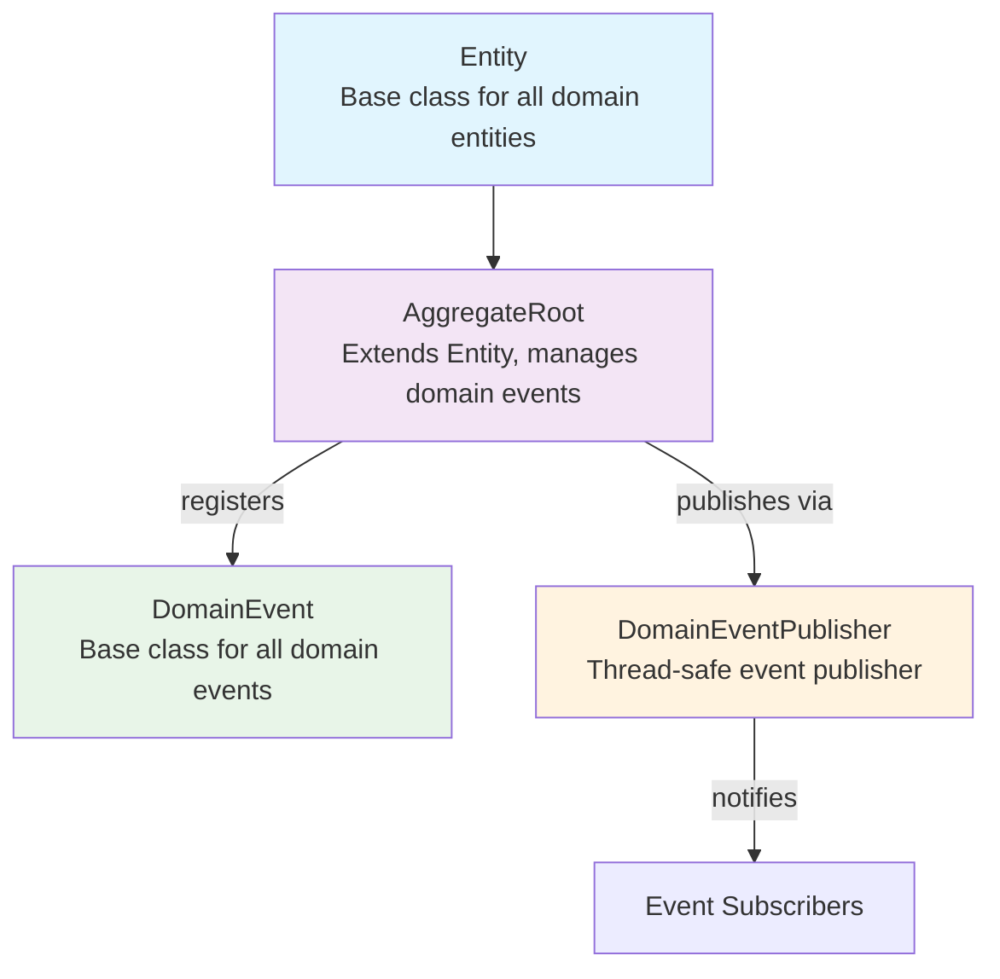
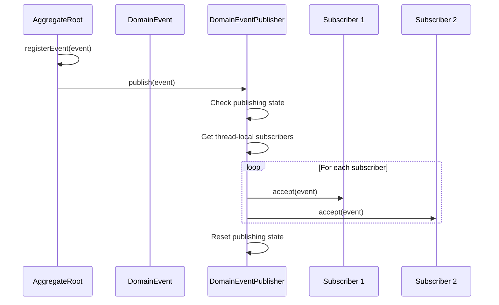
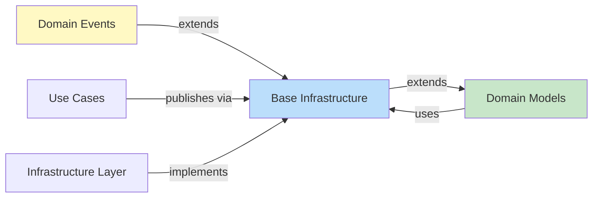

# Base Infrastructure Module Documentation

## Overview

The **Base Infrastructure** module provides the foundational building blocks for the Wallet Hub application's domain-driven design architecture. This module establishes the core patterns and abstractions that enable event-driven communication, entity management, and domain event publishing throughout the system.

## Module Purpose

The base_infrastructure module serves as the architectural foundation for implementing Domain-Driven Design (DDD) principles in the Wallet Hub application. It provides:

1. **Core Domain Patterns**: Abstract base classes for entities and aggregate roots
2. **Event-Driven Architecture**: Domain event publishing and subscription mechanisms
3. **Thread-Safe Event Handling**: Safe event propagation in concurrent environments
4. **Correlation Tracking**: Event correlation for distributed tracing

## Core Components

### 1. DomainEvent (Abstract Base Class)

**Location**: `src/main/java/dev/bloco/wallet/hub/domain/event/common/DomainEvent.java`

**Purpose**: Base class for all domain events in the system, providing common metadata and structure.

**Key Features**:
- Automatic UUID generation for event identification
- Timestamp recording for event occurrence time
- Correlation ID support for distributed tracing
- Immutable event properties

**Class Structure**:
```java
public abstract class DomainEvent {
    private final UUID eventId;        // Unique identifier for the event
    private final Instant occurredOn;  // Timestamp when event occurred
    private final UUID correlationId;  // Correlation ID for tracing
}
```

**Usage Example**:
```java
public class WalletCreatedEvent extends DomainEvent {
    private final UUID walletId;
    private final String walletName;
    
    public WalletCreatedEvent(UUID correlationId, UUID walletId, String walletName) {
        super(correlationId);
        this.walletId = walletId;
        this.walletName = walletName;
    }
}
```

### 2. DomainEventPublisher (Thread-Local Publisher)

**Location**: `src/main/java/dev/bloco/wallet/hub/domain/event/common/DomainEventPublisher.java`

**Purpose**: Thread-safe publisher for domain events using ThreadLocal storage to prevent concurrent modification issues.

**Key Features**:
- Thread-local subscriber management
- Prevention of circular event publishing
- Safe subscription during non-publishing periods
- Thread isolation for event handling

**Architecture**:
```java
public class DomainEventPublisher {
    private static final ThreadLocal<List<Consumer<DomainEvent>>> SUBSCRIBERS;
    private static final ThreadLocal<Boolean> PUBLISHING;
    
    // Thread-safe subscription
    public static void subscribe(Consumer<DomainEvent> subscriber)
    
    // Safe event publishing
    public static void publish(DomainEvent event)
    
    // Cleanup for thread management
    public static void reset()
}
```

**Thread Safety Mechanism**:
- Uses `ThreadLocal` to isolate subscribers per thread
- Prevents subscription during active publishing
- Ensures no concurrent modification of subscriber lists

### 3. AggregateRoot (Abstract Base Class)

**Location**: `src/main/java/dev/bloco/wallet/hub/domain/model/common/AggregateRoot.java`

**Purpose**: Base class for aggregate roots in DDD, extending Entity with domain event management capabilities.

**Key Features**:
- Extends `Entity` base class
- Manages domain event registration and clearing
- Provides unmodifiable event lists
- Supports event sourcing patterns

**Class Hierarchy**:
```
AggregateRoot (extends Entity)
    ├── Wallet
    ├── User
    ├── Vault
    └── Other domain aggregates
```

**Event Management**:
```java
public abstract class AggregateRoot extends Entity {
    private final List<DomainEvent> domainEvents = new ArrayList<>();
    
    protected void registerEvent(DomainEvent event) {
        domainEvents.add(event);
    }
    
    public List<DomainEvent> getDomainEvents() {
        return Collections.unmodifiableList(domainEvents);
    }
    
    public void clearEvents() {
        domainEvents.clear();
    }
}
```

### 4. Entity (Abstract Base Class)

**Location**: `src/main/java/dev/bloco/wallet/hub/domain/model/common/Entity.java`

**Purpose**: Base class for all domain entities, providing identity management and equality semantics.

**Key Features**:
- UUID-based identity management
- Proper equals() and hashCode() implementations
- Immutable ID property
- Foundation for domain object modeling

**Implementation**:
```java
public abstract class Entity {
    private final UUID id;
    
    protected Entity(UUID id) {
        this.id = id;
    }
    
    // Proper equality based on ID
    @Override
    public boolean equals(Object o) {
        if (this == o) return true;
        if (o == null || getClass() != o.getClass()) return false;
        Entity entity = (Entity) o;
        return Objects.equals(id, entity.id);
    }
    
    @Override
    public int hashCode() {
        return Objects.hash(id);
    }
}
```

## Architecture Diagrams

### Component Relationships



### Event Flow Architecture



### Module Dependencies



## Integration Patterns

### 1. Event Registration Pattern

Aggregate roots use the `registerEvent()` method to record domain events that occur during business operations:

```java
public class Wallet extends AggregateRoot {
    public void activate() {
        // Business logic
        this.status = WalletStatus.ACTIVE;
        
        // Register domain event
        registerEvent(new WalletStatusChangedEvent(
            UUID.randomUUID(), 
            this.getId(), 
            WalletStatus.ACTIVE
        ));
    }
}
```

### 2. Event Publishing Pattern

Use cases or application services publish events after persisting aggregates:

```java
public class ActivateWalletUseCase {
    private final WalletRepository walletRepository;
    
    public void execute(UUID walletId) {
        Wallet wallet = walletRepository.findById(walletId);
        wallet.activate();
        walletRepository.save(wallet);
        
        // Publish domain events
        wallet.getDomainEvents().forEach(DomainEventPublisher::publish);
        wallet.clearEvents();
    }
}
```

### 3. Event Subscription Pattern

Event handlers subscribe to domain events for side effects:

```java
public class WalletEventLogger {
    public WalletEventLogger() {
        DomainEventPublisher.subscribe(this::logEvent);
    }
    
    private void logEvent(DomainEvent event) {
        if (event instanceof WalletStatusChangedEvent) {
            WalletStatusChangedEvent walletEvent = (WalletStatusChangedEvent) event;
            logger.info("Wallet {} status changed to {}", 
                walletEvent.getWalletId(), 
                walletEvent.getNewStatus());
        }
    }
}
```

## Thread Safety Considerations

### Thread-Local Isolation
The `DomainEventPublisher` uses ThreadLocal storage to ensure:
- Each thread has its own subscriber list
- No cross-thread interference
- Safe concurrent event processing

### Publishing Guard
The publisher includes a guard to prevent:
- Recursive event publishing
- Subscription during active publishing
- Concurrent modification exceptions

### Memory Management
- `reset()` method clears ThreadLocal variables
- Prevents memory leaks in thread pools
- Ensures clean state for new operations

## Correlation and Tracing

### Event Correlation
Each `DomainEvent` includes:
- `correlationId`: Links related events across system boundaries
- `eventId`: Unique identifier for individual events
- `occurredOn`: Precise timestamp for event ordering

### Distributed Tracing Integration
The correlation ID can be used with:
- OpenTelemetry tracing
- Log aggregation systems
- Performance monitoring tools

## Best Practices

### 1. Event Design
- Keep events immutable
- Include all relevant context
- Use descriptive event names
- Maintain backward compatibility

### 2. Aggregate Design
- One aggregate root per transaction boundary
- Register events for all state changes
- Clear events after publishing
- Keep aggregates focused and cohesive

### 3. Publisher Usage
- Subscribe handlers at application startup
- Use correlation IDs for cross-service tracing
- Handle exceptions in subscribers gracefully
- Monitor event throughput and latency

## Common Use Cases

### 1. Audit Logging
```java
public class AuditLogSubscriber {
    public AuditLogSubscriber() {
        DomainEventPublisher.subscribe(this::logToAudit);
    }
    
    private void logToAudit(DomainEvent event) {
        auditRepository.save(new AuditEntry(
            event.getEventId(),
            event.getClass().getSimpleName(),
            event.getOccurredOn(),
            event.getCorrelationId()
        ));
    }
}
```

### 2. Cache Invalidation
```java
public class CacheInvalidationSubscriber {
    public CacheInvalidationSubscriber() {
        DomainEventPublisher.subscribe(this::invalidateCache);
    }
    
    private void invalidateCache(DomainEvent event) {
        if (event instanceof UserProfileUpdatedEvent) {
            UserProfileUpdatedEvent userEvent = (UserProfileUpdatedEvent) event;
            cache.evict("user:" + userEvent.getUserId());
        }
    }
}
```

### 3. Notification Dispatch
```java
public class NotificationDispatcher {
    public NotificationDispatcher() {
        DomainEventPublisher.subscribe(this::dispatchNotifications);
    }
    
    private void dispatchNotifications(DomainEvent event) {
        if (event instanceof TransactionConfirmedEvent) {
            TransactionConfirmedEvent txEvent = (TransactionConfirmedEvent) event;
            notificationService.sendTransactionConfirmation(
                txEvent.getUserId(),
                txEvent.getTransactionId()
            );
        }
    }
}
```

## Performance Considerations

### Event Volume
- Monitor number of events per aggregate
- Consider batch publishing for high-volume scenarios
- Evaluate memory usage for large event lists

### Subscriber Impact
- Keep subscriber logic lightweight
- Consider async processing for heavy operations
- Monitor subscriber execution time

### Thread Pool Configuration
- Size thread pools appropriately for event processing
- Monitor thread utilization
- Consider dedicated pools for critical subscribers

## Testing Strategies

### Unit Testing
```java
@Test
public void testAggregateEventRegistration() {
    Wallet wallet = new Wallet(UUID.randomUUID(), "Test Wallet");
    wallet.activate();
    
    List<DomainEvent> events = wallet.getDomainEvents();
    assertEquals(1, events.size());
    assertTrue(events.get(0) instanceof WalletStatusChangedEvent);
}
```

### Integration Testing
```java
@Test
public void testEventPublishingFlow() {
    // Setup subscriber
    List<DomainEvent> receivedEvents = new ArrayList<>();
    DomainEventPublisher.subscribe(receivedEvents::add);
    
    // Execute use case
    activateWalletUseCase.execute(walletId);
    
    // Verify events
    assertEquals(1, receivedEvents.size());
    assertTrue(receivedEvents.get(0) instanceof WalletStatusChangedEvent);
    
    // Cleanup
    DomainEventPublisher.reset();
}
```

## Related Modules

### Domain Models
The base_infrastructure module provides the foundation for all domain models. See [domain_models.md](domain_models.md) for detailed information on specific domain entities.

### Domain Events
Specialized event implementations extend the base `DomainEvent` class. Refer to [domain_events.md](domain_events.md) for event-specific documentation.

### Infrastructure Layer
The infrastructure layer implements the `DomainEventPublisher` interface for production event handling. See [infrastructure_events.md](infrastructure_events.md) for implementation details.

## Migration and Versioning

### Backward Compatibility
- DomainEvent base class is designed for extension
- New fields can be added with default values
- Event serialization should handle missing fields

### Event Schema Evolution
- Add new event types for new capabilities
- Deprecate old event types rather than modifying
- Use versioning in event names if needed

## Troubleshooting

### Common Issues

1. **No Events Published**
   - Verify `registerEvent()` is called
   - Check that `publish()` is called after persistence
   - Ensure subscribers are registered before publishing

2. **Memory Leaks**
   - Call `reset()` in cleanup phases
   - Monitor ThreadLocal usage
   - Consider weak references for long-lived subscribers

3. **Event Ordering Issues**
   - Use `occurredOn` timestamps for ordering
   - Consider sequence numbers for strict ordering
   - Implement idempotent event handling

### Monitoring and Metrics
- Track event publication rates
- Monitor subscriber execution times
- Alert on event processing failures
- Log correlation IDs for debugging

## Conclusion

The base_infrastructure module is the cornerstone of the Wallet Hub's domain-driven architecture. It provides the essential patterns and abstractions that enable clean separation of concerns, event-driven communication, and maintainable domain modeling. By adhering to the patterns established in this module, developers can build scalable, observable, and maintainable domain logic that forms the core of the Wallet Hub application.

---
*Last Updated: [Current Date]*
*Module Version: 1.0.0*
*Compatibility: Java 17+, Spring Boot 3.x*