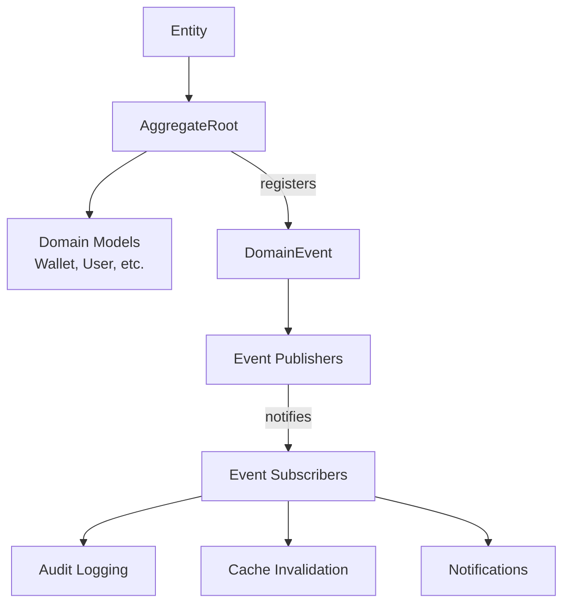

# Base Infrastructure Module - Introduction

## Quick Overview

The **Base Infrastructure** module provides the foundational architectural patterns for the Wallet Hub application's domain-driven design implementation. This module establishes the core abstractions that enable clean domain modeling, event-driven communication, and maintainable business logic.

## What This Module Provides

### Core Abstractions
- **DomainEvent**: Base class for all domain events with correlation tracking
- **DomainEventPublisher**: Thread-safe event publishing mechanism
- **Entity**: Base class for domain entities with proper identity management
- **AggregateRoot**: Extended entity class with domain event management

### Key Benefits
- **Consistent Architecture**: Uniform patterns across all domain components
- **Thread Safety**: Safe concurrent event processing
- **Observability**: Built-in correlation for distributed tracing
- **Maintainability**: Clean separation of concerns and responsibilities

## Quick Start

### Basic Usage Example

```java
// Creating an aggregate root
public class Wallet extends AggregateRoot {
    private String name;
    
    public Wallet(UUID id, String name) {
        super(id);
        this.name = name;
    }
    
    public void activate() {
        // Business logic
        this.status = WalletStatus.ACTIVE;
        
        // Register domain event
        registerEvent(new WalletStatusChangedEvent(
            UUID.randomUUID(), // correlationId
            this.getId(),
            WalletStatus.ACTIVE
        ));
    }
}

// Publishing events
public class ActivateWalletUseCase {
    public void execute(UUID walletId) {
        Wallet wallet = walletRepository.findById(walletId);
        wallet.activate();
        walletRepository.save(wallet);
        
        // Publish all registered events
        wallet.getDomainEvents().forEach(DomainEventPublisher::publish);
        wallet.clearEvents();
    }
}

// Subscribing to events
public class AuditLogger {
    public AuditLogger() {
        DomainEventPublisher.subscribe(event -> {
            logger.info("Event occurred: {}", event.getClass().getSimpleName());
        });
    }
}
```

## Architecture Overview



## When to Use This Module

### Use This Module For:
- Creating new domain entities and aggregates
- Implementing event-driven business logic
- Building domain events for state changes
- Establishing correlation across distributed operations

### Related Modules:
- **[domain_models.md](domain_models.md)**: Specific domain entity implementations
- **[domain_events.md](domain_events.md)**: Specialized event types
- **[infrastructure_events.md](infrastructure_events.md)**: Production event handling

## Next Steps

For comprehensive documentation including:
- Detailed architecture diagrams
- Performance considerations
- Testing strategies
- Best practices and patterns
- Troubleshooting guide

👉 **[Read the full documentation](base_infrastructure.md)**

---
*This is a brief introduction. Refer to the main documentation for complete details.*