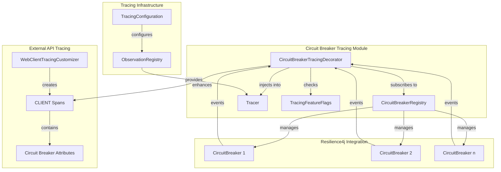
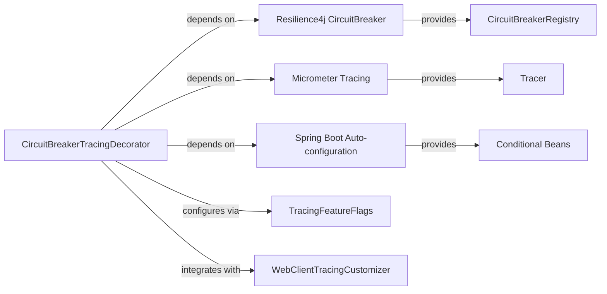
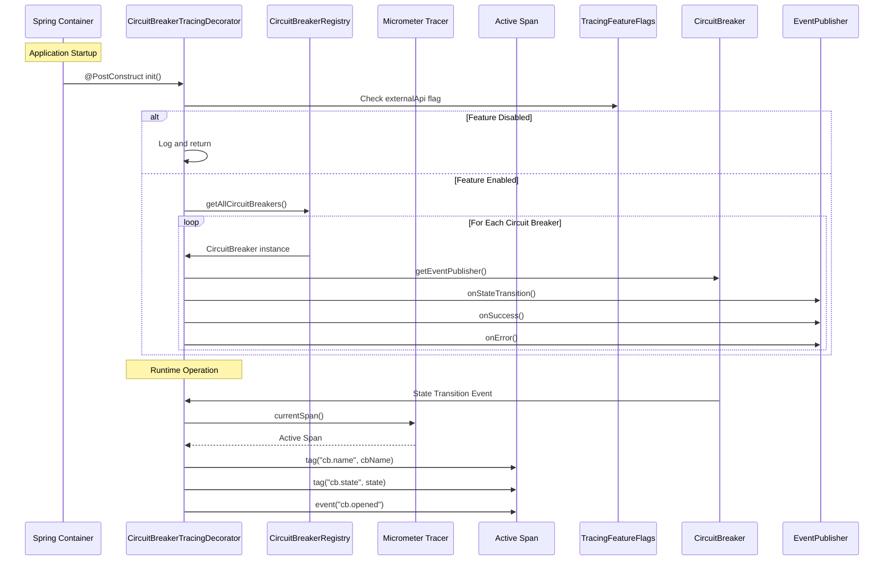
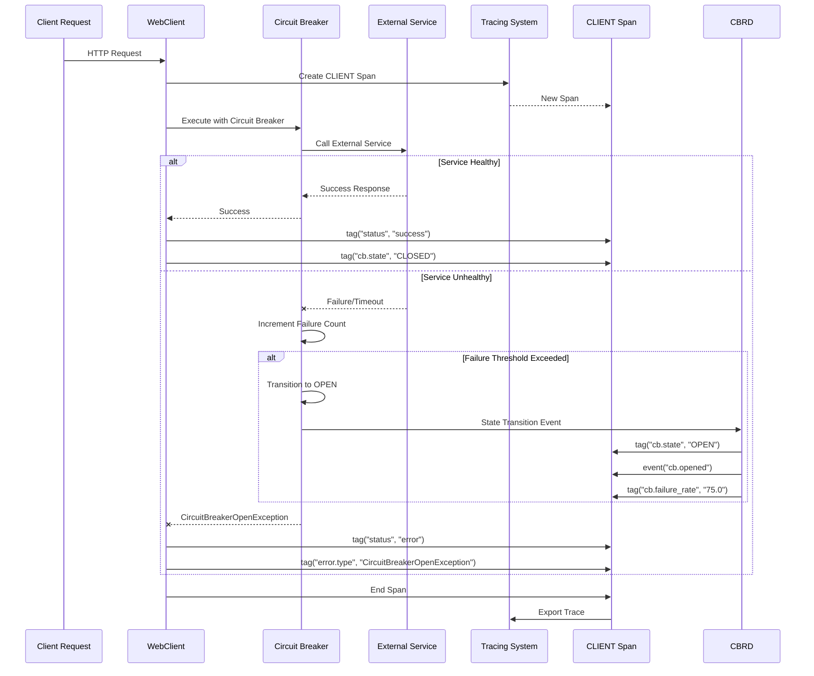

# Circuit Breaker Tracing Module

## Overview

The Circuit Breaker Tracing module enhances observability of Resilience4j circuit breakers by integrating them with the distributed tracing system. This module automatically captures circuit breaker state transitions, metrics, and events, correlating them with trace spans to provide deep insights into system resilience patterns.

## Purpose and Core Functionality

### Primary Objectives
1. **Observability Enhancement**: Add circuit breaker state and metrics as span attributes
2. **Failure Correlation**: Link circuit breaker openings with specific trace failures
3. **Performance Monitoring**: Track circuit breaker metrics (failure rates, slow call rates)
4. **Root Cause Analysis**: Identify which external services trigger circuit breaker state changes

### Key Features
- **Automatic State Tracking**: Monitors all registered circuit breakers for state transitions
- **Span Attribute Injection**: Adds circuit breaker metadata to active spans
- **Event Logging**: Creates span events for state transitions (OPEN → CLOSED → HALF_OPEN)
- **Metrics Capture**: Records failure rates and slow call rates as span tags
- **Feature Flag Control**: Can be disabled via `tracing.features.externalApi` configuration

## Architecture

### Component Relationships



### Dependencies



## Core Components

### CircuitBreakerTracingDecorator

The main component that decorates circuit breakers with tracing capabilities.

#### Key Responsibilities
1. **Event Subscription**: Subscribes to all circuit breaker state transitions
2. **Span Attribute Injection**: Adds circuit breaker metadata to active spans
3. **Event Creation**: Creates span events for state transitions
4. **Metrics Collection**: Captures circuit breaker metrics as span tags

#### Configuration Conditions
```java
@ConditionalOnClass(CircuitBreaker.class)          // Resilience4j available
@ConditionalOnBean(CircuitBreakerRegistry.class)   // Circuit breaker registry exists
@ConditionalOnProperty(
    value = "tracing.features.externalApi",        // Feature flag enabled
    havingValue = "true", 
    matchIfMissing = true
)
```

#### Initialization Process


## Data Flow

### Circuit Breaker State Transition Tracing



### Span Attributes and Events

#### Standard Span Attributes
| Attribute | Description | Example Values |
|-----------|-------------|----------------|
| `cb.name` | Circuit breaker identifier | `"external-api-chainlist"`, `"trace-export-primary"` |
| `cb.state` | Current circuit breaker state | `CLOSED`, `OPEN`, `HALF_OPEN`, `DISABLED`, `FORCED_OPEN` |
| `cb.failure_rate` | Failure rate percentage | `"0.0"`, `"75.5"`, `"100.0"` |
| `cb.slow_call_rate` | Slow call rate percentage | `"0.0"`, `"25.3"`, `"100.0"` |

#### Span Events
| Event Name | Trigger | Description |
|------------|---------|-------------|
| `cb.opened` | Circuit breaker opens | Too many failures detected |
| `cb.closed` | Circuit breaker closes | Service recovered |
| `cb.half_open` | Circuit breaker half-opens | Testing service recovery |
| `cb.state_transition` | Any state change | Generic transition event |
| `cb.error` | Error occurs | Error details captured |

## Integration with External API Tracing

### WebClient Integration
The CircuitBreakerTracingDecorator works in conjunction with [WebClientTracingCustomizer](webclient_tracing.md) to provide comprehensive external API observability:

1. **WebClientTracingCustomizer** creates CLIENT spans for HTTP requests
2. **CircuitBreakerTracingDecorator** enhances these spans with circuit breaker metadata
3. **SensitiveDataSanitizer** ensures sensitive data is masked in URLs and attributes

### Example Trace Output
```json
{
  "traceId": "abc123def456",
  "spans": [
    {
      "name": "HTTP GET",
      "kind": "CLIENT",
      "attributes": {
        "http.method": "GET",
        "http.url": "https://api.chainlist.org/chains",
        "cb.name": "external-api-chainlist",
        "cb.state": "OPEN",
        "cb.failure_rate": "75.0",
        "status": "error"
      },
      "events": [
        {
          "name": "cb.opened",
          "timestamp": "2024-01-15T10:30:00Z",
          "attributes": {
            "message": "Circuit breaker opened due to high failure rate (75%)"
          }
        }
      ]
    }
  ]
}
```

## Configuration

### Application Properties
```yaml
# application-tracing.yml
tracing:
  features:
    externalApi: true  # Enable/disable circuit breaker tracing
    
  resilience:
    circuit-breaker:
      enabled: true
      failure-threshold: 5
      wait-duration-in-open-state: 60s
      ring-buffer-size-in-closed-state: 100

management:
  tracing:
    enabled: true
  zipkin:
    tracing:
      endpoint: http://localhost:9411/api/v2/spans
  otlp:
    tracing:
      endpoint: http://localhost:4318/v1/traces
```

### Feature Flags
The module respects the `tracing.features.externalApi` flag from [TracingFeatureFlags](tracing_configuration.md#feature-flags). When disabled:
- No event subscriptions are created
- Circuit breaker events are not traced
- Module has zero runtime overhead

## Performance Characteristics

### Overhead Analysis
| Operation | Typical Overhead | Notes |
|-----------|-----------------|-------|
| Event Subscription | < 1ms (startup only) | One-time registration per circuit breaker |
| State Transition | < 0.1ms | Span attribute update + event creation |
| Metrics Capture | < 0.05ms | Reading and tagging metrics |
| Error Handling | < 0.1ms | Error attribute tagging |

### Memory Footprint
- **Per Circuit Breaker**: ~1KB for event listener registration
- **Span Attributes**: ~200 bytes per circuit breaker tag
- **Event Objects**: ~100 bytes per state transition

### Thread Safety
- **CircuitBreakerRegistry**: Thread-safe (Resilience4j implementation)
- **Micrometer Tracer**: Thread-safe span management
- **Event Publishers**: Thread-safe event delivery

## Use Cases and Examples

### 1. Identifying External Service Issues
**Scenario**: External API starts failing, causing circuit breaker to open.

**Trace Analysis**:
- CLIENT span shows `cb.state: OPEN` and `cb.failure_rate: 85.0`
- `cb.opened` event timestamp indicates when failures started
- Correlation with HTTP error codes in the same span

**Action**: Investigate external service health and implement retry strategies.

### 2. Circuit Breaker Flapping Detection
**Scenario**: Circuit breaker rapidly transitions between OPEN and HALF_OPEN states.

**Trace Analysis**:
- Multiple `cb.opened` and `cb.half_open` events in short time window
- Increasing `cb.failure_rate` trend
- Correlation with specific external endpoints

**Action**: Adjust circuit breaker configuration (failure threshold, wait duration).

### 3. Cascading Failure Analysis
**Scenario**: Primary trace export backend fails, circuit breaker opens, fallback used.

**Trace Analysis**:
- `cb.opened` event for primary backend
- Fallback backend spans show successful export
- Circuit breaker metrics show recovery pattern

**Action**: Monitor primary backend health and circuit breaker recovery.

## Troubleshooting

### Common Issues

#### 1. Circuit Breaker Events Not Traced
**Symptoms**: No `cb.*` attributes or events in spans.

**Diagnosis**:
```bash
# Check feature flag
curl http://localhost:8080/actuator/configprops/tracing.features.externalApi

# Check circuit breaker registration
grep "Circuit breaker tracing registered" application.log
```

**Solutions**:
- Ensure `tracing.features.externalApi: true`
- Verify Resilience4j dependencies are present
- Check circuit breaker bean registration

#### 2. Missing Span Context
**Symptoms**: "No active span for circuit breaker state transition" logs.

**Diagnosis**: Circuit breaker events occurring outside request context.

**Solutions**:
- Ensure circuit breaker calls are within traced operations
- Check async boundary context propagation
- Verify reactive context is properly propagated

#### 3. Performance Impact
**Symptoms**: Increased latency in circuit breaker operations.

**Diagnosis**: Tracing overhead affecting time-sensitive operations.

**Solutions**:
- Disable via `tracing.features.externalApi: false`
- Use sampling to reduce trace volume
- Monitor with [TracingMetricsCollector](tracing_monitoring.md)

## Best Practices

### 1. Naming Conventions
```java
// Good: Descriptive names
CircuitBreaker.of("external-api-chainlist")
CircuitBreaker.of("trace-export-primary")

// Avoid: Generic names
CircuitBreaker.of("cb1")
CircuitBreaker.of("external")
```

### 2. Configuration Guidelines
- Set appropriate failure thresholds based on service SLAs
- Configure wait durations that allow for service recovery
- Monitor circuit breaker metrics via tracing and metrics systems
- Use feature flags to disable in performance-critical environments

### 3. Integration Patterns
- Combine with [WebClientTracingCustomizer](webclient_tracing.md) for full external API observability
- Use with [SensitiveDataSanitizer](data_sanitization.md) to protect sensitive information
- Correlate with [UseCaseTracingAspect](use_case_tracing.md) for business context

## Related Modules

- [Tracing Configuration](tracing_configuration.md): Core tracing setup and feature flags
- [WebClient Tracing](webclient_tracing.md): External HTTP request tracing
- [Data Sanitization](data_sanitization.md): PII protection in traces
- [Tracing Monitoring](tracing_monitoring.md): Health and metrics collection
- [Resilience4j Integration](resilience_integration.md): Circuit breaker configuration

## Future Enhancements

### Planned Features
1. **Circuit Breaker Metrics Dashboard**: Visualize circuit breaker health across services
2. **Predictive Analytics**: Machine learning for circuit breaker behavior prediction
3. **Dynamic Configuration**: Runtime adjustment of circuit breaker parameters based on tracing data
4. **Cross-Service Correlation**: Correlate circuit breaker states across microservice boundaries

### Technical Debt
- **T021**: Implement `ResilientCompositeSpanExporter` with circuit breaker protection
- **Span Attribute Limits**: Ensure circuit breaker metadata stays within OpenTelemetry limits
- **Async Context Propagation**: Improve context propagation in reactive pipelines

## References

- [Resilience4j Documentation](https://resilience4j.readme.io/docs/circuitbreaker)
- [Micrometer Tracing](https://micrometer.io/docs/tracing)
- [OpenTelemetry Semantic Conventions](https://opentelemetry.io/docs/specs/semconv/)
- [Spring Cloud Circuit Breaker](https://spring.io/projects/spring-cloud-circuitbreaker)

---

*Last Updated: January 2024*  
*Module Version: 1.0.0*  
*Compatibility: Spring Boot 3.x, Resilience4j 2.x, Micrometer Tracing 1.x*