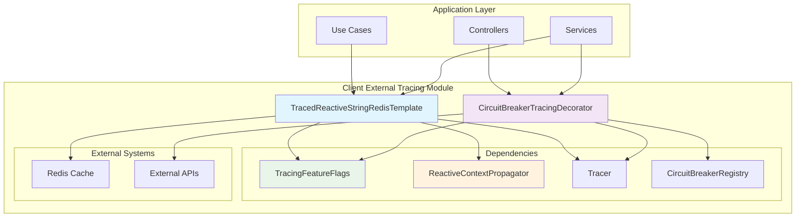
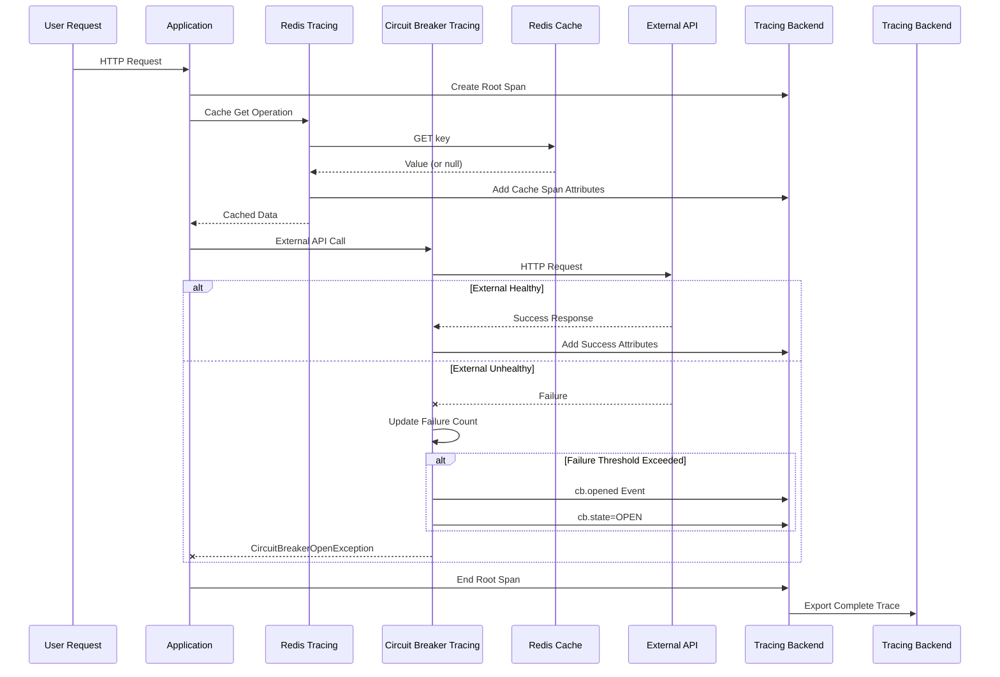

# Client External Tracing Module

## Overview

The **Client External Tracing** module is a critical component of the Wallet Hub's observability infrastructure that provides distributed tracing for external client interactions and dependencies. This module focuses on instrumenting external service calls, caching operations, and resilience patterns to provide end-to-end visibility into how the application interacts with external systems.

### Purpose

The primary purpose of this module is to:
1. **Trace external dependencies** - Monitor calls to Redis, external APIs, and other services
2. **Monitor resilience patterns** - Track circuit breaker state transitions and failures
3. **Provide cache observability** - Monitor Redis cache operations and performance
4. **Enable correlation** - Link external service failures to user requests and business operations

### Key Features

- **Redis Operation Tracing**: Full instrumentation of Reactive Redis operations with cache-specific metrics
- **Circuit Breaker Monitoring**: Real-time tracking of circuit breaker state transitions and failure rates
- **Feature Flag Control**: Granular control over tracing components via configuration
- **Reactive Context Propagation**: Seamless trace context propagation across reactive boundaries
- **Performance Optimization**: Minimal overhead with configurable sampling and filtering
- **External Dependency Visibility**: Complete observability of all external service interactions

### Role in System Architecture

The Client External Tracing module plays a crucial role in the Wallet Hub's observability stack by:

1. **External Dependency Monitoring**: Tracks all interactions with external systems (Redis, APIs, etc.)
2. **Resilience Pattern Observability**: Provides visibility into circuit breaker behavior and failure patterns
3. **Performance Bottleneck Identification**: Identifies slow external dependencies and cache inefficiencies
4. **Root Cause Analysis**: Correlates external service failures with user-facing issues
5. **Capacity Planning**: Provides data for scaling decisions based on external dependency usage patterns

## Architecture

The Client External Tracing module follows a decorator pattern architecture where tracing functionality is added to existing components without modifying their core logic. This approach ensures separation of concerns and maintainability.



### Data Flow



### Component Relationships

1. **TracedReactiveStringRedisTemplate**: Decorates Spring's ReactiveStringRedisTemplate to add tracing to all Redis operations
2. **CircuitBreakerTracingDecorator**: Subscribes to circuit breaker events and adds tracing attributes to active spans
3. **TracingFeatureFlags**: Controls which tracing features are enabled via configuration
4. **ReactiveContextPropagator**: Manages trace context propagation across reactive boundaries

## Sub-modules

The Client External Tracing module consists of two main sub-modules:

### 1. Redis Tracing ([TracedReactiveStringRedisTemplate](traced_redis_template.md))
Provides comprehensive tracing for Redis cache operations including:
- Cache hit/miss tracking with span events (`cache.hit`, `cache.miss`)
- Operation timing and error monitoring with `cache.error` events
- Key-based metrics and TTL tracking via span attributes
- Multi-key operation support with batch metrics
- Reactive context propagation across async boundaries
- Feature flag control via `tracing.features.reactive`

### 2. Circuit Breaker Tracing ([CircuitBreakerTracingDecorator](circuit_breaker_tracing.md))
Monitors resilience patterns by:
- Tracking circuit breaker state transitions with span events (`cb.opened`, `cb.closed`, `cb.half_open`)
- Capturing failure rates and metrics as span attributes (`cb.failure_rate`, `cb.slow_call_rate`)
- Correlating circuit breaker events with trace failures for root cause analysis
- Providing real-time visibility into external service health
- Feature flag control via `tracing.features.externalApi`

## Integration Points

### With Application Layer
- **Use Cases**: Redis operations for caching user data, wallet information, and session management
- **Controllers**: External API calls protected by circuit breakers
- **Event Consumers**: Cache operations during event processing
- **Services**: External service calls with resilience patterns

### With Other Tracing Modules
- **Core Configuration**: Uses `TracingFeatureFlags` for feature control
- **Propagation**: Leverages `ReactiveContextPropagator` for context management in reactive pipelines
- **Web Tracing**: Correlates with HTTP request tracing via `WebClientTracingCustomizer` for end-to-end visibility
- **Use Case Tracing**: Redis operations appear as child spans of business operations
- **Repository Tracing**: Cache operations complement database tracing for complete data access visibility

## Configuration

### Feature Flags
```yaml
tracing:
  features:
    reactive: true          # Enable reactive tracing (required for Redis tracing)
    externalApi: true       # Enable external API tracing (required for circuit breaker tracing)
```

### Redis Tracing Configuration
```java
@Bean
public TracedReactiveStringRedisTemplate tracedRedisTemplate(
    ReactiveRedisConnectionFactory factory,
    Tracer tracer,
    TracingFeatureFlags flags,
    ReactiveContextPropagator propagator) {
    return new TracedReactiveStringRedisTemplate(factory, tracer, flags, propagator);
}
```

### Circuit Breaker Configuration
```java
// Automatically configured via @ConditionalOnBean(CircuitBreakerRegistry.class)
// No manual configuration required
```

## Span Attributes and Events

### Redis Operations
| Attribute | Description | Example Values |
|-----------|-------------|----------------|
| `cache.system` | Cache system identifier | `"redis"` |
| `cache.operation` | Operation type | `"get"`, `"set"`, `"delete"`, `"exists"` |
| `cache.key` | Redis key (sanitized) | `"user:123"`, `"wallet:456"` |
| `cache.hit` | Cache hit status | `"true"`, `"false"` |
| `cache.ttl` | TTL in seconds | `"3600"`, `"60"` |
| `cache.value.size` | Value size in bytes | `"1024"`, `"256"` |

### Circuit Breaker Operations
| Attribute | Description | Example Values |
|-----------|-------------|----------------|
| `cb.name` | Circuit breaker identifier | `"trace-export-primary"`, `"external-api-chainlist"` |
| `cb.state` | Current circuit breaker state | `"CLOSED"`, `"OPEN"`, `"HALF_OPEN"` |
| `cb.failure_rate` | Failure rate percentage | `"25.50"`, `"75.25"` |
| `cb.slow_call_rate` | Slow call rate percentage | `"10.25"`, `"5.75"` |

## Performance Considerations

### Redis Tracing Overhead
- **Per operation**: < 1ms (mostly span creation and context propagation)
- **Memory impact**: Minimal (span objects are lightweight)
- **Network impact**: None (tracing is separate from Redis operations)

### Circuit Breaker Tracing Overhead
- **Per state transition**: < 0.1ms (span attribute update + event)
- **Event subscription**: One-time registration at startup
- **No impact** on circuit breaker decision-making

## Usage Examples

### Redis Operations with Tracing
```java
@Autowired
private TracedReactiveStringRedisTemplate tracedRedisTemplate;

public Mono<User> getUser(String userId) {
    return tracedRedisTemplate.get("user:" + userId)
        .map(value -> deserializeUser(value))
        .switchIfEmpty(fetchUserFromDatabase(userId));
}

public Mono<Boolean> cacheUser(User user, Duration ttl) {
    return tracedRedisTemplate.set("user:" + user.getId(), 
                                   serializeUser(user), 
                                   ttl);
}
```

### Circuit Breaker Integration
```java
@CircuitBreaker(name = "external-api-chainlist")
public Mono<List<Network>> fetchNetworksFromChainlist() {
    // External API call automatically traced
    return webClient.get()
        .uri("https://api.chainlist.org/chains")
        .retrieve()
        .bodyToMono(new ParameterizedTypeReference<List<Network>>() {});
}
```

## Troubleshooting

### Common Issues

1. **Missing Trace Context in Reactive Chains**
   - Ensure `.contextWrite(reactiveContextPropagator.captureTraceContext())` is used
   - Check that `tracing.features.reactive=true` is configured

2. **Circuit Breaker Events Not Traced**
   - Verify `tracing.features.externalApi=true` is enabled
   - Confirm circuit breaker is registered in `CircuitBreakerRegistry`

3. **High Tracing Overhead**
   - Consider disabling non-critical tracing features
   - Review sampling configuration in [core_configuration](core_configuration.md)

### Monitoring and Metrics

- **Redis cache hit rate**: Monitor via `cache.hit` attribute
- **Circuit breaker state changes**: Track via `cb.state` transitions
- **External API failure correlation**: Use `cb.name` with HTTP status codes

## Related Documentation

### Core Tracing Infrastructure
- [Tracing Configuration](tracing_configuration.md) - Overall tracing setup and configuration
- [Tracing Feature Flags](tracing_feature_flags.md) - Feature flag management for tracing components
- [Core Configuration](core_configuration.md) - Core tracing infrastructure setup

### Related Tracing Modules
- [Web HTTP Tracing](web_http_tracing.md) - HTTP request/response tracing (works with circuit breaker tracing)
- [Reactive Context Propagator](reactive_context_propagator.md) - Trace context propagation in reactive pipelines
- [Use Case Tracing](use_case_tracing.md) - Business operation tracing (Redis operations appear as child spans)
- [Repository Tracing Aspect](repository_tracing_aspect.md) - Database operation tracing (complements cache tracing)

### Data Management
- [Data Sanitization](data_sanitization.md) - PII protection in traces (used by both Redis and circuit breaker tracing)
- [Filters & Decorators](filters_decorators.md) - Additional tracing filters and decorators

### System Architecture
- [Infrastructure Tracing](infrastructure_tracing.md) - Parent module containing all tracing components
- [Sampling System](sampling_system.md) - Sampling configuration for performance optimization