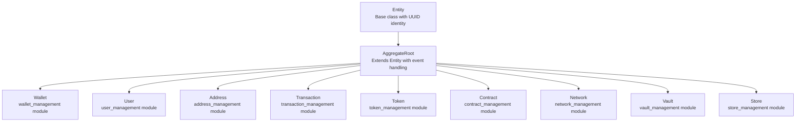
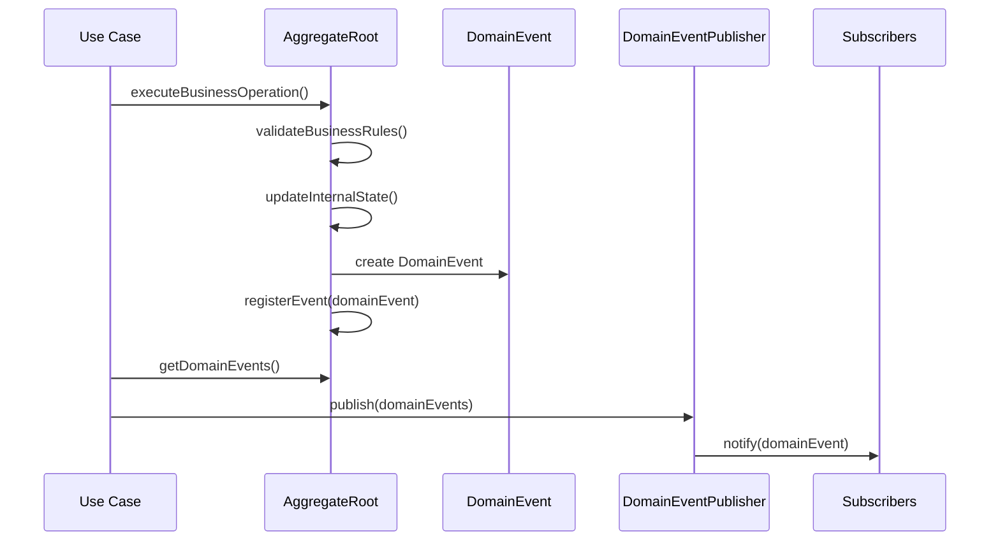
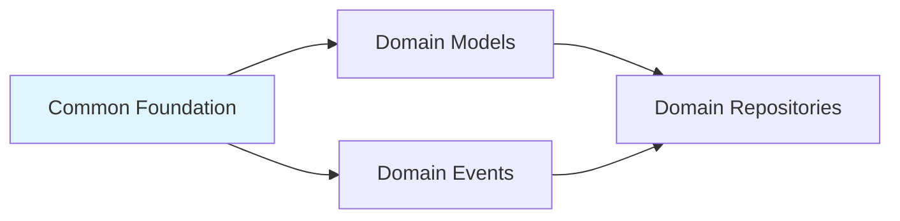

# Common Foundation Module

## Overview

The **Common Foundation** module provides the fundamental building blocks for the domain-driven design (DDD) architecture of the Wallet Hub application. This module defines the core abstractions that all domain entities inherit from, establishing a consistent pattern for identity management, equality comparison, and domain event handling throughout the system.

## Core Components

### 1. Entity Base Class

The `Entity` class serves as the foundation for all domain objects in the system, providing essential identity management and equality semantics.

#### Key Features:
- **UUID-based Identity**: All entities are uniquely identified by a UUID
- **Consistent Equality**: Entities are considered equal if they have the same ID and type
- **Immutable Identity**: Entity IDs are final and cannot be changed after creation

#### Implementation:
```java
public abstract class Entity {
  private final UUID id;

  protected Entity(UUID id) {
    this.id = id;
  }

  public UUID getId() {
    return id;
  }

  @Override
  public boolean equals(Object o) {
    if (this == o) return true;
    if (o == null || getClass() != o.getClass()) return false;
    Entity entity = (Entity) o;
    return Objects.equals(id, entity.id);
  }

  @Override
  public int hashCode() {
    return Objects.hash(id);
  }
}
```

### 2. AggregateRoot Base Class

The `AggregateRoot` class extends `Entity` and adds domain event handling capabilities for aggregates in the domain model.

#### Key Features:
- **Domain Event Registration**: Built-in mechanism for registering domain events
- **Event Collection Management**: Maintains a list of domain events raised by the aggregate
- **Thread-safe Event Handling**: Events are collected and can be published atomically

#### Implementation:
```java
public abstract class AggregateRoot extends Entity {
    private final List<DomainEvent> domainEvents = new ArrayList<>();

    protected AggregateRoot(UUID id) {
        super(id);
    }

    protected void registerEvent(DomainEvent event) {
        domainEvents.add(event);
    }

    public List<DomainEvent> getDomainEvents() {
        return Collections.unmodifiableList(domainEvents);
    }

    public void clearEvents() {
        domainEvents.clear();
    }
}
```

## Architecture

### Module Hierarchy



### Domain Event Integration



## Usage Patterns

### 1. Creating Domain Entities

All domain entities follow a consistent pattern:

```java
// Example from Wallet entity
public class Wallet extends AggregateRoot {
    // Factory method pattern
    public static Wallet create(UUID id, String name, String description) {
        Wallet wallet = new Wallet(id, name, description);
        wallet.registerEvent(new WalletCreatedEvent(id, wallet.getCorrelationId()));
        return wallet;
    }
    
    // Constructor with business logic
    public Wallet(UUID id, String name, String description) {
        super(id);  // Calls AggregateRoot constructor
        this.name = name;
        this.description = description;
        this.createdAt = Instant.now();
        this.updatedAt = Instant.now();
        this.balance = BigDecimal.ZERO;
        this.status = WalletStatus.ACTIVE;
    }
}
```

### 2. Domain Event Registration

Aggregates use the `registerEvent()` method to record domain events:

```java
// Example from User entity
public void activate() {
    if (this.status != UserStatus.ACTIVE) {
        UserStatus oldStatus = this.status;
        this.status = UserStatus.ACTIVE;
        this.updatedAt = Instant.now();
        registerEvent(new UserStatusChangedEvent(
            getId(), oldStatus, this.status, "User activated", null
        ));
    }
}
```

### 3. Repository Integration

Repositories work with entities through their base interfaces:

```java
// Example from WalletRepository
public interface WalletRepository {
    Wallet save(Wallet wallet);  // Works with AggregateRoot
    Optional<Wallet> findById(UUID id);
    void update(Wallet wallet);
    // ... other methods
}
```

## Design Principles

### 1. Identity Management
- **Global Uniqueness**: All entities have globally unique UUID identifiers
- **Immutable Identity**: Entity IDs cannot be changed after creation
- **Reference by ID**: Entities reference each other by ID, not by object reference

### 2. Equality and HashCode
- **Type-aware Equality**: Entities of different types are never equal, even with same ID
- **Consistent HashCode**: HashCode is based solely on the entity ID
- **Database Integration**: Equality works correctly with ORM frameworks

### 3. Domain Event Pattern
- **Event Sourcing Ready**: Built-in support for event sourcing patterns
- **Transactional Consistency**: Events are collected during transaction execution
- **Loose Coupling**: Events enable decoupled communication between bounded contexts

### 4. Aggregate Design
- **Transaction Boundaries**: Aggregates define consistency boundaries
- **Business Rule Enforcement**: All business rules are enforced within aggregates
- **Event-driven Updates**: State changes are communicated via domain events

## Integration with Other Modules

### Dependencies



### 1. Domain Models Module
All domain models in the `domain_models` module extend either `Entity` or `AggregateRoot`:
- **Simple Entities**: Extend `Entity` for value objects and simple entities
- **Aggregates**: Extend `AggregateRoot` for complex entities with business logic

### 2. Domain Events Module
The `DomainEvent` class from the [domain_events](domain_events.md) module is used by `AggregateRoot` for event registration and publishing.

### 3. Domain Repositories Module
Repositories in the `domain_repositories` module work with entities through their base `Entity` and `AggregateRoot` types.

## Best Practices

### 1. Entity Creation
- Use factory methods (`create()`) for creating new entities
- Always pass UUID explicitly for testability
- Register domain events in factory methods

### 2. Event Registration
- Register events immediately after state changes
- Include relevant context in event payloads
- Use correlation IDs for tracing across bounded contexts

### 3. Equality Implementation
- Never override `equals()` and `hashCode()` in subclasses
- Rely on the base implementation for consistency
- Use `getId()` for entity comparisons in business logic

### 4. Aggregate Design
- Keep aggregates small and focused
- Enforce all business rules within aggregate boundaries
- Use domain events for cross-aggregate communication

## Common Patterns

### 1. Factory Method Pattern
```java
public static EntityType create(UUID id, /* parameters */) {
    EntityType entity = new EntityType(id, /* parameters */);
    entity.registerEvent(new EntityCreatedEvent(id, /* event data */));
    return entity;
}
```

### 2. State Change Pattern
```java
public void changeState(NewState newState, String reason) {
    OldState oldState = this.state;
    this.state = newState;
    this.updatedAt = Instant.now();
    registerEvent(new StateChangedEvent(getId(), oldState, newState, reason));
}
```

### 3. Business Rule Validation
```java
public void performOperation(/* parameters */) {
    validateOperationAllowed();  // Check aggregate state
    validateBusinessRules();     // Check business rules
    updateState();               // Update internal state
    registerEvent();             // Record domain event
}
```

## Testing Considerations

### 1. Unit Testing Entities
- Test equality and hashCode implementations
- Verify domain event registration
- Test business rule enforcement

### 2. Integration Testing
- Test repository integration with entities
- Verify event publishing flows
- Test aggregate consistency boundaries

### 3. Mocking Strategies
- Mock repositories that return entity instances
- Verify domain event publishing
- Test entity state transitions

## Performance Considerations

### 1. Memory Efficiency
- Entity base classes are lightweight
- Domain events are collected in lists (consider bounded collections for high-volume systems)

### 2. Database Integration
- UUID-based IDs work well with distributed systems
- Consider database indexing strategies for UUID columns
- Batch event publishing for performance

### 3. Event Processing
- Clear events after publishing to prevent memory leaks
- Consider asynchronous event processing for scalability
- Implement event deduplication if needed

## Extension Points

### 1. Custom Entity Types
While most entities should extend `AggregateRoot`, simple value objects can extend `Entity` directly:

```java
public class SimpleEntity extends Entity {
    private final String value;
    
    public SimpleEntity(UUID id, String value) {
        super(id);
        this.value = value;
    }
}
```

### 2. Event Enrichment
Subclasses can add methods for specific event types:

```java
protected void registerStatusChangeEvent(OldStatus oldStatus, NewStatus newStatus, String reason) {
    registerEvent(new StatusChangedEvent(getId(), oldStatus, newStatus, reason, getCorrelationId()));
}
```

### 3. Validation Hooks
Add validation methods in subclasses:

```java
protected void validateState() {
    if (!isValidState()) {
        throw new IllegalStateException("Invalid entity state");
    }
}
```

## Related Documentation

- [Domain Events Module](domain_events.md) - For domain event definitions and publishing
- [Domain Models Overview](../domain_models/README.md) - For entity implementations
- [Repository Pattern](../domain_repositories/README.md) - For data persistence patterns
- [Use Cases](../use_cases/README.md) - For business operation implementations

---

*Last Updated: Generated from module analysis*