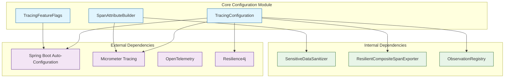
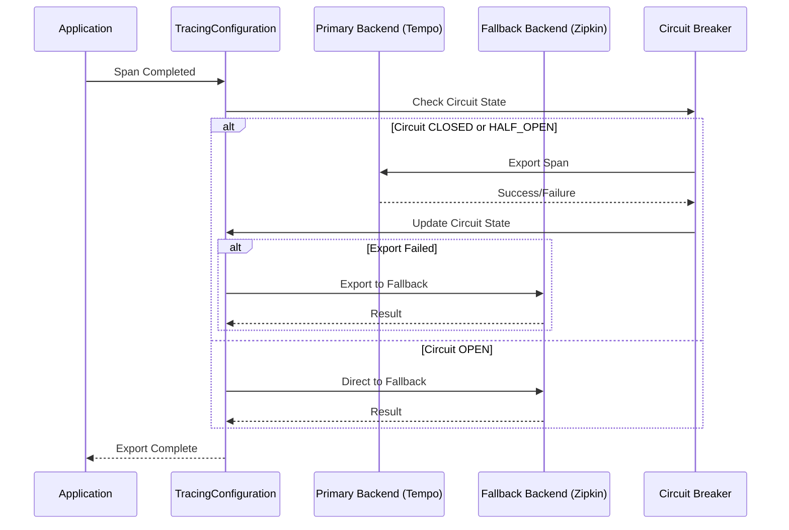
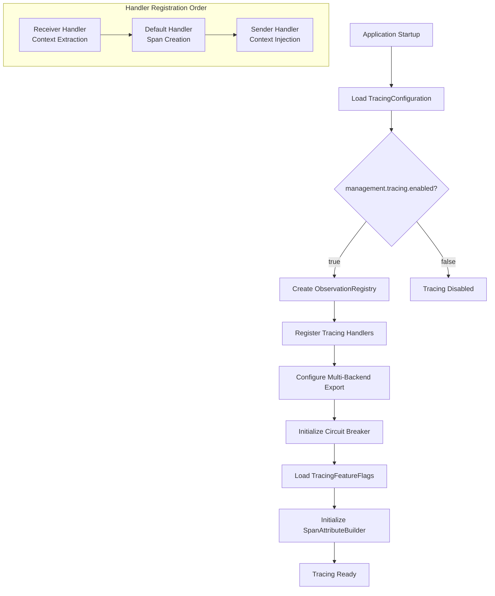

# Core Configuration Module

## Overview

The **Core Configuration Module** is the foundational component of the Wallet Hub's distributed tracing infrastructure. It provides the essential configuration and utilities for setting up, managing, and controlling the observability system across the entire application.

This module serves as the **central configuration hub** for the tracing subsystem, establishing the core infrastructure that enables end-to-end visibility into application performance, business operations, and system dependencies.

## Module Purpose

The Core Configuration Module has three primary responsibilities:

1. **Infrastructure Setup**: Configures the core tracing infrastructure using Micrometer Tracing and OpenTelemetry standards
2. **Feature Control**: Provides runtime control over which components are instrumented via feature flags
3. **Attribute Standardization**: Ensures consistent span attribute naming following OpenTelemetry semantic conventions

## Architecture



## Core Components

### 1. TracingConfiguration

**Location**: `src/main/java/dev/bloco/wallet/hub/infra/adapter/tracing/config/TracingConfiguration.java`

**Purpose**: Central configuration class that sets up the distributed tracing infrastructure using Micrometer Tracing and OpenTelemetry standards.

**Key Responsibilities**:
- Creates and configures the central `ObservationRegistry` with tracing-specific handlers
- Sets up multi-backend trace export with primary and fallback backends
- Configures circuit breaker protection for resilient span export
- Integrates with Spring Boot's auto-configuration for tracing

**Configuration Properties**:
```yaml
management:
  tracing:
    enabled: true  # Master switch for tracing
    sampling:
      probability: 0.1  # Sample 10% of traces
  zipkin:
    tracing:
      endpoint: http://localhost:9411/api/v2/spans  # Zipkin backend
  otlp:
    tracing:
      endpoint: http://localhost:4318/v1/traces  # OTLP/Tempo backend

tracing:
  backends:
    primary: tempo    # Primary backend (OTLP/Tempo)
    fallback: zipkin  # Fallback backend (Zipkin)
  resilience:
    circuit-breaker:
      enabled: true
      failure-threshold: 5
      wait-duration-in-open-state: 60s
      ring-buffer-size-in-closed-state: 100
```

**Observation Registry Configuration**:
The `ObservationRegistry` is configured with three handlers in specific order:

1. **PropagatingReceiverTracingObservationHandler**: Extracts trace context from incoming requests/messages
2. **DefaultTracingObservationHandler**: Creates spans for local operations
3. **PropagatingSenderTracingObservationHandler**: Injects trace context into outgoing requests/messages

**Multi-Backend Export Strategy**:


### 2. TracingFeatureFlags

**Location**: `src/main/java/dev/bloco/wallet/hub/infra/adapter/tracing/config/TracingFeatureFlags.java`

**Purpose**: Provides runtime control over which components are instrumented for distributed tracing, enabling granular performance tuning and troubleshooting.

**Feature Flags**:
| Flag | Default | Description | Performance Impact |
|------|---------|-------------|-------------------|
| `database` | `true` | Database operation tracing (JPA, R2DBC) | ~1-2ms per query |
| `kafka` | `true` | Kafka producer/consumer tracing | ~0.5-1ms per message |
| `stateMachine` | `true` | State machine transition tracing | ~0.5ms per transition |
| `externalApi` | `true` | External HTTP client tracing | <1ms per request |
| `reactive` | `true` | Reactive pipeline tracing | <0.5ms per operator |
| `useCase` | `true` | Use case execution tracing | ~1-2ms per use case |

**Runtime Updates**:
Feature flags can be updated at runtime without service restart:
```bash
# Update configuration
curl -X POST http://localhost:8080/actuator/refresh \
  -H "Content-Type: application/json"
```

**Configuration Example**:
```yaml
tracing:
  features:
    database: true        # Enable database tracing
    kafka: true          # Enable Kafka tracing  
    state-machine: true  # Enable state machine tracing
    external-api: true   # Enable external API tracing
    reactive: true       # Enable reactive tracing
    use-case: true       # Enable use case tracing
```

### 3. SpanAttributeBuilder

**Location**: `src/main/java/dev/bloco/wallet/hub/infra/adapter/tracing/config/SpanAttributeBuilder.java`

**Purpose**: Utility class for building standardized span attributes following OpenTelemetry semantic conventions, ensuring consistency and compliance across the codebase.

**Attribute Namespaces**:
- **Database Operations**: `db.*` (db.system, db.operation, db.statement, etc.)
- **Messaging Operations**: `messaging.*` (messaging.system, messaging.destination, etc.)
- **HTTP Operations**: `http.*` (http.method, http.url, http.status_code, etc.)
- **Wallet Domain**: `wallet.*` (wallet.id, wallet.operation, wallet.currency, etc.)
- **State Machine**: `statemachine.*` (statemachine.id, statemachine.state.from, etc.)
- **Error Handling**: `error.*` (error.type, error.message, error.stack, etc.)

**Key Features**:
- **Automatic Sanitization**: All values are sanitized using `SensitiveDataSanitizer`
- **Length Truncation**: Values truncated to 1024 characters with "..." suffix
- **Type-Safe Constants**: Predefined constants for all OpenTelemetry semantic conventions
- **Builder Methods**: Convenient methods for adding attributes by domain

**Usage Example**:
```java
// Database operation
spanAttributeBuilder.addDatabaseAttributes(span, "postgresql", "SELECT", 
    "SELECT * FROM wallet WHERE id = ?", 1);

// Wallet operation  
spanAttributeBuilder.addWalletOperationAttributes(span, "wallet-123", 
    "add_funds", "tx-456", 100.00, "USD");

// Error handling
spanAttributeBuilder.addErrorAttributes(span, exception);
```

## Dependencies

### Internal Dependencies
- **SensitiveDataSanitizer**: Used by `SpanAttributeBuilder` for PII removal and data sanitization
- **ResilientCompositeSpanExporter**: Created by `TracingConfiguration` for resilient span export
- **ObservationRegistry**: Central registry configured by `TracingConfiguration`

### External Dependencies
- **Spring Boot**: Auto-configuration for tracing infrastructure
- **Micrometer Tracing**: Core tracing library with Brave bridge
- **OpenTelemetry**: Semantic conventions and standards compliance
- **Resilience4j**: Circuit breaker implementation for resilient export

## Configuration Flow



## Integration with Other Modules

### 1. Sampling System
The Core Configuration Module works with the [sampling_system](sampling_system.md) to:
- Apply sampling decisions after span creation
- Configure sampling rates via application properties
- Integrate with tail-based sampling strategies

### 2. Instrumentation Aspects
Feature flags from `TracingFeatureFlags` control:
- `RepositoryTracingAspect` (database tracing)
- `UseCaseTracingAspect` (use case tracing)
- Conditional bean registration via `@ConditionalOnProperty`

### 3. Propagation Components
The configured `ObservationRegistry` enables:
- `CloudEventTracePropagator` for Kafka message tracing
- `ReactiveContextPropagator` for reactive context propagation

## Performance Considerations

### Overhead Analysis
| Component | Overhead | Impact |
|-----------|----------|--------|
| ObservationRegistry | <1ms per observation | Minimal baseline overhead |
| Feature Flag Checks | <1μs per check | Negligible |
| Span Attribute Building | ~0.1ms per span | Minimal |
| Sanitization | 0.5-2ms for complex values | Moderate for SQL/URL sanitization |

### Optimization Strategies
1. **Disable Non-Critical Tracing**: Use feature flags to disable tracing for high-volume operations
2. **Sampling**: Configure appropriate sampling rates (default: 10%)
3. **Attribute Truncation**: Automatic truncation prevents oversized spans
4. **Circuit Breaker**: Prevents tracing failures from impacting application performance

## Security Considerations

### Data Protection
- **PII Removal**: `SensitiveDataSanitizer` automatically removes emails, phones, credit cards
- **Secret Masking**: API keys, tokens, and passwords are masked in traces
- **SQL Sanitization**: Literal values replaced with placeholders in SQL statements
- **URL Sanitization**: Sensitive query parameters masked in URLs

### Safe Fields
Only explicitly safelisted fields are included in traces:
- Database: `id`, `wallet_id`, `transaction_id`, `status`, `amount`, etc.
- HTTP Headers: `content-type`, `user-agent`, `accept`, etc.

## Monitoring and Health

### Health Indicators
- **TracingHealthIndicator**: Monitors tracing backend connectivity
- **Circuit Breaker Metrics**: Export success/failure rates and circuit state
- **Feature Flag State**: Current enabled/disabled components

### Logging
On startup, the module logs:
- ObservationRegistry configuration status
- Feature flag state (enabled/disabled components)
- Backend endpoint configuration
- Circuit breaker settings

## Testing

### Unit Testing
```java
@SpringBootTest(properties = {
    "tracing.features.database=false",
    "tracing.features.kafka=false"
})
class TracingDisabledTest {
    @Autowired
    private TracingFeatureFlags flags;
    
    @Test
    void shouldHaveDatabaseTracingDisabled() {
        assertFalse(flags.isDatabase());
    }
}
```

### Integration Testing
- Verify span export to configured backends
- Test circuit breaker failover behavior
- Validate feature flag refresh via Actuator

## Troubleshooting

### Common Issues

1. **No Spans Exported**
   - Check `management.tracing.enabled=true`
   - Verify backend endpoints are configured
   - Check circuit breaker state

2. **High Memory Usage**
   - Reduce sampling rate
   - Disable non-critical feature flags
   - Enable span attribute truncation

3. **Missing Trace Context**
   - Verify ObservationRegistry handler order
   - Check reactive context propagation
   - Validate CloudEvent trace extensions

### Diagnostic Commands
```bash
# Check feature flag state
curl http://localhost:8080/actuator/env/tracing.features

# Check circuit breaker state
curl http://localhost:8080/actuator/metrics/resilience4j.circuitbreaker.state

# Refresh configuration
curl -X POST http://localhost:8080/actuator/refresh
```

## Future Enhancements

### Planned Improvements
1. **Dynamic Sampling**: Per-component sampling rates based on feature flags
2. **Time-Based Flags**: Enable tracing only during business hours
3. **User-Based Tracing**: Trace only specific user requests
4. **Export Metrics**: Enhanced metrics for export performance and costs

### Technical Debt
- **T021**: Full implementation of `ResilientCompositeSpanExporter` with explicit handler beans
- **Attribute Validation**: Runtime validation of OpenTelemetry semantic conventions
- **Configuration Validation**: Pre-flight validation of tracing configuration

## Related Documentation

- [Sampling System](sampling_system.md): Sampling strategies and configuration
- [Instrumentation Aspects](instrumentation_aspects.md): AOP-based tracing instrumentation
- [Propagation Components](propagation.md): Trace context propagation mechanisms
- [Web HTTP Tracing](web_http_tracing.md): HTTP request/response tracing
- [Messaging Tracing](messaging_tracing.md): Kafka message tracing

## Summary

The Core Configuration Module is the **foundation of the observability system**, providing:

1. **Centralized Configuration**: Single source of truth for tracing setup
2. **Runtime Control**: Granular feature flags for performance tuning
3. **Standards Compliance**: OpenTelemetry semantic conventions
4. **Resilience**: Circuit breaker protection for span export
5. **Security**: Automatic PII removal and data sanitization

By configuring the `ObservationRegistry`, managing feature flags, and standardizing span attributes, this module enables comprehensive observability while maintaining performance and security standards across the Wallet Hub application.