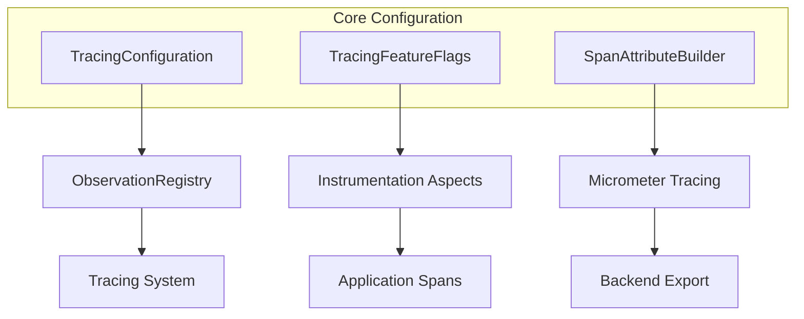

# Core Configuration Module - Introduction

## Brief Overview

The **Core Configuration Module** is the foundational component of the Wallet Hub's distributed tracing infrastructure. It establishes the essential configuration and utilities for setting up, managing, and controlling the observability system across the entire application.

## Key Responsibilities

1. **Infrastructure Setup**: Configures core tracing infrastructure using Micrometer Tracing and OpenTelemetry standards
2. **Feature Control**: Provides runtime control over instrumentation via feature flags
3. **Attribute Standardization**: Ensures consistent span attribute naming following OpenTelemetry semantic conventions

## Core Components

### 1. TracingConfiguration
Central configuration class that sets up the distributed tracing infrastructure, including:
- ObservationRegistry with tracing handlers
- Multi-backend trace export with primary/fallback support
- Circuit breaker protection for resilient span export

### 2. TracingFeatureFlags
Runtime control over which components are instrumented, enabling:
- Granular performance tuning
- Selective troubleshooting
- Zero-downtime configuration updates

### 3. SpanAttributeBuilder
Utility class for building standardized span attributes with:
- OpenTelemetry semantic convention compliance
- Automatic PII removal and data sanitization
- Type-safe constants and builder methods

## Quick Start

### Enable Tracing
```yaml
# application-tracing.yml
management:
  tracing:
    enabled: true
    sampling:
      probability: 0.1
  zipkin:
    tracing:
      endpoint: http://localhost:9411/api/v2/spans
```

### Configure Feature Flags
```yaml
tracing:
  features:
    database: true
    kafka: true
    use-case: true
```

### Runtime Updates
```bash
curl -X POST http://localhost:8080/actuator/refresh
```

## Architecture Overview



## Performance Impact

| Component | Overhead | Recommendation |
|-----------|----------|----------------|
| Baseline Tracing | ~2-5ms per operation | Enable for production |
| Feature Flags | <1μs per check | Use for optimization |
| Attribute Building | ~0.1ms per span | Minimal impact |

## Security Features

- **Automatic PII Removal**: Emails, phones, credit cards masked
- **Secret Protection**: API keys, tokens, passwords hidden
- **SQL Sanitization**: Literal values replaced with placeholders
- **Safe Field Lists**: Only explicitly allowed data included

## Next Steps

For comprehensive documentation including:
- Detailed architecture diagrams
- Configuration reference
- Performance optimization guide
- Troubleshooting procedures
- Integration with other modules

See the [full documentation](core_configuration.md).

## Related Modules

- [Sampling System](sampling_system.md): Sampling strategies and configuration
- [Instrumentation Aspects](instrumentation_aspects.md): AOP-based tracing
- [Propagation Components](propagation.md): Trace context propagation
- [Web HTTP Tracing](web_http_tracing.md): HTTP request tracing