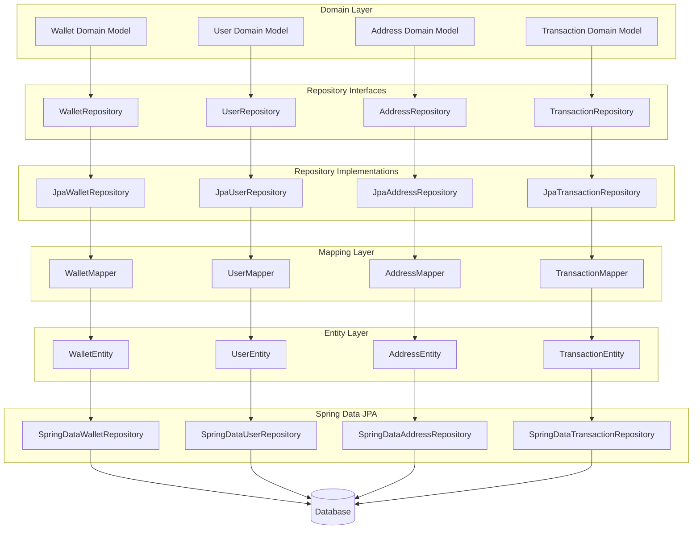
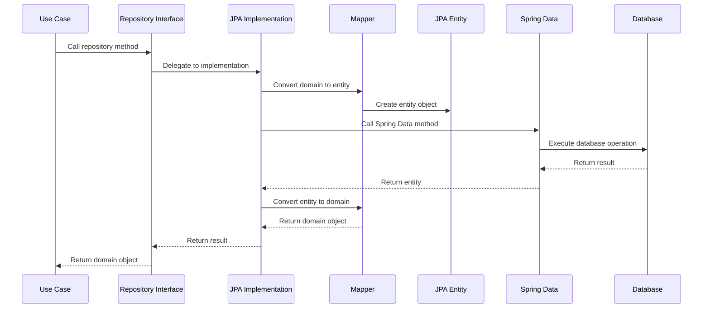
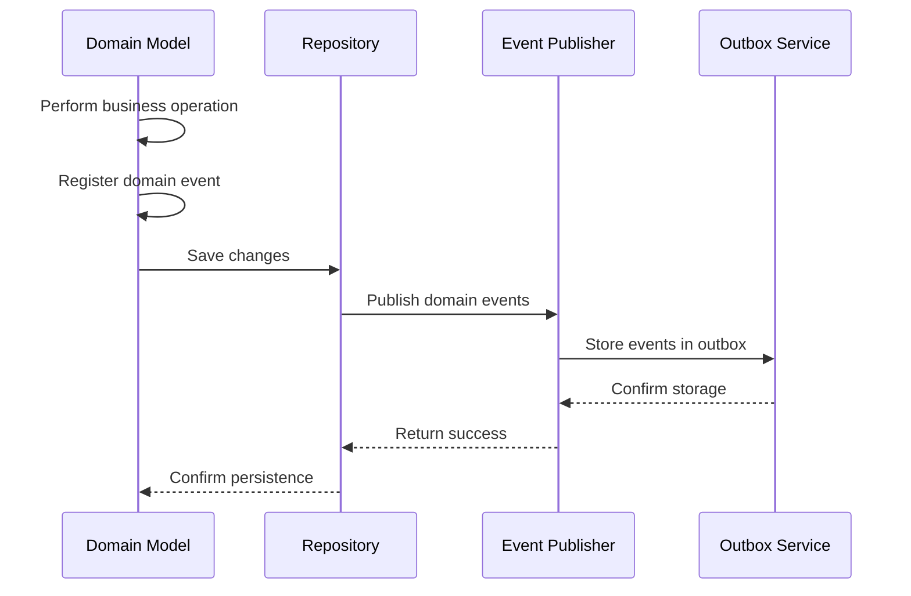
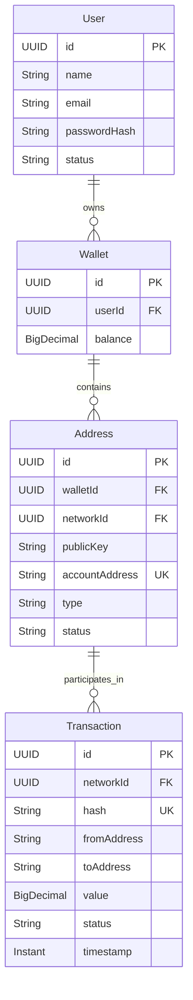
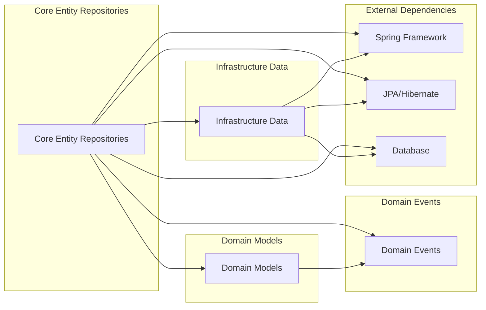

# Core Entity Repositories Module

## Overview

The Core Entity Repositories module is a foundational component of the Wallet Hub system that provides data persistence and retrieval capabilities for the core domain entities. This module implements the Repository pattern, separating domain logic from data access concerns and providing a clean abstraction layer for managing the system's primary entities.

### Key Responsibilities

1. **Data Persistence**: Manage CRUD operations for core domain entities
2. **Domain Isolation**: Decouple domain models from infrastructure concerns
3. **Query Abstraction**: Provide domain-specific query methods
4. **Transaction Management**: Handle data consistency and integrity
5. **Event Integration**: Support domain event publishing through repositories

## Architecture

### Module Structure

```
core_entity_repositories/
├── Domain Interfaces (Gateway Layer)
│   ├── WalletRepository
│   ├── UserRepository
│   ├── AddressRepository
│   └── TransactionRepository
├── Infrastructure Implementations
│   ├── JpaWalletRepository
│   ├── JpaUserRepository
│   ├── JpaAddressRepository
│   └── JpaTransactionRepository
├── Data Access Layer
│   ├── SpringDataWalletRepository
│   ├── SpringDataUserRepository
│   ├── SpringDataAddressRepository
│   └── SpringDataTransactionRepository
├── Entity Layer
│   ├── WalletEntity
│   ├── UserEntity
│   ├── AddressEntity
│   └── TransactionEntity
└── Mapping Layer
    ├── WalletMapper
    ├── UserMapper
    ├── AddressMapper
    └── TransactionMapper
```

### Architecture Diagram



## Core Components

### 1. Wallet Repository

#### Interface: `WalletRepository`

The `WalletRepository` interface defines the contract for managing wallet entities in the system. Wallets are uniquely identified by UUID and are associated with specific users.

**Key Methods:**
- `save(Wallet wallet)`: Persists a new wallet
- `update(Wallet wallet)`: Updates an existing wallet
- `findById(UUID id)`: Retrieves a wallet by its unique identifier
- `findByUserId(UUID userId)`: Finds all wallets for a specific user
- `findActiveByUserId(UUID userId)`: Retrieves active wallets for a user
- `findByUserIdAndStatus(UUID userId, WalletStatus status)`: Finds wallets by user and status

**Implementation: `JpaWalletRepository`**
- Uses Spring Data JPA for database operations
- Maps between `Wallet` domain model and `WalletEntity`
- Provides fallback implementations for queries not supported by JPA schema

### 2. User Repository

#### Interface: `UserRepository`

The `UserRepository` interface manages user entities within the system. Users are uniquely identified by UUID and include authentication and profile information.

**Key Methods:**
- `save(User user)`: Persists a new user
- `findByEmail(String email)`: Finds a user by email address
- `findByStatus(UserStatus status)`: Retrieves users by status
- `findActiveUsers()`: Gets all active users
- `findByEmailVerificationToken(String token)`: Finds user by verification token

**Implementation: `JpaUserRepository`**
- Implements user persistence using JPA
- Maps between `User` domain model and `UserEntity`
- Provides fallback filtering for complex queries

### 3. Address Repository

#### Interface: `AddressRepository`

The `AddressRepository` interface handles blockchain address entities. Addresses are associated with wallets and networks, and include cryptographic information.

**Key Methods:**
- `save(Address address)`: Persists a new address
- `findByWalletId(UUID walletId)`: Finds addresses by wallet
- `findByNetworkId(UUID networkId)`: Retrieves addresses by network
- `findByAccountAddress(String accountAddress)`: Finds address by blockchain address
- `findByNetworkIdAndAccountAddress(UUID networkId, String accountAddress)`: Finds address by network and blockchain address

**Implementation: `JpaAddressRepository`**
- Uses Spring Data JPA with custom query methods
- Maps between `Address` domain model and `AddressEntity`
- Supports complex queries through JPA method naming conventions

### 4. Transaction Repository

#### Interface: `TransactionRepository`

The `TransactionRepository` interface manages blockchain transaction entities. Transactions are associated with networks and include detailed blockchain data.

**Key Methods:**
- `save(Transaction transaction)`: Persists a new transaction
- `findByHash(String hash)`: Finds transaction by blockchain hash
- `findByNetworkId(UUID networkId)`: Retrieves transactions by network
- `findByFromAddress(String fromAddress)`: Finds transactions by sender
- `findByToAddress(String toAddress)`: Finds transactions by recipient
- `findByTimestampBetween(Instant start, Instant end)`: Retrieves transactions within time range

**Implementation: `JpaTransactionRepository`**
- Implements transaction persistence with JPA
- Maps between `Transaction` domain model and `TransactionEntity`
- Supports comprehensive querying of transaction data

## Data Flow

### Repository Operation Flow



### Domain Event Integration



## Domain Models

### Wallet Domain Model

The `Wallet` class extends `AggregateRoot` and represents a user's cryptocurrency wallet. Key features:

- **Aggregate Root**: Manages address and transaction relationships
- **Status Management**: Supports ACTIVE, INACTIVE, DELETED, LOCKED, RECOVERING states
- **Fund Management**: Provides methods for adding/withdrawing funds
- **Event Publishing**: Emits domain events for state changes
- **Validation**: Includes operation validation based on wallet status

### User Domain Model

The `User` class extends `AggregateRoot` and represents system users. Key features:

- **Authentication**: Manages password hashes and login attempts
- **Status Management**: Supports PENDING_VERIFICATION, ACTIVE, DEACTIVATED, SUSPENDED states
- **Email Verification**: Handles email verification tokens and status
- **Two-Factor Authentication**: Integrates with 2FA functionality
- **Security**: Implements account locking after failed attempts

### Address Domain Model

The `Address` class extends `AggregateRoot` and represents blockchain addresses. Key features:

- **Cryptographic Data**: Stores public keys and account addresses
- **Type Management**: Supports EXTERNAL, INTERNAL, CONTRACT address types
- **Relationship Management**: Tracks associated transactions and token balances
- **Status Control**: Manages ACTIVE and ARCHIVED states
- **Signing Capability**: Determines if address can sign transactions

### Transaction Domain Model

The `Transaction` class extends `AggregateRoot` and represents blockchain transactions. Key features:

- **Blockchain Data**: Stores hash, block information, and gas details
- **Status Tracking**: Manages PENDING, CONFIRMED, FAILED states
- **Network Association**: Links transactions to specific networks
- **Event Publishing**: Emits events for status changes
- **Rehydration Support**: Supports loading from persisted state

## Data Mapping

### Mapping Strategy

The module uses MapStruct for object mapping between domain models and JPA entities:

1. **Domain to Entity**: Converts rich domain objects to persistence entities
2. **Entity to Domain**: Reconstructs domain objects with business logic
3. **Value Object Mapping**: Handles specialized value objects like `PublicKey` and `AccountAddress`

### Mapper Implementations

- **WalletMapper**: Maps between `Wallet` and `WalletEntity`
- **UserMapper**: Maps between `User` and `UserEntity` with rehydration support
- **AddressMapper**: Maps between `Address` and `AddressEntity` with value object conversion
- **TransactionMapper**: Maps between `Transaction` and `TransactionEntity` with rehydration support

## Database Schema

### Entity Relationships



### Table Definitions

**Users Table:**
- `id`: UUID primary key
- `name`: User's display name
- `email`: Unique email address
- Additional fields for authentication and status

**Wallets Table:**
- `id`: UUID primary key  
- `user_id`: Foreign key to users
- `balance`: Current wallet balance

**Addresses Table:**
- `id`: UUID primary key
- `wallet_id`: Foreign key to wallets
- `network_id`: Foreign key to networks
- `account_address`: Unique blockchain address
- `public_key`: Cryptographic public key
- `type`: Address type (EXTERNAL, INTERNAL, CONTRACT)
- `status`: Address status (ACTIVE, ARCHIVED)

**Transactions Table:**
- `id`: UUID primary key
- `network_id`: Foreign key to networks
- `hash`: Unique transaction hash
- `from_address`: Sender address
- `to_address`: Recipient address
- `value`: Transaction amount
- `status`: Transaction status (PENDING, CONFIRMED, FAILED)
- `timestamp`: Transaction creation time

## Integration Points

### Dependencies



### External Systems Integration

1. **Spring Data JPA**: Provides repository abstraction and query generation
2. **Hibernate**: ORM implementation for database operations
3. **Database**: PostgreSQL/MySQL for data persistence
4. **MapStruct**: Object mapping between layers
5. **Domain Events**: Integration with event publishing system

## Usage Examples

### Creating and Saving a Wallet

```java
// Create a new wallet
Wallet wallet = Wallet.create(
    UUID.randomUUID(),
    "My Wallet",
    "Personal cryptocurrency wallet"
);

// Save wallet through repository
Wallet savedWallet = walletRepository.save(wallet);

// Find wallet by user
List<Wallet> userWallets = walletRepository.findByUserId(userId);
```

### Managing User Accounts

```java
// Create and save user
User user = User.create(
    "John Doe",
    "john@example.com",
    passwordHash
);
User savedUser = userRepository.save(user);

// Find user by email
Optional<User> foundUser = userRepository.findByEmail("john@example.com");

// Update user profile
user.updateProfile("John Smith", "john.smith@example.com");
userRepository.update(user);
```

### Working with Addresses

```java
// Create blockchain address
Address address = Address.create(
    UUID.randomUUID(),
    walletId,
    networkId,
    publicKey,
    accountAddress,
    AddressType.EXTERNAL,
    "m/44'/60'/0'/0/0"
);

// Save address
Address savedAddress = addressRepository.save(address);

// Find addresses by wallet
List<Address> walletAddresses = addressRepository.findByWalletId(walletId);
```

### Transaction Management

```java
// Create transaction
Transaction transaction = Transaction.create(
    UUID.randomUUID(),
    networkId,
    new TransactionHash("0xabc123..."),
    fromAddress,
    toAddress,
    BigDecimal.valueOf(1.5),
    "0x"
);

// Save transaction
Transaction savedTransaction = transactionRepository.save(transaction);

// Find transactions by network
List<Transaction> networkTransactions = transactionRepository.findByNetworkId(networkId);
```

## Error Handling

### Repository Exceptions

1. **Data Integrity Errors**: Handled through JPA constraint violations
2. **Query Execution Errors**: Caught and wrapped in domain-specific exceptions
3. **Mapping Errors**: Validated during domain-entity conversion
4. **Concurrency Issues**: Managed through optimistic locking where applicable

### Fallback Strategies

1. **Unsupported Operations**: Provide fallback implementations for unsupported JPA queries
2. **Data Validation**: Validate domain objects before persistence
3. **Error Recovery**: Implement retry mechanisms for transient failures
4. **Audit Logging**: Log repository operations for debugging and monitoring

## Performance Considerations

### Query Optimization

1. **Indexed Fields**: Database indexes on frequently queried columns
2. **Pagination Support**: Implement pagination for large result sets
3. **Lazy Loading**: Use JPA lazy loading for related entities
4. **Query Caching**: Implement caching for frequently accessed data

### Memory Management

1. **Batch Operations**: Support batch inserts and updates
2. **Stream Processing**: Use streams for large dataset processing
3. **Connection Pooling**: Configure optimal connection pool sizes
4. **Entity State Management**: Properly manage JPA entity lifecycle

## Testing Strategy

### Unit Testing

1. **Repository Interfaces**: Test contract compliance
2. **Mapper Components**: Verify correct object mapping
3. **Domain Logic**: Test business rules in domain models
4. **Query Methods**: Validate query results and behavior

### Integration Testing

1. **Database Integration**: Test with embedded database
2. **Transaction Management**: Verify ACID properties
3. **Concurrent Access**: Test multi-threaded scenarios
4. **Error Scenarios**: Validate error handling and recovery

### Mock Testing

1. **Repository Mocks**: Mock repository interfaces for service testing
2. **Database Mocks**: Use in-memory databases for fast testing
3. **Event Publisher Mocks**: Mock event publishing for isolated testing

## Related Modules

- **[domain_models.md](domain_models.md)**: Core domain entities and business logic
- **[infrastructure_data.md](infrastructure_data.md)**: Data access layer and persistence infrastructure
- **[domain_events.md](domain_events.md)**: Domain event publishing and handling
- **[asset_management_repositories.md](asset_management_repositories.md)**: Asset-related repository implementations