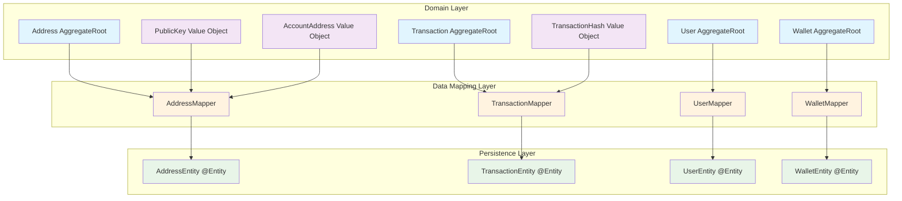
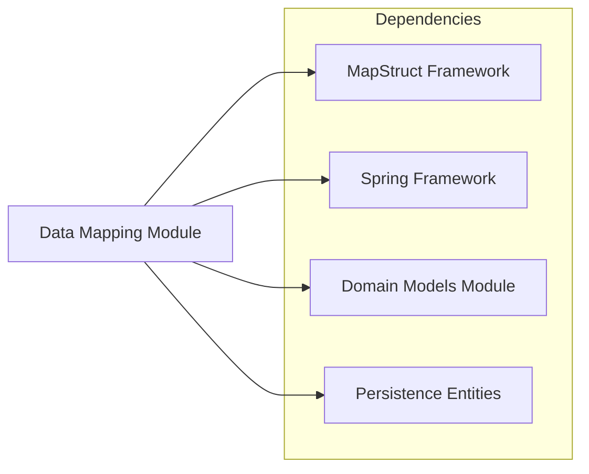
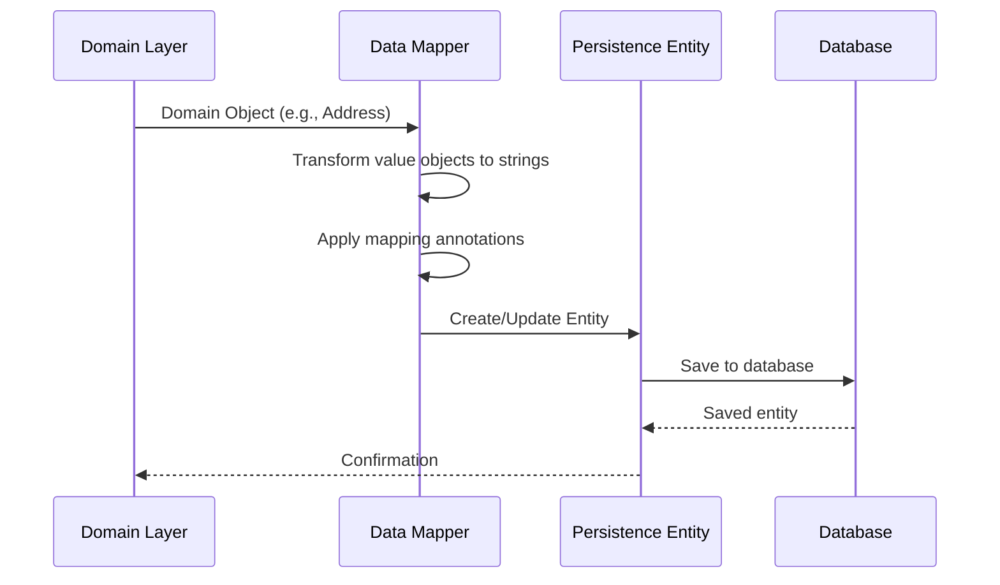
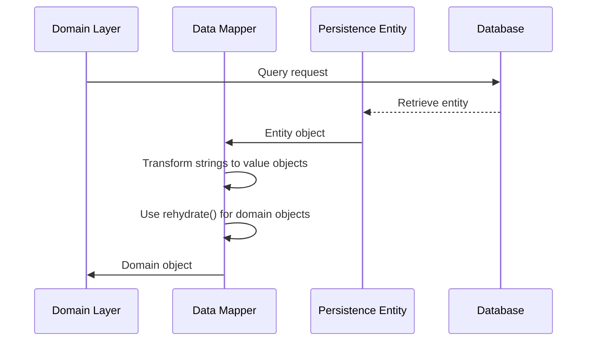
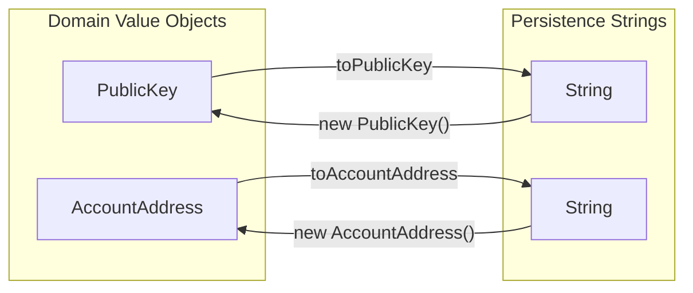

# Data Mapping Module

## Overview

The Data Mapping module is a critical infrastructure component in the WalletHub application that handles bidirectional data transformation between domain models and persistence entities. This module implements the **Data Mapper** pattern using MapStruct framework to provide type-safe, efficient, and maintainable mapping between the domain layer and data layer.

## Purpose and Core Functionality

The primary purpose of the Data Mapping module is to:

1. **Decouple Domain Models from Persistence**: Keep domain models clean and free from persistence concerns
2. **Ensure Type Safety**: Provide compile-time validation of mapping operations
3. **Simplify Data Transformation**: Reduce boilerplate code for converting between domain objects and database entities
4. **Maintain Consistency**: Ensure consistent data transformation across the application

## Architecture

### Component Relationships



### Module Dependencies



## Core Components

### 1. AddressMapper

**Purpose**: Maps between `Address` domain objects and `AddressEntity` database entities, handling complex value object transformations.

**Key Features**:
- Maps `PublicKey` and `AccountAddress` value objects to/from string representations
- Uses custom named mapping methods for value object conversion
- Handles null values gracefully

**Mapping Details**:

| Domain Field | Entity Field | Transformation | Notes |
|-------------|-------------|---------------|-------|
| `Address.id` | `AddressEntity.id` | Direct mapping | UUID type preserved |
| `Address.walletId` | `AddressEntity.walletId` | Direct mapping | UUID type preserved |
| `Address.networkId` | `AddressEntity.networkId` | Direct mapping | UUID type preserved |
| `PublicKey.value` | `AddressEntity.publicKey` | `publicKey.value → publicKey` | Value object to string |
| `AccountAddress.value` | `AddressEntity.accountAddress` | `accountAddress.value → accountAddress` | Value object to string |
| `Address.type` | `AddressEntity.type` | Direct mapping | Enum type preserved |
| `Address.derivationPath` | `AddressEntity.derivationPath` | Direct mapping | String type preserved |
| `Address.status` | `AddressEntity.status` | Direct mapping | Enum type preserved |

**Custom Methods**:
- `toPublicKey(String)`: Converts string to `PublicKey` value object with validation
- `toAccountAddress(String)`: Converts string to `AccountAddress` value object with validation

### 2. TransactionMapper

**Purpose**: Maps between `Transaction` domain objects and `TransactionEntity` database entities, handling transaction-specific rehydration logic.

**Key Features**:
- Uses `Transaction.rehydrate()` method for domain object reconstruction
- Maps all transaction metadata including gas information and block details
- Handles bidirectional mapping with explicit field assignments

**Mapping Details**:

| Domain Field | Entity Field | Transformation | Notes |
|-------------|-------------|---------------|-------|
| `Transaction.id` | `TransactionEntity.id` | Direct mapping | UUID type preserved |
| `Transaction.networkId` | `TransactionEntity.networkId` | Direct mapping | UUID type preserved |
| `TransactionHash.value` | `TransactionEntity.hash` | `hash.getValue() → hash` | Value object to string |
| `Transaction.fromAddress` | `TransactionEntity.fromAddress` | Direct mapping | String type preserved |
| `Transaction.toAddress` | `TransactionEntity.toAddress` | Direct mapping | String type preserved |
| `Transaction.value` | `TransactionEntity.value` | Direct mapping | BigDecimal type preserved |
| `Transaction.gasPrice` | `TransactionEntity.gasPrice` | Direct mapping | BigDecimal type preserved |
| `Transaction.gasLimit` | `TransactionEntity.gasLimit` | Direct mapping | BigDecimal type preserved |
| `Transaction.gasUsed` | `TransactionEntity.gasUsed` | Direct mapping | BigDecimal type preserved |
| `Transaction.data` | `TransactionEntity.data` | Direct mapping | String type preserved |
| `Transaction.timestamp` | `TransactionEntity.timestamp` | Direct mapping | Instant type preserved |
| `Transaction.blockNumber` | `TransactionEntity.blockNumber` | Direct mapping | Long type preserved |
| `Transaction.blockHash` | `TransactionEntity.blockHash` | Direct mapping | String type preserved |
| `Transaction.status` | `TransactionEntity.status` | Direct mapping | Enum type preserved |

**Special Handling**:
- Uses `Transaction.rehydrate()` method for domain object reconstruction
- All fields passed to rehydrate constructor for proper aggregate restoration

### 3. UserMapper

**Purpose**: Maps between `User` domain objects and `UserEntity` database entities, focusing on user profile information.

**Key Features**:
- Uses `User.rehydrate()` for domain object reconstruction
- Maps core user profile fields (id, name, email)
- Simple, focused mapping for user data

**Mapping Details**:

| Domain Field | Entity Field | Transformation | Notes |
|-------------|-------------|---------------|-------|
| `User.id` | `UserEntity.id` | Direct mapping | UUID type preserved |
| `User.name` | `UserEntity.name` | Direct mapping | String type preserved |
| `User.email` | `UserEntity.email` | Direct mapping | String type preserved |

**Special Handling**:
- Uses `User.rehydrate()` method for domain object reconstruction
- Focuses on core user profile information (additional user data may be in other entities)

### 4. WalletMapper

**Purpose**: Maps between `Wallet` domain objects and `WalletEntity` database entities, handling wallet balance and user relationships.

**Key Features**:
- Maps wallet balance between domain and entity
- Handles user ID relationships (uses domain ID as placeholder for entity constraints)
- Simple mapping focused on wallet financial data

**Mapping Details**:

| Domain Field | Entity Field | Transformation | Notes |
|-------------|-------------|---------------|-------|
| `Wallet.id` | `WalletEntity.id` | Direct mapping | UUID type preserved |
| `Wallet.balance` | `WalletEntity.balance` | Direct mapping | BigDecimal type preserved |
| `Wallet.id` | `WalletEntity.userId` | `id → userId` | Placeholder mapping for non-null constraint |

**Special Handling**:
- Creates domain object using constructor `new Wallet(id, "Wallet", "")`
- Sets balance from entity after domain object creation
- Uses domain ID as placeholder for `userId` field to satisfy database constraints
- Note: Domain model has richer structure (name, description, status) not fully mapped to entity

## Data Flow

### Domain to Persistence Flow



### Persistence to Domain Flow



## Value Object Handling

The Data Mapping module implements special handling for domain value objects:

### PublicKey and AccountAddress Mapping



**Custom Mapping Methods**:
- `toPublicKey()`: Converts string to `PublicKey` value object with validation
- `toAccountAddress()`: Converts string to `AccountAddress` value object with validation

## Configuration and Integration

### MapStruct Configuration

All mappers are configured with `@Mapper(componentModel = "spring")` which:
1. Integrates with Spring's dependency injection
2. Generates implementation at compile time
3. Provides type-safe mapping

### Spring Integration

```java
// Auto-generated implementation
@Component
public class AddressMapperImpl implements AddressMapper {
    // MapStruct generated implementation
}

// Usage in services
@Service
public class AddressService {
    @Autowired
    private AddressMapper addressMapper;
    
    public Address saveAddress(Address address) {
        AddressEntity entity = addressMapper.toEntity(address);
        // Save to repository
        AddressEntity saved = addressRepository.save(entity);
        return addressMapper.toDomain(saved);
    }
}
```

## Error Handling and Validation

### Null Safety
All mappers implement null checks:
```java
default Transaction toDomain(TransactionEntity entity) {
    if (entity == null) return null;
    // ... mapping logic
}
```

### Value Object Validation
Value object constructors include validation:
```java
public PublicKey(String value) {
    validatePublicKey(value); // Throws IllegalArgumentException
    this.value = value;
}
```

## Performance Considerations

1. **Compile-time Generation**: MapStruct generates implementation at compile time, avoiding reflection overhead
2. **Type Safety**: Compile-time validation prevents runtime mapping errors
3. **Minimal Boilerplate**: Reduces manual mapping code maintenance
4. **Efficient Transformation**: Direct field assignments without intermediate objects

## Usage Examples

### Basic Mapping
```java
// Domain to Entity
Address address = Address.create(...);
AddressEntity entity = addressMapper.toEntity(address);
addressRepository.save(entity);

// Entity to Domain
AddressEntity savedEntity = addressRepository.findById(id);
Address domainAddress = addressMapper.toDomain(savedEntity);
```

### Complex Value Object Mapping
```java
// Custom mapping for value objects
@Named("toPublicKey")
default PublicKey toPublicKey(String value) {
    return value != null ? new PublicKey(value) : null;
}

// Usage in mapping
@Mapping(target = "publicKey", source = "publicKey", qualifiedByName = "toPublicKey")
Address toDomain(AddressEntity entity);
```

## Testing Considerations

When testing components that use mappers:
1. **Unit Tests**: Test mapper implementations directly
2. **Integration Tests**: Test complete data flow through repositories
3. **Null Handling**: Verify null safety in both directions
4. **Value Objects**: Test validation during mapping

## Related Modules

- **[Domain Models](domain_models.md)**: Source domain objects for mapping
- **[Infrastructure Data](infrastructure_data.md)**: Target entities and repositories
- **[Repository Layer](repository_layer.md)**: Consumers of mapped data
- **[Use Cases](use_cases.md)**: Business logic that operates on mapped domain objects

## Best Practices

1. **Keep Mappers Focused**: Each mapper should handle one domain entity type
2. **Use Named Methods**: For complex transformations, use `@Named` methods
3. **Maintain Bidirectionality**: Ensure both `toDomain` and `toEntity` methods exist
4. **Handle Null Values**: Always check for null before mapping
5. **Document Complex Mappings**: Use JavaDoc for non-obvious transformations

## Mapping Patterns

### Pattern 1: Rehydration Pattern
Used when reconstructing domain aggregates from persistence. This pattern calls the domain object's `rehydrate()` method to properly restore the aggregate state without triggering domain events.

```java
// TransactionMapper example
default Transaction toDomain(TransactionEntity entity) {
    if (entity == null) return null;
    return Transaction.rehydrate(
        entity.getId(),
        entity.getNetworkId(),
        new TransactionHash(entity.getHash()),
        entity.getFromAddress(),
        entity.getToAddress(),
        entity.getValue(),
        entity.getData(),
        entity.getTimestamp(),
        entity.getBlockNumber(),
        entity.getBlockHash(),
        entity.getStatus(),
        entity.getGasPrice(),
        entity.getGasLimit(),
        entity.getGasUsed()
    );
}
```

**When to use**: For aggregate roots that have complex construction logic and need to be restored without triggering creation events.

### Pattern 2: Value Object Transformation Pattern
Used for mapping domain value objects to/from primitive types. This pattern uses custom named methods with `@Named` annotation.

```java
// AddressMapper example
@Named("toPublicKey")
default PublicKey toPublicKey(String value) {
    return value != null ? new PublicKey(value) : null;
}

@Named("toAccountAddress")
default AccountAddress toAccountAddress(String value) {
    return value != null ? new AccountAddress(value) : null;
}

// Usage in mapping
@Mapping(target = "publicKey", source = "publicKey", qualifiedByName = "toPublicKey")
@Mapping(target = "accountAddress", source = "accountAddress", qualifiedByName = "toAccountAddress")
Address toDomain(AddressEntity entity);
```

**When to use**: For domain value objects that require validation or custom construction logic.

### Pattern 3: Direct Field Mapping Pattern
Used for simple one-to-one field mappings where types are compatible.

```java
// UserMapper example
@Mappings({
    @Mapping(target = "id", source = "id"),
    @Mapping(target = "name", source = "name"),
    @Mapping(target = "email", source = "email")
})
UserEntity toEntity(User domain);
```

**When to use**: For simple fields with compatible types that don't require transformation.

### Pattern 4: Constructor + Setter Pattern
Used when domain objects need to be constructed and then additional properties set.

```java
// WalletMapper example
default Wallet toDomain(WalletEntity entity) {
    if (entity == null) return null;
    Wallet wallet = new Wallet(entity.getId(), "Wallet", "");
    wallet.setBalance(entity.getBalance());
    return wallet;
}
```

**When to use**: When domain objects have required constructor parameters and additional settable properties.

### Pattern 5: Placeholder Mapping Pattern
Used to satisfy database constraints when domain model doesn't have equivalent fields.

```java
// WalletMapper example
default WalletEntity toEntity(Wallet domain) {
    if (domain == null) return null;
    WalletEntity entity = new WalletEntity();
    entity.setId(domain.getId());
    // No userId in domain model; use id as placeholder to satisfy non-null constraint
    entity.setUserId(domain.getId());
    entity.setBalance(domain.getBalance());
    return entity;
}
```

**When to use**: When persistence layer has constraints that aren't represented in the domain model.

### Pattern Usage Summary

| Mapper | Patterns Used | Key Characteristics |
|--------|--------------|-------------------|
| **AddressMapper** | Pattern 2 (Value Object), Pattern 3 (Direct Field) | Handles complex value objects (`PublicKey`, `AccountAddress`) with custom transformation methods |
| **TransactionMapper** | Pattern 1 (Rehydration), Pattern 3 (Direct Field) | Uses `rehydrate()` for proper aggregate restoration, maps all transaction metadata |
| **UserMapper** | Pattern 1 (Rehydration), Pattern 3 (Direct Field) | Simple mapping focused on core user profile fields |
| **WalletMapper** | Pattern 4 (Constructor + Setter), Pattern 5 (Placeholder) | Uses constructor with default values, placeholder mapping for database constraints |

## Future Considerations

1. **Additional Mappers**: Extend to cover all domain entities
2. **Custom Converters**: Add support for complex type conversions
3. **Performance Optimization**: Consider caching for frequently mapped objects
4. **Validation Integration**: Integrate with validation frameworks during mapping

## Conclusion

The Data Mapping module provides a robust, type-safe foundation for data transformation in the WalletHub application. By leveraging MapStruct's compile-time code generation and following domain-driven design principles, it ensures clean separation between domain logic and persistence concerns while maintaining high performance and maintainability.