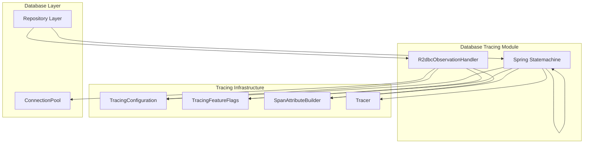
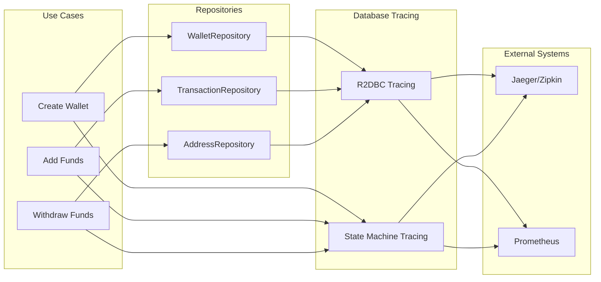
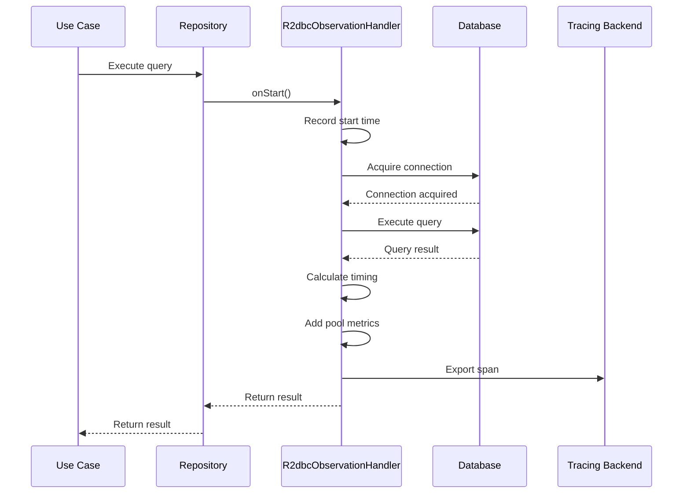
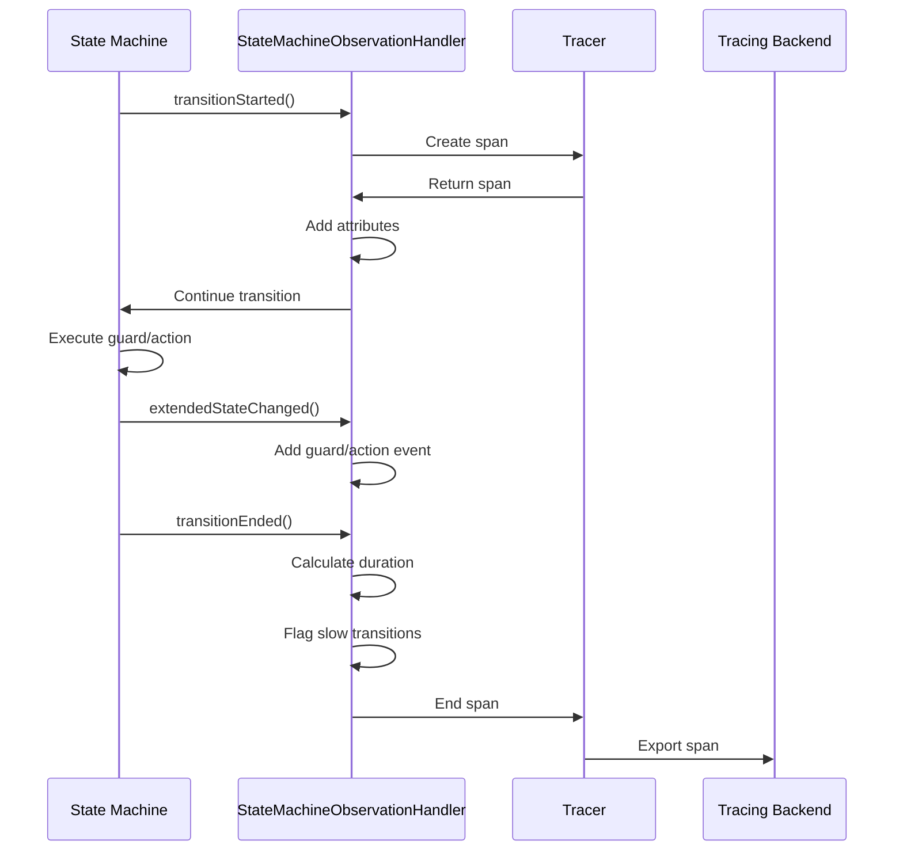

# Database Tracing Module

## Overview

The Database Tracing module provides comprehensive observability for database operations within the Wallet Hub application. It instruments both reactive (R2DBC) and state machine (Spring Statemachine) database interactions to provide visibility into query performance, connection pool health, and saga workflow execution.

### Purpose

This module enables developers and operations teams to:
- Monitor database query performance and identify slow operations
- Track connection pool utilization and detect resource exhaustion
- Trace saga state transitions and compensation flows
- Correlate database operations with business transactions
- Detect and diagnose database-related performance bottlenecks

### Key Features

1. **Reactive Database Tracing**: Instruments R2DBC operations with connection pool metrics
2. **State Machine Tracing**: Tracks saga workflow transitions and compensation flows
3. **Performance Monitoring**: Detects slow queries and state transitions
4. **Error Tracking**: Captures database errors with context for debugging
5. **Feature Flag Control**: Enables/disables tracing components via configuration

## Architecture

The Database Tracing module consists of two main components that work together with the broader tracing infrastructure:



### Component Relationships

1. **R2dbcObservationHandler**: Integrates with Spring Data R2DBC's observation support to trace reactive database operations
2. **StateMachineObservationHandler**: Listens to Spring Statemachine events to trace saga state transitions
3. **TracingFeatureFlags**: Controls enablement of database and state machine tracing via configuration
4. **SpanAttributeBuilder**: Provides standardized span attributes following OpenTelemetry conventions
5. **TracingConfiguration**: Configures the overall tracing infrastructure

## Sub-modules

### 1. R2DBC Tracing ([r2dbc_tracing.md](r2dbc_tracing.md))
Instruments reactive database operations using R2DBC and provides:
- Connection acquisition timing
- Query execution duration
- Connection pool metrics (active/idle connections, utilization)
- Database system and operation type detection
- Error tracking for database failures

### 2. State Machine Tracing ([state_machine_tracing.md](state_machine_tracing.md))
Traces Spring Statemachine transitions for saga workflows:
- State transition timing and duration
- Compensation flow detection and tracking
- Guard evaluations and action executions
- Slow transition detection (timeout monitoring)
- Error handling for state machine failures

## Integration Points

### With Application Components



### Configuration

The module is configured via application properties:

```yaml
tracing:
  features:
    database: true          # Enable R2DBC tracing
    stateMachine: true      # Enable state machine tracing
  
  # R2DBC specific settings
  database:
    slow-query-threshold-ms: 50
    connection-pool-metrics: true
  
  # State machine specific settings  
  stateMachine:
    slow-transition-threshold-ms: 5000
    compensation-tracking: true
```

## Data Flow

### R2DBC Operation Flow



### State Machine Transition Flow



## Performance Characteristics

### Overhead Estimates

| Component | Overhead per Operation | Key Factors |
|-----------|------------------------|-------------|
| R2DBC Tracing | 0.5-1ms | Connection pool metrics, query analysis |
| State Machine Tracing | 0.5-1ms | Span creation, attribute collection |
| Combined | 1-2ms | Both handlers active |

### Optimization Guidelines

1. **High-volume systems**: Consider disabling database tracing for read-only queries
2. **Complex sagas**: State machine tracing overhead scales with transition count
3. **Connection pool monitoring**: Enable only when diagnosing pool issues
4. **Production vs Development**: Use feature flags to adjust tracing granularity

## Error Handling

The module provides comprehensive error tracking:

1. **Database Errors**: Captures SQL exceptions with sanitized messages
2. **Connection Failures**: Tracks connection acquisition timeouts
3. **State Machine Errors**: Records transition failures with context
4. **Compensation Flows**: Automatically detects and tags rollback scenarios

## Monitoring and Alerting

### Key Metrics

| Metric | Description | Alert Threshold |
|--------|-------------|-----------------|
| `db.connection.acquisition_time_ms` | Connection acquisition time | > 100ms |
| `db.connection_pool.utilization_percent` | Pool utilization | > 80% |
| `statemachine.transition.duration_ms` | State transition duration | > 5000ms |
| `statemachine.slow_transition` | Slow transition flag | true |

### Health Indicators

- **Connection Pool Health**: Monitors active vs max connections
- **State Machine Health**: Tracks stuck transitions and error rates
- **Tracing Health**: Verifies span export functionality

## Related Modules

- [infrastructure_tracing](infrastructure_tracing.md): Core tracing infrastructure
- [infrastructure_data](infrastructure_data.md): Database and state machine implementations
- [domain_repositories](domain_repositories.md): Repository interfaces
- [use_cases](use_cases.md): Business operations that trigger database calls

## Usage Examples

### Enabling/Disabling Tracing

```java
// Via application.properties
tracing.features.database=true
tracing.features.stateMachine=true

// Programmatically (if needed)
@Autowired
private TracingFeatureFlags featureFlags;

public void configureTracing() {
    if (featureFlags.isDatabase()) {
        // Database tracing is enabled
    }
}
```

### Customizing Thresholds

```yaml
tracing:
  database:
    slow-query-threshold-ms: 100  # Alert on queries > 100ms
  stateMachine:
    slow-transition-threshold-ms: 10000  # Alert on transitions > 10s
```

## Troubleshooting

### Common Issues

1. **Missing spans**: Verify feature flags are enabled
2. **High overhead**: Consider disabling non-critical tracing components
3. **Connection pool metrics missing**: Ensure ConnectionPool is properly injected
4. **State machine events not captured**: Verify listener registration

### Debug Logging

Enable debug logging for detailed tracing information:

```yaml
logging:
  level:
    dev.bloco.wallet.hub.infra.adapter.tracing.handler: DEBUG
```

## Future Enhancements

Planned improvements for the Database Tracing module:

1. **Query Plan Analysis**: Capture and analyze query execution plans
2. **Transaction Tracing**: Track database transaction boundaries
3. **Batch Operation Support**: Instrument bulk insert/update operations
4. **Database-specific Metrics**: Collect database engine-specific metrics
5. **Predictive Analytics**: Identify patterns leading to performance issues