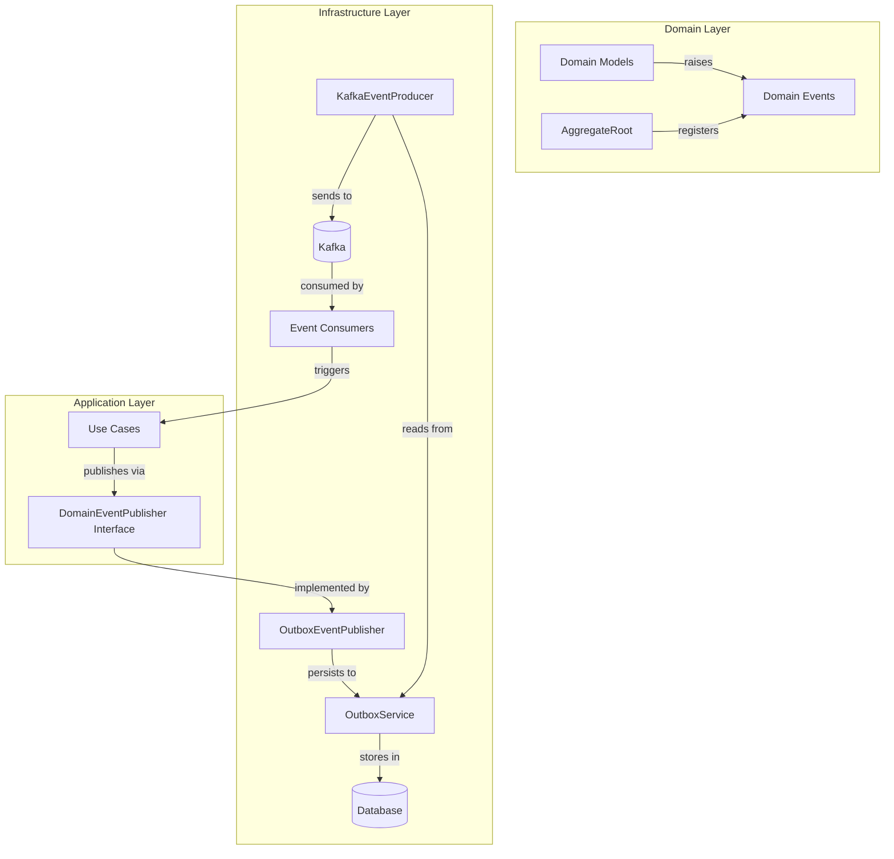

# Domain Events Module

## Overview

The Domain Events module is a critical component of the Wallet Hub system that implements the Domain-Driven Design (DDD) event-driven architecture pattern. This module provides a comprehensive framework for capturing, publishing, and processing domain events that occur within the system's business logic.

Domain events represent significant state changes or business occurrences within the system, such as wallet creation, user authentication, token balance changes, and transaction confirmations. These events enable loose coupling between different parts of the system and support event sourcing, audit logging, and integration with external systems.

## Architecture Overview

The Domain Events module follows a layered architecture with clear separation of concerns:



### Key Architectural Patterns

1. **Event-Driven Architecture**: Domain events are first-class citizens that drive system behavior
2. **Outbox Pattern**: Ensures reliable event delivery by persisting events before publishing
3. **CloudEvents Standard**: Uses CNCF CloudEvents specification for consistent event formatting
4. **W3C Trace Context**: Implements distributed tracing across event boundaries
5. **Saga Pattern**: Coordinates distributed transactions through event choreography

## Core Components

### 1. Base Event Infrastructure

#### DomainEvent (Abstract Base Class)
The foundation of all domain events in the system. Every domain event inherits from this base class, which provides:
- Unique event ID generation
- Timestamp of when the event occurred
- Correlation ID for tracing related operations
- Thread-safe event publishing mechanism

#### DomainEventPublisher (Static Publisher)
A thread-local publisher that allows in-memory event subscription and publishing within the same thread context. This is primarily used for unit testing and simple in-process event handling.

#### AggregateRoot (Event Registration)
Domain aggregates that extend `AggregateRoot` can register domain events through the `registerEvent()` method. These events are collected and can be published after the aggregate's state changes are persisted.

### 2. Event Categories

The system organizes domain events into logical categories based on the bounded context they belong to:

#### User Management Events
- `UserCreatedEvent`: Triggered when a new user registers
- `UserAuthenticatedEvent`: Triggered when a user successfully logs in
- `UserProfileUpdatedEvent`: Triggered when user profile information changes
- `UserStatusChangedEvent`: Triggered when user account status changes

#### Wallet Management Events
- `WalletCreatedEvent`: Triggered when a new wallet is created
- `WalletUpdatedEvent`: Triggered when wallet metadata changes
- `WalletStatusChangedEvent`: Triggered when wallet status changes
- `WalletDeletedEvent`: Triggered when a wallet is soft-deleted
- `WalletRecoveryInitiatedEvent`: Triggered when wallet recovery process starts

#### Address Management Events
- `AddressCreatedEvent`: Triggered when a new blockchain address is generated
- `AddressStatusChangedEvent`: Triggered when address status changes
- `AddressAddedToWalletEvent`: Triggered when an address is added to a wallet
- `AddressRemovedFromWalletEvent`: Triggered when an address is removed from a wallet

#### Token Management Events
- `TokenCreatedEvent`: Triggered when a new token is registered in the system
- `TokenBalanceChangedEvent`: Triggered when token balances change
- `TokenAddedToWalletEvent`: Triggered when a token is added to a wallet's watchlist
- `TokenRemovedFromWalletEvent`: Triggered when a token is removed from a wallet

#### Transaction Events
- `TransactionCreatedEvent`: Triggered when a new transaction is initiated
- `TransactionStatusChangedEvent`: Triggered when transaction status updates
- `TransactionConfirmedEvent`: Triggered when a transaction is confirmed on-chain

#### Contract Events
- `ContractDeployedEvent`: Triggered when a smart contract is deployed
- `ContractInteractionEvent`: Triggered when a contract function is called
- `ContractOwnerAddedEvent`: Triggered when an owner is added to a contract
- `ContractOwnerRemovedEvent`: Triggered when an owner is removed from a contract

#### Network Events
- `NetworkCreatedEvent`: Triggered when a new blockchain network is added
- `NetworkAddedEvent`: Triggered when a network becomes available
- `NetworkStatusChangedEvent`: Triggered when network status changes

#### Vault Events
- `VaultCreatedEvent`: Triggered when a new key vault is created
- `VaultStatusChangedEvent`: Triggered when vault status changes
- `KeyPairGeneratedEvent`: Triggered when new cryptographic key pairs are generated

#### Store Events
- `StoreCreatedEvent`: Triggered when a new data store is created
- `StoreStatusChangedEvent`: Triggered when store status changes
- `AddressAddedToStoreEvent`: Triggered when an address is added to a store

## Event Flow and Processing

### 1. Event Generation
Domain events are generated within domain aggregates when significant state changes occur. The `AggregateRoot` base class provides methods to register these events:

```java
public class Wallet extends AggregateRoot {
    public Wallet create(String name, UUID userId) {
        Wallet wallet = new Wallet(UUID.randomUUID(), name, userId);
        wallet.registerEvent(new WalletCreatedEvent(wallet.getId(), correlationId));
        return wallet;
    }
}
```

### 2. Event Publishing
Events are published through the `DomainEventPublisher` interface, which has multiple implementations:

#### In-Process Publishing
For simple cases and testing, events can be published in-memory using the static `DomainEventPublisher` class.

#### Outbox Pattern Publishing
For production use, the `OutboxEventPublisher` persists events to an outbox table before publishing, ensuring reliable delivery even in case of failures.

### 3. Event Persistence
Events are stored in the `outbox` table with the following structure:
- `id`: Auto-incrementing primary key
- `event_type`: The type of event (e.g., "WalletCreatedEvent")
- `payload`: JSON serialized event data
- `correlation_id`: Correlation ID for tracing
- `created_at`: Event creation timestamp
- `sent`: Boolean flag indicating if event has been sent to message broker

### 4. Event Distribution
The `KafkaEventProducer` periodically polls the outbox table for unsent events, converts them to CloudEvents format, injects W3C trace context, and publishes them to Kafka topics.

### 5. Event Consumption
Event consumers subscribe to Kafka topics, process incoming CloudEvents, and trigger appropriate business logic. Consumers include:
- Saga state machine updates
- Audit logging
- Notification services
- External system integrations

## Integration with Other Modules

### Domain Models Module
Domain events are tightly coupled with domain models. Each event represents a state change in one or more domain entities. See [domain_models.md](domain_models.md) for details on domain entities.

### Infrastructure Events Module
The infrastructure layer provides the actual implementation of event publishing and consumption mechanisms. See [infrastructure_events.md](infrastructure_events.md) for implementation details.

### Infrastructure Tracing Module
Domain events integrate with distributed tracing through W3C Trace Context propagation in CloudEvents. See [infrastructure_tracing.md](infrastructure_tracing.md) for tracing implementation.

### Use Cases Module
Use cases trigger domain events as part of business operation execution. Events are published after successful completion of use cases.

## Event Serialization Format

Domain events are serialized to JSON format with the following structure:

```json
{
  "eventId": "550e8400-e29b-41d4-a716-446655440000",
  "occurredOn": "2024-01-15T10:30:00Z",
  "correlationId": "123e4567-e89b-12d3-a456-426614174000",
  "walletId": "789e4567-e89b-12d3-a456-426614174000",
  "newName": "My Updated Wallet",
  "newDescription": "Updated wallet description"
}
```

When published to Kafka, events are wrapped in CloudEvents format:

```json
{
  "specversion": "1.0",
  "id": "550e8400-e29b-41d4-a716-446655440000",
  "type": "WalletUpdatedEvent",
  "source": "/wallet-hub",
  "datacontenttype": "application/json",
  "time": "2024-01-15T10:30:00Z",
  "traceparent": "00-0af7651916cd43dd8448eb211c80319c-b7ad6b7169203331-01",
  "data": {
    "eventId": "550e8400-e29b-41d4-a716-446655440000",
    "occurredOn": "2024-01-15T10:30:00Z",
    "correlationId": "123e4567-e89b-12d3-a456-426614174000",
    "walletId": "789e4567-e89b-12d3-a456-426614174000",
    "newName": "My Updated Wallet",
    "newDescription": "Updated wallet description"
  }
}
```

## Error Handling and Reliability

### At-Least-Once Delivery
The outbox pattern ensures at-least-once delivery by:
1. Persisting events to database within the same transaction as business data
2. Periodically polling and sending unsent events
3. Marking events as sent only after successful publication
4. Retrying failed publications on subsequent polling cycles

### Idempotent Consumers
Event consumers are designed to be idempotent, handling duplicate events gracefully by:
- Checking if the event has already been processed
- Using correlation IDs to identify related operations
- Implementing idempotent state transitions

### Dead Letter Queue
Failed event processing can be configured to route to dead letter queues for manual inspection and reprocessing.

## Testing Considerations

### Unit Testing
Domain events can be tested in isolation by:
- Verifying event data correctness
- Testing event registration in aggregates
- Mocking the event publisher for isolated testing

### Integration Testing
End-to-end event flow testing involves:
- Publishing events through the outbox
- Verifying event persistence
- Testing event consumption and side effects
- Validating distributed tracing propagation

## Performance Considerations

### Batch Processing
The outbox processor uses batch processing to:
- Poll multiple events in single database query
- Send events in batches to Kafka
- Reduce database and network overhead

### Event Size Optimization
Events are designed to be lightweight, containing only essential information to:
- Minimize serialization/deserialization overhead
- Reduce network bandwidth usage
- Improve Kafka throughput

### Asynchronous Processing
Event publishing and consumption are asynchronous operations that don't block business logic execution.

## Monitoring and Observability

### Metrics
Key metrics to monitor:
- Event publication rate per type
- Outbox queue size and age
- Event processing latency
- Error rates in event consumption

### Tracing
Distributed tracing provides:
- End-to-end visibility of event flows
- Correlation between business operations and events
- Performance analysis across event boundaries

### Logging
Structured logging includes:
- Event IDs for correlation
- Event types and payload summaries
- Processing timestamps and durations
- Error contexts for failed events

## Future Enhancements

### Planned Improvements
1. **Event Schema Registry**: Centralized schema management for event evolution
2. **Event Replay**: Ability to replay historical events for debugging and recovery
3. **Event Versioning**: Support for multiple event versions and migrations
4. **Event Sourcing**: Full event sourcing implementation for selected aggregates
5. **Event Analytics**: Real-time analytics on event streams

### Scalability Considerations
The architecture supports horizontal scaling through:
- Partitioned Kafka topics
- Multiple consumer instances
- Database connection pooling
- Cached event schemas