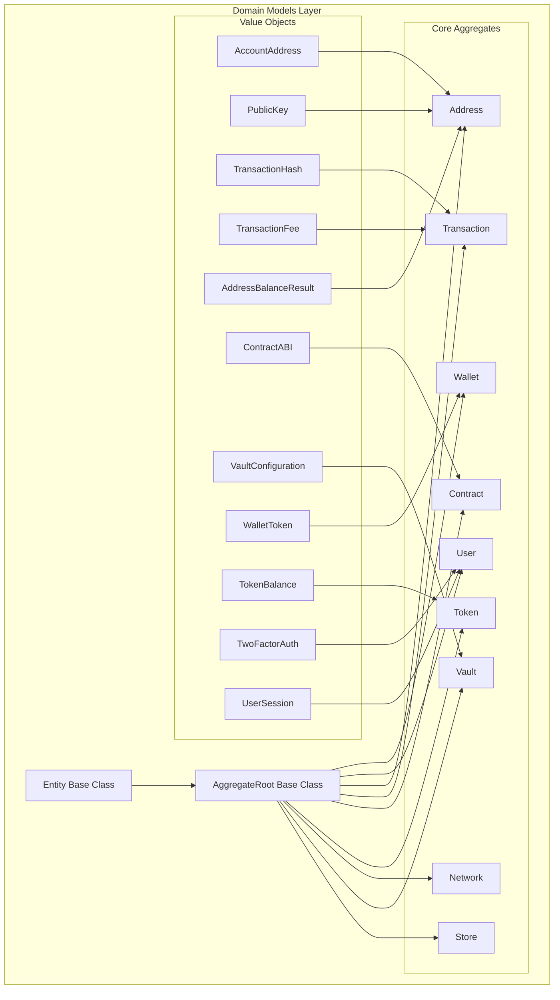
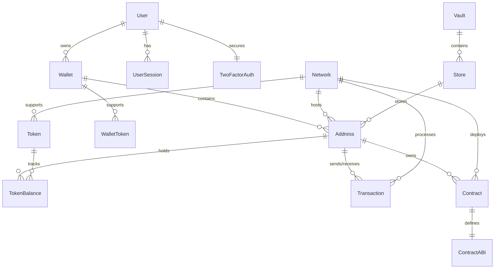

# Domain Models Module

## Overview

The Domain Models module is the core of the Wallet Hub system, implementing the business domain using Domain-Driven Design (DDD) principles. This module contains all the essential entities, value objects, and aggregates that represent the blockchain wallet management domain.

### Purpose
The domain models module provides:
- **Business Logic Encapsulation**: Core business rules and invariants are encapsulated within domain entities
- **Ubiquitous Language**: Consistent terminology across the entire system
- **Aggregate Boundaries**: Clear boundaries for transactional consistency
- **Domain Events**: Event-driven architecture for system integration

## Architecture Overview

The domain models follow a layered architecture with clear separation between entities, value objects, and aggregates:



### Key Design Patterns

1. **Aggregate Root Pattern**: Each aggregate root controls access to its internal entities
2. **Value Object Pattern**: Immutable objects representing domain concepts
3. **Factory Methods**: Static creation methods for proper initialization
4. **Domain Events**: Events emitted for important state changes
5. **Rich Domain Model**: Business logic encapsulated within entities

## Core Sub-modules

The domain models module is organized into several cohesive sub-modules, each representing a specific domain concept:

### 1. [Common Foundation](common_foundation.md)
- **Entity**: Base class for all domain entities with UUID identity
- **AggregateRoot**: Base class for aggregates with domain event support
- **Purpose**: Provides foundational building blocks for all domain models

### 2. [Wallet Management](wallet_management.md)
- **Wallet**: Main wallet aggregate with balance management and address tracking
- **WalletToken**: Relationship between wallets and supported tokens
- **Purpose**: Manages user wallets, balances, and associated addresses

### 3. [Address Management](address_management.md)
- **Address**: Blockchain address with public key and account information
- **AccountAddress**: Value object for blockchain addresses
- **PublicKey**: Value object for cryptographic public keys
- **AddressBalanceResult**: Comprehensive balance information for addresses
- **Purpose**: Manages blockchain addresses and their associated data

### 4. [User Management](user_management.md)
- **User**: User aggregate with authentication and profile management
- **TwoFactorAuth**: 2FA settings and backup codes management
- **UserSession**: Active user sessions and authentication state
- **Purpose**: Handles user identity, authentication, and security

### 5. [Transaction Management](transaction_management.md)
- **Transaction**: Blockchain transaction with status tracking
- **TransactionHash**: Value object for transaction hashes
- **TransactionFee**: Fee estimation and calculation
- **Purpose**: Manages blockchain transactions and fee calculations

### 6. [Token Management](token_management.md)
- **Token**: Cryptographic token representation (ERC20, ERC721, etc.)
- **TokenBalance**: Token balance for specific addresses
- **Purpose**: Manages tokens and their balances across addresses

### 7. [Contract Management](contract_management.md)
- **Contract**: Smart contract representation with ABI
- **ContractABI**: Application Binary Interface for smart contracts
- **Purpose**: Manages smart contracts and their interactions

### 8. [Network Management](network_management.md)
- **Network**: Blockchain network configuration
- **Purpose**: Manages different blockchain networks and their configurations

### 9. [Vault Management](vault_management.md)
- **Vault**: Secure key storage and management
- **VaultConfiguration**: Configuration for different vault types
- **Purpose**: Provides secure key management and cryptographic operations

### 10. [Store Management](store_management.md)
- **Store**: Storage for addresses within vaults
- **Purpose**: Manages address storage and organization within vaults

## Domain Relationships



## Key Business Rules

### Wallet Operations
- Wallets must be active to perform operations
- Balance operations require positive amounts
- Address management follows strict ownership rules

### User Security
- Failed login attempts trigger account locking
- Email verification required for full access
- 2FA can be enabled/disabled with backup codes

### Transaction Processing
- Transactions start as PENDING and can be CONFIRMED or FAILED
- Gas calculations follow network-specific rules
- Fee estimation supports multiple priority levels

### Address Management
- Addresses have specific types (EXTERNAL, INTERNAL, CONTRACT)
- Only active addresses can sign transactions
- Address status controls operational capabilities

## Integration Points

### Domain Events
The domain models emit events that are consumed by other modules:
- **Wallet Events**: Creation, updates, status changes
- **User Events**: Authentication, profile updates, status changes
- **Transaction Events**: Creation, confirmation, failure
- **Address Events**: Creation, status changes
- **Token Events**: Balance changes, creation

### Repository Interfaces
Domain models define repository interfaces in the [domain_repositories](domain_repositories.md) module for data persistence.

### Use Cases
Domain models are used by [use_cases](use_cases.md) to implement business operations.

## Design Principles

### 1. Immutability
Value objects are immutable to ensure thread safety and predictable behavior.

### 2. Encapsulation
Business rules are encapsulated within domain entities, preventing anemic domain models.

### 3. Consistency Boundaries
Aggregates define transactional boundaries to maintain consistency.

### 4. Event-Driven
Important state changes emit domain events for system integration.

### 5. Validation
Input validation occurs at the domain level to ensure data integrity.

## Usage Examples

### Creating a Wallet
```java
UUID walletId = UUID.randomUUID();
UUID userId = UUID.randomUUID();
Wallet wallet = Wallet.create(walletId, "My Wallet", "Personal wallet", userId);
```

### Adding Funds
```java
wallet.addFunds(new BigDecimal("100.50"));
```

### Creating a Transaction
```java
TransactionHash hash = new TransactionHash("0xabc123...");
Transaction tx = Transaction.create(
    UUID.randomUUID(),
    networkId,
    hash,
    "0xfrom...",
    "0xto...",
    new BigDecimal("1.5"),
    "0xdata..."
);
```

### Managing User 2FA
```java
user.enableTwoFactorAuth(totpSecret);
String[] backupCodes = user.getTwoFactorAuth().getBackupCodes();
```

## Testing Considerations

When testing domain models:
1. Test business rules and invariants
2. Verify domain event emission
3. Test validation logic
4. Verify aggregate consistency
5. Test state transitions

## Related Modules

- **[domain_events](domain_events.md)**: Domain event definitions and publishers
- **[domain_repositories](domain_repositories.md)**: Repository interfaces for data access
- **[use_cases](use_cases.md)**: Business use cases that operate on domain models
- **[infrastructure_data](infrastructure_data.md)**: Data persistence implementations