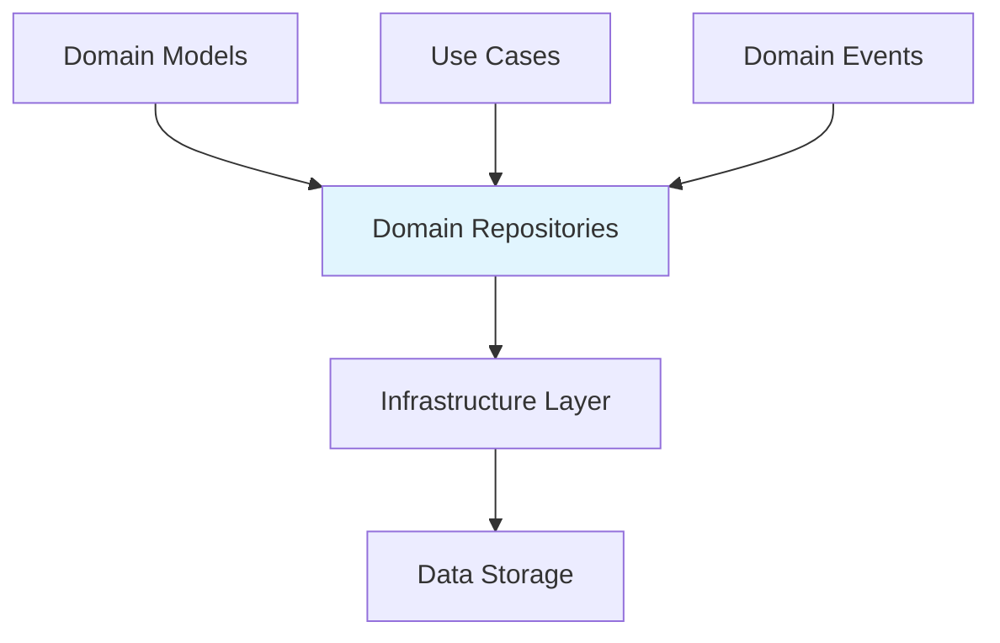
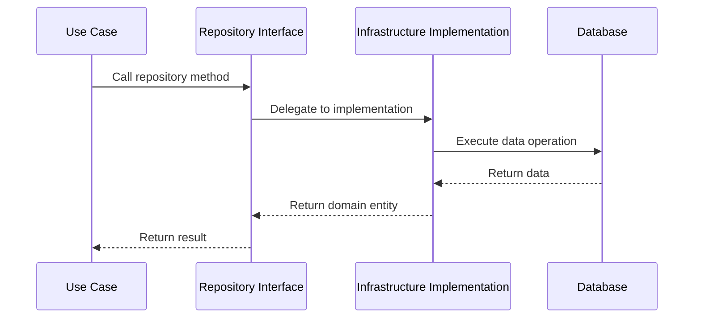

# Domain Repositories Module

## Overview

The Domain Repositories module serves as the persistence abstraction layer for the Wallet Hub application, implementing the Repository pattern from Domain-Driven Design (DDD). This module defines interfaces for data access operations while keeping the domain layer completely independent of infrastructure concerns.

### Purpose

The primary purpose of this module is to:
- Provide clean, domain-focused interfaces for data persistence
- Decouple business logic from data storage implementation details
- Enable testability through interface-based design
- Support multiple data storage strategies through polymorphism
- Maintain consistency in data access patterns across the application

### Architecture Position

The Domain Repositories module sits between the Domain Models and Infrastructure layers, acting as a contract that defines how domain entities should be persisted and retrieved without exposing implementation details.



## Module Structure

The Domain Repositories module is organized into logical sub-modules based on functional areas:

### 1. **Core Entity Repositories** ([core_entity_repositories.md](core_entity_repositories.md))
Manages the fundamental entities that form the backbone of the Wallet Hub system.

**Components:**
- **WalletRepository**: Core wallet management with user association
- **UserRepository**: User account entities and authentication data  
- **AddressRepository**: Blockchain address entities with wallet and network associations
- **TransactionRepository**: Comprehensive transaction management with extensive query capabilities

**Key Features:**
- Complete CRUD operations for core entities
- Domain-specific query methods
- Integration with domain events
- Transaction management support

### 2. **Asset Management Repositories** ([asset_management_repositories.md](asset_management_repositories.md))
Handles cryptocurrency tokens and their relationships with wallets and addresses.

**Components:**
- **TokenRepository**: Token definitions across networks (ERC-20, ERC-721, etc.)
- **TokenBalanceRepository**: Token balance tracking for addresses
- **WalletTokenRepository**: Many-to-many relationship between wallets and tokens

**Key Features:**
- Token metadata management
- Balance tracking and updates
- Wallet-token association management
- Support for multiple token standards

### 3. **Infrastructure Repositories** ([infrastructure_repositories.md](infrastructure_repositories.md))
Manages system infrastructure components and configurations.

**Components:**
- **ContractRepository**: Smart contract entities deployed on blockchain networks
- **NetworkRepository**: Blockchain network configurations with correlation ID support
- **StoreRepository**: Storage entities associated with vaults
- **VaultRepository**: Cryptographic vault entities for secure key storage

**Key Features:**
- Infrastructure component lifecycle management
- Configuration persistence
- Correlation ID support for distributed tracing
- Secure storage management

### 4. **Support Repositories** ([support_repositories.md](support_repositories.md))
Provides supporting functionality for system operations.

**Components:**
- **TransactionFeeRepository**: Transaction fee estimations and historical data
- **UserSessionRepository**: User session management and security

**Key Features:**
- Fee estimation and management
- Session lifecycle and security
- Support for operational requirements
- Historical data management

### 5. **Event Publishing** ([event_publishing.md](event_publishing.md))
Handles domain event publication for decoupled system communication.

**Components:**
- **DomainEventPublisher**: Publishes domain events to interested subscribers

**Key Features:**
- Event publication abstraction
- Integration with outbox pattern
- Support for reliable event delivery
- Decoupled system communication

## Design Patterns

### Repository Pattern
Each interface follows the Repository pattern, providing:
- Collection-like interface for domain entities
- Abstraction of data storage mechanisms
- Consistent CRUD operations across all entities
- Domain-specific query methods

### Interface Segregation
Interfaces are focused and specific to their domain responsibilities, avoiding bloated generic repositories:
- Each repository manages a single aggregate root
- Query methods are domain-specific, not generic
- Operations align with business requirements

### Dependency Inversion
Domain layer depends on abstractions (interfaces), not concrete implementations:
- Use cases depend on repository interfaces
- Infrastructure implements the interfaces
- Enables testability and flexibility

### Outbox Pattern (Event Publishing)
For reliable event delivery:
- Events persisted in same transaction as domain changes
- Asynchronous processing ensures reliability
- Guarantees at-least-once delivery semantics

### Mapper Pattern
For clean separation between domain and persistence layers:
- MapStruct used for object mapping
- Domain objects maintain business logic
- Entities optimized for persistence

## Implementation Patterns

### JPA Repository Implementation
Most repositories follow this implementation pattern:

```java
@Repository
public class JpaEntityRepository implements EntityRepository {
    private final SpringDataEntityRepository springDataRepository;
    private final EntityMapper mapper;
    
    public Entity save(Entity entity) {
        EntityEntity jpaEntity = mapper.toEntity(entity);
        EntityEntity savedEntity = springDataRepository.save(jpaEntity);
        return mapper.toDomain(savedEntity);
    }
    
    public Optional<Entity> findById(UUID id) {
        return springDataRepository.findById(id)
                .map(mapper::toDomain);
    }
}
```

### Fallback Query Implementation
When JPA schema doesn't support certain queries:

```java
public List<Entity> findByCustomCriteria(Criteria criteria) {
    // Fallback to filtering in memory
    return findAll().stream()
            .filter(entity -> matchesCriteria(entity, criteria))
            .collect(Collectors.toList());
}
```

### Correlation ID Support
Some repositories support distributed tracing:

```java
public interface NetworkRepository {
    default Network save(Network network) {
        return save(network, null);
    }
    
    Network save(Network network, String correlationId);
}
```

## Data Flow



## Integration Points

### With Domain Models
- Each repository works with specific domain entity types
- Returns fully hydrated domain objects
- Maintains entity identity and business rules

### With Infrastructure Layer
- Interfaces implemented in `infrastructure_data` module
- Uses JPA repositories, mappers, and data entities
- Supports multiple data sources through polymorphism

### With Use Cases
- Use cases depend on repository interfaces
- Enables business logic to focus on domain rules
- Supports transaction management and consistency

### With Domain Events
- Repository operations may trigger domain events
- Events published through `DomainEventPublisher`
- Supports eventual consistency and system integration

## Testing Strategy

### Unit Testing
- Mock repository interfaces in domain logic tests
- Test business rules independently of persistence

### Integration Testing
- Test concrete implementations with real databases
- Verify data mapping and query correctness

### Contract Testing
- Ensure all implementations satisfy interface contracts
- Test edge cases and error conditions

## Best Practices

1. **Always use interfaces** - Never depend on concrete repository implementations
2. **Keep repositories focused** - Each repository should manage a single aggregate root
3. **Use Optional for single results** - Avoid null returns for find operations
4. **Implement bulk operations carefully** - Consider performance for large datasets
5. **Maintain transaction boundaries** - Coordinate transactions at use case level
6. **Handle concurrency** - Use optimistic locking or versioning where needed

## Common Operations Pattern

Most repositories follow a consistent pattern:

```java
public interface EntityRepository {
    // Basic CRUD
    Entity save(Entity entity);
    Optional<Entity> findById(UUID id);
    List<Entity> findAll();
    void delete(UUID id);
    boolean existsById(UUID id);
    
    // Domain-specific queries
    List<Entity> findByRelatedId(UUID relatedId);
    Optional<Entity> findByUniqueAttribute(String attribute);
    
    // Status-based queries
    List<Entity> findByStatus(Status status);
}
```

## Error Handling

- **NotFoundException**: When entities don't exist (handled by Optional)
- **DuplicateException**: For unique constraint violations
- **ConcurrentModificationException**: For optimistic locking failures
- **DataAccessException**: For infrastructure-level errors

## Performance Considerations

1. **Lazy Loading**: Use judiciously to avoid N+1 query problems
2. **Pagination**: Implement for large result sets
3. **Caching**: Consider caching for frequently accessed, rarely changed data
4. **Indexing**: Ensure proper database indexes for query patterns
5. **Batch Operations**: Use for bulk inserts/updates

## Extension Points

The modular design allows for:
- Adding new repository interfaces for new domain entities
- Implementing alternative storage strategies
- Adding cross-cutting concerns (caching, auditing, etc.)
- Supporting multiple database technologies

## Summary

The Domain Repositories module provides a comprehensive persistence abstraction layer for the Wallet Hub application. By implementing the Repository pattern with clear interface segregation, it enables:

1. **Clean Architecture**: Separation of concerns between domain logic and data access
2. **Testability**: Easy mocking of repository interfaces for unit testing
3. **Flexibility**: Support for multiple data storage implementations
4. **Consistency**: Uniform data access patterns across the application
5. **Reliability**: Integration with domain events through the outbox pattern

The modular organization into logical sub-modules (Core Entities, Asset Management, Infrastructure, Support, and Event Publishing) provides clear boundaries and makes the system maintainable and extensible.

## Related Documentation

### Sub-module Documentation
- [Core Entity Repositories](core_entity_repositories.md) - Wallet, User, Address, and Transaction management
- [Asset Management Repositories](asset_management_repositories.md) - Token and balance management
- [Infrastructure Repositories](infrastructure_repositories.md) - Contract, Network, Store, and Vault management
- [Support Repositories](support_repositories.md) - Transaction fees and user sessions
- [Event Publishing](event_publishing.md) - Domain event publication system

### Related Modules
- [Domain Models](domain_models.md) - Entity definitions and business rules
- [Domain Events](domain_events.md) - Event publishing and handling
- [Infrastructure Data](infrastructure_data.md) - Concrete repository implementations
- [Use Cases](use_cases.md) - Business logic using repositories