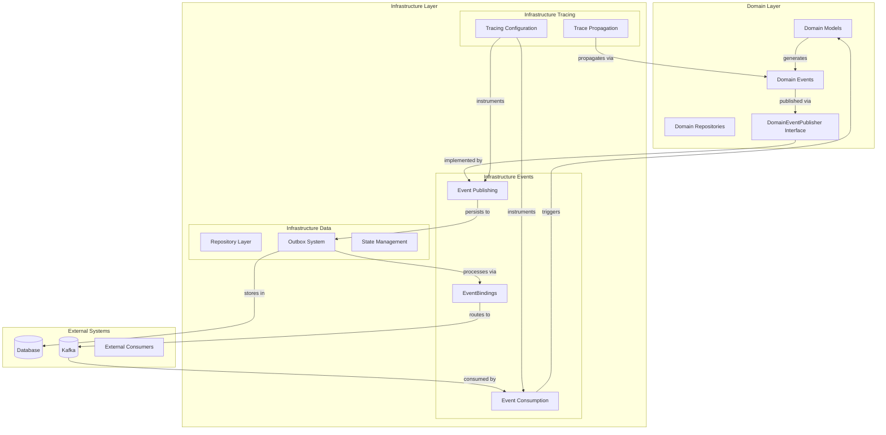
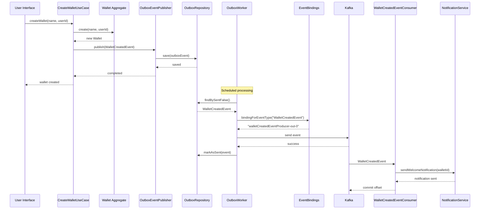
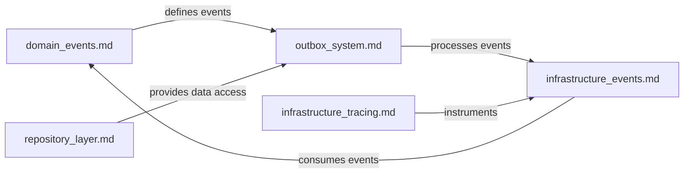

# Event-Driven Architecture Summary

## Overview

This document provides a comprehensive overview of the event-driven architecture in the Wallet Hub application, focusing on how the different modules work together to provide reliable, scalable event processing.

## Architecture Overview



## Module Interactions

### 1. Domain Event Generation

**Involved Modules:**
- [domain_models](domain_models.md): Contains aggregates that generate events
- [domain_events](domain_events.md): Defines event classes and base infrastructure

**Process:**
1. Domain aggregates (Wallet, User, etc.) undergo state changes
2. Events are registered via `AggregateRoot.registerEvent()`
3. Events extend the `DomainEvent` base class
4. Events contain business data, timestamps, and correlation IDs

### 2. Event Publishing

**Involved Modules:**
- [domain_events](domain_events.md): Provides `DomainEventPublisher` interface
- [infrastructure_events](infrastructure_events.md): Implements `OutboxEventPublisher`
- [outbox_system](outbox_system.md): Provides `OutboxService` and `OutboxEvent`

**Process:**
1. Use cases call `domainEventPublisher.publish(event)`
2. `OutboxEventPublisher` serializes event to JSON
3. Event is saved to `outbox` table via `OutboxRepository`
4. Transaction ensures event is persisted with business data

### 3. Event Processing

**Involved Modules:**
- [outbox_system](outbox_system.md): `OutboxWorker` processes unsent events
- [infrastructure_events](infrastructure_events.md): `EventBindings` maps event types
- [infrastructure_events](infrastructure_events.md): `KafkaEventProducer` sends events

**Process:**
1. `OutboxWorker` runs every 5 seconds (scheduled)
2. Fetches unsent events from `outbox` table
3. Maps event type to binding using `EventBindings`
4. Sends event payload via `StreamBridge` to Kafka
5. Marks event as sent upon successful delivery

### 4. Event Consumption

**Involved Modules:**
- [infrastructure_events](infrastructure_events.md): Event consumers (WalletCreatedEventConsumer, etc.)
- [domain_models](domain_models.md): Domain logic triggered by events
- [infrastructure_tracing](infrastructure_tracing.md): Distributed tracing

**Process:**
1. Consumers subscribe to Kafka topics
2. Receive CloudEvents with W3C trace context
3. Deserialize event payloads
4. Execute business logic (use cases)
5. Update domain state
6. Commit Kafka offsets

## Data Flow Example: Wallet Creation



## Reliability Patterns

### 1. Transactional Outbox Pattern

**Purpose:** Ensure reliable event delivery despite failures
**Implementation:** [outbox_system](outbox_system.md)

**Key Features:**
- Events persisted in same transaction as business data
- Periodic polling for unsent events
- Idempotent processing with retry mechanism
- At-least-once delivery guarantee

### 2. Idempotent Consumers

**Purpose:** Handle duplicate events gracefully
**Implementation:** [infrastructure_events](infrastructure_events.md) consumers

**Key Features:**
- Event ID tracking for duplicate detection
- Correlation ID for operation grouping
- Idempotent state transitions
- Dead letter queue for problematic events

### 3. Distributed Tracing

**Purpose:** End-to-end visibility across event boundaries
**Implementation:** [infrastructure_tracing](infrastructure_tracing.md)

**Key Features:**
- W3C Trace Context propagation in CloudEvents
- Correlation between business operations and events
- Performance monitoring across services
- Error correlation and debugging

## Configuration Summary

### Database Configuration
```sql
-- Outbox table for reliable event delivery
CREATE TABLE outbox (
    id BIGINT PRIMARY KEY AUTO_INCREMENT,
    event_type VARCHAR(255) NOT NULL,
    payload TEXT NOT NULL,
    correlation_id VARCHAR(255),
    created_at TIMESTAMP NOT NULL DEFAULT CURRENT_TIMESTAMP,
    sent BOOLEAN NOT NULL DEFAULT FALSE
);
```

### Spring Cloud Stream Configuration
```yaml
spring:
  cloud:
    stream:
      bindings:
        walletCreatedEventProducer-out-0:
          destination: wallet-created-events
        fundsAddedEventProducer-out-0:
          destination: funds-added-events
      kafka:
        binder:
          brokers: ${KAFKA_BROKERS:localhost:9092}
```

### Event Bindings Configuration
```java
// Centralized mapping in EventBindings.java
private static final Map<String, String> EVENT_TYPE_TO_BINDING = Map.of(
    "walletCreatedEventProducer", "walletCreatedEventProducer-out-0",
    "fundsAddedEventProducer", "fundsAddedEventProducer-out-0"
);
```

## Monitoring and Observability

### Key Metrics

| Metric | Description | Module |
|--------|-------------|--------|
| `outbox.queue.size` | Number of unsent events | [outbox_system](outbox_system.md) |
| `events.published.total` | Total events published | [infrastructure_events](infrastructure_events.md) |
| `events.consumed.total` | Total events consumed | [infrastructure_events](infrastructure_events.md) |
| `event.processing.latency` | End-to-end event processing time | [infrastructure_tracing](infrastructure_tracing.md) |

### Health Checks

1. **Outbox Health:** Queue size, oldest event age, processing lag
2. **Kafka Health:** Broker connectivity, consumer lag, topic availability
3. **Database Health:** Connection pool, query performance, lock contention

### Alerting Scenarios

1. **High Outbox Queue:** >1000 unsent events for >5 minutes
2. **Event Processing Failure:** >10% error rate in event consumption
3. **High Latency:** >30 seconds end-to-end event processing
4. **Consumer Lag:** >1000 messages behind in any partition

## Best Practices

### 1. Event Design
- Keep events small and focused
- Include all necessary context
- Use correlation IDs for tracing
- Version events for compatibility

### 2. Error Handling
- Implement retry with exponential backoff
- Use dead letter queues for poison pills
- Monitor and alert on failures
- Implement circuit breakers for external dependencies

### 3. Performance
- Batch process events when possible
- Use appropriate partitioning strategies
- Monitor and optimize database queries
- Implement caching for read-heavy patterns

### 4. Testing
- Test event serialization/deserialization
- Verify end-to-end event flows
- Test failure scenarios and recovery
- Load test under expected volumes

## Module Dependencies

### Core Dependencies


### Implementation Hierarchy
1. **Domain Layer** ([domain_events](domain_events.md))
   - Defines business events and interfaces
   
2. **Infrastructure Data** ([infrastructure_data](infrastructure_data.md))
   - Parent module containing data persistence components
   
3. **Outbox System** ([outbox_system](outbox_system.md))
   - Implements transactional outbox pattern
   
4. **Repository Layer** ([repository_layer](repository_layer.md))
   - Provides data access implementation
   
5. **Infrastructure Events** ([infrastructure_events](infrastructure_events.md))
   - Implements event publishing and consumption
   
6. **Infrastructure Tracing** ([infrastructure_tracing](infrastructure_tracing.md))
   - Provides distributed tracing across events

## Future Evolution

### Short-term Enhancements
1. **Event Schema Registry:** Centralized schema management
2. **Event Replay:** Ability to replay historical events
3. **Enhanced Monitoring:** More granular metrics and dashboards

### Long-term Vision
1. **Event Sourcing:** Full event sourcing for critical aggregates
2. **CQRS:** Separate read/write models for scalability
3. **Stream Processing:** Real-time analytics on event streams
4. **Multi-cluster Support:** Geographic distribution of event processing

## Conclusion

The event-driven architecture in Wallet Hub provides a robust, scalable foundation for building reliable distributed systems. By leveraging the transactional outbox pattern, idempotent consumers, and comprehensive observability, the system ensures data consistency while enabling asynchronous processing and loose coupling between components.

Each module plays a specific role in the overall architecture, from domain event definition to reliable delivery and consumption. The clear separation of concerns and well-defined interfaces make the system maintainable, testable, and adaptable to future requirements.