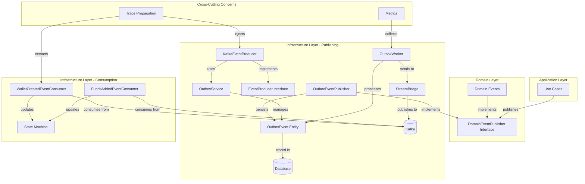
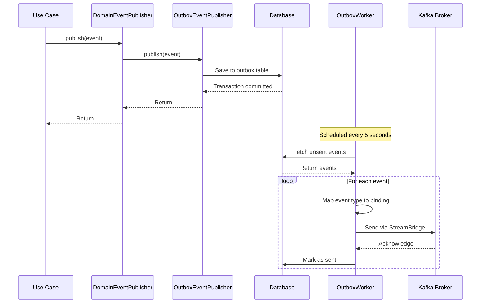
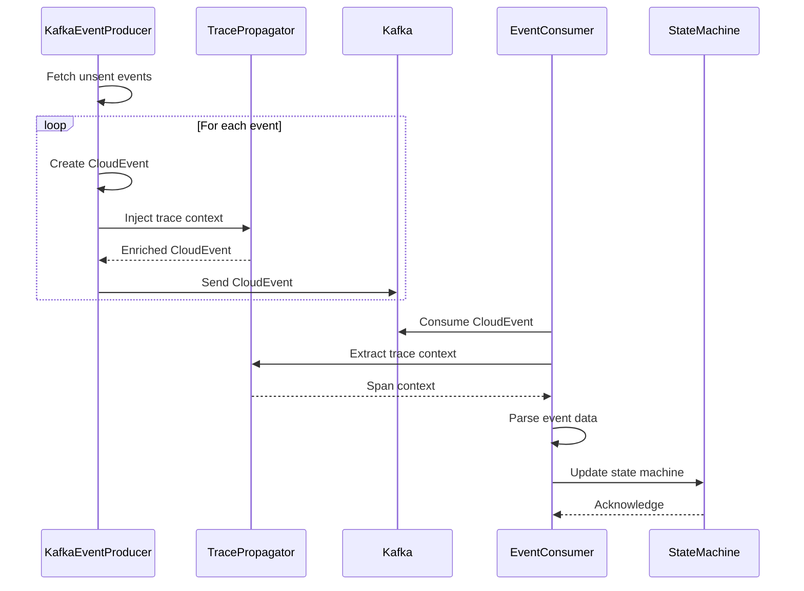

# Event Publishing Module

## Overview

The Event Publishing module is a critical component of the Wallet Hub system that implements the **Outbox Pattern** for reliable event-driven communication. This module ensures that domain events are reliably published to external systems while maintaining transactional consistency with the primary database operations.

The module provides a decoupled architecture where domain events are first persisted in an outbox table within the same database transaction, then asynchronously processed and delivered to message brokers like Kafka. This approach guarantees **at-least-once delivery** and prevents data inconsistencies between the database and external systems.

## Core Architecture

### Design Principles

1. **Transactional Consistency**: Events are persisted in the same transaction as domain state changes
2. **Reliability**: Guaranteed delivery through the outbox pattern with retry mechanisms
3. **Decoupling**: Producers and consumers are loosely coupled through message brokers
4. **Observability**: Full tracing support with W3C Trace Context propagation
5. **Extensibility**: Support for multiple event types and consumer patterns

### Component Architecture



## Core Components

### 1. Domain Event Publishing Interface

**Component**: `DomainEventPublisher` (interface)
**Location**: `src/main/java/dev/bloco/wallet/hub/domain/gateway/DomainEventPublisher.java`

This interface defines the contract for publishing domain events throughout the system. It provides a simple abstraction that allows domain logic to publish events without being coupled to specific infrastructure implementations.

```java
public interface DomainEventPublisher {
    void publish(Object event);
}
```

**Key Characteristics**:
- Simple, single-method interface for maximum flexibility
- Accepts any `Object` as event payload
- Implementations handle serialization, persistence, and delivery

### 2. Outbox Event Publisher Implementation

**Component**: `OutboxEventPublisher`
**Location**: `src/main/java/dev/bloco/wallet/hub/infra/adapter/event/OutboxEventPublisher.java`

This is the primary implementation of the `DomainEventPublisher` interface that follows the Outbox Pattern. It serializes domain events to JSON and persists them in the outbox table within the same database transaction.

**Key Responsibilities**:
- Serializes events to JSON using Jackson ObjectMapper
- Persists events to the outbox table with event type and payload
- Ensures transactional consistency with domain state changes
- Handles serialization errors gracefully

**Usage Example**:
```java
@Transactional
public void createWallet(CreateWalletCommand command) {
    Wallet wallet = walletFactory.create(command);
    walletRepository.save(wallet);
    
    // Publish event within the same transaction
    domainEventPublisher.publish(new WalletCreatedEvent(wallet.getId(), command.getCorrelationId()));
}
```

### 3. Outbox Event Entity

**Component**: `OutboxEvent`
**Location**: `src/main/java/dev/bloco/wallet/hub/infra/provider/data/OutboxEvent.java`

The JPA entity representing events in the outbox table. This entity stores all necessary metadata for reliable event processing.

**Entity Structure**:
```java
@Entity
@Table(name = "outbox", indexes = {@Index(name = "idx_outbox_created_at", columnList = "created_at")})
public class OutboxEvent {
    private Long id;                    // Primary key
    private String eventType;           // Event type identifier
    private String payload;             // JSON serialized event
    private String correlationId;       // Correlation ID for tracing
    private Instant createdAt;          // Creation timestamp
    private boolean sent = false;       // Delivery status
}
```

**Database Schema**:
```sql
CREATE TABLE outbox (
    id BIGINT PRIMARY KEY AUTO_INCREMENT,
    event_type VARCHAR(255) NOT NULL,
    payload TEXT NOT NULL,
    correlation_id VARCHAR(255),
    created_at TIMESTAMP NOT NULL,
    sent BOOLEAN DEFAULT FALSE NOT NULL,
    INDEX idx_outbox_created_at (created_at)
);
```

### 4. Outbox Service

**Component**: `OutboxService`
**Location**: `src/main/java/dev/bloco/wallet/hub/infra/provider/data/OutboxService.java`

Service layer that provides business operations for managing outbox events, abstracting the repository layer.

**Key Methods**:
- `saveOutboxEvent()`: Persists new events with transactional guarantees
- `markEventAsSent()`: Updates event status after successful delivery
- `getUnsentEvents()`: Retrieves pending events for processing

### 5. Outbox Worker

**Component**: `OutboxWorker`
**Location**: `src/main/java/dev/bloco/wallet/hub/infra/provider/data/OutboxWorker.java`

Scheduled component that periodically processes unsent events from the outbox and delivers them to the appropriate message channels.

**Processing Flow**:
1. Fetches all unsent events every 5 seconds
2. Maps event types to message bindings using `EventBindings`
3. Sends events via `StreamBridge` to Kafka
4. Marks successfully sent events as sent
5. Records metrics for monitoring

### 6. Kafka Event Producer

**Component**: `KafkaEventProducer`
**Location**: `src/main/java/dev/bloco/wallet/hub/infra/adapter/event/producer/KafkaEventProducer.java`

Specialized producer that handles CloudEvent formatting and W3C Trace Context propagation for events sent to Kafka.

**Key Features**:
- Wraps events as CloudEvents 1.0 specification
- Injects W3C Trace Context for distributed tracing
- Supports multiple event types (wallet created, funds added, etc.)
- Includes correlation ID extraction from domain events

### 7. Event Bindings

**Component**: `EventBindings`
**Location**: `src/main/java/dev/bloco/wallet/hub/infra/adapter/event/producer/EventBindings.java`

Centralized mapping of event types to Kafka channel bindings, ensuring consistent routing across the system.

**Binding Configuration**:
```java
private static final Map<String, String> EVENT_TYPE_TO_BINDING = Map.of(
    "walletCreatedEventProducer", "walletCreatedEventProducer-out-0",
    "fundsAddedEventProducer", "fundsAddedEventProducer-out-0",
    "fundsWithdrawnEventProducer", "fundsWithdrawnEventProducer-out-0",
    "fundsTransferredEventProducer", "fundsTransferredEventProducer-out-0"
);
```

## Event Processing Flow

### 1. Event Publication Flow



### 2. CloudEvent Processing with Tracing



## Domain Events Structure

### Base Domain Event

All domain events extend the `DomainEvent` base class which provides common metadata:

```java
public abstract class DomainEvent {
    private final UUID eventId;        // Unique event identifier
    private final Instant occurredOn;  // Event timestamp
    private final UUID correlationId;  // Correlation ID for workflow tracing
}
```

### Supported Event Types

The system supports a comprehensive set of domain events across different bounded contexts:

#### Wallet Events
- `WalletCreatedEvent`: New wallet creation
- `WalletUpdatedEvent`: Wallet information updates
- `WalletDeletedEvent`: Wallet removal
- `WalletStatusChangedEvent`: Status changes (active, suspended, etc.)

#### Address Events
- `AddressCreatedEvent`: New address generation
- `AddressAddedToWalletEvent`: Address association with wallet
- `AddressRemovedFromWalletEvent`: Address disassociation

#### Transaction Events
- `TransactionCreatedEvent`: New transaction initiation
- `TransactionConfirmedEvent`: Transaction confirmation
- `TransactionStatusChangedEvent`: Status updates

#### User Events
- `UserCreatedEvent`: User registration
- `UserAuthenticatedEvent`: User login
- `UserProfileUpdatedEvent`: Profile changes

#### Token Events
- `TokenCreatedEvent`: New token definition
- `TokenBalanceChangedEvent`: Balance updates
- `TokenAddedToWalletEvent`: Token association

*For a complete list of domain events, refer to the [domain_events module documentation](domain_events.md).*

## Configuration

### Spring Cloud Stream Bindings

```yaml
spring:
  cloud:
    stream:
      bindings:
        walletCreatedEventProducer-out-0:
          destination: wallet-created-events
          content-type: application/json
        fundsAddedEventProducer-out-0:
          destination: funds-added-events
          content-type: application/json
        fundsWithdrawnEventProducer-out-0:
          destination: funds-withdrawn-events
          content-type: application/json
        fundsTransferredEventProducer-out-0:
          destination: funds-transferred-events
          content-type: application/json
      
      kafka:
        binder:
          brokers: ${KAFKA_BROKERS:localhost:9092}
          replication-factor: 1
```

### Outbox Processing Schedule

```java
@Scheduled(fixedRate = 5000)  // Process every 5 seconds
public void processOutbox() {
    // Processing logic
}
```

## Error Handling and Resilience

### 1. Serialization Errors
- Events that fail JSON serialization throw `RuntimeException`
- Original database transaction may roll back depending on configuration
- Errors are logged with full stack traces for debugging

### 2. Delivery Failures
- Failed message deliveries are retried on next scheduled run
- Events remain in "unsent" state until successfully delivered
- Exponential backoff could be implemented for persistent failures

### 3. Unknown Event Types
- Events with unmapped types are logged and skipped
- Metrics are recorded for monitoring unknown event types
- No automatic retry for unknown event types

### 4. Database Consistency
- Uses Spring's `@Transactional` for atomic operations
- Events are persisted in the same transaction as domain changes
- Prevents scenarios where domain state changes but events are lost

## Monitoring and Observability

### Metrics Collection

The system exposes several metrics for monitoring:

```java
// In OutboxWorker
meterRegistry.counter("outbox.sent", "binding", binding).increment();
meterRegistry.counter("outbox.send.failed", "binding", binding).increment();
meterRegistry.counter("outbox.unknown.type", "eventType", eventType).increment();
```

### Distributed Tracing

Full support for W3C Trace Context propagation:

1. **Trace Injection**: `CloudEventTracePropagator` injects trace context into CloudEvents
2. **Trace Extraction**: Consumers extract and continue trace spans
3. **Span Attributes**: Event-specific attributes added to spans for better observability

### Health Indicators

Integration with Spring Boot Actuator for health checks:
- Database connectivity for outbox table
- Kafka broker connectivity
- Event processing latency monitoring

## Integration Patterns

### 1. Saga Pattern Integration

Events are used to coordinate distributed sagas:
```java
// In WalletCreatedEventConsumer
var stateMachineMessage = MessageBuilder.withPayload(SagaEvents.WALLET_CREATED)
        .setHeader("correlationId", correlationId)
        .build();
stateMachine.sendEvent(Mono.just(stateMachineMessage)).subscribe();
```

### 2. Event Sourcing Compatibility

The outbox pattern naturally supports event sourcing:
- All domain changes are captured as events
- Events are stored in chronological order
- Can be replayed for state reconstruction

### 3. CQRS Pattern Support

Events enable Command-Query Responsibility Segregation:
- Commands produce events
- Events update read models
- Asynchronous consistency between write and read models

## Best Practices

### 1. Event Design
- Keep events focused on single domain changes
- Include all necessary data for consumers
- Use correlation IDs for workflow tracing
- Version events for backward compatibility

### 2. Error Handling
- Implement dead letter queues for poison messages
- Monitor event processing latency
- Set up alerts for delivery failures
- Implement circuit breakers for external dependencies

### 3. Performance Considerations
- Batch event processing where possible
- Use database indexes for efficient querying
- Consider partitioning for high-volume systems
- Monitor database growth and implement archiving

### 4. Testing Strategies
- Unit test event serialization/deserialization
- Integration test with in-memory databases
- End-to-end test with embedded Kafka
- Load test for high-volume scenarios

## Dependencies

### Internal Dependencies
- **domain_events**: Event definitions and base classes
- **domain_models**: Domain entities referenced in events
- **infrastructure_data**: Database repositories and entities
- **infrastructure_tracing**: Distributed tracing components

### External Dependencies
- **Spring Cloud Stream**: Message broker abstraction
- **Apache Kafka**: Message broker implementation
- **Jackson**: JSON serialization
- **Spring Data JPA**: Database access
- **Micrometer**: Metrics collection

## Future Enhancements

### Planned Improvements
1. **Event Schema Registry**: Centralized schema management for events
2. **Enhanced Retry Policies**: Configurable retry with exponential backoff
3. **Event Versioning**: Support for multiple event versions
4. **Batch Processing**: Optimized batch operations for high volume
5. **DLQ Management**: Automated dead letter queue handling

### Scalability Considerations
1. **Horizontal Scaling**: Multiple outbox worker instances
2. **Database Partitioning**: Time-based or hash-based partitioning
3. **Caching Layer**: Redis caching for frequent event types
4. **Stream Processing**: Integration with Kafka Streams for complex event processing

## Related Documentation

- [Domain Events Module](domain_events.md) - Complete list of domain events and their structures
- [Infrastructure Events Module](infrastructure_events.md) - Event consumers and producers
- [Tracing Module](infrastructure_tracing.md) - Distributed tracing implementation
- [Data Infrastructure Module](infrastructure_data.md) - Database entities and repositories