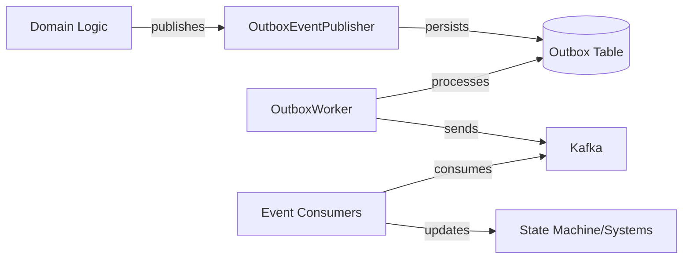

# Event Publishing Module - Introduction

## Module Overview

The Event Publishing module implements the **Outbox Pattern** to provide reliable, transactional event publishing in the Wallet Hub system. This module ensures that domain events are consistently published to external systems while maintaining data integrity with the primary database operations.

## Key Features

- **Transactional Consistency**: Events are persisted in the same database transaction as domain state changes
- **Reliable Delivery**: At-least-once delivery guarantee through the outbox pattern
- **Distributed Tracing**: Full W3C Trace Context propagation for observability
- **CloudEvents Support**: Standardized event format with metadata
- **Scheduled Processing**: Periodic processing of unsent events
- **Metrics Collection**: Comprehensive monitoring of event processing

## Quick Start

### Publishing an Event

```java
@Transactional
public void createWallet(CreateWalletCommand command) {
    Wallet wallet = walletFactory.create(command);
    walletRepository.save(wallet);
    
    // Publish event within the same transaction
    domainEventPublisher.publish(
        new WalletCreatedEvent(wallet.getId(), command.getCorrelationId())
    );
}
```

### Event Processing Flow

1. **Event Creation**: Domain logic creates domain events
2. **Outbox Persistence**: Events are serialized and stored in the outbox table
3. **Scheduled Processing**: Outbox worker processes unsent events every 5 seconds
4. **Message Delivery**: Events are sent to Kafka with CloudEvent formatting
5. **Consumer Processing**: Event consumers process messages and update systems

## Architecture Diagram



## Core Components

1. **DomainEventPublisher Interface**: Abstraction for event publishing
2. **OutboxEventPublisher**: Implementation using outbox pattern
3. **OutboxEvent Entity**: JPA entity for event storage
4. **OutboxService**: Business logic for event management
5. **OutboxWorker**: Scheduled processor for unsent events
6. **KafkaEventProducer**: CloudEvent producer with tracing
7. **Event Consumers**: Various consumers for different event types

## Configuration

### Basic Configuration

```yaml
spring:
  cloud:
    stream:
      bindings:
        walletCreatedEventProducer-out-0:
          destination: wallet-created-events
      kafka:
        binder:
          brokers: localhost:9092
```

### Processing Schedule

Events are processed every 5 seconds by default. This can be configured via the `@Scheduled(fixedRate)` annotation.

## Monitoring

The module provides comprehensive monitoring through:

- **Metrics**: Event processing counters and timers
- **Tracing**: Distributed trace propagation across services
- **Logging**: Detailed event processing logs
- **Health Checks**: Integration with Spring Boot Actuator

## For Detailed Documentation

For comprehensive documentation including:
- Complete architecture diagrams
- Event type specifications
- Error handling strategies
- Performance considerations
- Integration patterns
- Best practices

Please refer to the [full Event Publishing documentation](event_publishing.md).

## Related Modules

- [Domain Events](domain_events.md) - Event definitions and structures
- [Infrastructure Events](infrastructure_events.md) - Event consumers and producers
- [Tracing](infrastructure_tracing.md) - Distributed tracing implementation