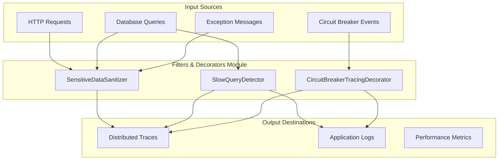
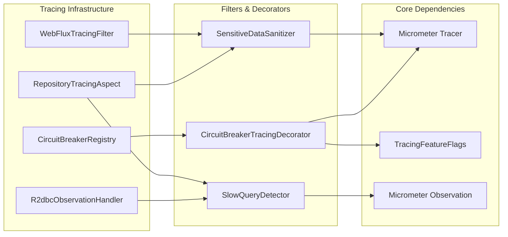
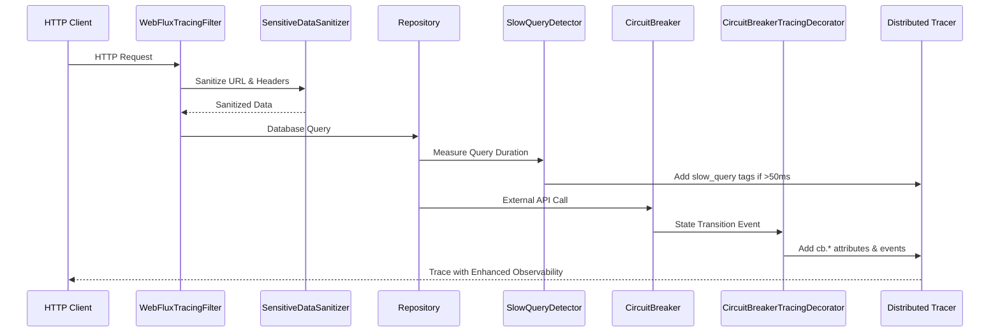

# Filters & Decorators Module

## Overview

The **Filters & Decorators** module is a critical component of the Wallet Hub's distributed tracing infrastructure, responsible for enhancing observability data quality and security. This module provides specialized filters and decorators that process tracing data to ensure compliance with privacy regulations, detect performance issues, and enrich traces with system health information.

## Core Purpose

The module addresses three key observability challenges:

1. **Data Privacy & Security**: Sanitizes sensitive information (PII, credentials, secrets) from trace data
2. **Performance Monitoring**: Detects and tags slow database queries for performance analysis
3. **System Resilience**: Decorates traces with circuit breaker state information for failure analysis

## Architecture



## Component Relationships



## Core Components

### 1. SensitiveDataSanitizer

The `SensitiveDataSanitizer` implements a safelist-based approach for removing sensitive data from trace attributes, ensuring compliance with privacy regulations (FR-006 requirement).

#### Key Features:
- **SQL Sanitization**: Replaces literal values with placeholders while preserving query structure
- **URL Sanitization**: Masks sensitive query parameters and path segments
- **PII Masking**: Detects and masks emails, phone numbers, credit cards using regex patterns
- **Header Filtering**: Allowlist approach - only safe headers are included in traces
- **Exception Sanitization**: Removes sensitive data from exception messages

#### Safelist Configuration:
```java
// Safe database fields for traces
SAFE_DB_FIELDS = ["id", "wallet_id", "transaction_id", "saga_id", "event_id", 
                  "status", "state", "type", "operation", "amount",
                  "created_at", "updated_at", "version"]

// Safe HTTP headers for traces
SAFE_HTTP_HEADERS = ["content-type", "accept", "user-agent", "accept-language",
                     "accept-encoding", "connection", "host", "referer"]
```

#### Usage Examples:
```java
// SQL sanitization
String sql = "SELECT * FROM users WHERE email = 'user@example.com'";
String sanitized = sanitizer.sanitizeSql(sql);
// Result: "SELECT * FROM users WHERE email = ?"

// URL sanitization
String url = "https://api.wallet.com/auth?token=abc123&amount=100";
String sanitized = sanitizer.sanitizeUrl(url);
// Result: "https://api.wallet.com/auth?token=***&amount=100"

// PII masking
String text = "User john@example.com called 555-123-4567";
String masked = sanitizer.maskPiiPatterns(text);
// Result: "User ***@***.*** called ***-***-****"
```

### 2. SlowQueryDetector

The `SlowQueryDetector` identifies slow database queries and adds diagnostic tags to observations for performance monitoring and alerting.

#### Key Features:
- **Configurable Threshold**: Default 50ms, configurable via `tracing.sampling.slow-query-threshold-ms`
- **Automatic Tagging**: Adds `slow_query=true` and `query.duration_ms` tags to observations
- **Multiple Timing Sources**: Supports millisecond, Duration, and nanosecond timing
- **Integration Ready**: Used by RepositoryTracingAspect and R2dbcObservationHandler

#### Configuration:
```yaml
tracing:
  sampling:
    slow-query-threshold-ms: 50  # Queries slower than 50ms are tagged
```

#### Usage Example:
```java
@Around("execution(* repository.*.*(..))")
public Object trace(ProceedingJoinPoint joinPoint) {
    long start = System.currentTimeMillis();
    Object result = joinPoint.proceed();
    long duration = System.currentTimeMillis() - start;
    
    Observation observation = createObservation();
    boolean isSlow = slowQueryDetector.detectAndTag(observation, duration);
    
    if (isSlow) {
        log.warn("Slow query detected: {}ms", duration);
    }
    
    return result;
}
```

### 3. CircuitBreakerTracingDecorator

The `CircuitBreakerTracingDecorator` enhances circuit breaker observability by adding distributed tracing attributes and events to circuit breaker operations.

#### Key Features:
- **State Tracking**: Captures circuit breaker state (OPEN/CLOSED/HALF_OPEN) as span attributes
- **Event Correlation**: Creates span events for state transitions (opened, closed, half-opened)
- **Metrics Integration**: Adds failure rate and slow call rate metrics to spans
- **Automatic Registration**: Subscribes to all circuit breakers via CircuitBreakerRegistry

#### Span Attributes Added:
| Attribute | Description | Values |
|-----------|-------------|--------|
| `cb.name` | Circuit breaker identifier | e.g., "trace-export-primary", "external-api-chainlist" |
| `cb.state` | Current circuit breaker state | CLOSED, OPEN, HALF_OPEN, DISABLED, FORCED_OPEN |
| `cb.failure_rate` | Failure rate percentage | 0.0 to 100.0 |
| `cb.slow_call_rate` | Slow call rate percentage | 0.0 to 100.0 |

#### Span Events:
- `cb.opened`: Circuit breaker transitioned to OPEN (too many failures)
- `cb.closed`: Circuit breaker transitioned to CLOSED (healthy again)
- `cb.half_open`: Circuit breaker transitioned to HALF_OPEN (testing recovery)
- `cb.state_transition`: Generic transition event with from/to states

## Data Flow



## Integration Points

### With WebFluxTracingFilter
The `SensitiveDataSanitizer` integrates with `WebFluxTracingFilter` to sanitize HTTP request data before it's added to trace spans. The WebFluxTracingFilter uses sanitization methods for:
- URL sanitization: Masks sensitive query parameters (token, password, secret, key, auth)
- IP address masking: Keeps only first two octets for privacy
- Trace ID masking: Shows only first 8 characters in logs

### With RepositoryTracingAspect
Both `SensitiveDataSanitizer` and `SlowQueryDetector` are used by `RepositoryTracingAspect` to:
1. Sanitize SQL statements in trace attributes using `sanitizeSql()`
2. Detect and tag slow database queries with `detectAndTag()`
3. Sanitize error messages that may contain sensitive SQL data
4. Add database operation attributes (SELECT, INSERT, UPDATE, DELETE)

### With R2dbcObservationHandler
`SlowQueryDetector` integrates with `R2dbcObservationHandler` to monitor reactive database queries. The handler:
1. Measures connection acquisition time
2. Adds connection pool metrics (active, idle, pending connections)
3. Derives database operations from observation names
4. Works with the `TracingFeatureFlags` to enable/disable database tracing

### With CircuitBreakerRegistry
`CircuitBreakerTracingDecorator` automatically subscribes to all circuit breakers registered in the `CircuitBreakerRegistry`:
1. Listens for state transition events (OPEN, CLOSED, HALF_OPEN)
2. Adds circuit breaker metrics (failure rate, slow call rate)
3. Respects the `tracing.features.externalApi` feature flag
4. Creates span events for circuit breaker operations

## Configuration

### Application Properties
```yaml
tracing:
  features:
    database: true        # Enable database tracing (required for SlowQueryDetector)
    externalApi: true     # Enable circuit breaker tracing
    useCase: true         # Enable use case tracing
    kafka: true           # Enable Kafka tracing
    stateMachine: true    # Enable state machine tracing
    reactive: true        # Enable reactive tracing
  sampling:
    slow-query-threshold-ms: 50  # Slow query detection threshold
```

### Feature Flags Integration
The module integrates with `TracingFeatureFlags` for granular control:

| Component | Feature Flag | Default | Purpose |
|-----------|--------------|---------|---------|
| SensitiveDataSanitizer | N/A (always active) | N/A | Data privacy is always enforced |
| SlowQueryDetector | `tracing.features.database` | true | Only active when database tracing enabled |
| CircuitBreakerTracingDecorator | `tracing.features.externalApi` | true | Only active when external API tracing enabled |

#### Feature Flag Methods:
```java
// Check if any tracing is enabled
boolean anyEnabled = featureFlags.isAnyTracingEnabled();

// Check if all tracing is disabled
boolean allDisabled = featureFlags.isAllTracingDisabled();

// Get enabled components summary
String enabled = featureFlags.getEnabledComponents(); // e.g., "database, externalApi, useCase"

// Get disabled components summary  
String disabled = featureFlags.getDisabledComponents(); // e.g., "kafka, stateMachine"
```

#### Runtime Configuration:
Feature flags support `@RefreshScope` for dynamic updates without restart:
```java
// POST to /actuator/refresh with updated properties
{
  "tracing.features.database": "false",
  "tracing.sampling.slow-query-threshold-ms": "100"
}
```

## Performance Characteristics

| Component | Overhead | Impact |
|-----------|----------|--------|
| SensitiveDataSanitizer | < 0.5ms per sanitization | Minimal, only processes trace data |
| SlowQueryDetector | < 0.1ms per query | Only active for queries > threshold |
| CircuitBreakerTracingDecorator | < 0.1ms per state transition | One-time registration at startup |

## Security Considerations

### Data Protection
- **Safelist Approach**: Only explicitly allowed data is included in traces
- **Regex Pattern Matching**: Comprehensive PII detection using industry-standard patterns
- **Truncation**: Enforces 1024-character limit per attribute (per data-model.md spec)

### Sensitive Data Handling

#### SQL Sanitization Patterns:
```java
// String literals: 'value' → ?
SQL_STRING_LITERAL = Pattern.compile("'[^']*'");

// Number literals: = 123 → = ?
SQL_NUMBER_LITERAL = Pattern.compile("=\\s*\\d+");

// IN clauses: IN (1, 2, 3) → IN (?)
SQL_IN_CLAUSE = Pattern.compile("IN\\s*\\([^)]+\\)", Pattern.CASE_INSENSITIVE);
```

#### PII Detection Patterns:
```java
// Email addresses
EMAIL_PATTERN = Pattern.compile("\\b[A-Za-z0-9._%+-]+@[A-Za-z0-9.-]+\\.[A-Z|a-z]{2,}\\b");

// Phone numbers (international format support)
PHONE_PATTERN = Pattern.compile("\\b(\\+\\d{1,3}[-.\\s]?)?\\(?\\d{3}\\)?[-.\\s]?\\d{3}[-.\\s]?\\d{4}\\b");

// Credit card numbers (various formats)
CREDIT_CARD_PATTERN = Pattern.compile("\\b\\d{4}[-.\\s]?\\d{4}[-.\\s]?\\d{4}[-.\\s]?\\d{4}\\b");

// JWT tokens
JWT_PATTERN = Pattern.compile("\\bey[A-Za-z0-9-_=]+\\.[A-Za-z0-9-_=]+\\.?[A-Za-z0-9-_.+/=]*\\b");

// UUIDs
UUID_PATTERN = Pattern.compile("\\b[0-9a-fA-F]{8}-[0-9a-fA-F]{4}-[0-9a-fA-F]{4}-[0-9a-fA-F]{4}-[0-9a-fA-F]{12}\\b");
```

#### URL Sanitization:
- **Query Parameters**: Sensitive params (token, api_key, password) masked as `***`
- **Path Segments**: Email addresses in paths masked as `***@***.***`
- **UUIDs in URLs**: Masked as `***-***-***-***-***`

#### Header Filtering:
- **Safelist Approach**: Only explicitly allowed headers included
- **Safe Headers**: `content-type`, `accept`, `user-agent`, `accept-language`, `accept-encoding`, `connection`, `host`, `referer`
- **Authorization Headers**: All masked as `***` (Bearer, Basic, Digest, etc.)

#### Exception Message Sanitization:
- PII patterns removed from exception text
- SQL error messages sanitized to remove literal values
- Potential secrets in exception messages masked (e.g., `password=***`)

## Monitoring & Alerting

### Slow Query Alerts
```promql
# Grafana Alert: More than 100 slow queries in 5 minutes
count(traces{slow_query="true"}) > 100

# Tempo Query: Find slow queries with latency > 50ms
{slow_query="true"} | latency > 50ms
```

### Circuit Breaker Monitoring
```promql
# Alert when circuit breaker opens
traces{cb.state="OPEN"} > 0

# Monitor circuit breaker failure rates
avg(traces{cb.name="external-api-chainlist"} | cb.failure_rate) by (cb.name)
```

## Error Handling

### SensitiveDataSanitizer
- Returns original input if null or blank
- Gracefully handles malformed patterns
- Logs sanitization errors at DEBUG level

### SlowQueryDetector
- Returns false if observation is null
- Handles negative durations gracefully
- Configurable via application properties

### CircuitBreakerTracingDecorator

#### Event Subscriptions:
```java
// State transition events
circuitBreaker.getEventPublisher().onStateTransition(event -> {
    // Add cb.name, cb.state attributes
    // Create span event (cb.opened, cb.closed, cb.half_open)
});

// Success events
circuitBreaker.getEventPublisher().onSuccess(event -> {
    // Add metrics (failure_rate, slow_call_rate)
});

// Error events  
circuitBreaker.getEventPublisher().onError(event -> {
    // Add error attributes
    // Create cb.error event
});
```

#### State Mapping:
| Circuit Breaker State | Span Event Name | Description |
|----------------------|-----------------|-------------|
| OPEN | `cb.opened` | Too many failures, circuit is open |
| CLOSED | `cb.closed` | Healthy state, requests flow normally |
| HALF_OPEN | `cb.half_open` | Testing recovery, limited requests allowed |
| DISABLED | `cb.disabled` | Circuit breaker disabled |
| FORCED_OPEN | `cb.forced_open` | Manually forced open state |

#### Error Handling:
- Checks for active span before adding attributes (returns if no span)
- Logs errors at ERROR level with circuit breaker context
- Respects `tracing.features.externalApi` feature flag
- Gracefully handles null circuit breakers and registry

## Testing Considerations

### Unit Tests Should Cover:
1. **Pattern Matching**: Verify regex patterns detect all PII formats
2. **SQL Sanitization**: Ensure query structure preserved while data removed
3. **Threshold Detection**: Verify slow query detection at exact threshold
4. **Circuit Breaker Events**: Test all state transitions (OPEN, CLOSED, HALF_OPEN)
5. **Edge Cases**: Null inputs, empty strings, malformed data

### Integration Tests Should Cover:
1. **End-to-End Tracing**: Verify sanitized data appears in exported traces
2. **Performance Impact**: Ensure overhead within acceptable limits
3. **Feature Flags**: Test enabling/disabling via configuration
4. **Concurrent Access**: Verify thread safety under load

## Comprehensive Example

### End-to-End Trace Example
```json
{
  "traceId": "4bf92f3577b34da6a3ce929d0e0e4736",
  "spans": [
    {
      "name": "HTTP POST /api/wallets/transfer",
      "attributes": {
        "http.method": "POST",
        "http.url": "https://api.wallet.com/api/wallets/transfer?token=***&amount=100",
        "http.status_code": "200",
        "http.client_ip": "192.168.***.**",
        "status": "success"
      },
      "events": []
    },
    {
      "name": "useCase.TransferFundsUseCase.execute",
      "attributes": {
        "useCase.name": "TransferFundsUseCase",
        "wallet.source": "wallet_123",
        "wallet.destination": "wallet_456",
        "amount": "100.00",
        "currency": "USD",
        "status": "success"
      },
      "events": []
    },
    {
      "name": "repository.JpaWalletRepository.findByWalletId",
      "attributes": {
        "repository.class": "JpaWalletRepository",
        "repository.method": "findByWalletId",
        "db.system": "h2",
        "db.operation": "SELECT",
        "db.statement": "SELECT ... WHERE wallet_id = ?",
        "query.duration_ms": "45",
        "slow_query": "false",
        "status": "success"
      },
      "events": []
    },
    {
      "name": "repository.JpaWalletRepository.updateBalance",
      "attributes": {
        "repository.class": "JpaWalletRepository", 
        "repository.method": "updateBalance",
        "db.system": "h2",
        "db.operation": "UPDATE",
        "db.statement": "UPDATE wallet SET balance = ? WHERE id = ?",
        "query.duration_ms": "75",
        "slow_query": "true",
        "status": "success"
      },
      "events": []
    },
    {
      "name": "HTTP GET external-api-exchange-rates",
      "attributes": {
        "http.method": "GET",
        "http.url": "https://api.exchangerates.com/v1/latest?base=USD",
        "cb.name": "external-api-exchange-rates",
        "cb.state": "OPEN",
        "cb.failure_rate": "85.50",
        "cb.slow_call_rate": "12.30",
        "status": "error"
      },
      "events": [
        {
          "name": "cb.opened",
          "timestamp": "2024-01-15T10:30:45.123Z",
          "attributes": {
            "message": "Circuit breaker opened due to high failure rate (85.5%)"
          }
        }
      ]
    }
  ]
}
```

### Code Integration Example
```java
// Repository method with tracing
@Repository
public class WalletRepositoryImpl implements WalletRepository {
    
    @Override
    @Transactional
    public Wallet transferFunds(String sourceId, String destId, BigDecimal amount) {
        // 1. RepositoryTracingAspect intercepts this call
        // 2. SlowQueryDetector measures query duration
        // 3. SensitiveDataSanitizer cleans SQL in error messages
        
        Wallet source = findByWalletId(sourceId); // Monitored by SlowQueryDetector
        Wallet destination = findByWalletId(destId);
        
        // External API call with circuit breaker
        BigDecimal exchangeRate = exchangeRateService.getRate("USD", "EUR");
        // CircuitBreakerTracingDecorator adds cb.* attributes
        
        source.debit(amount);
        destination.credit(amount.multiply(exchangeRate));
        
        updateBalance(source); // Slow query tagged if >50ms
        updateBalance(destination);
        
        return source;
    }
}

// HTTP request processing
@RestController
public class WalletController {
    
    @PostMapping("/api/wallets/transfer")
    public ResponseEntity<TransferResponse> transfer(
            @RequestParam String token,
            @RequestParam BigDecimal amount) {
        // WebFluxTracingFilter intercepts request
        // SensitiveDataSanitizer masks token in URL: ?token=***&amount=100
        
        // Use case execution traced
        TransferResult result = transferFundsUseCase.execute(
            new TransferCommand(token, amount)
        );
        
        return ResponseEntity.ok(new TransferResponse(result));
    }
}
```

## Related Modules

- [Web HTTP Tracing](web_http_tracing.md): Uses SensitiveDataSanitizer for HTTP request sanitization
- [Instrumentation Aspects](instrumentation_aspects.md): Integrates with RepositoryTracingAspect
- [Core Configuration](core_configuration.md): Depends on TracingFeatureFlags
- [Client External Tracing](client_external_tracing.md): Related circuit breaker tracing functionality
- [Database Tracing](database_tracing.md): Uses R2dbcObservationHandler with SlowQueryDetector
- [Messaging Tracing](messaging_tracing.md): Related tracing for Kafka events

## Best Practices

### For Developers:
1. **Add New Safe Fields**: When adding new database fields to traces, update `SAFE_DB_FIELDS`
2. **Configure Thresholds**: Adjust `slow-query-threshold-ms` based on SLA requirements
3. **Monitor Circuit Breakers**: Use `cb.*` attributes for debugging distributed failures
4. **Test Sanitization**: Verify new API endpoints don't leak sensitive data

### For Operations:
1. **Alert on Slow Queries**: Set up alerts for sustained slow query patterns
2. **Monitor Circuit Breaker Health**: Use trace data to identify flapping circuit breakers
3. **Review Trace Exports**: Periodically audit exported traces for data leakage
4. **Adjust Sampling**: Use slow query tags to adjust trace sampling rates

## Future Enhancements

### Planned Features:
1. **Dynamic Safelists**: Configurable via external configuration
2. **Custom Pattern Support**: User-defined regex patterns for organization-specific PII
3. **Machine Learning**: ML-based anomaly detection for query patterns
4. **Real-time Alerts**: Immediate notification of sensitive data leakage
5. **Audit Logging**: Comprehensive audit trail of all sanitization operations

### Technical Debt:
1. **Pattern Performance**: Optimize regex patterns for high-throughput scenarios
2. **Memory Efficiency**: Reduce memory footprint for large trace processing
3. **Configuration Management**: Externalize patterns and thresholds
4. **Testing Coverage**: Increase integration test coverage

## Conclusion

The Filters & Decorators module is essential for maintaining observability while ensuring data privacy and system reliability. By sanitizing sensitive data, detecting performance issues, and enhancing circuit breaker visibility, this module enables comprehensive monitoring without compromising security or performance.

The module follows the principle of "observe everything, expose safely" - providing rich observability data while protecting sensitive information through rigorous sanitization and controlled exposure.