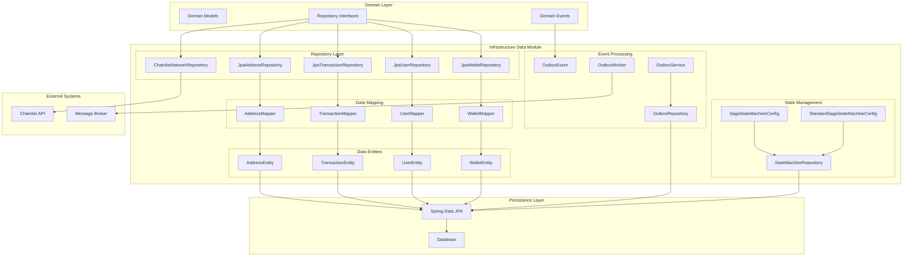
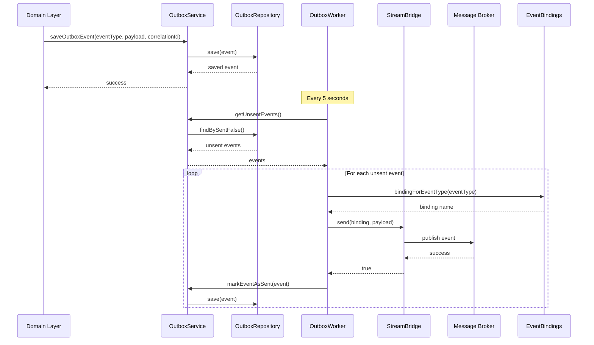

# Infrastructure Data Module

## Overview

The `infrastructure_data` module is responsible for data persistence, state management, and event processing in the Wallet Hub application. It serves as the bridge between the domain layer and the underlying data storage systems, implementing repository patterns, state machines, and outbox patterns for reliable event delivery.

This module provides:
- **JPA-based repository implementations** for core domain entities
- **Outbox pattern implementation** for reliable event publishing
- **Saga state machine configuration** for managing distributed transactions
- **Data mapping** between domain models and database entities
- **Network data integration** with external blockchain networks

## Architecture Overview



## Module Components

### 1. Repository Implementations

The module provides JPA-based implementations of domain repository interfaces:

#### Core Entity Repositories
- **JpaAddressRepository**: Manages blockchain address persistence
- **JpaTransactionRepository**: Handles blockchain transaction storage
- **JpaUserRepository**: Manages user account data
- **JpaWalletRepository**: Handles wallet data persistence

#### Specialized Repository
- **ChainlistNetworkRepository**: Integrates with external Chainlist API to fetch blockchain network metadata with caching support

Each repository follows the same pattern:
1. Implements a domain repository interface from the `domain_repositories` module
2. Uses Spring Data JPA repositories for database operations
3. Employs MapStruct mappers for domain-entity conversion
4. Provides transactional operations with proper error handling

### 2. Outbox Pattern Implementation

The outbox pattern ensures reliable event delivery in distributed systems:

#### Components:
- **OutboxEvent**: JPA entity representing events to be processed
- **OutboxService**: Service layer for managing outbox events
- **OutboxWorker**: Scheduled worker that processes unsent events
- **OutboxRepository**: Spring Data JPA repository for outbox events

#### Flow:


### 3. Saga State Machine

Manages distributed transaction workflows using Spring State Machine:

#### Configurations:
- **SagaStateMachineConfig**: Full configuration with JPA persistence (enabled with `saga` profile)
- **StandardSagaStateMachineConfig**: Basic configuration without persistence (default)

#### States:
- `INITIAL` → `WALLET_CREATED` → `FUNDS_ADDED` → `FUNDS_WITHDRAWN` → `FUNDS_TRANSFERRED` → `COMPLETED`
- Any state can transition to `FAILED` on `SAGA_FAILED` event

#### Persistence:
- Uses `StateMachineRepository` (JPA-based) to persist state machine state
- Enables recovery after system failures

### 4. Data Mapping Layer

MapStruct-based mappers convert between domain models and JPA entities:

- **AddressMapper**: Maps between `Address` domain model and `AddressEntity`
- **TransactionMapper**: Maps between `Transaction` domain model and `TransactionEntity`
- **UserMapper**: Maps between `User` domain model and `UserEntity`
- **WalletMapper**: Maps between `Wallet` domain model and `WalletEntity`

### 5. Data Entities

JPA entities representing database tables:

- **AddressEntity**: Stores blockchain address information
- **TransactionEntity**: Stores blockchain transaction data
- **UserEntity**: Stores user account information
- **WalletEntity**: Stores wallet data

## Key Design Patterns

### 1. Repository Pattern
- Abstracts data access logic from business logic
- Provides consistent interface for domain repositories
- Enables easy testing and swapping of data sources

### 2. Outbox Pattern
- Ensures reliable event publishing in distributed systems
- Prevents lost events during system failures
- Enables eventual consistency

### 3. Saga Pattern
- Manages distributed transactions across multiple services
- Provides compensation mechanisms for failures
- Maintains transaction state for recovery

### 4. Data Mapper Pattern
- Separates domain models from persistence concerns
- Enables independent evolution of domain and data layers
- Provides type-safe mapping between layers

## Dependencies

### Internal Dependencies:
- **domain_models**: Domain entities and value objects
- **domain_repositories**: Repository interfaces
- **domain_events**: Domain event definitions
- **infrastructure_events**: Event bindings and producers

### External Dependencies:
- **Spring Data JPA**: Database access and ORM
- **Spring State Machine**: State management
- **MapStruct**: Object mapping
- **Spring Cloud Stream**: Event streaming
- **Jackson**: JSON processing (for Chainlist API)

## Configuration

### Application Properties:
```yaml
# Outbox configuration
spring:
  cloud:
    stream:
      bindings:
        walletCreatedEventProducer-out-0:
          destination: wallet-created-events
        fundsAddedEventProducer-out-0:
          destination: funds-added-events
        fundsWithdrawnEventProducer-out-0:
          destination: funds-withdrawn-events
        fundsTransferredEventProducer-out-0:
          destination: funds-transferred-events

# Network configuration
wallet:
  networks:
    chainlist-url: https://chainlist.org/api/v1/chains
    cache-ttl: PT5M  # 5 minutes cache TTL

# Saga configuration
spring:
  statemachine:
    enabled: true
```

### Profiles:
- **saga**: Enables JPA-persisted state machine
- **!saga** (default): Uses in-memory state machine

## Error Handling

The module implements comprehensive error handling:

1. **Repository Operations**: Proper exception translation and logging
2. **Outbox Processing**: Retry logic for failed event publishing
3. **Network Integration**: Graceful degradation when Chainlist API is unavailable
4. **State Machine**: Compensation actions for failed transitions

## Monitoring and Metrics

- **Outbox metrics**: Counters for sent/failed/unknown events
- **Cache metrics**: Hit/miss rates for network data caching
- **State machine metrics**: Transition counts and error rates
- **Database metrics**: Query performance and connection pool stats

## Testing Considerations

### Unit Tests:
- Repository implementations with in-memory databases
- Mapper implementations for domain-entity conversion
- Service layer with mocked dependencies

### Integration Tests:
- Full outbox pattern workflow
- State machine transitions with persistence
- Chainlist API integration with wiremock

### Performance Tests:
- Outbox processing under load
- Database query performance
- Cache effectiveness for network data

## Related Documentation

- [Domain Models](domain_models.md): Domain entities and business logic
- [Domain Repositories](domain_repositories.md): Repository interface definitions
- [Infrastructure Events](infrastructure_events.md): Event publishing and consumption
- [Database Schema](../docs/DATABASE.md): Database table definitions and relationships