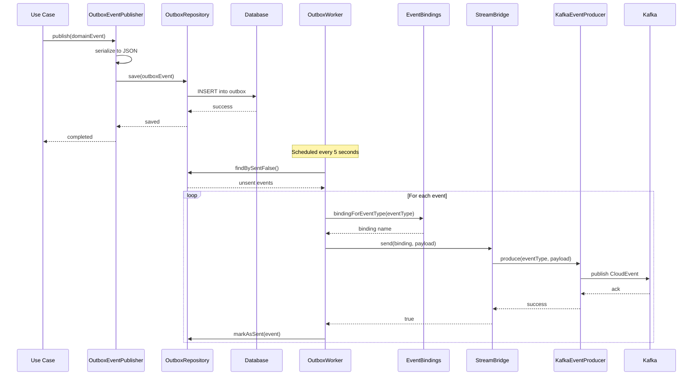
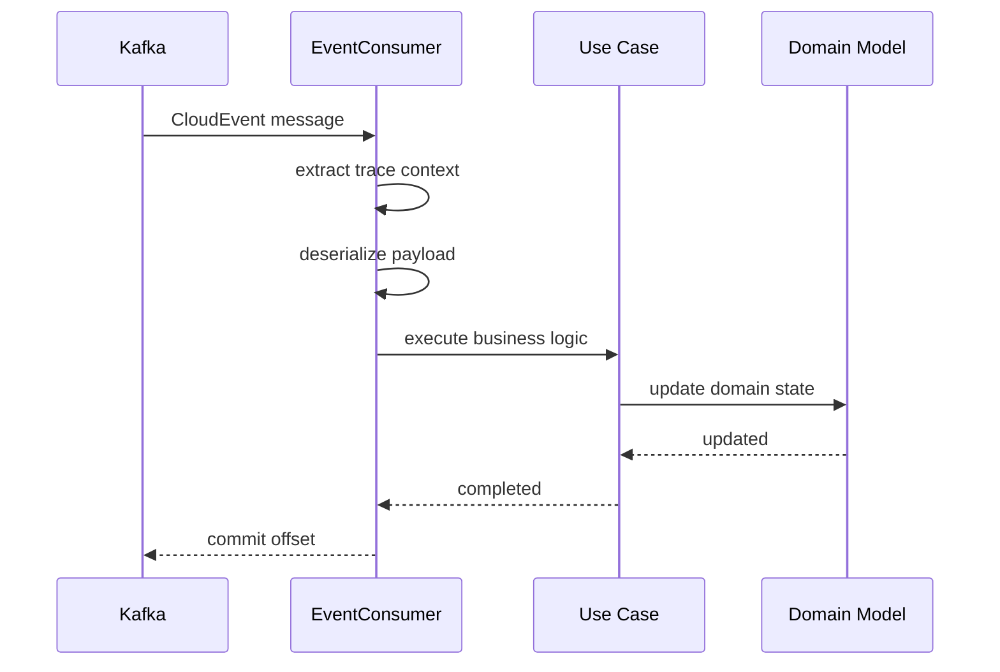

# Infrastructure Events Module

## Overview

The Infrastructure Events module provides the implementation layer for event publishing and consumption in the Wallet Hub system. This module bridges the gap between domain events and external messaging systems, implementing the outbox pattern, message serialization, and event distribution mechanisms.

## Core Components

### 1. Event Publishing Components

#### OutboxEventPublisher
Implements the `DomainEventPublisher` interface from the domain layer, providing reliable event publishing through the outbox pattern.

**Key Responsibilities:**
- Serializes domain events to JSON format
- Persists events to the outbox table within the same transaction
- Uses event class name as the event type identifier
- Handles serialization errors with proper exception handling

**Integration Points:**
- Implements `DomainEventPublisher` interface
- Uses `OutboxRepository` for data persistence
- Leverages Jackson `ObjectMapper` for JSON serialization

#### EventProducer Interface
Defines the contract for event producers in the system.

**Key Methods:**
- `produce(String eventType, String payload)`: Produces an event with the given type and payload

#### KafkaEventProducer
Implements the `EventProducer` interface for Kafka-based event distribution.

**Key Features:**
- Converts events to CloudEvents format
- Injects W3C trace context for distributed tracing
- Publishes events to configured Kafka topics
- Handles Kafka-specific error scenarios

#### EventBindings
Centralized mapping of event types to Spring Cloud Stream binding names.

**Key Features:**
- Eliminates string coupling in code
- Provides single source of truth for binding mappings
- Supports easy evolution of channel names
- Returns `Optional<String>` for safe binding lookup

**Current Bindings:**
- `walletCreatedEventProducer` → `walletCreatedEventProducer-out-0`
- `fundsAddedEventProducer` → `fundsAddedEventProducer-out-0`
- `fundsWithdrawnEventProducer` → `fundsWithdrawnEventProducer-out-0`
- `fundsTransferredEventProducer` → `fundsTransferredEventProducer-out-0`

### 2. Event Consumption Components

#### Event Consumers
Various consumers that process incoming events from Kafka topics.

**Available Consumers:**
- `WalletCreatedEventConsumer`: Processes wallet creation events
- `FundsAddedEventConsumer`: Processes funds addition events
- `FundsWithdrawnEventConsumer`: Processes funds withdrawal events
- `FundsTransferredEventConsumer`: Processes funds transfer events

**Consumer Design:**
- Implement Spring's `Consumer` interface
- Handle CloudEvents format with W3C trace context
- Perform idempotent operations
- Integrate with business logic through use cases

## Architecture

### Event Publishing Flow



### Event Consumption Flow



## Configuration

### Spring Cloud Stream Configuration

```yaml
spring:
  cloud:
    stream:
      function:
        definition: walletCreatedEventConsumer;fundsAddedEventConsumer;fundsWithdrawnEventConsumer;fundsTransferredEventConsumer
      
      bindings:
        # Producer bindings
        walletCreatedEventProducer-out-0:
          destination: wallet-created-events
          content-type: application/json
          
        fundsAddedEventProducer-out-0:
          destination: funds-added-events
          content-type: application/json
          
        fundsWithdrawnEventProducer-out-0:
          destination: funds-withdrawn-events
          content-type: application/json
          
        fundsTransferredEventProducer-out-0:
          destination: funds-transferred-events
          content-type: application/json
        
        # Consumer bindings
        walletCreatedEventConsumer-in-0:
          destination: wallet-created-events
          group: wallet-hub-consumers
          
        fundsAddedEventConsumer-in-0:
          destination: funds-added-events
          group: wallet-hub-consumers
          
        fundsWithdrawnEventConsumer-in-0:
          destination: funds-withdrawn-events
          group: wallet-hub-consumers
          
        fundsTransferredEventConsumer-in-0:
          destination: funds-transferred-events
          group: wallet-hub-consumers
      
      kafka:
        binder:
          brokers: ${KAFKA_BROKERS:localhost:9092}
          auto-create-topics: true
          auto-add-partitions: true
        
        producer:
          key-serializer: org.apache.kafka.common.serialization.StringSerializer
          value-serializer: org.springframework.kafka.support.serializer.JsonSerializer
          properties:
            spring.json.type.mapping: walletCreatedEvent:dev.bloco.wallet.hub.domain.event.wallet.WalletCreatedEvent
            
        consumer:
          key-deserializer: org.apache.kafka.common.serialization.StringDeserializer
          value-deserializer: org.springframework.kafka.support.serializer.JsonDeserializer
          properties:
            spring.json.type.mapping: walletCreatedEvent:dev.bloco.wallet.hub.domain.event.wallet.WalletCreatedEvent
            spring.json.trusted.packages: "*"
```

### CloudEvents Configuration

The system uses CNCF CloudEvents specification for consistent event formatting:

**CloudEvents Attributes:**
- `specversion`: "1.0"
- `id`: Unique event identifier
- `type`: Event type (e.g., "WalletCreatedEvent")
- `source`: Event source URI
- `datacontenttype`: "application/json"
- `time`: Event timestamp
- `traceparent`: W3C Trace Context
- `data`: Actual event payload

### Tracing Configuration

Events integrate with distributed tracing through:
- W3C Trace Context injection in CloudEvents
- Correlation ID propagation
- Span creation for event processing
- Trace sampling based on event type

## Error Handling

### Publishing Errors

**Serialization Failures:**
- Occur when domain events cannot be serialized to JSON
- Result in `RuntimeException` with descriptive message
- Prevent corrupted data from being stored

**Unknown Event Types:**
- When `EventBindings` has no mapping for an event type
- Event is skipped with warning log
- Metrics recorded for monitoring

**Message Delivery Failures:**
- When Kafka producer fails to send message
- Event remains in outbox for retry
- Exponential backoff for retry attempts

### Consumption Errors

**Deserialization Failures:**
- Occur when message cannot be deserialized
- Message sent to dead letter topic
- Alert triggered for manual intervention

**Business Logic Failures:**
- Occur when event processing fails
- Implement retry with exponential backoff
- Dead letter queue for permanent failures

**Idempotency Violations:**
- Detect duplicate event processing
- Skip already processed events
- Log warning for investigation

## Monitoring and Metrics

### Key Metrics

**Publishing Metrics:**
- `events.published.total`: Total events published
- `events.published.by_type`: Events published by type
- `events.published.latency`: Publishing latency distribution
- `events.published.errors`: Publishing error count

**Consumption Metrics:**
- `events.consumed.total`: Total events consumed
- `events.consumed.by_type`: Events consumed by type
- `events.consumed.latency`: Consumption latency distribution
- `events.consumed.errors`: Consumption error count

**Outbox Metrics:**
- `outbox.queue.size`: Number of unsent events
- `outbox.queue.age`: Age of oldest unsent event
- `outbox.processing.time`: Outbox processing time

### Health Checks

**Kafka Health:**
- Broker connectivity
- Topic existence and configuration
- Producer/consumer health

**Outbox Health:**
- Database connectivity
- Queue growth rate
- Processing lag

## Performance Considerations

### Batch Processing
- Outbox worker processes events in batches
- Kafka producer uses batch sending
- Consumer processes messages in batches when possible

### Connection Pooling
- Database connection pooling for outbox operations
- Kafka producer connection pooling
- Consumer connection management

### Serialization Optimization
- Jackson ObjectMapper reuse
- JSON schema caching
- Protobuf consideration for high-volume events

### Memory Management
- Event payload size limits
- Batch size configuration
- Consumer buffer management

## Security Considerations

### Event Payload Security
- Sensitive data sanitization before logging
- PII masking in event payloads
- Encryption for sensitive event data

### Access Control
- Kafka ACL configuration
- Producer/consumer authentication
- Topic-level permissions

### Audit Logging
- All event publishing logged
- Consumer processing audit trails
- Security event monitoring

## Testing

### Unit Testing
- Test event serialization/deserialization
- Verify binding mappings
- Test error handling scenarios

### Integration Testing
- End-to-end event flow testing
- Kafka integration testing
- Outbox pattern verification

### Performance Testing
- Load testing event publishing
- Throughput measurement
- Latency profiling

## Related Modules

### Outbox System
The [outbox_system](outbox_system.md) module provides the core outbox pattern implementation that this module builds upon.

### Domain Events
The [domain_events](domain_events.md) module defines the business events that this module publishes and consumes.

### Infrastructure Tracing
The [infrastructure_tracing](infrastructure_tracing.md) module provides distributed tracing integration for events.

### Repository Layer
The [repository_layer](repository_layer.md) module provides data access for the outbox table operations.