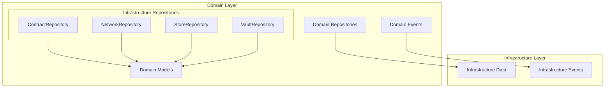
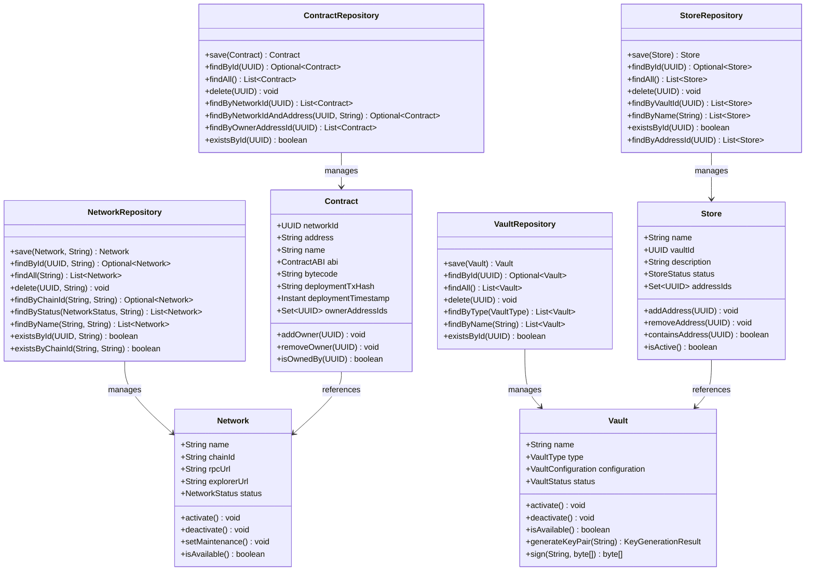
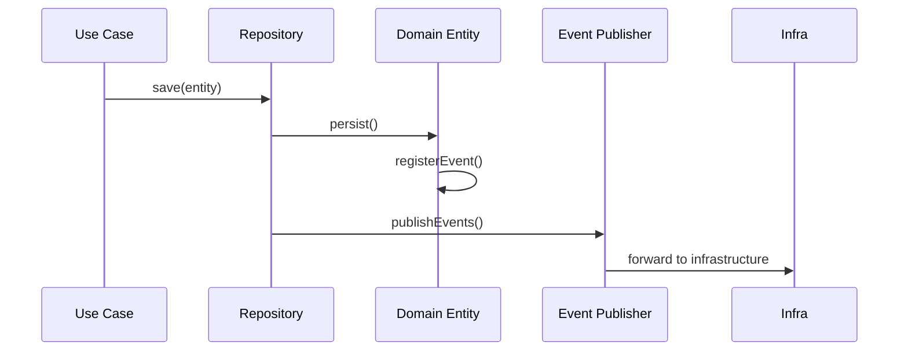
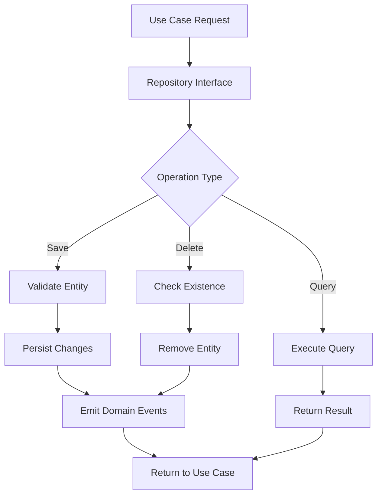
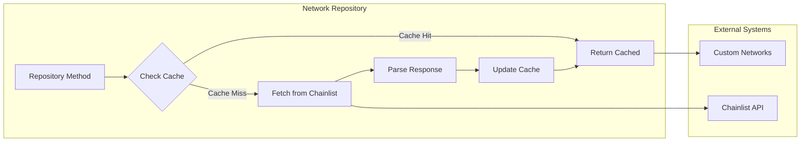

# Infrastructure Repositories Module

## Overview

The Infrastructure Repositories module is a specialized submodule within the domain repositories layer that manages infrastructure-related entities in the Wallet Hub system. This module provides repository interfaces for managing blockchain networks, smart contracts, secure vaults, and storage systems that form the foundational infrastructure for wallet operations.

## Module Purpose

The Infrastructure Repositories module serves as the persistence abstraction layer for infrastructure entities, enabling:
- **Network Management**: Storage and retrieval of blockchain network configurations
- **Contract Management**: Persistence of smart contract deployments and interactions
- **Vault Management**: Secure storage of cryptographic key management systems
- **Store Management**: Organization of address groupings and storage configurations

## Architecture

### Module Position in System Architecture



### Component Relationships



## Core Components

### 1. ContractRepository

The `ContractRepository` interface manages smart contract entities in the system, providing CRUD operations and specialized queries for contract management.

**Key Operations:**
- **Basic CRUD**: `save()`, `findById()`, `findAll()`, `delete()`, `existsById()`
- **Network-specific queries**: `findByNetworkId()`, `findByNetworkIdAndAddress()`
- **Ownership queries**: `findByOwnerAddressId()`

**Usage Example:**
```java
// Find contract by network and address
Optional<Contract> contract = contractRepository.findByNetworkIdAndAddress(
    networkId, "0x742d35Cc6634C0532925a3b844Bc9e...");

// Find all contracts owned by an address
List<Contract> ownedContracts = contractRepository.findByOwnerAddressId(addressId);
```

### 2. NetworkRepository

The `NetworkRepository` interface manages blockchain network configurations with support for correlation IDs and external data sources.

**Key Features:**
- **Correlation ID Support**: All operations support correlation IDs for distributed tracing
- **Chain ID Management**: Unique identification of blockchain networks
- **Status-based Filtering**: Query networks by operational status
- **External Integration**: Can integrate with external network registries (e.g., Chainlist)

**Specialized Operations:**
- `findByChainId()`: Find network by blockchain chain ID
- `findByStatus()`: Filter networks by operational status (ACTIVE, INACTIVE, MAINTENANCE)
- `findByName()`: Search networks by name (case-insensitive)
- `existsByChainId()`: Check if a network with given chain ID exists

**Implementation Note**: The `ChainlistNetworkRepository` implementation demonstrates integration with external network registries, providing caching and fallback mechanisms.

### 3. StoreRepository

The `StoreRepository` interface manages storage groupings that organize addresses within vaults.

**Key Operations:**
- **Basic CRUD**: Standard repository operations
- **Vault-based queries**: `findByVaultId()` for organizational grouping
- **Address relationships**: `findByAddressId()` to find stores containing specific addresses
- **Name-based search**: `findByName()` for store discovery

**Store Purpose**: Stores provide logical grouping of addresses within vaults, enabling organized management of related addresses for specific purposes or applications.

### 4. VaultRepository

The `VaultRepository` interface manages secure vault systems for cryptographic key management.

**Key Operations:**
- **Basic CRUD**: Standard repository operations
- **Type-based filtering**: `findByType()` for vault type segregation
- **Name-based search**: `findByName()` for vault discovery

**Vault Types Supported:**
- `HSM`: Hardware Security Module
- `AWS_KMS`: Amazon Web Services Key Management Service
- `AZURE_KEY_VAULT`: Microsoft Azure Key Vault
- `GOOGLE_CLOUD_KMS`: Google Cloud Key Management Service
- `SOFTWARE`: Software-based key storage

## Domain Models

### Contract Model
The `Contract` model represents deployed smart contracts with:
- **Network Association**: Links to specific blockchain networks
- **Contract ABI**: Application Binary Interface for contract interaction
- **Bytecode**: Deployed contract bytecode
- **Deployment Information**: Transaction hash and timestamp
- **Ownership Management**: Multiple address ownership support

### Network Model
The `Network` model represents blockchain networks with:
- **Chain ID**: Unique blockchain identifier
- **RPC Endpoint**: JSON-RPC interface URL
- **Explorer URL**: Blockchain explorer for transaction viewing
- **Status Management**: ACTIVE, INACTIVE, MAINTENANCE states
- **URL Generation**: Helper methods for transaction and address explorer URLs

### Store Model
The `Store` model represents address groupings with:
- **Vault Association**: Parent vault relationship
- **Address Management**: Set of contained addresses
- **Status Control**: ACTIVE/INACTIVE states
- **Descriptive Metadata**: Name and description fields

### Vault Model
The `Vault` model represents cryptographic key management systems with:
- **Type Specification**: HSM, cloud KMS, or software-based
- **Configuration**: Type-specific configuration parameters
- **Status Management**: ACTIVE/INACTIVE states
- **Cryptographic Operations**: Key generation and signing capabilities

## Event-Driven Architecture

### Domain Events
Each repository manages entities that emit domain events:



**Contract Events:**
- `ContractDeployedEvent`: Emitted when a contract is deployed
- `ContractInteractionEvent`: Emitted on contract interactions
- `ContractOwnerAddedEvent`: When an owner is added to a contract
- `ContractOwnerRemovedEvent`: When an owner is removed from a contract

**Network Events:**
- `NetworkCreatedEvent`: Emitted when a network is created
- `NetworkStatusChangedEvent`: When network status changes
- `NetworkAddedEvent`: When a network is added to the system

**Store Events:**
- `StoreCreatedEvent`: Emitted when a store is created
- `StoreStatusChangedEvent`: When store status changes
- `AddressAddedToStoreEvent`: When an address is added to a store

**Vault Events:**
- `VaultCreatedEvent`: Emitted when a vault is created
- `VaultStatusChangedEvent`: When vault status changes
- `KeyPairGeneratedEvent`: When cryptographic key pairs are generated

## Data Flow

### Repository Operation Flow



### Network Repository Data Flow with External Integration



## Integration Points

### 1. With Domain Models
- **Aggregate Root Inheritance**: All managed entities extend `AggregateRoot`
- **Event Registration**: Entities register domain events during state changes
- **Business Logic Encapsulation**: Domain logic resides in entity models

### 2. With Infrastructure Layer
- **Repository Implementations**: Concrete implementations in `infrastructure_data` module
- **Event Publishing**: Integration with `DomainEventPublisher`
- **Data Mapping**: Entity-to-domain model mapping via mappers

### 3. With External Systems
- **Chainlist Integration**: `ChainlistNetworkRepository` fetches network data from external API
- **Vault Providers**: Integration with various key management services
- **Blockchain Networks**: Connection to blockchain RPC endpoints

## Implementation Patterns

### 1. Repository Pattern
- **Interface Segregation**: Clean separation of repository contracts
- **Persistence Ignorance**: Domain layer unaware of persistence details
- **Testability**: Easy mocking for unit testing

### 2. Caching Strategy (NetworkRepository)
- **Time-based Cache**: Configurable TTL for external data
- **Fallback Mechanism**: Serve stale data on fetch failure
- **Memory Efficiency**: Concurrent data structures for thread safety

### 3. Correlation ID Propagation
- **Distributed Tracing**: Support for correlation IDs across operations
- **Context Propagation**: Maintain request context through repository calls
- **Audit Trail**: Enable request tracing across service boundaries

## Usage Examples

### Managing Networks
```java
// Create and save a network
Network network = Network.create(
    UUID.randomUUID(),
    "Ethereum Mainnet",
    "1",
    "https://mainnet.infura.io/v3/API_KEY",
    "https://etherscan.io"
);

Network savedNetwork = networkRepository.save(network, "req-123");

// Find network by chain ID
Optional<Network> foundNetwork = networkRepository.findByChainId("1", "req-123");

// Get all active networks
List<Network> activeNetworks = networkRepository.findByStatus(NetworkStatus.ACTIVE, "req-123");
```

### Managing Contracts
```java
// Save a deployed contract
Contract contract = Contract.create(
    UUID.randomUUID(),
    networkId,
    "0x742d35Cc6634C0532925a3b844Bc9e...",
    "MyToken",
    contractABI,
    bytecode,
    deploymentTxHash
);

Contract savedContract = contractRepository.save(contract);

// Find contracts on a specific network
List<Contract> networkContracts = contractRepository.findByNetworkId(networkId);
```

### Managing Vaults and Stores
```java
// Create a vault
Vault vault = Vault.create(
    UUID.randomUUID(),
    "Production Vault",
    VaultType.AWS_KMS,
    vaultConfiguration
);

Vault savedVault = vaultRepository.save(vault);

// Create a store within the vault
Store store = Store.create(
    UUID.randomUUID(),
    "User Addresses",
    savedVault.getId(),
    "Store for user wallet addresses"
);

Store savedStore = storeRepository.save(store);
```

## Error Handling

### Repository-Specific Error Scenarios
1. **Network Repository**:
   - External API failures (Chainlist)
   - Cache corruption
   - Invalid chain ID formats

2. **Contract Repository**:
   - Duplicate contract addresses on same network
   - Invalid contract ABI
   - Orphaned contract references

3. **Vault Repository**:
   - Unsupported vault type configurations
   - Invalid cryptographic configurations
   - Vault availability issues

4. **Store Repository**:
   - Circular store references
   - Invalid vault associations
   - Address constraint violations

### Resilience Patterns
- **Retry Logic**: For transient external failures
- **Circuit Breakers**: For external service integration
- **Graceful Degradation**: Fallback to cached data
- **Validation Guards**: Pre-operation validation

## Testing Considerations

### Unit Testing
- **Mock Repositories**: Test use cases with mocked repository implementations
- **Entity Validation**: Test domain entity business logic
- **Event Emission**: Verify correct domain event registration

### Integration Testing
- **Repository Implementations**: Test concrete repository implementations
- **Database Integration**: Test JPA or other persistence mechanisms
- **External Service Integration**: Test Chainlist API integration

### Performance Testing
- **Cache Efficiency**: Test network repository caching performance
- **Query Optimization**: Test repository query performance
- **Concurrent Access**: Test thread safety under load

## Related Modules

- **[domain_models.md](domain_models.md)**: Contains the domain entity definitions
- **[domain_events.md](domain_events.md)**: Contains domain event definitions and publishing mechanisms
- **[infrastructure_data.md](infrastructure_data.md)**: Contains repository implementations and data persistence
- **[core_entity_repositories.md](core_entity_repositories.md)**: Contains core entity repositories (Wallet, User, Address, Transaction)

## Configuration

### Network Repository Configuration
```yaml
wallet:
  networks:
    chainlist-url: "https://chainlist.org/api/v1/chains"
    cache-ttl: PT5M  # 5 minute cache TTL
```

### Repository Tracing Configuration
```yaml
management:
  tracing:
    sampling:
      probability: 1.0
    repository:
      enabled: true
      slow-query-threshold: 100ms
```

## Monitoring and Observability

### Key Metrics
1. **Repository Operations**:
   - Operation latency by repository type
   - Cache hit/miss ratios for NetworkRepository
   - Error rates by operation type

2. **External Integrations**:
   - Chainlist API response times
   - External service availability
   - Cache effectiveness metrics

3. **Business Metrics**:
   - Number of networks by status
   - Contract deployment frequency
   - Vault utilization by type

### Health Checks
- **Repository Connectivity**: Database/External service connectivity
- **Cache Health**: Cache population and expiration status
- **External Service Health**: Chainlist API availability

## Future Enhancements

### Planned Features
1. **Advanced Caching**: Redis-based distributed caching for repositories
2. **Repository Metrics**: Enhanced metrics collection and dashboards
3. **Query Optimization**: Advanced indexing and query optimization
4. **Multi-tenancy**: Support for multi-tenant repository implementations
5. **Audit Logging**: Comprehensive audit trails for repository operations

### Integration Roadmap
1. **Additional Network Sources**: Integration with more network registries
2. **Vault Provider Expansion**: Support for additional KMS providers
3. **Contract Registry Integration**: Integration with contract verification services
4. **Blockchain Indexer Integration**: Real-time contract event indexing

---

*Last Updated: Documentation generated based on current module structure*