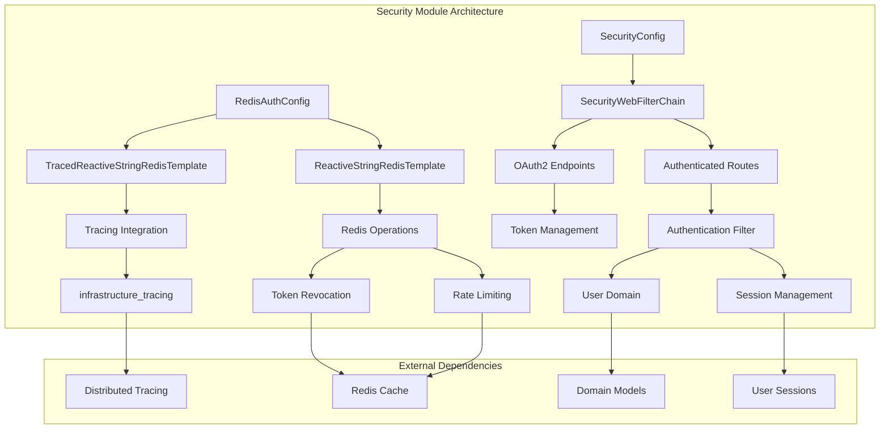
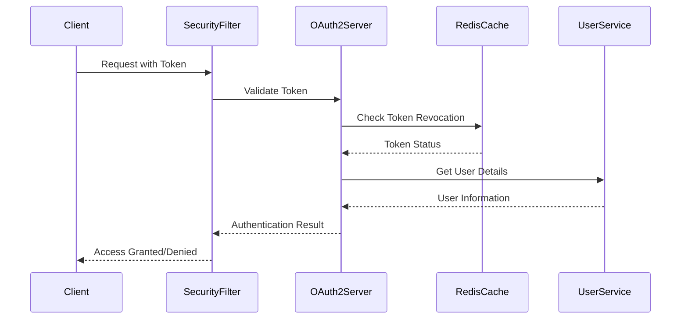

# Infrastructure Security Module

## Overview

The Infrastructure Security module provides the foundational security layer for the Wallet Hub application. It implements authentication, authorization, and secure communication patterns using Spring Security with WebFlux in a reactive architecture. The module is designed to be extensible, supporting OAuth2 flows, distributed tracing for security operations, and integration with Redis for token management and rate limiting.

## Architecture

The security module follows a layered architecture that integrates with the broader application ecosystem:



## Core Components

### 1. Security Configuration (`SecurityConfig`)

The main security configuration class that sets up the WebFlux security filter chain. For detailed documentation on security configuration, see [security_configuration.md](security_configuration.md).

**Key Features:**
- Reactive security configuration using `ServerHttpSecurity`
- Extensible filter chain for future security enhancements
- Integration with OAuth2 authorization server
- Public OAuth2 endpoints: `/oauth2/token`, `/oauth2/revoke`, `/auth/introspect`
- Authenticated access for all other endpoints
- CSRF protection disabled for API-first architecture

### 2. Redis Authentication Configuration (`RedisAuthConfig`)

Configuration for Redis-based authentication concerns including token revocation and rate limiting. For detailed documentation on Redis authentication configuration, see [redis_auth_configuration.md](redis_auth_configuration.md).

**Key Features:**
- Integration with [infrastructure_tracing](infrastructure_tracing.md) module
- Support for reactive Redis operations
- Automatic context propagation for distributed tracing
- Traced Redis operations with conditional bean creation
- Fallback support to standard Redis template when tracing is disabled

## Integration Points

### Authentication Flow



### Token Management

The security module integrates with Redis for:
1. **Token revocation lists**: Tracking invalidated tokens
2. **Rate limiting**: Preventing brute force attacks
3. **Session management**: Storing active session information

## Configuration Properties

### Security Configuration
```yaml
# Security endpoints configuration
security:
  oauth2:
    token-endpoint: /oauth2/token
    revoke-endpoint: /oauth2/revoke
    introspect-endpoint: /auth/introspect
```

### Redis Configuration
```yaml
# Redis authentication configuration
spring:
  data:
    redis:
      host: localhost
      port: 6379
      password: ${REDIS_PASSWORD:}
      timeout: 2000ms
      connect-timeout: 1000ms
```

## Dependencies

### Internal Dependencies
- **[infrastructure_tracing](infrastructure_tracing.md)**: For distributed tracing of security operations
- **[domain_models](domain_models.md)**: User and session domain models
- **[domain_repositories](domain_repositories.md)**: User repository for authentication

### External Dependencies
- **Spring Security WebFlux**: Reactive security framework
- **Spring Data Redis Reactive**: Reactive Redis operations
- **Micrometer Tracing**: Distributed tracing integration

## Security Considerations

### Current Implementation
1. **Minimal Security**: Initial skeleton with basic OAuth2 endpoint protection
2. **CSRF Disabled**: Appropriate for stateless API architecture
3. **Public Endpoints**: OAuth2 token endpoints accessible without authentication

### Future Enhancements
1. **Scope-based Authorization**: Fine-grained access control
2. **Rate Limiting**: Protection against brute force attacks
3. **Security Metrics**: Monitoring and alerting for security events
4. **Advanced Filter Chain**: Custom security filters for specific requirements

## Usage Examples

### Basic Security Configuration
```java
@Configuration
@EnableWebFluxSecurity
public class CustomSecurityConfig extends SecurityConfig {
    
    @Override
    public SecurityWebFilterChain securityWebFilterChain(ServerHttpSecurity http) {
        return super.securityWebFilterChain(http)
            .addFilterAt(new CustomSecurityFilter(), SecurityWebFiltersOrder.AUTHENTICATION);
    }
}
```

### Redis Authentication Usage
```java
@Service
public class TokenRevocationService {
    
    private final ReactiveStringRedisTemplate redisTemplate;
    
    public Mono<Boolean> revokeToken(String tokenId) {
        return redisTemplate.opsForValue()
            .set("revoked:" + tokenId, "true", Duration.ofHours(1));
    }
    
    public Mono<Boolean> isTokenRevoked(String tokenId) {
        return redisTemplate.opsForValue()
            .get("revoked:" + tokenId)
            .map("true"::equals);
    }
}
```

## Monitoring and Observability

The security module integrates with the tracing infrastructure to provide:

1. **Redis operation tracing**: Cache hits/misses, operation latency
2. **Authentication events**: Success/failure tracking
3. **Token validation**: Performance metrics for token validation operations

## Testing Considerations

When testing the security module:

1. **Mock Security Context**: Use `@WithMockUser` for unit tests
2. **Test Security Filter**: Verify public vs protected endpoints
3. **Redis Integration Tests**: Test token revocation and rate limiting
4. **Reactive Testing**: Use `StepVerifier` for reactive security flows

## Related Documentation

### Sub-module Documentation
- [security_configuration.md](security_configuration.md) - Detailed security configuration and authentication flow
- [redis_auth_configuration.md](redis_auth_configuration.md) - Redis-based authentication with tracing integration

### External Module Documentation
- [infrastructure_tracing.md](infrastructure_tracing.md) - Distributed tracing configuration
- [domain_models.md](domain_models.md) - User and security domain models
- [domain_repositories.md](domain_repositories.md) - User repository interfaces
- [domain_events.md](domain_events.md) - Security event publishing
- [infrastructure_data.md](infrastructure_data.md) - Session storage implementation