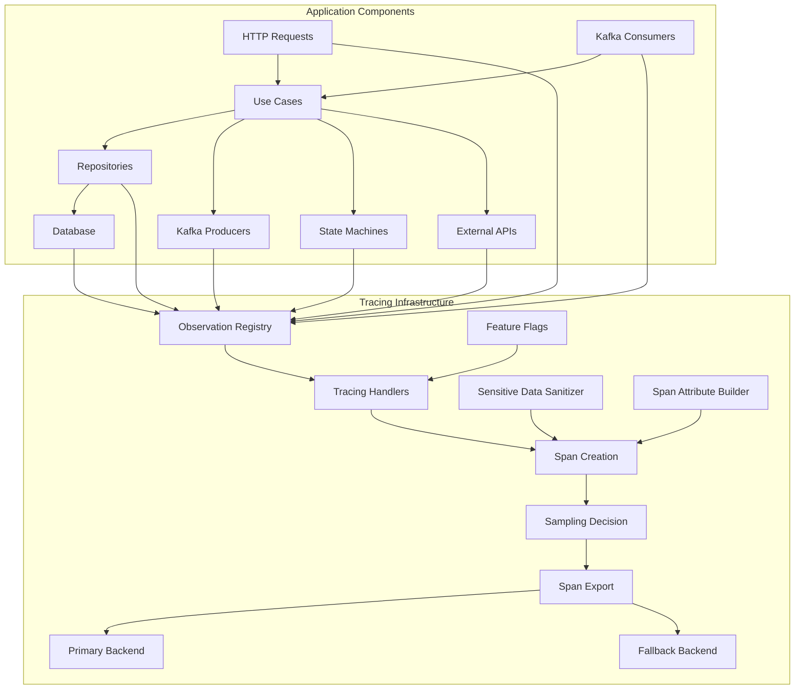
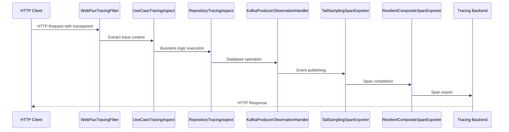

# Infrastructure Tracing Module

## Overview

The Infrastructure Tracing module provides comprehensive distributed tracing capabilities for the Wallet Hub application using Micrometer Tracing with Brave bridge and OpenTelemetry standards. This module enables end-to-end observability across all application components, from HTTP requests and database operations to Kafka messaging and state machine transitions.

### Purpose
- **Distributed Trace Collection**: Capture and correlate operations across service boundaries
- **Performance Monitoring**: Measure latency and identify bottlenecks in business workflows
- **Error Diagnosis**: Track failures across distributed components with full context
- **Compliance**: Ensure sensitive data is properly sanitized before trace export
- **Cost Optimization**: Implement intelligent sampling to balance observability with performance

### Key Features
- **Multi-backend Export**: Support for Tempo (OTLP) and Zipkin backends with automatic failover
- **Intelligent Sampling**: Tail-based sampling with always-sample rules for critical events
- **Feature Flags**: Runtime control over tracing components for performance tuning
- **Sensitive Data Protection**: Automatic sanitization of PII, credentials, and SQL statements
- **Reactive Support**: Full trace context propagation across Project Reactor pipelines
- **CloudEvents Integration**: W3C Trace Context propagation across Kafka boundaries

## Architecture Overview



### Core Components

The tracing module is organized into several sub-modules, each responsible for specific aspects of distributed tracing:

1. **Core Configuration** (`core_configuration.md`)
   - `TracingConfiguration`: Central configuration for observation registry and multi-backend export
   - `TracingFeatureFlags`: Runtime control over tracing components
   - `SpanAttributeBuilder`: Standardized span attributes following OpenTelemetry conventions

2. **Sampling System** (`sampling_system.md`)
   - `SamplingConfiguration`: Intelligent sampling strategies with always-sample rules
   - `TailSamplingSpanExporter`: Buffered span evaluation for tail-based sampling
   - `ResilientCompositeSpanExporter`: Circuit breaker-protected multi-backend export

3. **Instrumentation Aspects** (`instrumentation_aspects.md`)
   - `RepositoryTracingAspect`: AOP instrumentation for JPA repository operations
   - `UseCaseTracingAspect`: AOP instrumentation for business use case executions

4. **Web & HTTP Tracing** (`web_http_tracing.md`)
   - `WebFluxTracingFilter`: W3C Trace Context extraction for incoming HTTP requests
   - `WebClientTracingCustomizer`: Trace context injection for outbound HTTP calls

5. **Client & External Tracing** (`client_external_tracing.md`)
   - `TracedReactiveStringRedisTemplate`: Distributed tracing for Redis operations
   - `CircuitBreakerTracingDecorator`: Tracing integration with Resilience4j circuit breakers

6. **Messaging Tracing** (`messaging_tracing.md`)
   - `KafkaConsumerObservationHandler`: Observation handler for Kafka message consumption
   - `KafkaProducerObservationHandler`: Observation handler for Kafka message publishing

7. **Database Tracing** (`database_tracing.md`)
   - `R2dbcObservationHandler`: Observation handler for reactive database operations
   - `StateMachineObservationHandler`: Tracing for Spring Statemachine transitions

8. **Propagation** (`propagation.md`)
   - `CloudEventTracePropagator`: W3C Trace Context propagation via CloudEvents
   - `ReactiveContextPropagator`: Trace context propagation across reactive pipelines

9. **Monitoring & Health** (`monitoring_health.md`)
   - `TracingHealthIndicator`: Health checks for tracing infrastructure
   - `TracingMetricsCollector`: Metrics collection for tracing operations

10. **Filters & Decorators** (`filters_decorators.md`)
    - `SensitiveDataSanitizer`: PII and credential sanitization for trace data
    - `SlowQueryDetector`: Performance threshold detection for database queries

## Data Flow



## Configuration

### Activation
Tracing is activated via the `tracing` profile or property:
```yaml
# application.yml
spring:
  profiles:
    active: tracing

# OR
management:
  tracing:
    enabled: true
```

### Backend Configuration
```yaml
# application-tracing.yml
tracing:
  backends:
    primary: tempo      # OTLP/Tempo backend
    fallback: zipkin    # Zipkin fallback
  
  features:
    database: true      # Enable database tracing
    kafka: true         # Enable Kafka tracing
    stateMachine: true  # Enable state machine tracing
    externalApi: true   # Enable external API tracing
    reactive: true      # Enable reactive tracing
    useCase: true       # Enable use case tracing

management:
  tracing:
    sampling:
      probability: 0.1  # 10% baseline sampling
  
  zipkin:
    tracing:
      endpoint: http://localhost:9411/api/v2/spans
  
  otlp:
    tracing:
      endpoint: http://localhost:4318/v1/traces
```

## Integration Points

### With Application Layer
- **Use Cases**: Automatic instrumentation via `UseCaseTracingAspect`
- **Repositories**: Automatic instrumentation via `RepositoryTracingAspect`
- **Domain Events**: Trace context propagation via `CloudEventTracePropagator`

### With Infrastructure Layer
- **Database**: JPA and R2DBC instrumentation
- **Messaging**: Kafka producer/consumer instrumentation
- **Caching**: Redis operation tracing
- **External APIs**: WebClient instrumentation

### With Observability Stack
- **Metrics**: Integration with Micrometer metrics
- **Logging**: Correlation IDs for log aggregation
- **Health**: Tracing infrastructure health checks

## Performance Characteristics

| Component | Overhead | Impact |
|-----------|----------|--------|
| Span Creation | 0.5-2ms | Per operation |
| SQL Sanitization | 0.5-2ms | Per query |
| Trace Context Propagation | <0.1ms | Per boundary |
| Sampling Decision | <0.01ms | Per span |
| Span Export | 5-50ms | Async, non-blocking |

## Security & Compliance

### Data Protection
- **Sensitive Data Sanitization**: Automatic masking of PII, credentials, and SQL literals
- **Identifier Handling**: Wallet/user IDs hashed, transaction IDs included as-is
- **URL Sanitization**: Query parameters and path segments masked
- **Header Filtering**: Only safe headers included in traces

### Privacy Controls
- **Feature Flags**: Granular control over tracing components
- **Sampling**: 10% baseline with always-sample rules for critical events
- **Attribute Limits**: 1024 character maximum for attribute values

## Monitoring & Troubleshooting

### Health Checks
```bash
GET /actuator/health/tracing
```
Returns tracer availability and feature flag states.

### Metrics
- `tracing.spans.created`: Total spans created
- `tracing.spans.exported`: Total spans exported
- `tracing.spans.dropped`: Total spans dropped
- `tracing.feature.flags.state`: Current feature flag states

### Logging
- DEBUG: Trace context operations and span lifecycle
- INFO: Configuration validation and feature flag changes
- WARN: Missing trace context, slow operations
- ERROR: Export failures, configuration errors

## Best Practices

### Development
1. **Always enable use case tracing** for business operation visibility
2. **Use SpanAttributeBuilder** for consistent attribute naming
3. **Test with tracing enabled** to catch context propagation issues
4. **Monitor sampling rates** to ensure critical events are captured

### Production
1. **Start with 10% sampling** and adjust based on volume
2. **Enable all feature flags initially**, disable selectively after profiling
3. **Monitor export failures** and circuit breaker states
4. **Regularly review trace data** for compliance and performance

### Troubleshooting
1. **Missing traces**: Check feature flags and sampling configuration
2. **Orphaned spans**: Verify reactive context propagation
3. **High overhead**: Disable non-critical tracing components
4. **Export failures**: Check backend connectivity and circuit breaker state

## Related Documentation

- [Core Configuration](core_configuration.md) - Central tracing configuration and feature flags
- [Sampling System](sampling_system.md) - Intelligent sampling strategies
- [Instrumentation Aspects](instrumentation_aspects.md) - AOP-based instrumentation
- [Web & HTTP Tracing](web_http_tracing.md) - HTTP request/response tracing
- [Client & External Tracing](client_external_tracing.md) - External service tracing
- [Messaging Tracing](messaging_tracing.md) - Kafka messaging tracing
- [Database Tracing](database_tracing.md) - Database operation tracing
- [Propagation](propagation.md) - Trace context propagation
- [Monitoring & Health](monitoring_health.md) - Health checks and metrics
- [Filters & Decorators](filters_decorators.md) - Data sanitization and performance detection

## Future Enhancements

### Planned Features (T020-T021)
1. **Complete ResilientCompositeSpanExporter**: Full circuit breaker integration
2. **Trace-level Sampling**: Sample all spans in a trace if any matches rules
3. **Dynamic Sampling Rates**: Adjust sampling based on system load
4. **Persistent Buffer**: Graceful shutdown without span loss

### Research Items
1. **Per-operation Granularity**: Enable only specific operation types
2. **Time-based Scheduling**: Enable tracing during business hours only
3. **User-based Flags**: Trace only specific user requests
4. **Cost Attribution**: Attribute tracing costs to business units