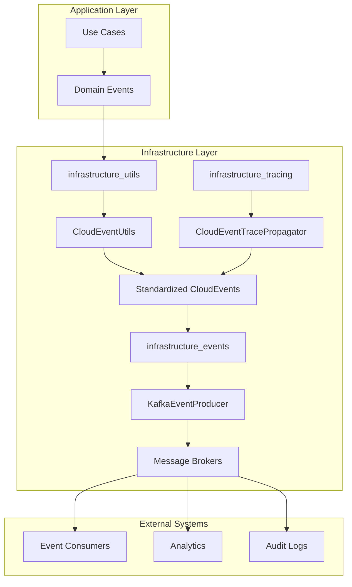
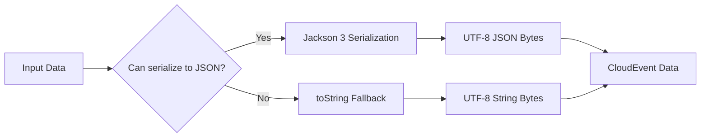
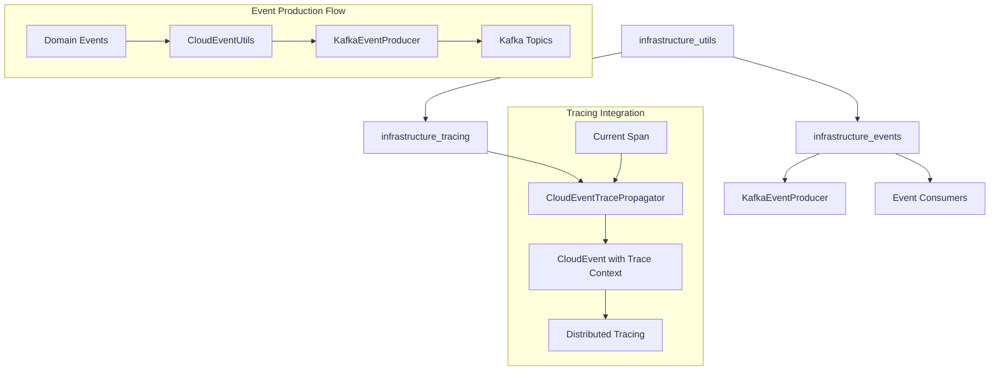
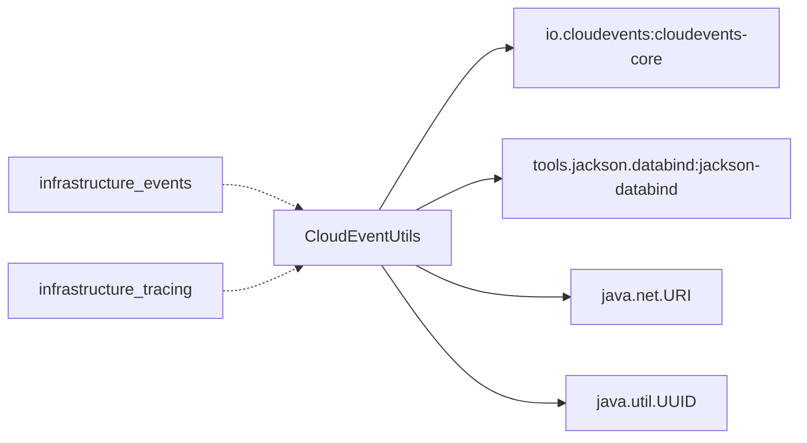
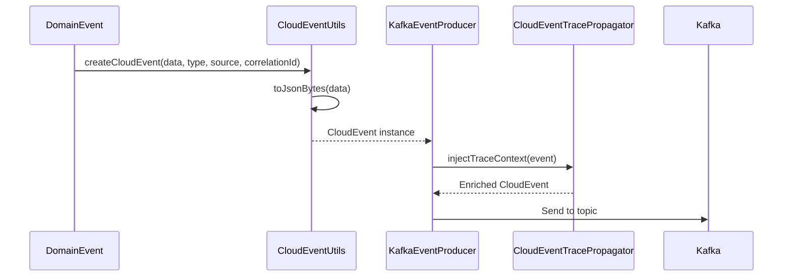

# Infrastructure Utilities Module

## Overview

The `infrastructure_utils` module provides essential utility classes that support the infrastructure layer of the Wallet Hub application. Currently, it contains the `CloudEventUtils` class, which serves as a centralized factory for creating standardized CloudEvent instances with consistent configurations and serialization behavior.

## Module Purpose

The primary purpose of this module is to:
1. **Standardize CloudEvent Creation**: Provide a consistent way to create CloudEvents across the application
2. **Simplify Event Serialization**: Handle JSON serialization with proper error handling
3. **Promote Reusability**: Reduce code duplication in event-producing components
4. **Ensure Consistency**: Maintain uniform CloudEvent structure and attributes
5. **Support Distributed Tracing**: Enable correlation ID propagation for end-to-end traceability
6. **Facilitate Event-Driven Architecture**: Provide building blocks for reliable event communication

## Role in System Architecture

The `infrastructure_utils` module plays a critical role in the Wallet Hub's event-driven architecture:



As shown in the diagram:
1. **Use Cases generate Domain Events** during business operations
2. **CloudEventUtils transforms** domain events into standardized CloudEvents
3. **Tracing components enrich** events with distributed trace context
4. **Event producers publish** events to message brokers
5. **External systems consume** events for various purposes

## Design Principles

The `infrastructure_utils` module follows several key design principles:

1. **Single Responsibility**: Each utility class has a clear, focused purpose
2. **Immutability**: Created CloudEvents are immutable and thread-safe
3. **Defensive Programming**: Graceful degradation in case of serialization failures
4. **Consistency Over Configuration**: Standardized defaults with minimal configuration
5. **Extensibility**: Designed to accommodate future utility classes

## Core Components

### CloudEventUtils

The `CloudEventUtils` class is a utility class that provides factory methods for creating CloudEvent instances with various configurations.

#### Key Features

1. **Automatic ID Generation**: Generates unique UUIDs for each CloudEvent
2. **JSON Serialization**: Automatically serializes payload data to JSON bytes using Jackson 3
3. **Error Resilience**: Graceful fallback to string representation if JSON serialization fails
4. **Extension Support**: Supports adding correlation IDs as CloudEvent extensions
5. **Type Safety**: Generic methods that work with any data type
6. **Thread Safety**: All methods are static and thread-safe
7. **Null Safety**: Proper handling of null values in serialization

#### Method Details

##### `createCloudEvent(T data, String type, String source)`

Creates a basic CloudEvent with the specified data, type, and source URI.

**Parameters:**
- `data`: The payload data to include in the CloudEvent (serialized to JSON bytes)
- `type`: The type of the CloudEvent, identifying the nature of the event
- `source`: The URI that identifies the source of the CloudEvent

**Returns:** A CloudEvent instance containing the specified attributes and data payload

**Example:**
```java
WalletCreatedEvent event = new WalletCreatedEvent(walletId, userId);
CloudEvent cloudEvent = CloudEventUtils.createCloudEvent(
    event, 
    "wallet.created", 
    "urn:wallet-hub:wallet-service"
);
```

##### `createCloudEvent(T data, String type, String source, String correlationId)`

Creates a CloudEvent with correlation ID support for distributed tracing and event correlation.

**Parameters:**
- `data`: The payload data to include in the CloudEvent (serialized to JSON bytes)
- `type`: The type of the CloudEvent, identifying the nature of the event
- `source`: The URI that identifies the source of the CloudEvent
- `correlationId`: The ID used to correlate the event with related events or actions

**Returns:** A CloudEvent instance containing the specified attributes, data payload, and correlation ID extension

**Example:**
```java
FundsAddedEvent event = new FundsAddedEvent(walletId, amount, transactionId);
CloudEvent cloudEvent = CloudEventUtils.createCloudEvent(
    event,
    "funds.added",
    "urn:wallet-hub:transaction-service",
    transactionId.toString()
);
```

#### Internal Implementation

##### `toJsonBytes(Object data)`

Private helper method that handles JSON serialization with the following characteristics:

1. **Jackson 3 Integration**: Uses Jackson 3's builder pattern with auto-discovered modules via SPI
2. **Error Handling**: Falls back to `toString()` if serialization fails to avoid hard failures
3. **UTF-8 Encoding**: Ensures consistent character encoding for string fallback
4. **Module Auto-Discovery**: Leverages Jackson's SPI for automatic module registration
5. **Performance Optimized**: Reuses Jackson's internal buffers for efficient serialization

**Serialization Strategy:**


**Error Handling Philosophy:**
- **Primary Goal**: Never fail event creation due to serialization issues
- **Fallback Strategy**: Preserve data in string format for debugging
- **Logging**: Errors are caught but not propagated to maintain system resilience
- **Recovery**: Events with fallback serialization can still be processed by consumers

## Architecture

### Module Relationships



### Dependencies



## Usage Patterns

### Event Production

The `CloudEventUtils` is typically used by event producers in the `infrastructure_events` module:

```java
// In KafkaEventProducer or similar components
public void produceEvent(DomainEvent domainEvent) {
    String eventType = determineEventType(domainEvent);
    String sourceUri = "urn:wallet-hub:" + getServiceName();
    String correlationId = domainEvent.getCorrelationId().toString();
    
    CloudEvent cloudEvent = CloudEventUtils.createCloudEvent(
        domainEvent,
        eventType,
        sourceUri,
        correlationId
    );
    
    // Send to Kafka or other messaging systems
    sendToMessageBroker(cloudEvent);
}
```

### Integration with Tracing

When used with the `CloudEventTracePropagator` from the `infrastructure_tracing` module:

```java
// Create basic CloudEvent
CloudEvent basicEvent = CloudEventUtils.createCloudEvent(data, type, source);

// Enrich with trace context
CloudEvent enrichedEvent = tracePropagator.injectTraceContext(basicEvent);
```

## Data Flow



## Error Handling Strategy

The `CloudEventUtils` implements a defensive error handling strategy:

1. **Primary Path**: Jackson 3 JSON serialization with auto-discovered modules
2. **Fallback Path**: If serialization fails, uses `toString()` with UTF-8 encoding
3. **No Exceptions**: Never throws exceptions to calling code, ensuring event production continues

This approach ensures that:
- Events are always produced, even with serialization issues
- System resilience is maintained during schema evolution
- Debug information is preserved in the fallback case

## Configuration

### Jackson 3 Configuration

The utility leverages Jackson 3's Service Provider Interface (SPI) for automatic module discovery:

```java
tools.jackson.databind.json.JsonMapper om = tools.jackson.databind.json.JsonMapper.builder()
    .findAndAddModules()  // Auto-discovers Jackson modules via SPI
    .build();
```

This ensures compatibility with:
- Java 8 Date/Time API modules
- Custom serializers registered via SPI
- Third-party Jackson modules

### CloudEvent Specification Compliance

The utility creates CloudEvents compliant with the [CloudEvents Specification v1.0](https://github.com/cloudevents/spec/blob/v1.0/spec.md):

- **Spec Version**: v1.0
- **Required Attributes**: `id`, `type`, `source`, `datacontenttype`
- **Data Format**: JSON (`application/json`)
- **ID Format**: UUID v4

## Best Practices

### When to Use CloudEventUtils

1. **Always use for CloudEvent creation**: Ensures consistency across the application
2. **Prefer the correlationId variant**: For better traceability in distributed systems
3. **Use appropriate source URIs**: Follow the pattern `urn:wallet-hub:{service-name}`

### Integration Guidelines

1. **Combine with tracing**: Always use `CloudEventTracePropagator` for distributed tracing
2. **Handle serialization errors**: Monitor logs for serialization failures
3. **Test with complex objects**: Ensure Jackson modules are properly registered

## Related Modules

- [infrastructure_events.md](infrastructure_events.md): Event production and consumption infrastructure
- [infrastructure_tracing.md](infrastructure_tracing.md): Distributed tracing and observability
- [domain_events.md](domain_events.md): Domain event definitions and structure

## Testing Considerations

When testing components that use `CloudEventUtils`:

1. **Mock serialization**: Test both successful and failed serialization paths
2. **Verify CloudEvent structure**: Ensure required attributes are present
3. **Test correlation ID propagation**: Verify extension attributes are correctly set

## Performance Considerations

### Serialization Performance

The `CloudEventUtils` is designed for optimal performance in high-throughput scenarios:

1. **Jackson Reuse**: Jackson's `JsonMapper` is built once per class load (static initialization)
2. **Buffer Management**: Jackson manages internal buffers efficiently
3. **UTF-8 Optimization**: Direct byte array operations avoid unnecessary string conversions
4. **Minimal Allocation**: UUID generation and URI parsing are optimized

### Memory Footprint

- **CloudEvent Instances**: Lightweight wrapper around byte arrays and metadata
- **Byte Arrays**: Data is stored as UTF-8 bytes, minimizing memory overhead
- **No Caching**: Events are created fresh each time, avoiding memory leaks

### Monitoring and Observability

While `CloudEventUtils` itself doesn't emit metrics, its usage can be monitored through:

1. **Application Metrics**: Track event creation rates and serialization success/failure ratios
2. **Tracing Integration**: Correlation IDs enable end-to-end traceability
3. **Log Analysis**: Monitor for serialization fallback occurrences
4. **Performance Profiling**: Measure serialization latency in production

## Future Enhancements

Potential enhancements for the `infrastructure_utils` module:

1. **Additional CloudEvent factories**: For batch events, binary data, etc.
2. **Schema validation**: Integration with JSON Schema or Protobuf schemas
3. **Compression support**: Automatic payload compression for large events
4. **Custom serializers**: Pluggable serialization strategies
5. **Metrics integration**: Track event creation statistics
6. **Async serialization**: Non-blocking serialization for reactive applications
7. **Schema registry integration**: Automatic schema evolution support
8. **Custom extension support**: Configurable CloudEvent extensions
9. **Validation framework**: Pre-send validation of CloudEvent structure
10. **Template system**: Reusable CloudEvent templates for common patterns

## Summary

The `infrastructure_utils` module provides essential utility functions that standardize CloudEvent creation across the Wallet Hub application. By centralizing event creation logic, it ensures consistency, reduces code duplication, and provides robust error handling for event serialization. The `CloudEventUtils` class is a critical component that enables reliable event-driven communication within the system's microservices architecture.