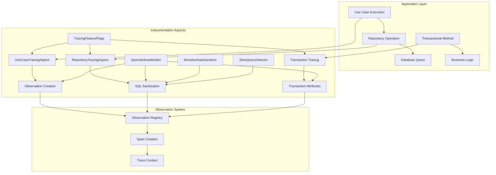
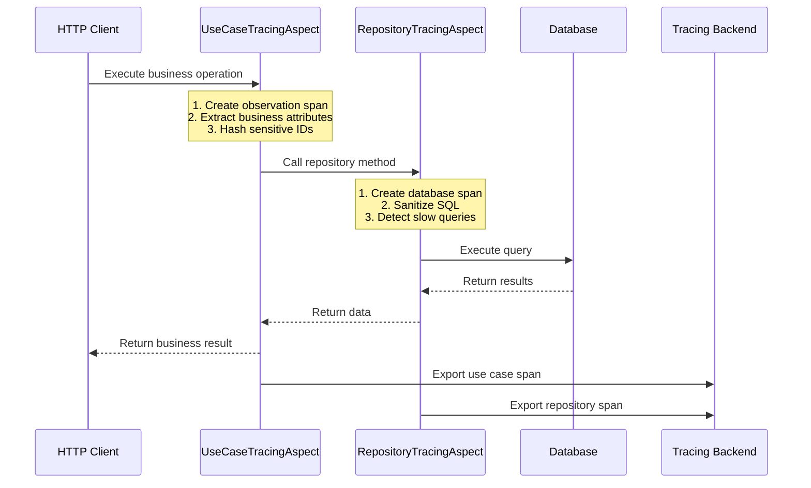

# Instrumentation Aspects Module

## Overview

The Instrumentation Aspects module provides Aspect-Oriented Programming (AOP) based instrumentation for automatic distributed tracing of key application components. This module enables non-invasive tracing of business logic (use cases) and data access operations (repositories) without modifying the core application code.

### Purpose
- **Automatic Instrumentation**: Automatically trace use case executions and repository operations
- **Business Context Capture**: Add business-specific attributes to traces (wallet IDs, transaction amounts)
- **Performance Monitoring**: Measure execution times of business operations and database queries
- **Error Tracking**: Capture and propagate errors with full context in traces
- **Privacy Compliance**: Hash sensitive identifiers while preserving trace correlation

### Key Features
- **Repository Tracing**: Automatic tracing of all JPA repository operations with SQL sanitization
- **Use Case Tracing**: Business operation tracing with intelligent attribute extraction
- **Transaction Tracing**: Spring `@Transactional` method instrumentation
- **Feature Flag Control**: Runtime enable/disable of tracing aspects
- **Sensitive Data Protection**: Automatic hashing of wallet/user IDs, sanitization of error messages
- **Performance Detection**: Slow query detection and tagging

## Architecture Overview



### Component Relationships

The instrumentation aspects integrate with the broader tracing infrastructure:

1. **Observation Registry**: Central registry for span creation and management
2. **SpanAttributeBuilder**: Standardized attribute naming following OpenTelemetry conventions
3. **TracingFeatureFlags**: Runtime control over which aspects are active
4. **SensitiveDataSanitizer**: Protection of sensitive data in traces
5. **SlowQueryDetector**: Performance monitoring for database operations

## Core Components

### 1. RepositoryTracingAspect
**Purpose**: Automatically traces all JPA repository operations with detailed database context.

**Key Capabilities**:
- Intercepts all public methods in repository interfaces
- Captures database system, operation type, and SQL patterns
- Sanitizes SQL statements to remove sensitive data
- Detects and tags slow queries
- Integrates with Spring `@Transactional` annotations

**Span Attributes Captured**:
- `db.system`: Database type (PostgreSQL, H2, etc.)
- `db.operation`: Operation type (SELECT, INSERT, UPDATE, DELETE)
- `db.statement`: Sanitized SQL statement pattern
- `db.sql.table`: Primary table involved
- `repository.class`: Repository interface name
- `repository.method`: Repository method name
- `status`: Success/error status
- `error.type`: Exception class (if error occurs)

**Configuration**:
```yaml
tracing:
  features:
    database: true  # Enable/disable repository tracing
```

**Detailed Documentation**: See [RepositoryTracingAspect](repository_tracing_aspect.md) for comprehensive implementation details, data flow diagrams, and integration examples.

### 2. UseCaseTracingAspect
**Purpose**: Automatically traces business use case executions with business context.

**Key Capabilities**:
- Intercepts all public methods in classes ending with "UseCase"
- Extracts business identifiers from method parameters
- Hashes sensitive identifiers (wallet/user IDs) for privacy
- Includes safe identifiers (transaction IDs) as-is
- Derives business operation names from class names
- Sanitizes error messages to remove sensitive data

**Span Attributes Captured**:
- `usecase.class`: Use case class name
- `usecase.method`: Method name
- `wallet.operation`: Business operation in snake_case
- `transaction.id`: Transaction ID (included as-is)
- `wallet.id.hash`: Hashed wallet ID (SHA-256, truncated)
- `user.id.hash`: Hashed user ID (SHA-256, truncated)
- `transaction.amount`: Transaction amount
- `wallet.currency`: Currency code
- `error.type`: Exception class (if error occurs)
- `error.message`: Sanitized error message
- `error.stack`: Truncated stack trace

**Identifier Handling Policy**:
| Identifier Type | Handling | Reason |
|----------------|----------|--------|
| Transaction ID | Included as-is | Technical identifier, needed for correlation |
| Saga ID | Included as-is | Technical identifier, needed for correlation |
| Event Type | Included as-is | Business metadata, low sensitivity |
| Wallet ID | SHA-256 hashed | User-related, requires privacy protection |
| User ID | SHA-256 hashed | User-related, requires privacy protection |

**Configuration**:
```yaml
tracing:
  features:
    use-case: true  # Enable/disable use case tracing
```

**Detailed Documentation**: See [UseCaseTracingAspect](use_case_tracing_aspect.md) for comprehensive implementation details, privacy handling, and integration patterns.

## Data Flow



## Integration Points

### With Domain Layer
- **Use Cases**: Automatic instrumentation of all business operations
- **Repositories**: Automatic instrumentation of all data access operations
- **Transactions**: Tracing of Spring `@Transactional` method executions

### With Infrastructure Layer
- **Database**: SQL statement capture and sanitization
- **Observation Registry**: Integration with Micrometer Observation API
- **Feature Flags**: Runtime control via `TracingFeatureFlags`

### With Security Layer
- **Sensitive Data Protection**: Hashing of wallet/user IDs
- **Error Message Sanitization**: Removal of sensitive data from exceptions
- **SQL Sanitization**: Protection of database query parameters

## Performance Characteristics

| Operation | Overhead | Notes |
|-----------|----------|-------|
| Use Case Span Creation | 1-2ms | Includes attribute extraction and ID hashing |
| Repository Span Creation | 1-2ms | Includes SQL sanitization and operation detection |
| SQL Sanitization | 0.5-2ms | Per query, depends on query complexity |
| ID Hashing (SHA-256) | <0.1ms | Per identifier, thread-local digest reuse |
| Slow Query Detection | <0.01ms | Simple duration comparison |
| Feature Flag Check | <0.001ms | In-memory boolean check |

**Total Overhead**: 2-4ms per use case execution (including repository calls)

## Configuration Examples

### Basic Configuration
```yaml
# application.yml
tracing:
  features:
    database: true      # Enable repository tracing
    use-case: true      # Enable use case tracing
```

### Conditional Activation
```java
// Aspects are conditionally registered based on properties
@ConditionalOnProperty(value = "tracing.features.database", havingValue = "true", matchIfMissing = true)
public class RepositoryTracingAspect { ... }

@ConditionalOnProperty(value = "tracing.features.use-case", havingValue = "true", matchIfMissing = true)
public class UseCaseTracingAspect { ... }
```

### Custom Pointcuts
```java
// Repository tracing pointcut
@Around("execution(public * dev.bloco.wallet.hub.infra.provider.data.repository.*Repository.*(..))")

// Use case tracing pointcut  
@Around("execution(public * dev.bloco.wallet.hub.usecase.*UseCase.*(..))")

// Transaction tracing pointcut
@Around("@annotation(org.springframework.transaction.annotation.Transactional) || " +
        "@within(org.springframework.transaction.annotation.Transactional)")
```

## Usage Examples

### Repository Tracing Example
```java
@Repository
public interface WalletRepository extends JpaRepository<WalletEntity, UUID> {
    // Automatically traced by RepositoryTracingAspect
    Optional<WalletEntity> findByUserId(UUID userId);
    
    // Span attributes:
    // - db.system: "h2" (or actual database)
    // - db.operation: "SELECT"
    // - db.statement: "SELECT ... WHERE user_id = ?"
    // - repository.class: "WalletRepository"
    // - repository.method: "findByUserId"
}
```

### Use Case Tracing Example
```java
@Component
public class AddFundsUseCase {
    // Automatically traced by UseCaseTracingAspect
    public TransactionResult execute(String walletId, BigDecimal amount, String currency) {
        // Span attributes:
        // - usecase.class: "AddFundsUseCase"
        // - usecase.method: "execute"
        // - wallet.operation: "add_funds"
        // - wallet.id.hash: "a3f5b1c2d4e6f7g8" (hashed)
        // - transaction.amount: "100.00"
        // - wallet.currency: "USD"
    }
}
```

### Transaction Tracing Example
```java
@Service
public class WalletService {
    @Transactional
    public void transferFunds(String fromWalletId, String toWalletId, BigDecimal amount) {
        // Automatically traced by RepositoryTracingAspect transaction support
        // Span attributes:
        // - transaction.class: "WalletService"
        // - transaction.method: "transferFunds"
        // - tx.isolation_level: "DEFAULT"
        // - tx.propagation: "REQUIRED"
        // - tx.read_only: "false"
        // - tx.status: "COMMITTED" or "ROLLED_BACK"
    }
}
```

## Error Handling

### Exception Propagation
Both aspects properly propagate exceptions:
1. **RuntimeException/Error**: Re-thrown directly
2. **Checked exceptions**: Wrapped in RuntimeException to preserve AOP contract
3. **Error attributes**: Added to span before re-throwing

### Error Attribute Examples
```json
{
  "error": "true",
  "error.type": "InsufficientFundsException",
  "error.message": "Wallet ***-WALLET-ID-*** has insufficient balance",
  "error.stack": "InsufficientFundsException: Wallet ***-WALLET-ID-*** ..."
}
```

## Best Practices

### Development
1. **Name use cases consistently**: Use `*UseCase` suffix for automatic instrumentation
2. **Follow repository naming conventions**: Use `*Repository` suffix for automatic instrumentation
3. **Use meaningful method names**: Method names are used to derive operation types
4. **Test with tracing enabled**: Ensure no sensitive data leaks in traces

### Production
1. **Monitor overhead**: Use feature flags to disable non-critical tracing if needed
2. **Review trace data**: Regularly check for sensitive data in traces
3. **Adjust sampling**: Use sampling configuration to control volume
4. **Enable both aspects**: For complete business workflow visibility

### Troubleshooting
1. **Missing traces**: Check feature flags and pointcut expressions
2. **Missing attributes**: Verify method parameter names are available at runtime
3. **High overhead**: Consider disabling SQL sanitization for non-sensitive environments
4. **ID hashing issues**: Check SHA-256 algorithm availability

## Security Considerations

### Data Protection
- **Wallet/User IDs**: Always hashed using SHA-256 with truncation
- **SQL Statements**: Sanitized to remove literal values
- **Error Messages**: Sanitized to remove sensitive data
- **Stack Traces**: Limited to first 10 lines

### Privacy Compliance
- **Trace correlation**: Maintained via hashed IDs within same trace
- **Cross-trace tracking**: Prevented by hashing
- **Data minimization**: Only essential attributes included
- **Retention control**: Managed by tracing backend

## Related Documentation

### Sub-module Documentation
- [RepositoryTracingAspect](repository_tracing_aspect.md) - Detailed documentation of repository instrumentation
- [UseCaseTracingAspect](use_case_tracing_aspect.md) - Detailed documentation of use case instrumentation

### Parent Module Documentation
- [Infrastructure Tracing](infrastructure_tracing.md) - Overall tracing architecture and integration

### Supporting Modules
- [Core Configuration](core_configuration.md) - Tracing configuration and feature flags
- [Sampling System](sampling_system.md) - Intelligent sampling strategies
- [Filters & Decorators](filters_decorators.md) - Data sanitization components

### Application Layer Documentation
- [Domain Models](domain_models.md) - Business entities being traced
- [Use Cases](use_cases.md) - Business operations being instrumented
- [Domain Repositories](domain_repositories.md) - Repository interfaces being traced

## Future Enhancements

### Planned Improvements
1. **Custom attribute extraction**: Allow custom extractors for complex parameters
2. **Method-level feature flags**: Enable/disable tracing per method
3. **Async support**: Better support for reactive and async use cases
4. **Custom pointcut expressions**: Allow configuration of pointcuts via properties

### Performance Optimizations
1. **Attribute caching**: Cache derived attributes for repeated method calls
2. **Lazy attribute evaluation**: Defer expensive attribute extraction
3. **Batch span creation**: Optimize for high-volume operations
4. **Selective instrumentation**: Instrument only specific packages/classes