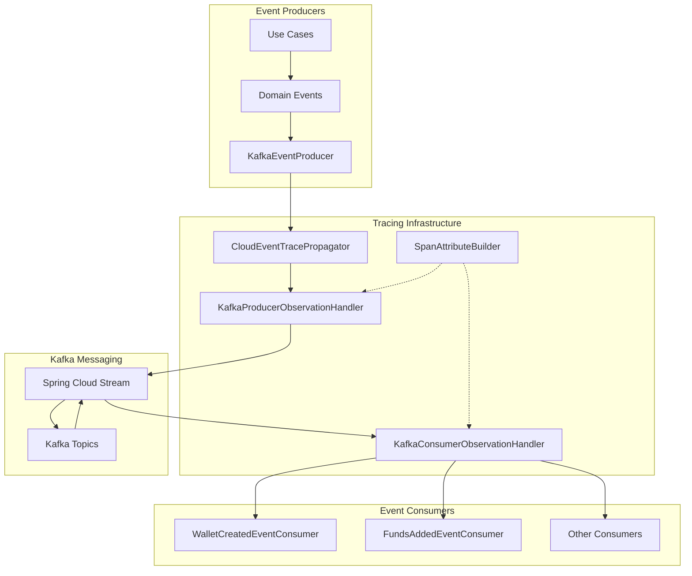
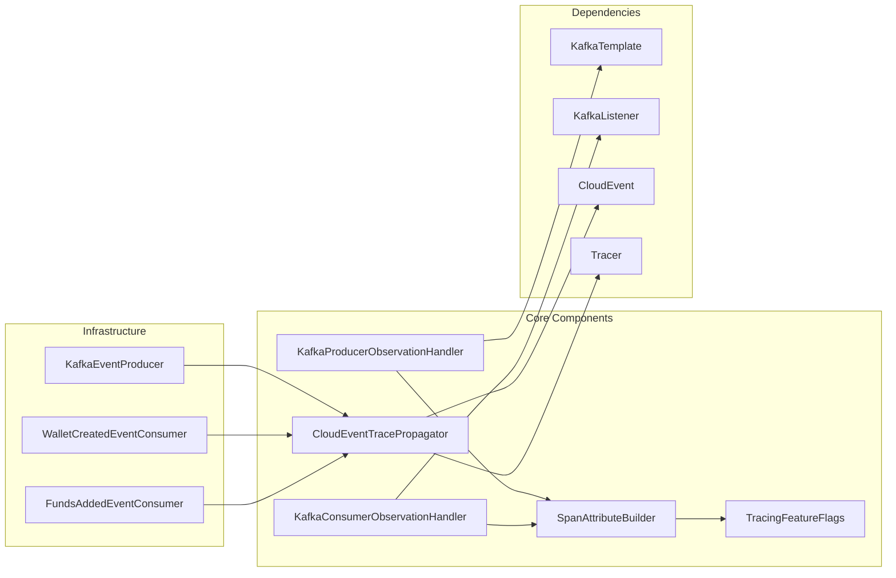
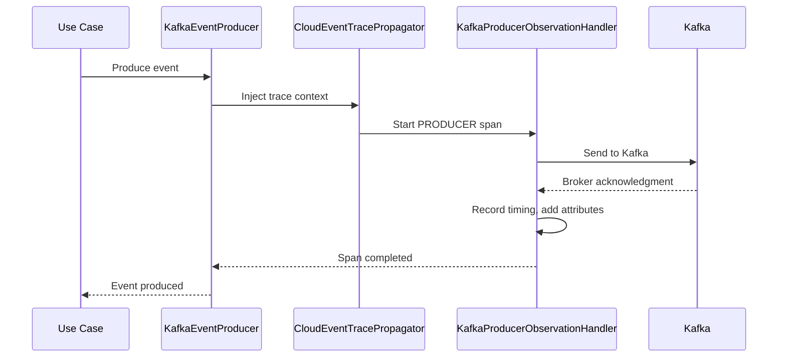
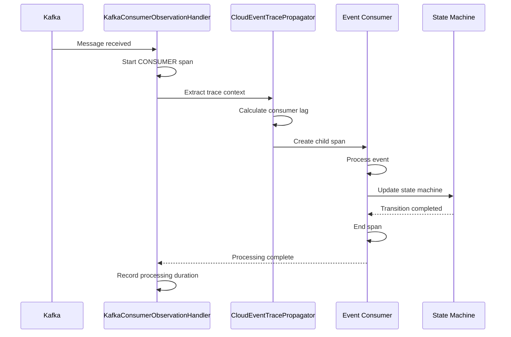

# Messaging Tracing Module

## Overview

The Messaging Tracing module provides comprehensive distributed tracing instrumentation for Kafka-based event-driven communication within the Wallet Hub system. This module enables end-to-end visibility across event producers and consumers, ensuring trace continuity across asynchronous boundaries and providing critical observability for event-driven workflows.

### Purpose

The primary purpose of this module is to:
1. **Instrument Kafka messaging** with OpenTelemetry-compliant spans
2. **Propagate trace context** across event boundaries using CloudEvents extensions
3. **Measure consumer lag** and processing latency for performance monitoring
4. **Maintain trace continuity** across event cascades and saga workflows
5. **Provide business context** by correlating events with wallet operations

### Key Features

- **W3C Trace Context Propagation**: Seamless trace context injection/extraction via CloudEvent extensions
- **Consumer Lag Tracking**: Automatic calculation of time between event production and consumption
- **Event Cascade Tracing**: Parent-child span relationships across event chains
- **Performance Monitoring**: Serialization/deserialization timing, processing duration
- **Error Tracking**: Failed message processing with exception details
- **Feature Flag Control**: Configurable tracing per component via `TracingFeatureFlags`

## Architecture

### High-Level Architecture



### Component Relationships



## Core Components

### 1. KafkaProducerObservationHandler

**Purpose**: Instruments Kafka event publishing with PRODUCER spans, capturing message serialization timing, broker acknowledgment timing, and trace context injection.

**Key Responsibilities**:
- Creates PRODUCER spans for Kafka send operations
- Records serialization duration and broker acknowledgment timing
- Adds topic, partition, and offset information to spans
- Marks spans as successful/failed based on send outcome

**Configuration**: Controlled by `tracing.features.kafka` flag (default: true)

**See detailed documentation**: [KafkaProducerObservationHandler.md](KafkaProducerObservationHandler.md)

### 2. KafkaConsumerObservationHandler

**Purpose**: Instruments Kafka event consumption with CONSUMER spans, capturing message reception timing, consumer lag calculation, and trace context extraction.

**Key Responsibilities**:
- Creates CONSUMER spans for Kafka receive operations
- Calculates consumer lag using CloudEvent send timestamps
- Extracts trace context from CloudEvent extensions
- Records deserialization and processing duration
- Maintains parent-child span relationships across event boundaries

**Configuration**: Controlled by `tracing.features.kafka` flag (default: true)

**See detailed documentation**: [KafkaConsumerObservationHandler.md](KafkaConsumerObservationHandler.md)

### 3. CloudEventTracePropagator

**Purpose**: Manages W3C Trace Context propagation through CloudEvent extensions, enabling trace continuity across event producers and consumers.

**Key Responsibilities**:
- Injects trace context into CloudEvents before publishing
- Extracts trace context from CloudEvents during consumption
- Calculates consumer lag using send/receive timestamps
- Creates child spans that continue producer traces

**Integration**: Works with `KafkaEventProducer` and event consumer functions

**See detailed documentation**: [CloudEventTracePropagator.md](CloudEventTracePropagator.md)

### 4. SpanAttributeBuilder

**Purpose**: Provides standardized attribute building for messaging spans following OpenTelemetry semantic conventions.

**Key Responsibilities**:
- Defines semantic attribute constants for messaging operations
- Sanitizes sensitive data in span attributes
- Truncates long attribute values to prevent storage issues
- Provides builder methods for consistent attribute creation

**Integration**: Used by both producer and consumer observation handlers

**See detailed documentation**: [SpanAttributeBuilder.md](SpanAttributeBuilder.md)

## Data Flow

### Event Production Flow



### Event Consumption Flow



## Configuration

### Feature Flags

Messaging tracing is controlled by the `tracing.features.kafka` property:

```yaml
tracing:
  features:
    kafka: true  # Enable/disable Kafka tracing
```

### Spring Boot Auto-configuration

The module uses Spring Boot's conditional configuration:

```java
@ConditionalOnClass(KafkaTemplate.class)  // Only register if Kafka is in classpath
@ConditionalOnProperty(value = "tracing.features.kafka", havingValue = "true", matchIfMissing = true)
```

### Span Attributes

Following OpenTelemetry semantic conventions for messaging:

| Attribute | Description | Example |
|-----------|-------------|---------|
| `messaging.system` | Message broker | `kafka` |
| `messaging.operation` | Operation type | `publish`, `receive`, `process` |
| `messaging.destination.name` | Topic name | `wallet-events` |
| `messaging.destination.kind` | Destination type | `topic` |
| `messaging.kafka.partition` | Partition number | `0` |
| `messaging.kafka.offset` | Message offset | `42` |
| `messaging.kafka.consumer.group` | Consumer group ID | `wallet-service` |
| `messaging.consumer_lag_ms` | Time from send to receive | `125` |
| `messaging.message.id` | CloudEvent ID | `evt-123` |

## Integration Points

### With Event Infrastructure

The messaging tracing module integrates with:

1. **KafkaEventProducer**: Uses `CloudEventTracePropagator` to inject trace context
2. **Event Consumers**: Use `CloudEventTracePropagator` to extract trace context
3. **Outbox Pattern**: Trace context persists through outbox storage and retrieval
4. **State Machine**: Saga workflows maintain trace correlation via correlation IDs

### With Other Tracing Modules

- **Database Tracing**: Events may trigger database operations with their own spans
- **Use Case Tracing**: Business operations that produce events have parent spans
- **State Machine Tracing**: Event processing triggers state transitions with spans
- **HTTP Tracing**: API calls that result in events maintain trace continuity

## Performance Considerations

### Overhead Estimates

| Operation | Estimated Overhead | Notes |
|-----------|-------------------|-------|
| Producer span creation | < 0.5ms | Mostly attribute setting |
| Consumer span creation | < 0.5ms | Includes trace context extraction |
| Consumer lag calculation | < 0.1ms | Simple timestamp subtraction |
| Trace context injection | < 0.2ms | CloudEvent extension addition |
| Trace context extraction | < 0.3ms | W3C format parsing |

### Optimization Guidelines

1. **High-throughput systems**: Consider sampling for non-critical events
2. **Memory usage**: Span attributes are truncated to 1024 characters
3. **Async export**: Spans are exported asynchronously to minimize impact
4. **Feature flags**: Disable tracing for specific components if needed

## Troubleshooting

### Common Issues

1. **Missing trace context**: Ensure `CloudEventTracePropagator` is properly configured
2. **No consumer lag**: Verify producers include `sendtimestamp` extension
3. **Span not created**: Check `tracing.features.kafka` configuration
4. **Trace discontinuity**: Ensure event consumers properly extract and end spans

### Monitoring Metrics

Key metrics to monitor:
- `messaging.consumer_lag_ms`: Should be < 1000ms for real-time systems
- `messaging.processing_time_ms`: Should be < 500ms for most events
- `messaging.kafka.deserialization_time_ms`: Should be < 50ms
- Error rate: Should be < 1% of total messages

## Related Documentation

- [Tracing Configuration](../infrastructure_tracing/core_configuration.md)
- [Event Infrastructure](../infrastructure_events/README.md)
- [Domain Events](../domain_events/README.md)
- [Use Case Tracing](../infrastructure_tracing/instrumentation_aspects/use_case_tracing_aspect.md)