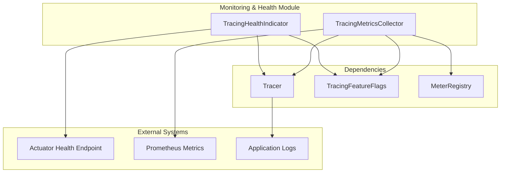

# Monitoring & Health Module

## Overview

The Monitoring & Health module provides comprehensive observability and health monitoring capabilities for the Wallet Hub's distributed tracing infrastructure. This module ensures that tracing operations are functioning correctly and provides real-time metrics for operational monitoring.

## Architecture

The Monitoring & Health module consists of two main components that work together to provide observability:



## Components

### 1. TracingHealthIndicator

The `TracingHealthIndicator` provides health status information for the distributed tracing infrastructure through Spring Boot Actuator's health endpoint.

**Key Responsibilities:**
- Verifies tracer availability and functionality
- Monitors feature flag states
- Tests span creation capability
- Provides detailed health status information

**Health Status Levels:**
- **UP**: Tracing fully functional
- **DOWN**: Tracer unavailable or non-functional  
- **UNKNOWN**: Unable to determine tracing state

**Exposed Health Details:**
```json
{
  "status": "UP",
  "details": {
    "tracer.available": true,
    "tracer.type": "BraveTracer",
    "features.database": true,
    "features.kafka": true,
    "features.stateMachine": true,
    "features.externalApi": true,
    "features.reactive": true,
    "features.useCase": true,
    "span.creation.test": "success"
  }
}
```

For detailed implementation, see [TracingHealthIndicator Documentation](TracingHealthIndicator.md).

### 2. TracingMetricsCollector

The `TracingMetricsCollector` collects and exposes distributed tracing metrics via Micrometer for monitoring and alerting.

**Key Responsibilities:**
- Tracks span creation, export, and drop rates
- Monitors feature flag states as gauges
- Records feature flag change events
- Provides metrics for operational monitoring

**Exposed Metrics:**
| Metric Name | Type | Description | Tags |
|-------------|------|-------------|------|
| `tracing.spans.created` | Counter | Total spans created | - |
| `tracing.spans.exported` | Counter | Total spans exported | - |
| `tracing.spans.dropped` | Counter | Total spans dropped | - |
| `tracing.feature.flags.changes` | Counter | Feature flag change events | - |
| `tracing.feature.flags.state` | Gauge | Current feature flag state | `feature`, `state` |

**Prometheus Query Examples:**
```promql
# Total spans created per minute
rate(tracing_spans_created_total[1m])

# Feature flag state
tracing_feature_flags_state{feature="database"}

# Span export success rate
rate(tracing_spans_exported_total[5m]) / rate(tracing_spans_created_total[5m])
```

For detailed implementation, see [TracingMetricsCollector Documentation](TracingMetricsCollector.md).

## Integration Points

### Spring Boot Actuator Integration

The module integrates with Spring Boot Actuator to provide health and metrics endpoints:

```yaml
# application.yml
management:
  endpoints:
    web:
      exposure:
        include: health,metrics,prometheus
  health:
    tracing:
      enabled: true
```

**Available Endpoints:**
- `GET /actuator/health/tracing` - Tracing health status
- `GET /actuator/metrics/tracing.spans.created` - Span creation metrics
- `GET /actuator/prometheus` - Prometheus metrics format

### Feature Flag Integration

The module integrates with the [TracingFeatureFlags](tracing_feature_flags.md) configuration to monitor tracing component states:

```java
// Feature flag monitoring example
if (featureFlags.isDatabase()) {
    // Database tracing is enabled
    metricsCollector.updateFeatureFlagStates();
}
```

### Tracer Integration

Both components integrate with the Micrometer Tracer to:
- Test span creation capability (health indicator)
- Monitor span lifecycle events (metrics collector)
- Track tracing infrastructure availability

## Configuration

### Health Indicator Configuration

```yaml
# application-tracing.yml
tracing:
  health:
    enabled: true
    span-test:
      enabled: true
      timeout: 100ms
```

### Metrics Configuration

```yaml
# application-tracing.yml
tracing:
  metrics:
    enabled: true
    export:
      prometheus: true
    buckets:
      - 0.001
      - 0.005
      - 0.01
      - 0.05
      - 0.1
      - 0.5
      - 1.0
      - 5.0
```

## Usage Examples

### Health Check Integration

```java
// Programmatic health check
Health tracingHealth = tracingHealthIndicator.health();
if (tracingHealth.getStatus() == Status.UP) {
    log.info("Tracing infrastructure is healthy");
} else {
    log.error("Tracing infrastructure issues: {}", tracingHealth.getDetails());
}
```

### Metrics Monitoring

```java
// Record custom tracing events
metricsCollector.recordSpanCreated();
metricsCollector.recordSpanExported();

// Monitor feature flag changes
metricsCollector.recordFeatureFlagChange();
```

### Alerting Configuration

```yaml
# Prometheus alert rules
groups:
  - name: tracing_alerts
    rules:
      - alert: TracingHealthDown
        expr: up{job="wallet-hub", instance="tracing"} == 0
        for: 1m
        labels:
          severity: critical
        annotations:
          summary: "Tracing infrastructure is down"
          
      - alert: HighSpanDropRate
        expr: rate(tracing_spans_dropped_total[5m]) > 0.1
        for: 2m
        labels:
          severity: warning
        annotations:
          summary: "High span drop rate detected"
```

## Dependencies

### Internal Dependencies
- [TracingFeatureFlags](tracing_feature_flags.md) - Feature flag configuration
- [TracingConfiguration](tracing_configuration.md) - Core tracing configuration
- [Core Configuration](core_configuration.md) - Base tracing infrastructure

### External Dependencies
- Spring Boot Actuator (health, metrics)
- Micrometer (metrics collection)
- Prometheus (metrics export)
- Brave/OpenTelemetry Tracer

## Monitoring Dashboard

A comprehensive monitoring dashboard should include:

1. **Health Status Panel**
   - Tracer availability
   - Feature flag states
   - Span creation test results

2. **Metrics Dashboard**
   - Span creation/export/drop rates
   - Feature flag state timeline
   - Error rates and patterns

3. **Alerting Rules**
   - Health status changes
   - High span drop rates
   - Feature flag conflicts

## Troubleshooting

### Common Issues

1. **Health Status DOWN**
   - Check tracer bean availability
   - Verify feature flag configuration
   - Test span creation manually

2. **Missing Metrics**
   - Verify Micrometer configuration
   - Check Prometheus scraping
   - Validate metric naming

3. **Feature Flag Conflicts**
   - Check configuration refresh
   - Verify @RefreshScope annotation
   - Monitor configuration changes

### Diagnostic Commands

```bash
# Check health status
curl http://localhost:8080/actuator/health/tracing

# View metrics
curl http://localhost:8080/actuator/metrics/tracing.spans.created

# Prometheus metrics
curl http://localhost:8080/actuator/prometheus | grep tracing_
```

## Performance Considerations

- Health checks add minimal overhead (<1ms per check)
- Metrics collection is asynchronous and non-blocking
- Feature flag monitoring is lightweight
- Span creation test creates minimal test spans

## Related Documentation

- [Tracing System Overview](tracing_system_overview.md) - Overall tracing architecture
- [Core Configuration](core_configuration.md) - Base tracing setup
- [TracingFeatureFlags](tracing_feature_flags.md) - Feature flag system
- [Infrastructure Tracing](infrastructure_tracing.md) - Parent module
- [TracingHealthIndicator](TracingHealthIndicator.md) - Detailed health indicator documentation
- [TracingMetricsCollector](TracingMetricsCollector.md) - Detailed metrics collector documentation