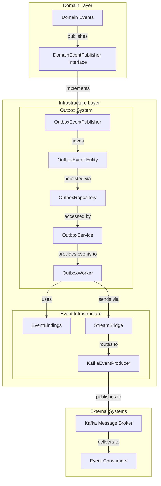
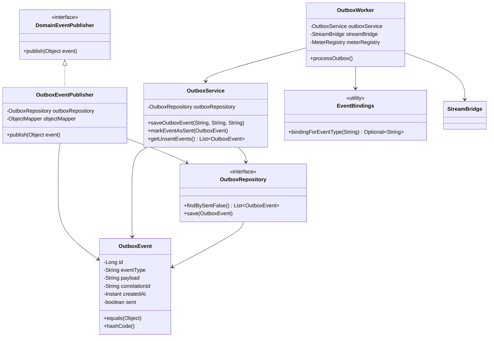
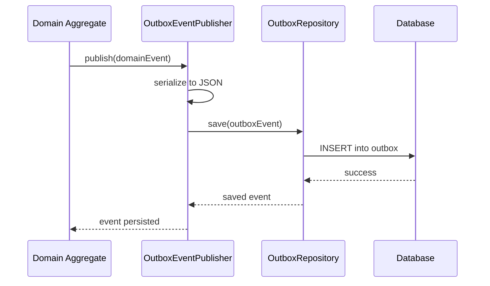
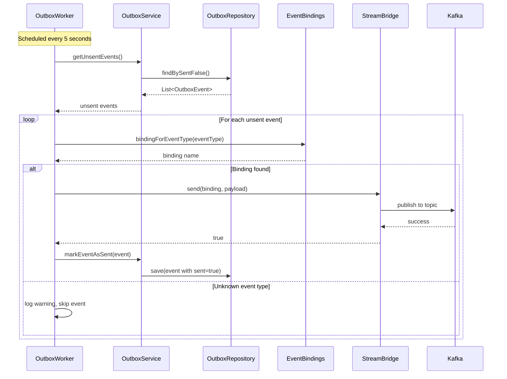

# Outbox System Module

## Overview

The Outbox System module implements the **Transactional Outbox Pattern** to ensure reliable event delivery in a distributed system. This pattern addresses the dual-write problem by decoupling database transactions from external messaging, providing eventual consistency while maintaining data integrity.

The module is part of the Wallet Hub application's infrastructure layer and serves as the backbone for asynchronous event-driven communication between different parts of the system and external services.

## Core Purpose

The primary purpose of the Outbox System is to:
1. **Ensure reliable event delivery** by persisting events in the database before attempting to send them
2. **Decouple business logic** from external messaging infrastructure
3. **Provide eventual consistency** between the application's internal state and external systems
4. **Enable retry mechanisms** for failed event deliveries
5. **Support distributed transactions** without requiring 2PC (Two-Phase Commit)

## Architecture

### High-Level Architecture



### Component Relationships



## Core Components

### 1. OutboxEvent Entity

The `OutboxEvent` class represents a persistent record of an event that needs to be processed. It serves as the data model for the outbox table in the database.

**Key Properties:**
- `id`: Auto-generated primary key
- `eventType`: Category/type of the event (e.g., "WalletCreatedEvent")
- `payload`: JSON-serialized event data
- `correlationId`: Optional identifier for tracing related operations
- `createdAt`: Timestamp when the event was created
- `sent`: Boolean flag indicating if the event has been successfully sent

**Database Configuration:**
- Table name: `outbox`
- Index: `idx_outbox_created_at` on `created_at` column
- Uses Hibernate for ORM with proper proxy handling in `equals()` and `hashCode()`

### 2. OutboxService

The `OutboxService` provides business logic for managing outbox events with transactional guarantees.

**Key Methods:**
- `saveOutboxEvent(String eventType, String payload, String correlationId)`: Persists a new event with transactional consistency
- `markEventAsSent(OutboxEvent event)`: Updates an event's status to sent
- `getUnsentEvents()`: Retrieves all events pending delivery

**Design Features:**
- All write operations are `@Transactional`
- Follows the Repository pattern for data access
- Provides a clean API for event lifecycle management

### 3. OutboxWorker

The `OutboxWorker` is a scheduled component that processes unsent events and delivers them to external systems.

**Key Responsibilities:**
- Periodically polls for unsent events (every 5 seconds)
- Maps event types to appropriate message bindings
- Sends events via Spring Cloud Stream's `StreamBridge`
- Updates event status upon successful delivery
- Provides metrics and logging for monitoring

**Scheduling Configuration:**
- Fixed rate: 5000ms (5 seconds)
- Single-threaded execution for consistency
- Error handling with retry semantics (implicit through periodic execution)

### 4. OutboxRepository

The `OutboxRepository` interface extends Spring Data JPA's `JpaRepository` to provide data access operations.

**Key Method:**
- `findBySentFalse()`: Custom query to retrieve unsent events

**Design Benefits:**
- Leverages Spring Data JPA for automatic implementation
- Provides type-safe query methods
- Integrates with Spring's transaction management

### 5. OutboxEventPublisher

The `OutboxEventPublisher` implements the `DomainEventPublisher` interface from the domain layer, bridging the gap between domain events and the outbox system.

**Key Features:**
- Serializes domain events to JSON using Jackson's `ObjectMapper`
- Stores events in the outbox table within the same transaction as business operations
- Uses event class name as the `eventType`
- Provides error handling for serialization failures

## Event Flow

### 1. Event Publishing Flow



### 2. Event Processing Flow



## Integration with Domain Events

### Event Type Mapping

The system uses a centralized mapping in `EventBindings` to associate domain event types with message bindings:

```java
// Event type to binding mapping
private static final Map<String, String> EVENT_TYPE_TO_BINDING = Map.of(
    "walletCreatedEventProducer", "walletCreatedEventProducer-out-0",
    "fundsAddedEventProducer", "fundsAddedEventProducer-out-0",
    "fundsWithdrawnEventProducer", "fundsWithdrawnEventProducer-out-0",
    "fundsTransferredEventProducer", "fundsTransferredEventProducer-out-0"
);
```

### Supported Event Types

The system currently supports the following event types (as defined in the domain events module):

1. **Wallet Events:**
   - `WalletCreatedEvent` → `walletCreatedEventProducer`
   - `WalletUpdatedEvent` → (future support)
   - `WalletDeletedEvent` → (future support)

2. **Funds Events:**
   - `FundsAddedEvent` → `fundsAddedEventProducer`
   - `FundsWithdrawnEvent` → `fundsWithdrawnEventProducer`
   - `FundsTransferredEvent` → `fundsTransferredEventProducer`

## Configuration

### Database Schema

```sql
CREATE TABLE outbox (
    id BIGINT PRIMARY KEY AUTO_INCREMENT,
    event_type VARCHAR(255) NOT NULL,
    payload TEXT NOT NULL,
    correlation_id VARCHAR(255),
    created_at TIMESTAMP NOT NULL DEFAULT CURRENT_TIMESTAMP,
    sent BOOLEAN NOT NULL DEFAULT FALSE
);

CREATE INDEX idx_outbox_created_at ON outbox(created_at);
```

### Spring Configuration

The outbox system requires the following Spring configurations:

1. **Transaction Management:** Enabled via `@Transactional` annotations
2. **Scheduling:** Enabled via `@EnableScheduling` in the main application
3. **Spring Cloud Stream:** Configured for Kafka bindings
4. **Jackson ObjectMapper:** For JSON serialization

### Application Properties

```yaml
spring:
  cloud:
    stream:
      bindings:
        walletCreatedEventProducer-out-0:
          destination: wallet-created-events
        fundsAddedEventProducer-out-0:
          destination: funds-added-events
        fundsWithdrawnEventProducer-out-0:
          destination: funds-withdrawn-events
        fundsTransferredEventProducer-out-0:
          destination: funds-transferred-events
      
      kafka:
        binder:
          brokers: ${KAFKA_BROKERS:localhost:9092}
```

## Error Handling and Resilience

### Failure Scenarios

1. **Event Serialization Failure:**
   - Occurs when domain events cannot be serialized to JSON
   - Results in `RuntimeException` being thrown
   - Prevents corrupted data from being stored

2. **Unknown Event Types:**
   - When `EventBindings` has no mapping for an event type
   - Event is skipped with a warning log
   - Metrics are recorded for monitoring

3. **Message Delivery Failure:**
   - When `StreamBridge.send()` returns `false`
   - Event remains unsent for retry in next cycle
   - Warning logged and metrics recorded

4. **Database Connection Issues:**
   - Transactional boundaries ensure consistency
   - Events are not marked as sent unless successfully persisted

### Retry Mechanism

The system implements an implicit retry mechanism through:
- Periodic polling of unsent events
- Events remain in "unsent" state until successfully delivered
- No manual intervention required for transient failures

### Monitoring and Metrics

The system provides comprehensive monitoring through:

1. **Micrometer Metrics:**
   - `outbox.sent`: Count of successfully sent events
   - `outbox.send.failed`: Count of failed delivery attempts
   - `outbox.unknown.type`: Count of events with unknown types

2. **Logging:**
   - INFO level for normal operations
   - WARN level for skipped events and delivery failures
   - ERROR level for serialization failures

3. **Database Monitoring:**
   - `outbox` table size and growth rate
   - Average time between creation and sending
   - Ratio of sent vs unsent events

## Performance Considerations

### Batch Processing

The `OutboxWorker` processes events in batches during each scheduled execution:
- Fetches all unsent events in a single query
- Processes each event sequentially
- Minimizes database round-trips

### Index Optimization

The `idx_outbox_created_at` index supports:
- Efficient querying of recent events
- Time-based cleanup of old events
- Performance monitoring by creation time

### Memory Management

- Events are processed one at a time to control memory usage
- JSON payloads are streamed directly from database to message broker
- No in-memory buffering of large event batches

## Scalability

### Horizontal Scaling

The outbox system supports horizontal scaling through:

1. **Database-Level Coordination:**
   - Multiple worker instances can run concurrently
   - Database transactions prevent duplicate processing
   - `SELECT ... FOR UPDATE SKIP LOCKED` pattern (potential enhancement)

2. **Partitioning Strategies:**
   - Events can be partitioned by `correlationId` or `eventType`
   - Multiple Kafka topics for different event categories
   - Consumer group partitioning for load distribution

### Throughput Optimization

For high-throughput scenarios, consider:
1. Increasing the polling frequency (adjust `fixedRate` parameter)
2. Implementing parallel processing within the worker
3. Using database-specific optimizations (e.g., PostgreSQL advisory locks)

## Best Practices

### 1. Event Design
- Keep event payloads small and focused
- Use correlation IDs for tracing related operations
- Version event schemas for backward compatibility

### 2. Error Handling
- Implement dead-letter queues for permanently failed events
- Set up alerts for sustained delivery failures
- Monitor event age to detect processing delays

### 3. Maintenance
- Regularly archive or delete old sent events
- Monitor database table growth
- Review and update event type mappings as needed

### 4. Testing
- Unit test event serialization/deserialization
- Integration test the complete publish-process cycle
- Load test under expected production volumes

## Related Modules

### Domain Events Module
The outbox system integrates with the [domain_events](domain_events.md) module, which defines the business events that trigger outbox operations. Domain events are serialized and stored in the outbox table for reliable delivery.

### Infrastructure Events Module
The [infrastructure_events](infrastructure_events.md) module contains the event consumers that process messages delivered by the outbox system, as well as the `EventBindings` utility that maps event types to message bindings.

### Repository Layer
The [repository_layer](repository_layer.md) module provides the data access patterns used by the `OutboxRepository` and other JPA-based repositories in the system.

### Infrastructure Data Module
The [infrastructure_data](infrastructure_data.md) module is the parent module that contains the outbox system along with other data persistence components like repository implementations and state management.

## Future Enhancements

### Planned Improvements

1. **Priority Queuing:** Support for event priority levels
2. **Dead Letter Queue:** Handling of permanently undeliverable events
3. **Dynamic Binding Discovery:** Automatic mapping of event types to bindings
4. **Batch Processing:** Optimized bulk event delivery
5. **Event Schema Registry:** Centralized management of event schemas

### Integration Opportunities

1. **Saga Pattern:** Enhanced support for distributed transactions
2. **Event Sourcing:** Integration with event-sourced aggregates
3. **CQRS:** Support for command-query responsibility segregation
4. **Analytics Pipeline:** Direct streaming to data warehouses

## Conclusion

The Outbox System module provides a robust, reliable foundation for event-driven communication in the Wallet Hub application. By implementing the Transactional Outbox Pattern, it ensures data consistency while enabling scalable, asynchronous processing of domain events.

The system's design emphasizes:
- **Reliability:** Guaranteed event delivery through persistence
- **Decoupling:** Separation of business logic from messaging infrastructure
- **Observability:** Comprehensive monitoring and metrics
- **Maintainability:** Clean separation of concerns and clear interfaces

As the application evolves, the outbox system provides a flexible foundation for implementing more advanced patterns like Event Sourcing, CQRS, and complex saga orchestrations.