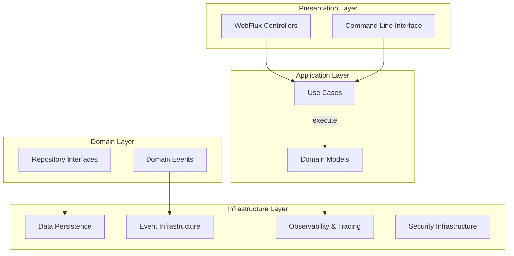
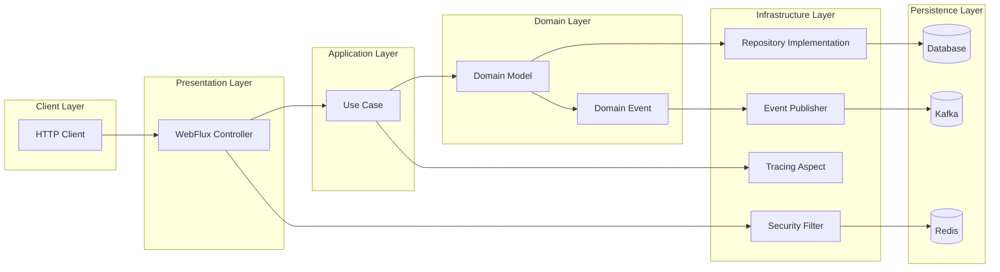
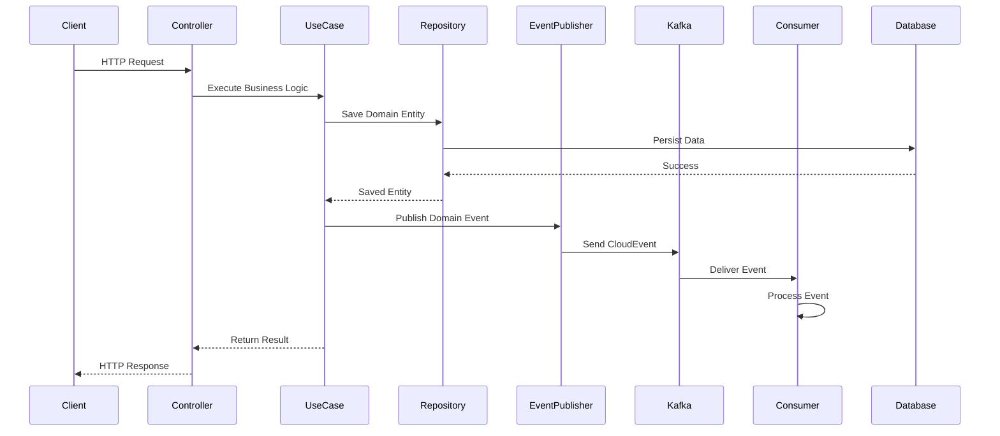
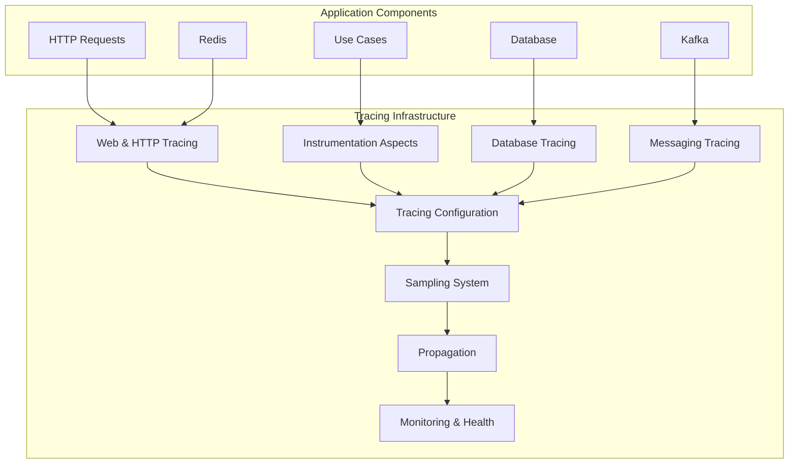

# Wallet-Java Repository Overview

## Purpose
The `wallet-java` repository is a comprehensive cryptocurrency wallet management system built with Java and Spring Boot. It provides a secure, scalable, and observable platform for managing digital wallets, handling cryptocurrency transactions, and ensuring secure operations through a domain-driven design architecture. The system supports multiple blockchain networks, token management, user authentication, and integrates with Hardware Security Modules (HSM) for secure key management.

## End-to-End Architecture

### Overall System Architecture

### Data Flow Architecture

### Event-Driven Architecture

### Distributed Tracing Architecture

## Core Modules Documentation

### 1. Application Module (`application`)
**Path**: `src/main/java/dev/bloco/wallet/hub`
- **Purpose**: Main entry point and configuration module
- **Key Components**: 
  - `WalletHubApplication`: Main Spring Boot application class
  - `DinamoLibraryLoader`: HSM native library loader
  - `ReactiveContextConfig`: Reactive context propagation for distributed tracing
  - `UseCaseConfig`: Use case bean configuration
- **Documentation**: [application.md](application.md)

### 2. Domain Models (`domain_models`)
**Path**: `src/main/java/dev/bloco/wallet/hub/domain/model`
- **Purpose**: Core business entities representing the domain
- **Key Components**:
  - `Wallet`: Cryptocurrency wallet with balance and addresses
  - `User`: System user with authentication and profile management
  - `Transaction`: Financial transactions between wallets
  - `Address`: Blockchain addresses associated with wallets
  - `Token`: Cryptocurrency tokens and their metadata
- **Documentation**: [domain_models.md](domain_models.md)

### 3. Domain Events (`domain_events`)
**Path**: `src/main/java/dev/bloco/wallet/hub/domain/event`
- **Purpose**: Domain events representing state changes
- **Key Components**:
  - `WalletCreatedEvent`, `WalletUpdatedEvent`: Wallet lifecycle events
  - `FundsAddedEvent`, `FundsWithdrawnEvent`: Financial operation events
  - `UserAuthenticatedEvent`, `UserCreatedEvent`: User management events
  - `TransactionConfirmedEvent`: Transaction status events
- **Documentation**: [domain_events.md](domain_events.md)

### 4. Domain Repositories (`domain_repositories`)
**Path**: `src/main/java/dev/bloco/wallet/hub/domain/gateway`
- **Purpose**: Repository interfaces defining data access contracts
- **Key Components**:
  - `WalletRepository`, `UserRepository`: Core entity repositories
  - `TransactionRepository`, `AddressRepository`: Transaction and address management
  - `TokenRepository`, `NetworkRepository`: Token and network data access
- **Documentation**: [domain_repositories.md](domain_repositories.md)

### 5. Infrastructure Data (`infrastructure_data`)
**Path**: `src/main/java/dev/bloco/wallet/hub/infra/provider/data`
- **Purpose**: Data persistence implementation
- **Key Components**:
  - JPA Entities: Database entity mappings
  - Repository Implementations: Spring Data JPA implementations
  - Mappers: Domain-entity conversion
  - Outbox Pattern: Reliable event publishing
- **Documentation**: [infrastructure_data.md](infrastructure_data.md)

### 6. Infrastructure Events (`infrastructure_events`)
**Path**: `src/main/java/dev/bloco/wallet/hub/infra/adapter/event`
- **Purpose**: Event infrastructure implementation
- **Key Components**:
  - `KafkaEventProducer`: Event publishing to Kafka
  - `Event Consumers`: Event processing from Kafka
  - Outbox Pattern: Reliable event delivery
- **Documentation**: [infrastructure_events.md](infrastructure_events.md)

### 7. Infrastructure Tracing (`infrastructure_tracing`)
**Path**: `src/main/java/dev/bloco/wallet/hub/infra/adapter/tracing`
- **Purpose**: Comprehensive observability system
- **Key Components**:
  - `TracingConfiguration`: Central tracing configuration
  - `UseCaseTracingAspect`: AOP-based use case instrumentation
  - `SamplingSystem`: Intelligent trace sampling
  - `Propagation`: Distributed trace context propagation
- **Documentation**: [infrastructure_tracing.md](infrastructure_tracing.md)

### 8. Infrastructure Security (`infrastructure_security`)
**Path**: `src/main/java/dev/bloco/wallet/hub/infra/adapter/security`
- **Purpose**: Security infrastructure
- **Key Components**:
  - `SecurityConfig`: Spring Security configuration
  - `RedisAuthConfig`: Redis-based authentication
- **Documentation**: [infrastructure_security.md](infrastructure_security.md)

### 9. Use Cases (`use_cases`)
**Path**: `src/main/java/dev/bloco/wallet/hub/usecase`
- **Purpose**: Business operation implementations
- **Key Components**:
  - `ValidateAddressUseCase`: Address format validation
  - Wallet Management: Create, update, delete wallets
  - Transaction Processing: Fund transfers, deposits, withdrawals
  - User Management: Authentication, profile updates
- **Documentation**: [use_cases.md](use_cases.md)

### 10. Infrastructure Utilities (`infrastructure_utils`)
**Path**: `src/main/java/dev/bloco/wallet/hub/infra/util`
- **Purpose**: Utility components
- **Key Components**:
  - `CloudEventUtils`: CloudEvent format utilities
- **Documentation**: [infrastructure_utils.md](infrastructure_utils.md)

## Key Features
- **Multi-Network Support**: Support for various blockchain networks
- **Event-Driven Architecture**: Asynchronous event processing with Kafka
- **Distributed Tracing**: Comprehensive observability with multi-backend tracing
- **Security**: Hardware Security Module (HSM) integration for key management
- **Reactive Programming**: Non-blocking, asynchronous operations using Project Reactor
- **Domain-Driven Design**: Rich domain models with business logic encapsulation

## Technology Stack
- **Java 17+**: Core programming language
- **Spring Boot 3**: Application framework
- **Spring WebFlux**: Reactive web framework
- **Spring Data JPA**: Data persistence
- **Kafka**: Event streaming
- **PostgreSQL**: Primary database
- **Redis**: Caching and session management
- **Micrometer Tracing**: Distributed tracing
- **OpenTelemetry**: Observability standards
- **CloudEvents**: Event format specification

## Deployment Requirements
- Java 17 or higher
- PostgreSQL database
- Redis for caching and sessions
- Kafka for event streaming
- Tempo or Zipkin for tracing (optional)
- Hardware Security Module (optional for production)

The repository follows Clean Architecture principles with clear separation between domain logic, application logic, and infrastructure concerns, making it maintainable, testable, and scalable for enterprise cryptocurrency wallet management.