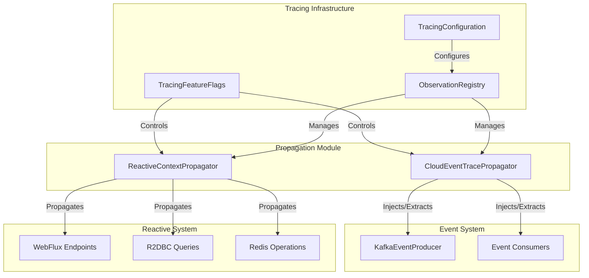
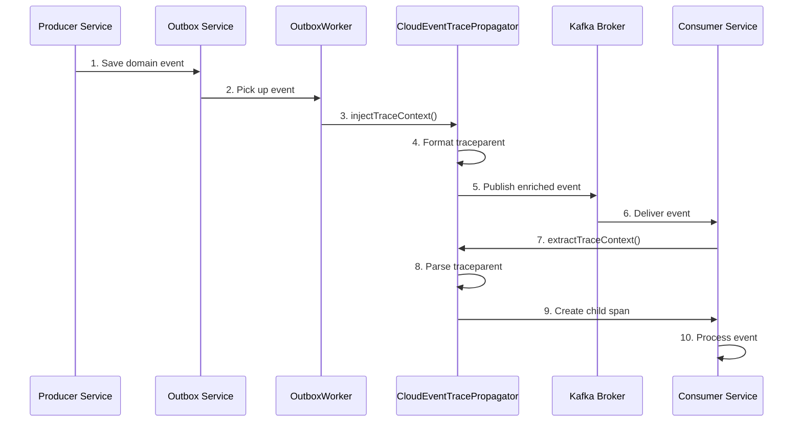
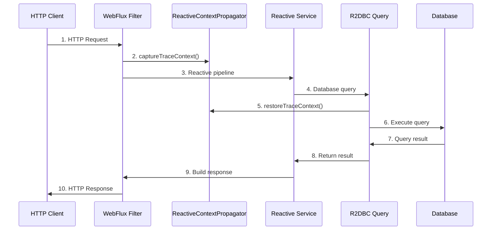

# Propagation Module

## Overview

The Propagation module is responsible for distributed trace context propagation across different communication boundaries in the Wallet Hub application. It ensures end-to-end trace continuity across synchronous HTTP calls, asynchronous Kafka messaging, and reactive programming boundaries.

## Architecture

The propagation module consists of two main components that work together to maintain trace continuity:



## Core Components

### 1. CloudEventTracePropagator
Handles distributed trace context propagation across Kafka boundaries using CloudEvents extension attributes following the W3C Trace Context specification.

**Key Responsibilities:**
- **Injection (Producer Side)**: Captures current trace context and embeds it as CloudEvent extension attributes (`traceparent`, `tracestate`) before publishing to Kafka
- **Extraction (Consumer Side)**: Reads trace context from CloudEvent extensions and restores it in the consumer's tracer, creating child spans linked to the producer span
- **Consumer Lag Tracking**: Calculates and records consumer lag metrics using send timestamps

**Integration Points:**
- `KafkaEventProducer`: Calls `injectTraceContext()` before sending events
- Event Consumers: Call `extractTraceContext()` in functional consumer preamble
- `ObservationRegistry`: Works with `PropagatingSenderTracingObservationHandler`

For detailed documentation, see [CloudEventTracePropagator Documentation](cloud_event_trace_propagator.md).

### 2. ReactiveContextPropagator
Propagates distributed tracing context through Project Reactor pipelines, ensuring trace continuity across reactive operators and thread boundaries.

**Key Responsibilities:**
- **Context Capture**: Captures current trace context into Reactor `Context`
- **Context Restoration**: Restores trace context from Reactor Context back to ThreadLocal
- **Scheduler Handling**: Manages trace context across scheduler transitions (`subscribeOn`, `publishOn`)
- **Span Attributes**: Adds reactor-specific span attributes (scheduler, operator, thread)

**Integration Points:**
- WebFlux endpoints and filters
- R2DBC reactive database operations
- Redis reactive cache operations
- Reactive service-to-service calls

For detailed documentation, see [ReactiveContextPropagator Documentation](reactive_context_propagator.md).

## Trace Propagation Flow

### Event-Driven Propagation (Kafka)



### Reactive Propagation (WebFlux/R2DBC)



## W3C Trace Context Format

The module implements the W3C Trace Context specification for trace propagation:

```
traceparent: 00-{trace-id}-{span-id}-{trace-flags}
Example:     00-4bf92f3577b34da6a3ce929d0e0e4736-00f067aa0ba902b7-01
             │  │                                │                  │
             │  │                                │                  └─ Flags (01=sampled)
             │  │                                └──────────────────── Span ID (16 hex chars)
             │  └─────────────────────────────────────────────────── Trace ID (32 hex chars)
             └────────────────────────────────────────────────────── Version (00)

tracestate: vendor-specific data (e.g., "congo=t61rcWkgMzE")
```

## CloudEvents Extension Model

CloudEvents extensions are key-value pairs that extend the event envelope without modifying the event payload (domain data). This keeps infrastructure concerns (tracing) separate from business logic:

```json
{
  "specversion": "1.0",
  "type": "dev.bloco.wallet.FundsAddedEvent",
  "source": "/wallet-hub",
  "id": "evt-12345",
  "datacontenttype": "application/json",
  "data": {
    "walletId": "wallet-789",
    "amount": 100.00
  },
  "traceparent": "00-4bf92f3577b34da6a3ce929d0e0e4736-00f067aa0ba902b7-01",
  "tracestate": "congo=t61rcWkgMzE",
  "sendtimestamp": 1672531200000
}
```

## Configuration

### Feature Flags

The propagation components are controlled by `TracingFeatureFlags`:

```yaml
tracing:
  features:
    kafka: true      # Enable Kafka trace propagation
    reactive: true   # Enable reactive trace propagation
```

### Auto-Configuration

Both propagators are auto-configured based on classpath presence:

- `CloudEventTracePropagator`: Active when `io.cloudevents.CloudEvent` is on classpath and `management.tracing.enabled=true`
- `ReactiveContextPropagator`: Active when `reactor.core.publisher.Mono` is on classpath and `tracing.features.reactive=true`

## Error Handling

### CloudEventTracePropagator Error Scenarios

| Scenario | Behavior | Log Level |
|----------|----------|-----------|
| No active span | Returns original CloudEvent unchanged | WARN |
| Missing traceparent | Creates new root trace | INFO |
| Invalid traceparent format | Creates new root trace | WARN |
| Extraction failure | Creates new root trace, continues processing | ERROR |

### ReactiveContextPropagator Error Scenarios

| Scenario | Behavior | Log Level |
|----------|----------|-----------|
| No trace context in Reactor Context | Returns null span | TRACE |
| Context capture error | Returns no-op function | ERROR |
| Context restoration error | Returns null span | ERROR |

## Performance Characteristics

### CloudEventTracePropagator
- Injection overhead: <0.5ms (string formatting and CloudEvent copy)
- Extraction overhead: <0.3ms (string parsing and context creation)
- Memory overhead: ~200 bytes per event (extension storage)
- No impact on event payload size (extensions stored separately in Kafka headers)

### ReactiveContextPropagator
- Overhead per operator: <0.1ms (context read/write)
- Memory per context: ~200 bytes (TraceContext + metadata)
- No blocking operations in reactive pipelines

## Integration with Other Modules

### Event System Integration
- **KafkaEventProducer**: Uses `CloudEventTracePropagator.injectTraceContext()` before publishing events
- **Event Consumers**: Use `CloudEventTracePropagator.extractTraceContext()` to restore trace context
- **Outbox Pattern**: Trace context preserved through transactional outbox

### Reactive System Integration
- **WebFlux Tracing Filter**: Uses `ReactiveContextPropagator` for HTTP request/response tracing
- **R2DBC Observation Handler**: Integrates with reactive context propagation
- **Redis Template Decorator**: Maintains trace context in cache operations

### Tracing Infrastructure
- **TracingConfiguration**: Configures `ObservationRegistry` with propagation handlers
- **TracingFeatureFlags**: Controls propagation feature enablement
- **SamplingConfiguration**: Affects which traces are propagated

## Usage Examples

### Kafka Event Production
```java
@Component
public class KafkaEventProducer {
    private final CloudEventTracePropagator propagator;
    
    public void publishEvent(DomainEvent event) {
        CloudEvent cloudEvent = CloudEventBuilder.v1()
            .withId(UUID.randomUUID().toString())
            .withType(event.getClass().getName())
            .withSource(URI.create("/wallet-hub"))
            .withData(serialize(event))
            .build();
        
        // Inject trace context before publishing
        CloudEvent enrichedEvent = propagator.injectTraceContext(cloudEvent);
        
        streamBridge.send("wallet-events", enrichedEvent);
    }
}
```

### Kafka Event Consumption
```java
@Configuration
public class EventConsumerConfig {
    private final CloudEventTracePropagator propagator;
    
    @Bean
    public Consumer<CloudEvent> walletEventConsumer() {
        return event -> {
            // Extract and activate trace context
            Span span = propagator.extractTraceContext(event);
            try {
                // Process event - trace context is now active
                processEvent(event);
            } catch (Exception e) {
                span.error(e);
                throw e;
            } finally {
                span.end();
            }
        };
    }
}
```

### Reactive Context Propagation
```java
@RestController
public class UserController {
    
    public Mono<UserDTO> getUser(String id) {
        return userRepository.findById(id)
            .contextWrite(reactiveContextPropagator.captureTraceContext())
            .flatMap(user -> walletService.getBalance(user))
            .map(balance -> new UserDTO(user, balance));
    }
}
```

## Testing Considerations

### CloudEventTracePropagator Tests
- Use `TestObservationRegistry` for unit tests
- Verify traceparent format matches W3C specification
- Test with and without active spans
- Test extraction with missing/invalid traceparent
- Use Spring Cloud Stream Test Binder for integration tests

### ReactiveContextPropagator Tests
- Use `StepVerifier` with context propagation
- Test scheduler transitions (parallel, boundedElastic)
- Verify context preservation across async boundaries
- Test error scenarios and fallback behavior

## Standards Compliance

- **W3C Trace Context**: https://www.w3.org/TR/trace-context/
- **CloudEvents v1.0**: https://github.com/cloudevents/spec/blob/v1.0/spec.md
- **CloudEvents Distributed Tracing**: https://github.com/cloudevents/spec/blob/main/cloudevents/extensions/distributed-tracing.md

## Related Components

- [TracingConfiguration](tracing_configuration.md): Configures the ObservationRegistry with propagation handlers
- [KafkaEventProducer](kafka_event_producer.md): Uses CloudEventTracePropagator for trace injection
- [TracingFeatureFlags](tracing_feature_flags.md): Controls propagation feature enablement
- [WebFluxTracingFilter](web_flux_tracing_filter.md): Integrates with ReactiveContextPropagator