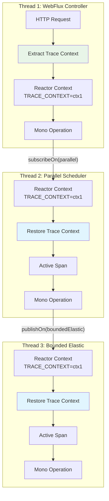
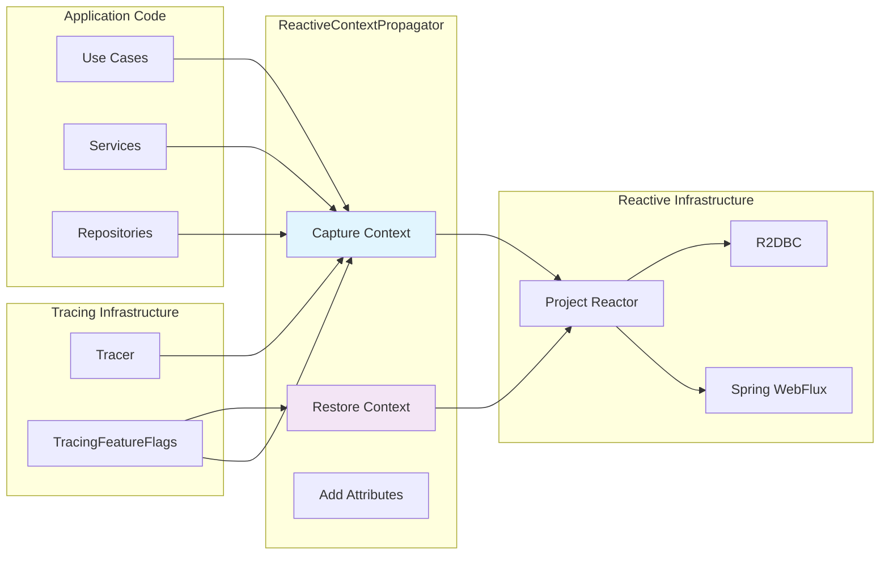

# ReactiveContextPropagator

## Overview

The `ReactiveContextPropagator` module manages trace context propagation in reactive applications. It bridges the gap between ThreadLocal-based tracing (used by Micrometer) and Reactor's Context-based execution model, ensuring trace continuity across async boundaries and thread transitions.

### Key Features
- **Reactive context management**: Propagates trace context through Reactor pipelines
- **Thread boundary tracking**: Monitors trace context across thread transitions
- **Scheduler awareness**: Identifies and tags scheduler types in spans
- **Feature flag integration**: Respects `tracing.features.reactive` configuration
- **Error resilience**: Graceful handling of context propagation failures

## Architecture

### Context Propagation Flow



### Component Integration



## Core Components

### ReactiveContextPropagator Class

The main class that manages trace context propagation in reactive pipelines.

#### Context Keys

| Key | Type | Description |
|-----|------|-------------|
| `TRACE_CONTEXT_KEY` | `TraceContext` | W3C trace context (traceId, spanId, flags) |
| `SPAN_KEY` | `Span` | Current active span |
| `SCHEDULER_KEY` | `String` | Scheduler name (for tracking) |
| `thread.origin` | `String` | Original thread name (for boundary detection) |

#### Key Methods

| Method | Description | Usage |
|--------|-------------|-------|
| `captureTraceContext()` | Captures current trace context | `.contextWrite(propagator.captureTraceContext())` |
| `restoreTraceContext(ContextView)` | Restores trace context from Reactor Context | Used in `Mono.deferContextual` |
| `addReactorAttributes(Span, String, String)` | Adds reactor-specific span attributes | Called during context restoration |
| `withTraceContext(Context, Mono)` | Executes Mono with trace context | Bridges reactive/blocking code |

## Usage Patterns

### Basic Context Propagation

```java
@Service
public class UserService {
    
    private final ReactiveContextPropagator propagator;
    private final UserRepository userRepository;
    
    public Mono<User> getUserWithTracing(String userId) {
        return userRepository.findById(userId)
            .contextWrite(propagator.captureTraceContext())
            .flatMap(user -> fetchUserDetails(user))
            .contextWrite(propagator.captureTraceContext());
    }
}
```

### Manual Context Restoration

```java
public Mono<String> processWithManualContext(String data) {
    return Mono.deferContextual(ctx -> {
        Span span = propagator.restoreTraceContext(ctx);
        try {
            // Code executes with active trace context
            return performOperation(data)
                .doOnNext(result -> span.event("operation.completed"));
        } finally {
            if (span != null) {
                span.end();
            }
        }
    });
}
```

### Scheduler-Aware Operations

```java
public Mono<List<User>> processInParallel(List<String> userIds) {
    return Flux.fromIterable(userIds)
        .parallel()
        .runOn(Schedulers.parallel())
        .flatMap(id -> userRepository.findById(id)
            .contextWrite(propagator.captureTraceContext()))
        .sequential()
        .collectList()
        .contextWrite(propagator.captureTraceContext());
}
```

## Span Attributes

### Reactor-Specific Attributes

| Attribute | Description | Example Values |
|-----------|-------------|----------------|
| `reactor.operator` | Reactor operator name | `"flatMap"`, `"subscribeOn"`, `"publishOn"` |
| `reactor.scheduler` | Scheduler type | `"parallel"`, `"boundedElastic"`, `"single"` |
| `reactor.thread` | Current thread name | `"parallel-1"`, `"boundedElastic-3"` |

### Thread Boundary Attributes

When trace context crosses thread boundaries, additional attributes are added:

```java
if (originThread.isPresent() && !originThread.get().equals(currentThread)) {
    span.tag("reactor.thread", currentThread);
    span.tag("reactor.scheduler", getSchedulerType(currentThread));
}
```

## Configuration

### Bean Configuration

```java
@Configuration
@ConditionalOnClass({Mono.class, Flux.class})
public class ReactiveTracingConfig {
    
    @Bean
    @ConditionalOnProperty(value = "tracing.features.reactive", havingValue = "true", matchIfMissing = true)
    public ReactiveContextPropagator reactiveContextPropagator(
        Tracer tracer,
        TracingFeatureFlags featureFlags) {
        return new ReactiveContextPropagator(tracer, featureFlags);
    }
}
```

### Application Properties

```yaml
tracing:
  features:
    reactive: true  # Enable reactive tracing
    
logging:
  level:
    dev.bloco.wallet.hub.infra.adapter.tracing.propagation: DEBUG
```

## Integration Examples

### With WebFlux Controllers

```java
@RestController
public class UserController {
    
    @GetMapping("/users/{id}")
    public Mono<User> getUser(@PathVariable String id) {
        return userService.getUser(id)
            .contextWrite(propagator.captureTraceContext());
    }
}
```

### With R2DBC Repositories

```java
@Repository
public interface UserRepository extends ReactiveCrudRepository<User, String> {
    
    @Query("SELECT * FROM users WHERE email = :email")
    Mono<User> findByEmail(String email);
}

@Service
public class UserService {
    
    public Mono<User> findUserByEmail(String email) {
        return userRepository.findByEmail(email)
            .contextWrite(propagator.captureTraceContext());
    }
}
```

### With External API Calls

```java
@Service
public class ExternalApiService {
    
    private final WebClient webClient;
    private final ReactiveContextPropagator propagator;
    
    public Mono<ApiResponse> callExternalApi(String endpoint) {
        return webClient.get()
            .uri(endpoint)
            .retrieve()
            .bodyToMono(ApiResponse.class)
            .contextWrite(propagator.captureTraceContext());
    }
}
```

## Performance Considerations

### Overhead Analysis

| Operation | Overhead | Notes |
|-----------|----------|-------|
| Context Capture | ~0.05ms | Reading ThreadLocal and creating context function |
| Context Restoration | ~0.1ms | Extracting from Reactor Context and setting ThreadLocal |
| Attribute Addition | ~0.02ms | Adding reactor-specific span attributes |
| Total per Boundary | ~0.17ms | Acceptable for most applications |

### Optimization Strategies

1. **Minimize Context Writes**: Only add `.contextWrite()` where necessary
2. **Batch Operations**: Process multiple items in single reactive chain
3. **Scheduler Selection**: Choose appropriate schedulers for workload
4. **Feature Flags**: Disable reactive tracing for performance-critical paths

## Error Handling

### Graceful Degradation

```java
public Function<Context, Context> captureTraceContext() {
    if (!featureFlags.isReactive()) {
        return ctx -> ctx; // No-op if disabled
    }
    
    try {
        Span currentSpan = tracer.currentSpan();
        if (currentSpan == null) {
            log.trace("No active span to capture");
            return ctx -> ctx;
        }
        
        // Capture context...
        return ctx -> ctx.put(TRACE_CONTEXT_KEY, traceContext);
        
    } catch (Exception e) {
        log.error("Error capturing trace context: {}", e.getMessage(), e);
        return ctx -> ctx; // Return no-op to avoid breaking chain
    }
}
```

### Error Recovery

```java
public Mono<String> resilientOperation(String input) {
    return Mono.deferContextual(ctx -> {
        try {
            Span span = propagator.restoreTraceContext(ctx);
            return performOperation(input)
                .onErrorResume(error -> {
                    span.tag("error.type", error.getClass().getSimpleName());
                    span.event("operation.error");
                    return fallbackOperation(input);
                });
        } catch (Exception e) {
            log.error("Context restoration failed: {}", e.getMessage());
            return performOperation(input); // Continue without tracing
        }
    });
}
```

## Testing

### Unit Testing

```java
@ExtendWith(MockitoExtension.class)
class ReactiveContextPropagatorTest {
    
    @Mock Tracer tracer;
    @Mock TracingFeatureFlags featureFlags;
    @Mock Span span;
    @Mock TraceContext traceContext;
    
    @Test
    void testCaptureTraceContext() {
        when(featureFlags.isReactive()).thenReturn(true);
        when(tracer.currentSpan()).thenReturn(span);
        when(span.context()).thenReturn(traceContext);
        when(traceContext.traceId()).thenReturn("trace-123");
        
        ReactiveContextPropagator propagator = 
            new ReactiveContextPropagator(tracer, featureFlags);
        
        Function<Context, Context> contextFunction = propagator.captureTraceContext();
        Context context = contextFunction.apply(Context.empty());
        
        assertTrue(context.hasKey(ReactiveContextPropagator.TRACE_CONTEXT_KEY));
    }
}
```

### Integration Testing

```java
@SpringBootTest
class ReactiveTracingIntegrationTest {
    
    @Autowired
    private ReactiveContextPropagator propagator;
    
    @Test
    void testContextPropagationAcrossThreads() {
        String result = Mono.just("test")
            .flatMap(value -> Mono.fromCallable(() -> value.toUpperCase())
                .subscribeOn(Schedulers.parallel()))
            .contextWrite(propagator.captureTraceContext())
            .block();
        
        assertEquals("TEST", result);
    }
}
```

## Best Practices

### Context Management

1. **Always capture context** before async boundaries (subscribeOn, publishOn)
2. **Restore context** in deferred operations (Mono.deferContextual)
3. **Chain context writes** for complex pipelines
4. **Monitor thread transitions** for performance optimization

### Scheduler Selection

| Scheduler | Use Case | Tracing Impact |
|-----------|----------|----------------|
| `Schedulers.immediate()` | Inline execution | Minimal context switching |
| `Schedulers.single()` | Sequential async | Single thread, easy tracing |
| `Schedulers.parallel()` | CPU-bound work | Multiple threads, requires context propagation |
| `Schedulers.boundedElastic()` | I/O-bound work | Thread pool, requires careful tracing |

### Error Prevention

1. **Check feature flags** before context operations
2. **Validate active span** before capturing context
3. **Handle null contexts** gracefully
4. **Log context transitions** for debugging

## Related Documentation

- [TracedReactiveStringRedisTemplate](traced_redis_template.md) - Redis cache tracing with reactive support
- [Tracing Configuration](tracing_configuration.md) - Overall tracing setup
- [TracingFeatureFlags](tracing_feature_flags.md) - Feature flag management
- [WebFlux Tracing](web_http_tracing.md) - HTTP request tracing in reactive applications
- [R2DBC Tracing](database_tracing.md) - Reactive database tracing