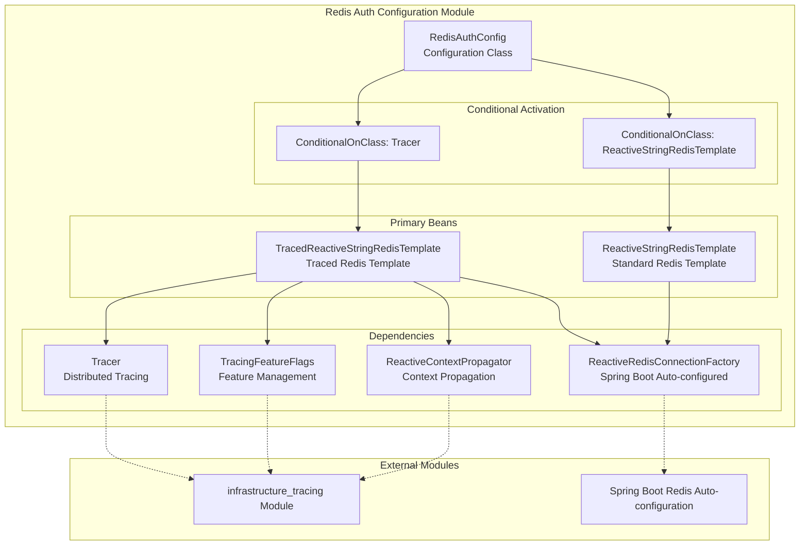
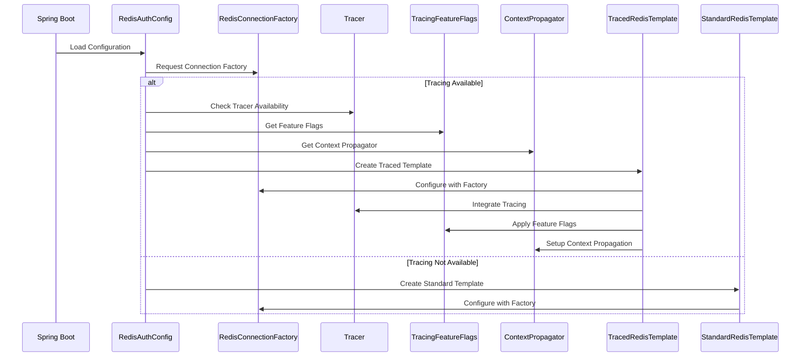
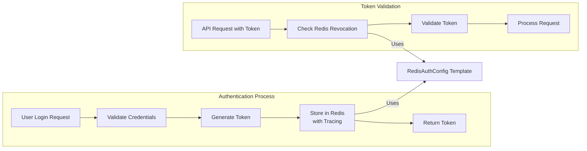

# Redis Authentication Configuration Module

## Overview

The `redis_auth_configuration` module is a Spring Boot configuration module responsible for setting up Redis-based authentication infrastructure within the Wallet Hub application. This module provides Redis template configurations specifically tailored for authentication concerns such as token revocation, rate limiting, and session management, with built-in distributed tracing support.

## Module Purpose

The primary purpose of this module is to:
1. **Configure Redis for Authentication**: Set up Redis templates optimized for authentication-related operations
2. **Enable Distributed Tracing**: Automatically integrate Redis operations with the application's distributed tracing system
3. **Provide Fallback Support**: Offer non-traced Redis templates when tracing is not available
4. **Reuse Existing Infrastructure**: Leverage Spring Boot's auto-configured Redis connection factory

## Architecture

### Component Relationships



### Configuration Flow



## Core Components

### 1. RedisAuthConfig Class

**Location**: `src/main/java/dev/bloco/wallet/hub/infra/provider/config/RedisAuthConfig.java`

**Purpose**: Main configuration class that defines Redis template beans for authentication operations.

**Key Features**:
- **Conditional Bean Creation**: Creates different Redis templates based on tracing availability
- **Dependency Injection**: Injects tracing components when available
- **Fallback Support**: Provides non-traced Redis template as fallback

**Configuration Methods**:

#### `tracedReactiveStringRedisTemplate()`
```java
@Bean
@ConditionalOnClass(name = "io.micrometer.tracing.Tracer")
public TracedReactiveStringRedisTemplate tracedReactiveStringRedisTemplate(
        ReactiveRedisConnectionFactory factory,
        Tracer tracer,
        TracingFeatureFlags featureFlags,
        ReactiveContextPropagator contextPropagator)
```

**Purpose**: Creates a Redis template with distributed tracing capabilities.

**Conditions**:
- Only created when `io.micrometer.tracing.Tracer` class is available
- Requires tracing infrastructure components

**Dependencies**:
- `ReactiveRedisConnectionFactory`: Spring Boot auto-configured Redis connection
- `Tracer`: Distributed tracing component from Micrometer
- `TracingFeatureFlags`: Feature flag management for tracing
- `ReactiveContextPropagator`: Context propagation for reactive streams

#### `reactiveStringRedisTemplate()`
```java
@Bean
@ConditionalOnClass(name = "org.springframework.data.redis.core.ReactiveStringRedisTemplate")
public ReactiveStringRedisTemplate reactiveStringRedisTemplate(
        ReactiveRedisConnectionFactory factory)
```

**Purpose**: Creates a standard Redis template without tracing (fallback).

**Conditions**:
- Created when `ReactiveStringRedisTemplate` class is available
- Used when tracing infrastructure is not present

**Dependencies**:
- `ReactiveRedisConnectionFactory`: Spring Boot auto-configured Redis connection

## Dependencies

### Internal Dependencies

| Dependency | Module | Purpose |
|------------|--------|---------|
| `TracedReactiveStringRedisTemplate` | `infrastructure_tracing` | Redis template with tracing decorator |
| `TracingFeatureFlags` | `infrastructure_tracing` | Feature flag management for tracing |
| `ReactiveContextPropagator` | `infrastructure_tracing` | Context propagation in reactive streams |
| `Tracer` | `infrastructure_tracing` | Distributed tracing instrumentation |

### External Dependencies

| Dependency | Purpose |
|------------|---------|
| `Spring Boot Redis Auto-configuration` | Provides `ReactiveRedisConnectionFactory` |
| `Spring Data Redis` | Provides `ReactiveStringRedisTemplate` |
| `Micrometer Tracing` | Provides distributed tracing capabilities |

## Usage Patterns

### 1. Authentication Token Management
```java
// Example: Token revocation using traced Redis template
@Component
public class TokenRevocationService {
    private final ReactiveStringRedisTemplate redisTemplate;
    
    public TokenRevocationService(ReactiveStringRedisTemplate redisTemplate) {
        this.redisTemplate = redisTemplate;
    }
    
    public Mono<Void> revokeToken(String tokenId) {
        return redisTemplate.opsForValue()
            .set("revoked:" + tokenId, "true", Duration.ofHours(1))
            .then();
    }
}
```

### 2. Rate Limiting Implementation
```java
// Example: Rate limiting for authentication attempts
@Component
public class RateLimitingService {
    private final ReactiveStringRedisTemplate redisTemplate;
    
    public Mono<Boolean> checkRateLimit(String key, int maxAttempts, Duration window) {
        return redisTemplate.opsForValue()
            .increment(key)
            .flatMap(count -> {
                if (count == 1) {
                    return redisTemplate.expire(key, window)
                        .thenReturn(count <= maxAttempts);
                }
                return Mono.just(count <= maxAttempts);
            });
    }
}
```

## Integration with System

### 1. Authentication Flow Integration



### 2. Tracing Integration

When tracing is enabled, all Redis operations for authentication are automatically traced with:
- **Span Creation**: Each Redis operation creates a trace span
- **Context Propagation**: Trace context is propagated through reactive streams
- **Feature Flags**: Tracing behavior can be controlled via `TracingFeatureFlags`
- **Performance Monitoring**: Redis operation latency and success rates are monitored

## Configuration Properties

The module relies on Spring Boot's Redis auto-configuration properties:

```yaml
spring:
  data:
    redis:
      host: localhost
      port: 6379
      password: ${REDIS_PASSWORD}
      timeout: 2000ms
      connect-timeout: 1000ms
```

For tracing configuration, refer to the [infrastructure_tracing module documentation](infrastructure_tracing.md).

## Error Handling and Fallbacks

### 1. Tracing Unavailability
- When tracing components are not available, the module automatically falls back to standard `ReactiveStringRedisTemplate`
- No tracing spans are created for Redis operations
- Authentication functionality remains fully operational

### 2. Redis Connection Issues
- Connection failures are handled by Spring Data Redis reactive streams
- Circuit breaker patterns should be implemented at the use case level
- Refer to [infrastructure_tracing module](infrastructure_tracing.md) for circuit breaker tracing

## Best Practices

### 1. Key Naming Convention
```java
// Recommended key patterns for authentication
String tokenKey = "auth:token:" + tokenId;
String revocationKey = "auth:revoked:" + tokenId;
String rateLimitKey = "auth:ratelimit:" + userId + ":" + action;
```

### 2. TTL Management
- Set appropriate TTLs for temporary authentication data
- Consider session duration for token storage
- Implement cleanup for rate limiting counters

### 3. Tracing Considerations
- Enable tracing in production for monitoring authentication performance
- Use feature flags to control tracing verbosity
- Monitor Redis operation latency in distributed traces

## Testing

### Unit Testing Configuration
```java
@SpringBootTest
class RedisAuthConfigTest {
    
    @Autowired(required = false)
    private TracedReactiveStringRedisTemplate tracedTemplate;
    
    @Autowired(required = false)
    private ReactiveStringRedisTemplate standardTemplate;
    
    @Test
    void shouldCreateAppropriateTemplateBasedOnTracingAvailability() {
        // Test depends on classpath configuration
        if (isTracingAvailable()) {
            assertNotNull(tracedTemplate);
            assertNull(standardTemplate);
        } else {
            assertNull(tracedTemplate);
            assertNotNull(standardTemplate);
        }
    }
}
```

### Integration Testing
```java
@Testcontainers
@SpringBootTest
class RedisAuthIntegrationTest {
    
    @Container
    static RedisContainer redis = new RedisContainer("redis:7-alpine");
    
    @DynamicPropertySource
    static void redisProperties(DynamicPropertyRegistry registry) {
        registry.add("spring.data.redis.host", redis::getHost);
        registry.add("spring.data.redis.port", redis::getFirstMappedPort);
    }
    
    @Test
    void shouldPerformAuthenticationOperations(@Autowired ReactiveStringRedisTemplate template) {
        StepVerifier.create(
            template.opsForValue().set("test:key", "value", Duration.ofSeconds(10))
                .then(template.opsForValue().get("test:key"))
        )
        .expectNext("value")
        .verifyComplete();
    }
}
```

## Related Modules

- [infrastructure_tracing](infrastructure_tracing.md): Provides distributed tracing components
- [infrastructure_security](infrastructure_security.md): Main security configuration module
- [domain_models](domain_models.md): Contains user and session domain models
- [use_cases](use_cases.md): Contains authentication use cases

## Future Enhancements

1. **Custom Serialization**: Add support for custom serialization of authentication objects
2. **Cluster Support**: Enhance configuration for Redis cluster deployments
3. **Metrics Integration**: Add Redis-specific metrics for authentication operations
4. **Cache Configuration**: Separate configuration for cache vs. persistence Redis usage

## Summary

The `redis_auth_configuration` module provides a robust, tracing-aware Redis configuration specifically designed for authentication operations in the Wallet Hub application. By leveraging Spring Boot's auto-configuration and integrating with the distributed tracing system, it ensures that authentication-related Redis operations are both performant and observable in production environments.

The module's conditional bean creation ensures backward compatibility and graceful degradation when tracing is not available, making it suitable for various deployment scenarios from development to production.