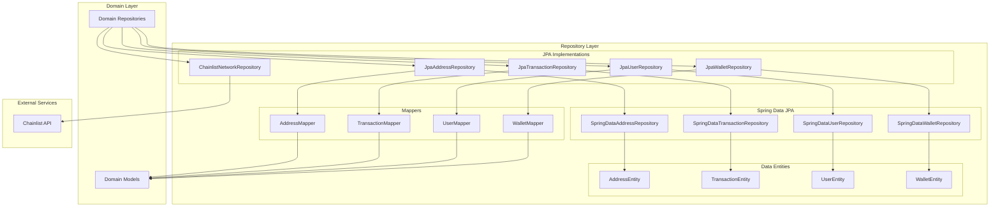
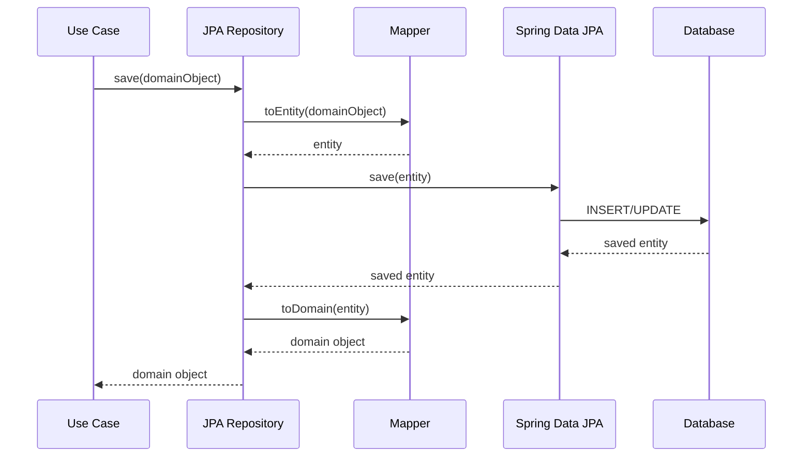
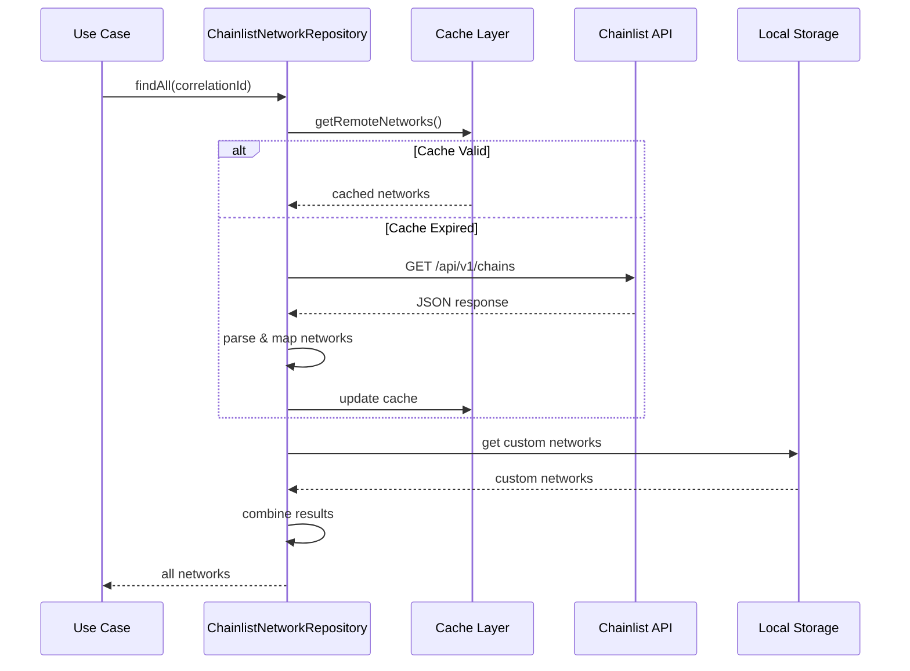

# Repository Layer Module

## Overview

The Repository Layer module is the data persistence infrastructure component of the Wallet Hub application. It implements the repository interfaces defined in the domain layer using JPA (Java Persistence API) and Spring Data JPA for relational database operations, with a specialized implementation for network data that integrates with external blockchain network metadata services.

This module serves as the bridge between the domain models and the underlying database, providing a clean separation of concerns while implementing the repository pattern for data access operations.

## Architecture

### Module Structure

The repository layer follows a layered architecture with clear separation between:

1. **JPA Repository Implementations** - Concrete implementations of domain repository interfaces
2. **Spring Data JPA Interfaces** - Auto-generated query methods for database operations
3. **Data Entities** - JPA entity classes mapped to database tables
4. **Mappers** - Components for converting between domain models and data entities
5. **Specialized Repository** - External service integration for network data

### Component Relationships



## Core Components

### 1. JPA Repository Implementations

#### JpaAddressRepository
**Purpose**: Implements the `AddressRepository` interface for address data persistence.

**Key Features**:
- CRUD operations for blockchain addresses
- Query methods for wallet and network associations
- Status-based filtering
- Account address lookups

**Dependencies**:
- `SpringDataAddressRepository` - Spring Data JPA interface
- `AddressMapper` - Domain-entity mapping

**Methods**:
- `save(Address)` - Persists address with mapping
- `findByWalletId(UUID)` - Retrieves addresses by wallet
- `findByNetworkId(UUID)` - Retrieves addresses by network
- `findByAccountAddress(String)` - Finds address by blockchain address
- `findByWalletIdAndStatus(UUID, AddressStatus)` - Filtered query

#### JpaTransactionRepository
**Purpose**: Implements the `TransactionRepository` interface for blockchain transaction data.

**Key Features**:
- Transaction persistence with blockchain metadata
- Hash-based lookups
- Network and address-based queries
- Status and timestamp filtering

**Dependencies**:
- `SpringDataTransactionRepository` - Spring Data JPA interface
- `TransactionMapper` - Domain-entity mapping

**Methods**:
- `save(Transaction)` - Persists transaction data
- `findByHash(String)` - Finds transaction by blockchain hash
- `findByNetworkId(UUID)` - Transactions on specific network
- `findByFromAddress(String)` - Outgoing transactions
- `findByToAddress(String)` - Incoming transactions
- `findByTimestampBetween(Instant, Instant)` - Time-range queries

#### JpaUserRepository
**Purpose**: Implements the `UserRepository` interface for user management.

**Key Features**:
- User CRUD operations
- Email-based lookups
- Status filtering
- Email verification token management

**Dependencies**:
- `SpringDataUserRepository` - Spring Data JPA interface
- `UserMapper` - Domain-entity mapping

**Methods**:
- `findByEmail(String)` - User lookup by email
- `findByStatus(UserStatus)` - Filter users by status
- `findActiveUsers()` - Convenience method for active users
- `findByEmailVerificationToken(String)` - Token-based lookup

#### JpaWalletRepository
**Purpose**: Implements the `WalletRepository` interface for wallet management.

**Key Features**:
- Wallet CRUD operations
- User-based wallet queries
- Status filtering
- Active wallet retrieval

**Dependencies**:
- `SpringDataWalletRepository` - Spring Data JPA interface
- `WalletMapper` - Domain-entity mapping

**Methods**:
- `findByUserId(UUID)` - User's wallets
- `findByUserIdAndStatus(UUID, WalletStatus)` - Filtered user wallets
- `findActiveByUserId(UUID)` - Active user wallets
- `findByName(String)` - Name-based search (fallback implementation)

### 2. Specialized Repository

#### ChainlistNetworkRepository
**Purpose**: Implements the `NetworkRepository` interface with external blockchain network metadata integration.

**Key Features**:
- Dynamic network data from Chainlist API
- Caching with configurable TTL
- Correlation ID support for distributed tracing
- Local custom network storage
- Fallback mechanisms for API failures

**Architecture**:
- **External Integration**: Fetches network metadata from Chainlist service
- **Caching Layer**: In-memory cache with expiration
- **Local Storage**: Concurrent map for custom networks
- **Resilience**: Timeout handling and error recovery

**Configuration**:
```properties
wallet.networks.chainlist-url=https://chainlist.org/api/v1/chains
wallet.networks.cache-ttl=PT5M
```

**Methods**:
- `findByChainId(String, String)` - Network by blockchain chain ID
- `findByName(String, String)` - Network name search
- `findByStatus(NetworkStatus, String)` - Status-based filtering
- `save(Network, String)` - Add custom networks

### 3. Spring Data JPA Interfaces

#### SpringDataAddressRepository
**Purpose**: Spring Data JPA repository for `AddressEntity`.

**Query Methods**:
- `findByWalletId(UUID)` - Addresses by wallet
- `findByNetworkId(UUID)` - Addresses by network
- `findByAccountAddress(String)` - Address by blockchain address
- `findByWalletIdAndStatus(UUID, String)` - Filtered wallet addresses
- `findByNetworkIdAndAccountAddress(UUID, String)` - Network-specific address

#### SpringDataTransactionRepository
**Purpose**: Spring Data JPA repository for `TransactionEntity`.

**Query Methods**:
- `findByHash(String)` - Transaction by hash
- `findByNetworkId(UUID)` - Network transactions
- `findByFromAddress(String)` - Outgoing transactions
- `findByToAddress(String)` - Incoming transactions
- `findByStatus(TransactionStatus)` - Status-based filtering
- `findByTimestampBetween(Instant, Instant)` - Time-range queries
- `existsByHash(String)` - Hash existence check

#### SpringDataUserRepository
**Purpose**: Spring Data JPA repository for `UserEntity`.

**Query Methods**: Basic CRUD operations provided by `JpaRepository`.

#### SpringDataWalletRepository
**Purpose**: Spring Data JPA repository for `WalletEntity`.

**Query Methods**: Basic CRUD operations provided by `JpaRepository`.

### 4. Data Entities

#### AddressEntity
**Table**: `addresses`

**Fields**:
- `id` (UUID, PK) - Unique identifier
- `walletId` (UUID) - Associated wallet
- `networkId` (UUID) - Blockchain network
- `publicKey` (String) - Cryptographic public key
- `accountAddress` (String, Unique) - Blockchain address
- `type` (AddressType) - Address type (e.g., EXTERNAL, CHANGE)
- `derivationPath` (String) - HD wallet derivation path
- `status` (AddressStatus) - Address status

#### TransactionEntity
**Table**: `transactions`

**Fields**:
- `id` (UUID, PK) - Unique identifier
- `networkId` (UUID) - Blockchain network
- `hash` (String, Unique) - Blockchain transaction hash
- `fromAddress` (String) - Sender address
- `toAddress` (String) - Recipient address
- `value` (BigDecimal) - Transaction amount
- `gasPrice`, `gasLimit`, `gasUsed` (BigDecimal) - Gas metrics
- `data` (String, LOB) - Transaction data/input
- `timestamp` (Instant) - Transaction time
- `blockNumber` (Long) - Block number
- `blockHash` (String) - Block hash
- `status` (TransactionStatus) - Transaction status

#### UserEntity
**Table**: `users`

**Fields**:
- `id` (UUID, PK) - Unique identifier
- `name` (String) - User name
- `email` (String) - User email

#### WalletEntity
**Table**: `wallets`

**Fields**:
- `id` (UUID, PK) - Unique identifier
- `userId` (UUID) - Associated user
- `balance` (BigDecimal) - Wallet balance

### 5. Mappers

#### AddressMapper
**Purpose**: Maps between `Address` domain model and `AddressEntity`.

**Features**:
- Custom mapping for value objects (`PublicKey`, `AccountAddress`)
- Spring component model for dependency injection
- Bidirectional mapping support

#### TransactionMapper
**Purpose**: Maps between `Transaction` domain model and `TransactionEntity`.

**Features**:
- Custom mapping logic for domain rehydration
- Handles all transaction metadata fields
- Null-safe mapping implementations

#### UserMapper
**Purpose**: Maps between `User` domain model and `UserEntity`.

**Features**:
- Simple field-to-field mapping
- Domain rehydration support
- Spring component model

#### WalletMapper
**Purpose**: Maps between `Wallet` domain model and `WalletEntity`.

**Features**:
- Domain object construction
- Field mapping with fallbacks
- Spring component model

## Data Flow

### Standard Repository Operation Flow



### Chainlist Network Data Flow



## Dependencies

### Internal Dependencies
- **Domain Layer**: Repository interfaces, domain models
- **Infrastructure Data**: Data entities, mappers
- **Spring Framework**: Spring Data JPA, Spring WebFlux

### External Dependencies
- **Chainlist API**: External blockchain network metadata
- **Database**: PostgreSQL/MySQL via JPA
- **Jackson**: JSON processing for API responses

## Configuration

### Spring Configuration
The repository layer components are configured via Spring annotations:
- `@Repository` - Marks classes as Spring-managed repositories
- `@Mapper(componentModel = "spring")` - MapStruct mapper configuration
- `@Entity` - JPA entity mapping
- `@Table` - Database table mapping

### Application Properties
```properties
# Chainlist Configuration
wallet.networks.chainlist-url=https://chainlist.org/api/v1/chains
wallet.networks.cache-ttl=PT5M

# Database Configuration (external)
spring.datasource.url=jdbc:postgresql://localhost:5432/wallethub
spring.datasource.username=postgres
spring.datasource.password=password
spring.jpa.hibernate.ddl-auto=update
```

## Error Handling

### Database Operations
- **Null Safety**: Mappers handle null values gracefully
- **Constraint Violations**: JPA exceptions propagated as runtime exceptions
- **Transaction Management**: Spring-managed transactions

### External API Integration
- **Timeout Handling**: Configurable timeouts for Chainlist API calls
- **Error Recovery**: Fallback to cached data on API failures
- **Circuit Breaking**: Implicit via timeout and error handling
- **Logging**: Comprehensive error logging with correlation IDs

## Performance Considerations

### Caching Strategy
- **Chainlist Data**: Configurable TTL-based caching (default: 5 minutes)
- **Entity Cache**: Second-level cache via JPA/Hibernate
- **Query Optimization**: Indexed fields for common queries

### Database Optimization
- **Indexes**: Unique constraints on `account_address`, `hash` fields
- **Query Patterns**: Optimized for wallet and network-based queries
- **Batch Operations**: Spring Data JPA batch processing support

### Memory Management
- **Response Size**: 1MB limit for Chainlist API responses
- **Cache Eviction**: Time-based cache expiration
- **Connection Pooling**: Spring Boot auto-configured connection pool

## Testing Strategy

### Unit Testing
- Repository implementations with in-memory databases
- Mapper component testing
- Cache behavior testing

### Integration Testing
- Database integration tests
- Chainlist API integration (with mocking)
- Transaction boundary testing

### Performance Testing
- Cache effectiveness measurements
- Database query performance
- API response time monitoring

## Related Modules

- **[domain_repositories.md](domain_repositories.md)**: Repository interfaces definition
- **[domain_models.md](domain_models.md)**: Domain models and value objects
- **[infrastructure_data.md](infrastructure_data.md)**: Complete data infrastructure overview
- **[use_cases.md](use_cases.md)**: Business logic using repositories

## Best Practices

### Repository Implementation
1. **Separation of Concerns**: Keep mapping logic in dedicated mappers
2. **Interface Segregation**: Follow domain repository interfaces precisely
3. **Error Propagation**: Let Spring Data exceptions propagate appropriately
4. **Null Safety**: Always handle null values in mappers

### External Integration
1. **Circuit Breaking**: Implement timeouts and fallbacks
2. **Caching**: Cache external data appropriately
3. **Monitoring**: Log correlation IDs for traceability
4. **Configuration**: Externalize API URLs and timeouts

### Database Operations
1. **Index Optimization**: Ensure proper indexes on query fields
2. **Transaction Boundaries**: Use appropriate transaction scopes
3. **Batch Operations**: Use batch processing for bulk operations
4. **Connection Management**: Proper connection pooling configuration

## Future Enhancements

### Planned Improvements
1. **Repository Metrics**: Add metrics for query performance
2. **Advanced Caching**: Redis integration for distributed caching
3. **Query DSL**: Type-safe query builders
4. **Audit Logging**: Comprehensive audit trail for data changes

### Scalability Considerations
1. **Database Sharding**: Support for sharded database architecture
2. **Read Replicas**: Read-write separation for high traffic
3. **Event Sourcing**: Consider event-sourced repositories for critical entities
4. **Polyglot Persistence**: Support for different storage backends