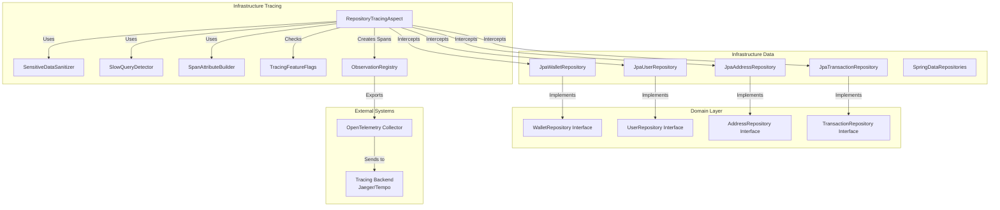
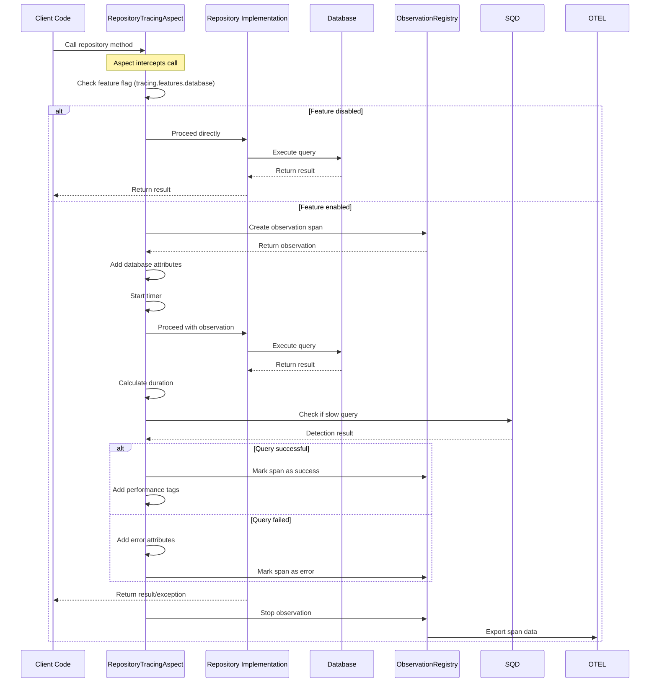
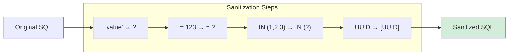

# Repository Tracing Aspect Module

## Overview

The **Repository Tracing Aspect** is a Spring AOP-based instrumentation component that automatically creates distributed tracing spans for all JPA repository operations in the Wallet Hub application. This module provides comprehensive observability into database interactions, enabling performance monitoring, query optimization, and troubleshooting of data access patterns.

## Key Features

- **Automatic Repository Instrumentation**: Traces all public methods in repository interfaces without code changes
- **SQL Sanitization**: Removes sensitive data from SQL statements while preserving query structure
- **Slow Query Detection**: Identifies and tags queries exceeding performance thresholds
- **Transaction Tracing**: Captures Spring transaction boundaries and attributes
- **Feature Flag Control**: Runtime enable/disable via configuration properties
- **OpenTelemetry Compliance**: Follows semantic conventions for database operations

## Architecture

### Module Position in Clean Architecture

```
┌─────────────────────────────────────────────────────────────┐
│                    Application Layer                        │
├─────────────────────────────────────────────────────────────┤
│                    Domain Layer                             │
│  ┌─────────────────────────────────────────────────────┐   │
│  │              Domain Repositories                    │   │
│  │  • WalletRepository      • UserRepository          │   │
│  │  • AddressRepository     • TransactionRepository   │   │
│  └─────────────────────────────────────────────────────┘   │
├─────────────────────────────────────────────────────────────┤
│                    Infrastructure Layer                     │
│  ┌─────────────────────────────────────────────────────┐   │
│  │           Infrastructure Tracing                    │   │
│  │  ┌─────────────────────────────────────────────┐   │   │
│  │  │       Repository Tracing Aspect             │◄──┼───┼── Intercepts
│  │  └─────────────────────────────────────────────┘   │   │
│  │  ┌─────────────────────────────────────────────┐   │   │
│  │  │         Infrastructure Data                 │   │   │
│  │  │  • JpaWalletRepository                      │───┼───┼── Implements
│  │  │  • JpaUserRepository                        │   │   │
│  │  │  • JpaAddressRepository                     │   │   │
│  │  │  • JpaTransactionRepository                 │   │   │
│  │  └─────────────────────────────────────────────┘   │   │
│  └─────────────────────────────────────────────────────┘   │
└─────────────────────────────────────────────────────────────┘
```

### Component Relationships



## Core Components

### 1. RepositoryTracingAspect

The main aspect class that intercepts repository method executions and wraps them in observation spans.

**Key Responsibilities:**
- Intercepts all public methods in repository interfaces matching `dev.bloco.wallet.hub.infra.provider.data.repository.*Repository.*(..)`
- Creates spans with standardized naming: `repository.{ClassName}.{methodName}`
- Adds database-specific attributes following OpenTelemetry conventions
- Handles both successful and failed operations
- Integrates with Spring's `@Transactional` annotation for transaction tracing

**Configuration:**
```java
@Aspect
@Component
@RequiredArgsConstructor
@ConditionalOnProperty(
    value = "tracing.features.database", 
    havingValue = "true", 
    matchIfMissing = true
)
public class RepositoryTracingAspect {
    // Aspect implementation
}
```

### 2. Dependencies

| Component | Purpose | Relationship |
|-----------|---------|--------------|
| `SpanAttributeBuilder` | Provides OpenTelemetry-compliant attribute constants | Used for standardized span attributes |
| `SensitiveDataSanitizer` | Sanitizes SQL statements and error messages | Removes PII from trace data |
| `SlowQueryDetector` | Identifies slow database queries | Tags slow queries for alerting |
| `TracingFeatureFlags` | Runtime control of tracing features | Enables/disables tracing per environment |
| `ObservationRegistry` | Micrometer observation infrastructure | Creates and manages spans |

## Tracing Capabilities

### Database Operation Tracing

**Span Naming Convention:**
```
repository.{RepositoryName}.{methodName}
```
Example: `repository.WalletRepository.findById`

**Standard Attributes Added:**

| Attribute | Value | Description |
|-----------|-------|-------------|
| `db.system` | `postgresql`, `h2`, etc. | Database system type |
| `db.operation` | `SELECT`, `INSERT`, `UPDATE`, `DELETE` | Operation type derived from method name |
| `db.statement` | Sanitized SQL pattern | Query structure with placeholders |
| `db.sql.table` | Table name | Primary table accessed |
| `repository.class` | Repository interface name | e.g., `WalletRepository` |
| `repository.method` | Method name | e.g., `findById` |
| `status` | `success` or `error` | Operation outcome |

**Operation Type Detection:**
```java
private String deriveOperationType(String methodName) {
    if (methodName.startsWith("find") || methodName.startsWith("get") || 
        methodName.startsWith("read") || methodName.startsWith("query") ||
        methodName.startsWith("exists") || methodName.startsWith("count")) {
        return "SELECT";
    } else if (methodName.startsWith("save") || methodName.startsWith("persist") ||
               methodName.startsWith("insert") || methodName.startsWith("create")) {
        return "INSERT";
    } else if (methodName.startsWith("update") || methodName.startsWith("modify")) {
        return "UPDATE";
    } else if (methodName.startsWith("delete") || methodName.startsWith("remove")) {
        return "DELETE";
    } else {
        return "UNKNOWN";
    }
}
```

### Transaction Tracing

**Span Naming Convention:**
```
transaction.{ClassName}.{methodName}
```

**Transaction Attributes:**

| Attribute | Description | Example |
|-----------|-------------|---------|
| `tx.isolation_level` | Transaction isolation level | `READ_COMMITTED` |
| `tx.propagation` | Transaction propagation behavior | `REQUIRED` |
| `tx.read_only` | Read-only transaction flag | `true` or `false` |
| `tx.timeout_seconds` | Transaction timeout | `30` |
| `tx.duration_ms` | Transaction duration | `45` |
| `tx.status` | Transaction outcome | `COMMITTED` or `ROLLED_BACK` |

### Error Handling

When repository operations fail, the aspect:
1. Marks the span with `error=true`
2. Adds error type and sanitized message
3. Preserves original exception type (RuntimeException/Error rethrown as-is)
4. Converts checked exceptions to RuntimeException for AOP compatibility

```java
private void addErrorAttributes(Observation observation, Throwable throwable) {
    observation.lowCardinalityKeyValue(SpanAttributeBuilder.ERROR, "true");
    observation.lowCardinalityKeyValue(SpanAttributeBuilder.ERROR_TYPE, 
                                      throwable.getClass().getSimpleName());
    
    String message = throwable.getMessage();
    if (message != null) {
        String sanitizedMessage = sanitizer.sanitizeSql(message);
        observation.highCardinalityKeyValue(SpanAttributeBuilder.ERROR_MESSAGE, 
                                           truncate(sanitizedMessage, 512));
    }
}
```

## Data Flow

### Repository Method Execution Flow



### SQL Sanitization Process



**Example:**
```sql
-- Original SQL:
SELECT * FROM users WHERE email = 'user@example.com' 
  AND phone = '+1234567890' AND id IN (1, 2, 3)

-- Sanitized SQL:
SELECT * FROM users WHERE email = ? 
  AND phone = ? AND id IN (?)
```

## Configuration

### Feature Flags

The aspect is controlled by the `tracing.features.database` property:

```yaml
# application.yml
tracing:
  features:
    database: true  # Enable/disable repository tracing
```

### Slow Query Threshold

Configure slow query detection threshold:

```yaml
tracing:
  sampling:
    slow-query-threshold-ms: 50  # Default: 50ms
```

### Repository Package Scanning

The aspect intercepts methods in:
```
dev.bloco.wallet.hub.infra.provider.data.repository.*Repository.*(..)
```

**Supported Repositories:**
- `JpaWalletRepository` - Wallet entity operations
- `JpaUserRepository` - User entity operations  
- `JpaAddressRepository` - Address entity operations
- `JpaTransactionRepository` - Transaction entity operations
- `SpringData*Repository` - Spring Data JPA repositories
- `OutboxRepository` - Outbox pattern implementation
- `StateMachineRepository` - Saga state machine persistence

## Performance Considerations

### Overhead Analysis

| Operation | Typical Overhead | Notes |
|-----------|-----------------|-------|
| Feature flag check | < 1μs | Simple boolean field access |
| Span creation | 1-2ms | Includes context propagation |
| SQL sanitization | 0.5-2ms | Depends on SQL complexity |
| Slow query detection | < 0.1ms | Simple threshold comparison |
| Span export | 2-5ms | Async, non-blocking |

### Optimization Strategies

1. **Selective Tracing**: Use feature flags to disable tracing in high-throughput scenarios
2. **Sampling**: Configure sampling rates to reduce volume (see [sampling_system.md](sampling_system.md))
3. **Batch Operations**: Consider manual instrumentation for batch operations
4. **Caching**: Cache sanitized SQL patterns for repeated queries

## Integration Points

### With Domain Layer

The aspect integrates with domain repositories through Spring Data JPA:

```java
// Domain repository interface
public interface WalletRepository extends DomainRepository<Wallet> {
    Optional<Wallet> findById(WalletId id);
    List<Wallet> findByUserId(UserId userId);
}

// Infrastructure implementation (traced)
@Repository
public class JpaWalletRepository implements WalletRepository {
    // All public methods automatically traced
    public Optional<Wallet> findById(WalletId id) {
        // Implementation traced by aspect
    }
}
```

### With Other Tracing Components

- **UseCaseTracingAspect**: Complements repository tracing with business logic tracing
- **R2dbcObservationHandler**: Provides reactive database tracing
- **WebFluxTracingFilter**: Completes end-to-end request tracing
- **KafkaObservationHandlers**: Connects messaging traces with database operations

## Usage Examples

### Basic Repository Tracing

```java
@Repository
public interface UserRepository extends JpaRepository<UserEntity, UUID> {
    // Automatically traced:
    // - Span name: "repository.UserRepository.findByEmail"
    // - Attributes: db.system, db.operation, db.statement
    
    Optional<UserEntity> findByEmail(String email);
    
    // Transaction tracing for custom methods
    @Transactional
    @Modifying
    @Query("UPDATE UserEntity u SET u.status = :status WHERE u.id = :id")
    int updateStatus(@Param("id") UUID id, @Param("status") UserStatus status);
}
```

### Custom Repository Implementation

```java
@Repository
public class CustomWalletRepositoryImpl implements CustomWalletRepository {
    
    private final EntityManager entityManager;
    
    // All public methods traced
    public List<Wallet> findActiveWallets() {
        // Complex query traced with attributes
        return entityManager.createQuery(
            "SELECT w FROM WalletEntity w WHERE w.status = 'ACTIVE'", 
            Wallet.class
        ).getResultList();
    }
}
```

### Transaction Boundary Tracing

```java
@Service
public class WalletService {
    
    @Transactional
    public Wallet createWallet(CreateWalletCommand command) {
        // Creates transaction span: "transaction.WalletService.createWallet"
        // Includes: isolation, propagation, timeout attributes
        
        Wallet wallet = walletFactory.create(command);
        return walletRepository.save(wallet); // Creates repository span
    }
}
```

## Monitoring and Alerting

### Key Metrics to Monitor

1. **Query Performance**: `db.operation` + duration percentiles
2. **Error Rates**: `status=error` by repository class
3. **Slow Queries**: `slow_query=true` count over time
4. **Transaction Outcomes**: `tx.status` distribution

### Sample Grafana Queries

```promql
# Slow query rate
rate(traces_total{slow_query="true"}[5m])

# Error rate by repository
sum by (repository.class) (
  rate(traces_total{status="error"}[5m])
) / 
sum by (repository.class) (
  rate(traces_total[5m])
)

# P95 query duration by operation
histogram_quantile(0.95, 
  sum by (le, db.operation) (
    rate(traces_duration_seconds_bucket[5m])
  )
)
```

### Alerting Rules

```yaml
# Prometheus alerting rules
groups:
  - name: database-alerts
    rules:
      - alert: HighSlowQueryRate
        expr: rate(traces_total{slow_query="true"}[5m]) > 10
        for: 5m
        labels:
          severity: warning
        annotations:
          summary: "High rate of slow database queries"
          
      - alert: RepositoryErrorRateHigh
        expr: |
          sum by (repository.class) (
            rate(traces_total{status="error"}[5m])
          ) / 
          sum by (repository.class) (
            rate(traces_total[5m])
          ) > 0.05
        for: 2m
        labels:
          severity: critical
```

## Troubleshooting

### Common Issues

1. **Tracing Not Working**
   - Check `tracing.features.database` property
   - Verify aspect is registered (check Spring logs)
   - Ensure repository methods are public

2. **High Overhead**
   - Consider increasing sampling rate
   - Review SQL sanitization patterns
   - Check for N+1 query patterns in traces

3. **Missing Attributes**
   - Verify SpanAttributeBuilder configuration
   - Check database connection metadata
   - Review method naming conventions

### Debug Mode

Enable debug logging for troubleshooting:

```yaml
logging:
  level:
    dev.bloco.wallet.hub.infra.adapter.tracing.aspect.RepositoryTracingAspect: DEBUG
```

## Related Documentation

- [infrastructure_tracing.md](infrastructure_tracing.md) - Overview of tracing infrastructure
- [sampling_system.md](sampling_system.md) - Sampling configuration and strategies
- [sensitive_data_sanitizer.md](sensitive_data_sanitizer.md) - Data sanitization implementation
- [use_case_tracing_aspect.md](use_case_tracing_aspect.md) - Business logic tracing aspect
- [span_attribute_builder.md](span_attribute_builder.md) - OpenTelemetry attribute standards
- [tracing_feature_flags.md](tracing_feature_flags.md) - Runtime tracing control

## Version History

| Version | Date | Changes |
|---------|------|---------|
| 1.0.0 | 2024-01-15 | Initial release with repository and transaction tracing |
| 1.1.0 | 2024-02-01 | Added slow query detection and SQL sanitization |
| 1.2.0 | 2024-02-15 | Enhanced error handling and feature flag support |

## Contributing

When modifying the RepositoryTracingAspect:

1. **Add New Attributes**: Use `SpanAttributeBuilder` constants for consistency
2. **Test Performance**: Measure overhead for new instrumentation
3. **Update Documentation**: Keep this document synchronized with code changes
4. **Consider Backwards Compatibility**: Maintain existing span naming conventions

## License

This module is part of the Wallet Hub application and follows the same licensing terms as the main project.