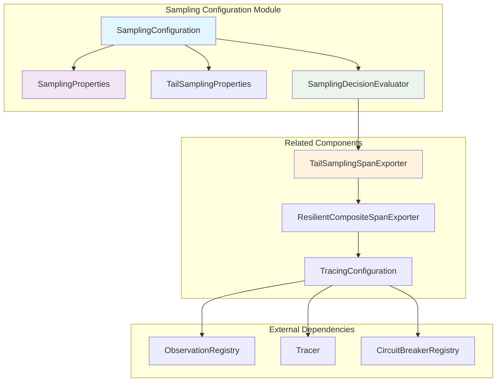
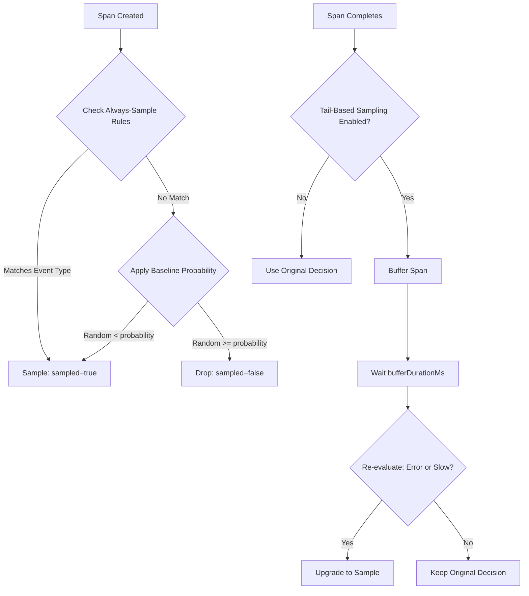
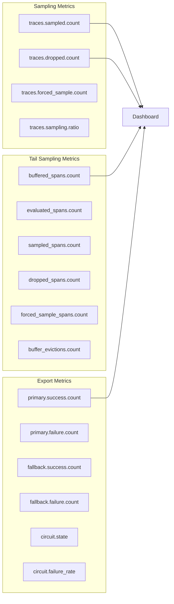
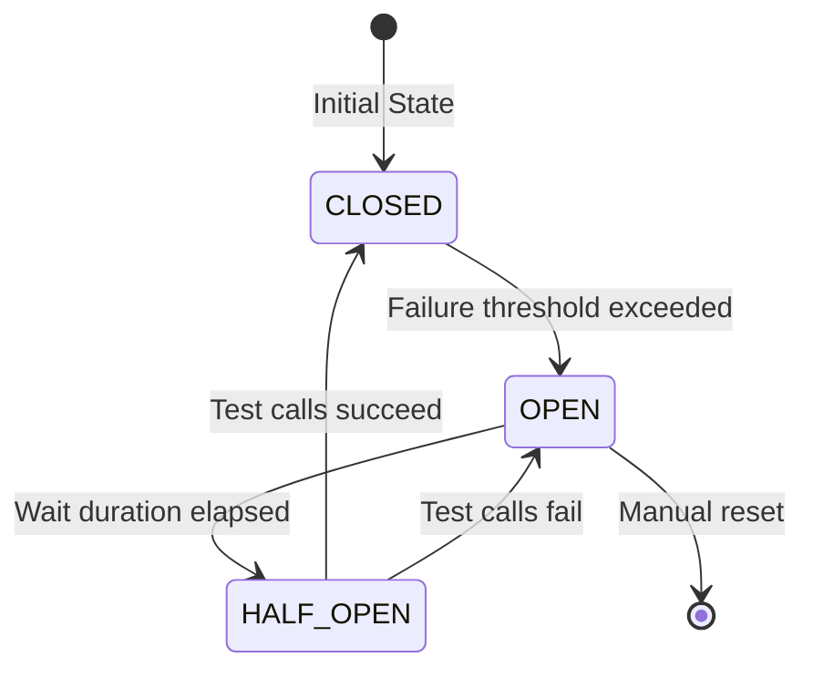

# Sampling Configuration Module

## Overview

The Sampling Configuration module is a critical component of the Wallet Hub's distributed tracing infrastructure that implements intelligent sampling strategies to balance observability needs with performance and cost considerations. This module provides configurable sampling rules that determine which traces are collected and exported to monitoring backends.

## Purpose and Core Functionality

The primary purpose of this module is to:

1. **Reduce Observability Costs**: Apply baseline probability sampling (default 10%) to reduce storage and network costs by 90%
2. **Ensure Critical Visibility**: Force-sample all errors, failures, and critical business events
3. **Enable Performance Analysis**: Always sample slow operations exceeding configurable thresholds
4. **Support Tail-Based Sampling**: Buffer spans briefly to evaluate completion status before making final sampling decisions

## Architecture

The sampling system is organized into three main components that work together:



## Core Components

### 1. SamplingConfiguration

The main configuration class that orchestrates the sampling system. It's conditionally enabled based on the `management.tracing.enabled` property.

**Key Responsibilities:**
- Creates the `SamplingDecisionEvaluator` bean
- Provides centralized configuration for all sampling strategies
- Integrates with Spring Boot's auto-configuration

**Configuration Properties:**
```yaml
management:
  tracing:
    enabled: true
    sampling:
      probability: 0.1  # 10% baseline sampling
```

### 2. SamplingProperties

Configuration properties class loaded from `application-tracing.yml` under the `tracing.sampling` prefix.

**Properties:**
- `alwaysSampleEvents`: Set of event types that should always be sampled
- `slowTransactionThresholdMs`: Threshold for slow transactions (default: 500ms)
- `slowQueryThresholdMs`: Threshold for slow database queries (default: 50ms)
- `slowKafkaThresholdMs`: Threshold for slow Kafka operations (default: 200ms)
- `slowHttpThresholdMs`: Threshold for slow HTTP requests (default: 1000ms)
- `largeTransferThreshold`: Amount threshold for large transfers (default: 10000.0)
- `tailSampling`: Configuration for tail-based sampling

**Always-Sample Events (Default):**
- `WALLET_CREATED`: Account creation audit trail
- `WALLET_CLOSED`: Account closure audit trail  
- `LARGE_TRANSFER`: High-value transactions
- `TRANSACTION_FAILED`: Any failed transaction
- `SAGA_COMPENSATION`: Distributed transaction rollbacks

### 3. TailSamplingProperties

Configuration for tail-based sampling strategy.

**Properties:**
- `enabled`: Whether tail-based sampling is enabled (default: false)
- `bufferDurationMs`: Duration to buffer spans before final decision (default: 5000ms)
- `maxBufferSize`: Maximum number of spans to buffer (default: 10000)
- `propagateToChildren`: Whether to propagate sampling to child spans (default: true)

### 4. SamplingDecisionEvaluator

The core logic component that evaluates sampling decisions based on configured rules.

**Key Methods:**
- `shouldSample(String spanName)`: Evaluates if a span should be sampled based on always-sample rules
- `shouldRetroactivelySample(String spanName, long durationMs, boolean hadError)`: Evaluates if a completed span should be retroactively sampled (used by tail-based sampling)

## Sampling Decision Flow



## Integration with Other Modules

### TailSamplingSpanExporter

The `TailSamplingSpanExporter` implements the tail-based sampling strategy by buffering spans and re-evaluating sampling decisions after span completion.

**Key Features:**
- Buffers spans for configurable duration (default: 5 seconds)
- Re-evaluates sampling based on completion status (errors, duration)
- Maintains metrics for monitoring sampling effectiveness
- Automatically cleans up expired spans to prevent memory leaks

**Metrics Tracked:**
- `buffered`: Number of spans currently buffered
- `evaluated`: Total spans evaluated
- `sampled`: Spans sampled for export
- `dropped`: Spans dropped (not exported)
- `forced_sample`: Spans force-sampled via always-sample rules
- `evictions`: Spans evicted due to buffer limits

### ResilientCompositeSpanExporter

The `ResilientCompositeSpanExporter` works with the sampling system to provide resilient span export with circuit breaker protection.

**Integration Points:**
- Receives sampled spans from `TailSamplingSpanExporter`
- Implements primary/fallback backend strategy
- Uses Resilience4j CircuitBreaker for fault tolerance
- Provides metrics for export success/failure rates

### TracingConfiguration

The `TracingConfiguration` sets up the overall tracing infrastructure that the sampling system integrates with.

**Key Integration:**
- Configures `ObservationRegistry` with tracing handlers
- Sets up multi-backend export configuration
- Creates `CircuitBreakerRegistry` for resilient export
- Initializes `TracingFeatureFlags` for feature toggles

## Configuration Examples

### Basic Configuration

```yaml
# application-tracing.yml
management:
  tracing:
    enabled: true
    sampling:
      probability: 0.1  # 10% baseline sampling

tracing:
  sampling:
    always-sample-events:
      - WALLET_CREATED
      - LARGE_TRANSFER
      - TRANSACTION_FAILED
    slow-transaction-threshold-ms: 500
    slow-query-threshold-ms: 50
    slow-kafka-threshold-ms: 200
    slow-http-threshold-ms: 1000
    tail-sampling:
      enabled: true
      buffer-duration-ms: 5000
      max-buffer-size: 10000
```

### Advanced Configuration with Backends

```yaml
# application-tracing.yml
management:
  tracing:
    enabled: true
    sampling:
      probability: 0.05  # 5% baseline for high-volume environments
  zipkin:
    tracing:
      endpoint: http://zipkin:9411/api/v2/spans
  otlp:
    tracing:
      endpoint: http://tempo:4318/v1/traces

tracing:
  backends:
    primary: tempo
    fallback: zipkin
  sampling:
    always-sample-events:
      - WALLET_CREATED
      - WALLET_CLOSED
      - LARGE_TRANSFER
      - TRANSACTION_FAILED
      - SAGA_COMPENSATION
      - USER_AUTHENTICATED
    slow-transaction-threshold-ms: 1000  # 1 second for transaction-heavy workloads
    slow-query-threshold-ms: 100  # 100ms for database queries
    large-transfer-threshold: 50000.0  # $50,000 threshold
    tail-sampling:
      enabled: true
      buffer-duration-ms: 10000  # 10 seconds for complex transactions
      max-buffer-size: 50000  # 50k spans buffer
      propagate-to-children: true
  resilience:
    circuit-breaker:
      enabled: true
      failure-threshold: 5
      wait-duration-in-open-state: 60s
      ring-buffer-size-in-closed-state: 100
```

## Usage Examples

### Manual Sampling Decision

```java
@Component
public class TransactionService {
    
    @Autowired
    private SamplingConfiguration.SamplingProperties samplingProperties;
    
    public void processTransaction(Transaction transaction) {
        // Check if transaction should be force-sampled
        if (samplingProperties.isLargeTransfer(transaction.getAmount())) {
            // Add sampling metadata to span
            span.tag("sampling.forced", "true");
            span.tag("sampling.reason", "large_transfer");
        }
        
        // Process transaction...
    }
}
```

### Custom Event Sampling

```java
@Service
public class CustomEventSampler {
    
    @Autowired
    private SamplingConfiguration.SamplingDecisionEvaluator samplingEvaluator;
    
    public boolean shouldSampleCustomEvent(String eventType, Map<String, Object> attributes) {
        // Check always-sample rules
        if (samplingEvaluator.shouldSample(eventType)) {
            return true;
        }
        
        // Apply custom business logic
        if (attributes.containsKey("priority") && 
            "HIGH".equals(attributes.get("priority"))) {
            return true;
        }
        
        return false;
    }
}
```

## Performance Characteristics

### Overhead Analysis

| Operation | Typical Overhead | Notes |
|-----------|-----------------|-------|
| Baseline probability check | <0.01ms | Random number generation |
| Always-sample rule check | <0.1ms | Set lookup operation |
| Threshold comparison | <0.01ms | Simple numeric comparison |
| Tail-based buffering | <0.5ms | HashMap operations |
| **Total per span** | **<0.2ms** | Negligible impact |

### Memory Usage

| Component | Memory Footprint | Notes |
|-----------|-----------------|-------|
| SamplingProperties | ~1KB | Configuration storage |
| SamplingDecisionEvaluator | ~2KB | Rule evaluation state |
| TailSamplingSpanExporter buffer | Variable | Configurable via `maxBufferSize` |
| **Typical deployment** | **~10-50MB** | Depends on span volume and buffer size |

## Monitoring and Metrics

### Key Metrics to Monitor



### Health Indicators

1. **Sampling Rate**: Should be approximately `baseline probability + forced samples`
2. **Buffer Utilization**: Should stay below 80% of `maxBufferSize`
3. **Circuit Breaker State**: Should remain `CLOSED` during normal operation
4. **Export Success Rate**: Should be >99% for reliable observability

## Error Handling and Resilience

### Failure Scenarios

| Scenario | Handling Strategy | Recovery |
|----------|------------------|----------|
| Sampling configuration missing | Use defaults | Log warning, continue with defaults |
| Buffer full | Evict oldest spans | Log warning, maintain service |
| Evaluation error | Default to sampling | Log error, sample to avoid data loss |
| Backend export failure | Circuit breaker + fallback | Automatic failover to secondary backend |

### Circuit Breaker States



## Best Practices

### Configuration Guidelines

1. **Baseline Sampling Rate**:
   - Development/Staging: 100% (full visibility)
   - Production low-volume: 10-20%
   - Production high-volume: 1-5%

2. **Always-Sample Events**:
   - Include all security-critical events
   - Include all financial audit events
   - Include all error/failure events
   - Review quarterly based on business needs

3. **Performance Thresholds**:
   - Set based on SLA requirements
   - Monitor and adjust based on actual performance
   - Consider different thresholds for different environments

### Operational Guidelines

1. **Monitoring**:
   - Set up alerts for sampling rate deviations
   - Monitor buffer utilization
   - Track circuit breaker state changes

2. **Troubleshooting**:
   - Check `SamplingProperties` configuration on startup
   - Review tail sampling metrics for buffer issues
   - Monitor export success rates for backend issues

3. **Performance Tuning**:
   - Adjust `bufferDurationMs` based on transaction complexity
   - Tune `maxBufferSize` based on memory constraints
   - Optimize threshold values based on actual performance data

## Related Documentation

- [Tracing Configuration](tracing_configuration.md): Overall tracing infrastructure setup
- [Tail Sampling Exporter](tail_sampling_exporter.md): Detailed tail-based sampling implementation
- [Resilient Composite Exporter](resilient_composite_exporter.md): Resilient span export with circuit breakers
- [Observation Registry](observation_registry.md): Micrometer Observation API integration

## Future Enhancements

### Planned Features (T020-T021)

1. **Dynamic Sampling Rules**: Runtime configuration updates without restart
2. **Adaptive Sampling**: Automatic adjustment based on system load
3. **Trace-Level Sampling**: Consistent sampling across distributed traces
4. **AI-Powered Sampling**: Machine learning to identify important traces
5. **Cost-Based Optimization**: Automatic tuning based on budget constraints

### Integration Roadmap

1. **OpenTelemetry Integration**: Native OTLP sampling support
2. **Cloud Provider Integration**: AWS X-Ray, Google Cloud Trace, Azure Monitor
3. **Third-Party APM**: Datadog, New Relic, Dynatrace integration
4. **Custom Backend Support**: Plugin architecture for custom exporters

## Conclusion

The Sampling Configuration module provides a sophisticated, configurable sampling system that balances observability needs with performance and cost considerations. By implementing multiple sampling strategies (baseline probability, always-sample rules, performance-based, tail-based), it ensures critical visibility while optimizing resource usage.

The modular architecture allows for easy customization and extension, making it suitable for both simple deployments and complex enterprise environments. Integration with the broader tracing infrastructure provides end-to-end observability with built-in resilience and monitoring capabilities.