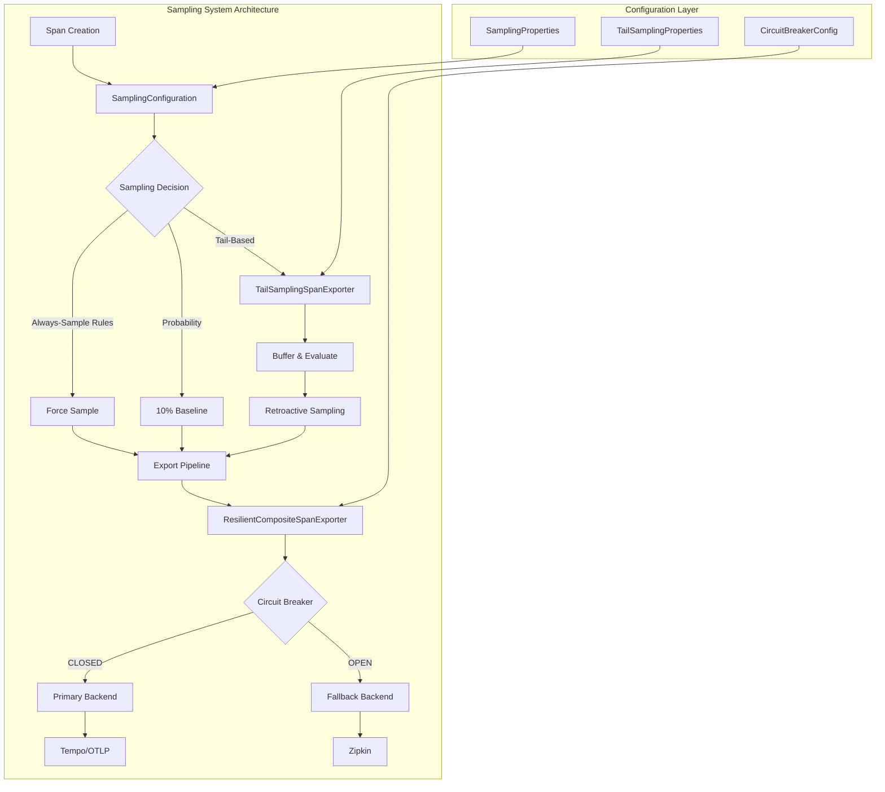
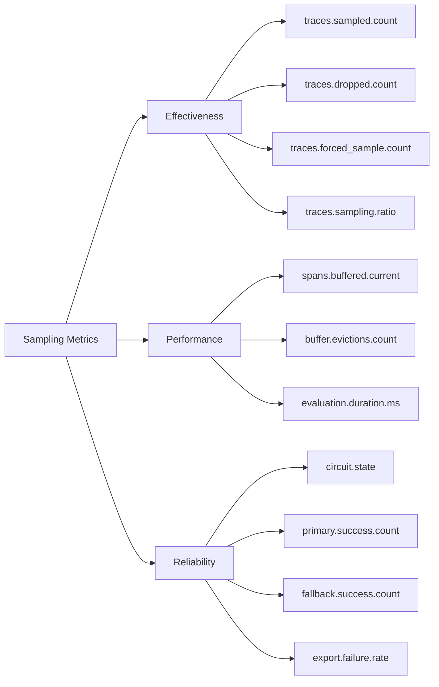
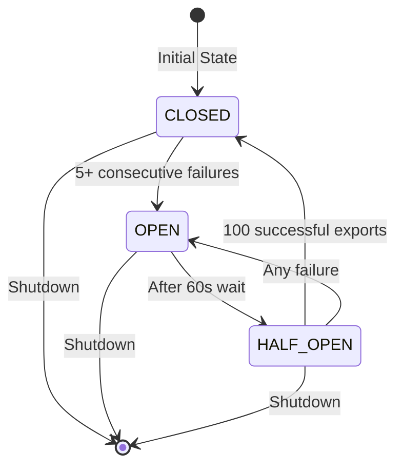

# Sampling System Module

## Overview

The Sampling System is a critical component of the Wallet Hub's distributed tracing infrastructure that implements intelligent sampling strategies to balance observability needs with performance and cost considerations. This module provides sophisticated sampling mechanisms that ensure important traces are captured while reducing the volume of trace data by up to 90%.

## Purpose and Core Functionality

The sampling system addresses the fundamental challenge in distributed tracing: capturing enough data to be useful while avoiding overwhelming storage and processing systems. It implements:

1. **Intelligent Sampling Rules**: Multi-criteria decision making for trace sampling
2. **Tail-Based Sampling**: Post-execution evaluation of spans for better decision making
3. **Resilient Export**: Circuit-breaker protected export to multiple backends
4. **Cost Optimization**: 90% reduction in trace volume while maintaining critical visibility

## Architecture Overview



## Key Components

### 1. SamplingConfiguration
The central configuration class that defines sampling strategies and rules.

**Core Components:**
- `SamplingProperties`: Configuration properties for sampling rules
- `TailSamplingProperties`: Configuration for tail-based sampling
- `SamplingDecisionEvaluator`: Logic for evaluating sampling decisions

**Key Features:**
- Always-sample rules for critical events
- Performance threshold-based sampling
- Baseline probability sampling (10% default)
- Integration with Micrometer Tracing's Observation API

### 2. TailSamplingSpanExporter
Implements tail-based sampling by buffering spans and evaluating them after completion.

**Core Components:**
- `BufferedSpan`: Internal representation of spans awaiting evaluation
- `TailSamplingSpanExporter`: Main exporter with buffer management

**Key Features:**
- Buffer spans for configurable duration (default 5 seconds)
- Retroactive sampling based on completion status
- Memory-bounded buffer with eviction policies
- Comprehensive metrics collection

### 3. ResilientCompositeSpanExporter
Provides fault-tolerant span export with circuit breaker protection.

**Core Components:**
- `ResilientCompositeSpanExporter`: Main exporter with circuit breaker
- `ExportException`: Custom exception for export failures

**Key Features:**
- Primary/fallback backend support
- Circuit breaker protection against backend failures
- Automatic failover between backends
- Export metrics and monitoring

## Sampling Strategies

### Always-Sample Rules
Critical events that bypass probability sampling:
- **WALLET_CREATED**: Account creation audit trail
- **WALLET_CLOSED**: Account closure audit trail  
- **LARGE_TRANSFER**: High-value transactions (> $10,000)
- **TRANSACTION_FAILED**: Any failed transaction
- **SAGA_COMPENSATION**: Distributed transaction rollbacks
- **ERROR**: Any span marked with error=true
- **SLOW_OPERATION**: Operations exceeding performance thresholds

### Performance Thresholds
Operations exceeding these durations are always sampled:
- **Slow Transaction**: ≥ 500ms
- **Slow Database Query**: ≥ 50ms  
- **Slow Kafka Operation**: ≥ 200ms
- **Slow HTTP Request**: ≥ 1000ms

### Tail-Based Sampling Strategy
Unlike head-based sampling (decision at span creation), tail-based sampling makes export decisions AFTER span completion:

```
Head-based:  Create Span → Decide Sample → Execute → Complete → Export (if sampled)
Tail-based:  Create Span → Execute → Complete → Buffer → Evaluate → Export (if matches rules)
```

## Configuration

### Application Configuration Example
```yaml
# application-tracing.yml
management:
  tracing:
    sampling:
      probability: 0.1  # 10% baseline sampling
      
tracing:
  sampling:
    always-sample-events:
      - WALLET_CREATED
      - LARGE_TRANSFER
      - TRANSACTION_FAILED
    slow-transaction-threshold-ms: 500
    slow-query-threshold-ms: 50
    slow-kafka-threshold-ms: 200
    slow-http-threshold-ms: 1000
    tail-sampling:
      enabled: true
      buffer-duration-ms: 5000  # Hold spans for 5s before decision
      max-buffer-size: 10000
      propagate-to-children: true
      
  resilience:
    circuit-breaker:
      enabled: true
      failure-threshold: 5
      wait-duration-in-open-state: 60s
      ring-buffer-size-in-closed-state: 100
```

### Programmatic Usage
```java
@Autowired
private SamplingProperties samplingProperties;

// Check if event should always be sampled
if (samplingProperties.shouldAlwaysSample("WALLET_CREATED")) {
    span.tag("sampling.forced", "true");
}

// Check if operation is slow
long durationMs = span.duration().toMillis();
if (samplingProperties.isSlowTransaction(durationMs)) {
    span.tag("sampling.reason", "slow_transaction");
}
```

## Integration with Other Modules

### Infrastructure Tracing
The sampling system is a sub-module of the [infrastructure_tracing](infrastructure_tracing.md) system and works closely with:

1. **Core Configuration**: Uses `TracingConfiguration` for overall tracing setup
2. **Instrumentation Aspects**: Integrates with `RepositoryTracingAspect` and `UseCaseTracingAspect`
3. **Propagation**: Works with `CloudEventTracePropagator` and `ReactiveContextPropagator`

### Domain Events
Sampling decisions consider domain events from the [domain_events](domain_events.md) module:
- `WalletCreatedEvent`, `WalletClosedEvent`
- `TransactionFailedEvent`, `LargeTransferEvent`
- `SagaCompensationEvent`

### Infrastructure Data
Interacts with data persistence through the [infrastructure_data](infrastructure_data.md) module for:
- Outbox pattern integration
- State machine persistence
- Repository tracing

## Performance Characteristics

### Sampling Evaluation Overhead
- **Baseline probability check**: <0.01ms (random number generation)
- **Always-sample rule check**: <0.1ms (set lookup)
- **Threshold comparison**: <0.01ms (simple numeric comparison)
- **Total overhead per span**: <0.2ms (negligible)

### Memory Management
- **Max buffer size**: 10,000 spans (configurable)
- **Memory per buffered span**: ~100-200 bytes
- **Total memory footprint**: ~1-2MB maximum
- **Eviction policy**: Oldest spans evicted when buffer full

### Throughput and Latency
- **Span buffering**: O(1) insertion into ConcurrentHashMap
- **Evaluation throughput**: 10,000+ spans/second
- **Latency impact**: Spans delayed by buffer duration (5s default) before export
- **Export latency**: ~5-50ms per span (network I/O dependent)

## Monitoring and Metrics

### Key Metrics to Monitor


### Metric Definitions
- **traces.sampled.count**: Number of traces sampled
- **traces.dropped.count**: Number of traces dropped
- **traces.forced_sample.count**: Traces sampled via always-sample rules
- **traces.sampling.ratio**: Actual sampling ratio (should be ~10% + forced samples)
- **spans.buffered.current**: Current number of spans in buffer
- **buffer.evictions.count**: Spans evicted due to buffer full
- **circuit.state**: Circuit breaker state (0=CLOSED, 1=OPEN, 2=HALF_OPEN)
- **export.failure.rate**: Percentage of failed exports

## Error Handling and Resilience

### Circuit Breaker States


### Failure Scenarios and Mitigations
1. **Primary Backend Failure**: Automatic failover to fallback backend
2. **Both Backends Down**: Spans lost but application continues (fail-safe)
3. **Buffer Overflow**: Oldest spans evicted, metrics logged
4. **Evaluation Errors**: Default to sampling to avoid losing important traces
5. **Memory Pressure**: Bounded buffer prevents memory exhaustion

## Cost Optimization

The sampling system achieves significant cost savings:

| Metric | Without Sampling | With Sampling | Reduction |
|--------|-----------------|---------------|-----------|
| Trace Volume | 100% | ~10-20% | 80-90% |
| Storage Cost | 100% | 10-20% | 80-90% |
| Network Traffic | 100% | 10-20% | 80-90% |
| Processing Cost | 100% | 10-20% | 80-90% |

**Critical visibility maintained:**
- 100% of errors and failures
- 100% of performance issues
- 100% of critical business events
- Representative sample of normal operations

## Thread Safety and Concurrency

All components are designed for thread-safe operation:

1. **ConcurrentHashMap** for span buffer management
2. **Atomic counters** for metrics collection
3. **ScheduledExecutorService** for async evaluation
4. **CircuitBreaker** with thread-safe state management
5. **Immutable configuration** after startup

## Future Enhancements

Planned improvements for upcoming releases:

### T020-T021 Integration
- Integration with `ResilientCompositeSpanExporter` for multi-backend export
- Trace-level sampling (sample all spans in a trace if any matches rules)
- Dynamic sampling rate adjustment based on system load
- Persistent buffer for graceful shutdown without span loss

### Advanced Features
- Machine learning-based anomaly detection for sampling decisions
- Adaptive sampling rates based on business hour patterns
- Integration with business metrics for context-aware sampling
- Distributed sampling coordination across service mesh

## Usage Examples

### Basic Configuration
```java
@Configuration
@EnableConfigurationProperties(SamplingProperties.class)
public class TracingConfig {
    
    @Bean
    public SamplingDecisionEvaluator samplingDecisionEvaluator(
            SamplingProperties properties) {
        return new SamplingDecisionEvaluator(properties);
    }
    
    @Bean
    @ConditionalOnProperty("tracing.sampling.tail-sampling.enabled")
    public TailSamplingSpanExporter tailSamplingSpanExporter(
            SamplingDecisionEvaluator evaluator) {
        return new TailSamplingSpanExporter(evaluator);
    }
}
```

### Custom Sampling Rules
```java
@Component
public class CustomSamplingRules {
    
    @Autowired
    private SamplingProperties samplingProperties;
    
    @PostConstruct
    public void addCustomRules() {
        // Add custom always-sample events
        samplingProperties.getAlwaysSampleEvents().add("CUSTOM_BUSINESS_EVENT");
        
        // Adjust thresholds
        samplingProperties.setSlowTransactionThresholdMs(1000);
        samplingProperties.setLargeTransferThreshold(50000.0);
    }
}
```

## Best Practices

### Configuration Guidelines
1. **Start with 10% baseline sampling** and adjust based on volume
2. **Define business-critical events** for always-sampling
3. **Set realistic performance thresholds** based on SLA requirements
4. **Enable tail-based sampling** for production environments
5. **Configure circuit breaker** with appropriate thresholds

### Monitoring Recommendations
1. **Alert on circuit breaker state changes** (CLOSED → OPEN)
2. **Monitor sampling ratio** to ensure it stays within expected range
3. **Track buffer evictions** to detect memory pressure
4. **Watch export failure rates** to identify backend issues
5. **Review forced sampling counts** to validate rule effectiveness

### Performance Tuning
1. **Adjust buffer size** based on span volume and memory constraints
2. **Tune cleanup intervals** based on span lifetime patterns
3. **Configure circuit breaker thresholds** based on backend reliability
4. **Optimize always-sample rule matching** for performance-critical paths
5. **Consider trace-level sampling** for complex distributed transactions

## Related Documentation

- [Infrastructure Tracing](infrastructure_tracing.md) - Parent module overview
- [Core Configuration](core_configuration.md) - Tracing configuration details
- [Domain Events](domain_events.md) - Event types considered for sampling
- [Infrastructure Data](infrastructure_data.md) - Data persistence integration
- [Resilience Patterns](infrastructure_events.md) - Circuit breaker implementation details