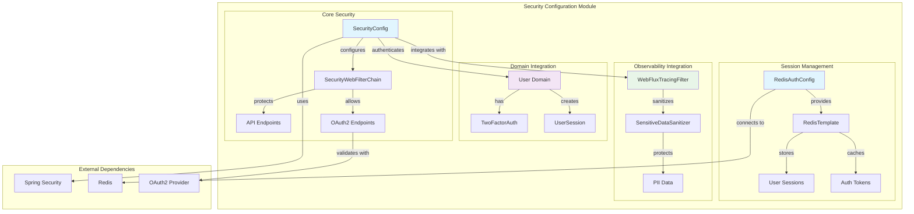
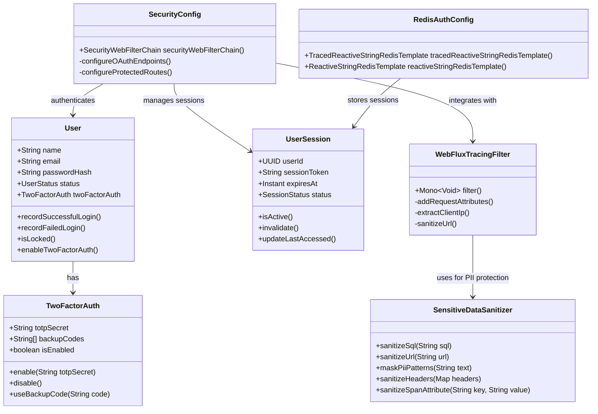
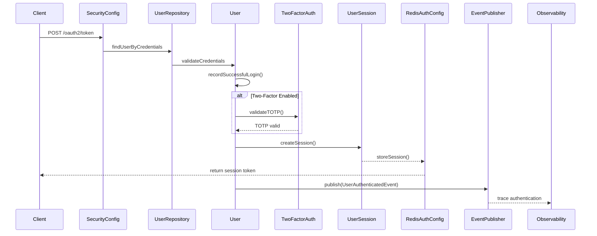
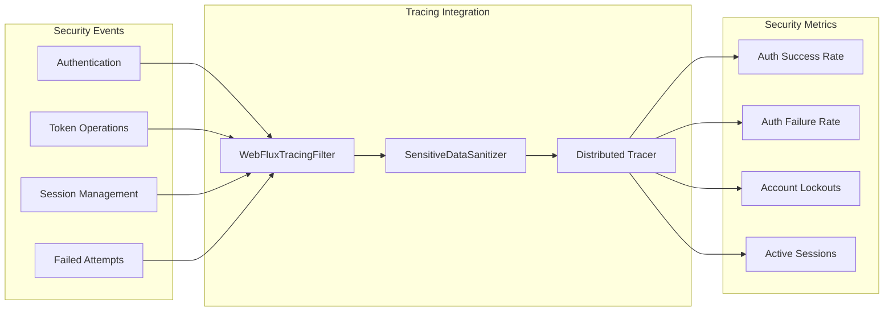

# Security Configuration Module

## Overview

The Security Configuration module is responsible for managing authentication, authorization, and security-related configurations within the Wallet Hub application. It provides the foundational security infrastructure that protects API endpoints, manages user sessions, and integrates with the broader observability system for security monitoring.

## Architecture

### Module Components



### Component Relationships



## Core Components

### 1. SecurityConfig

The main security configuration class that sets up the WebFlux security filter chain.

**Key Responsibilities:**
- Configures OAuth2 endpoints for public access
- Secures all other API endpoints requiring authentication
- Disables CSRF protection (stateless API)
- Disables HTTP Basic and form login (token-based auth only)

**Configuration Details:**
```java
@Configuration
@EnableWebFluxSecurity
public class SecurityConfig {
    @Bean
    public SecurityWebFilterChain securityWebFilterChain(ServerHttpSecurity http) {
        return http
            .csrf(ServerHttpSecurity.CsrfSpec::disable)
            .authorizeExchange(exchange -> exchange
                .pathMatchers("/oauth2/token", "/oauth2/revoke", "/auth/introspect").permitAll()
                .anyExchange().authenticated()
            )
            .httpBasic(ServerHttpSecurity.HttpBasicSpec::disable)
            .formLogin(ServerHttpSecurity.FormLoginSpec::disable)
            .build();
    }
}
```

**Public Endpoints:**
- `/oauth2/token` - Token issuance endpoint
- `/oauth2/revoke` - Token revocation endpoint  
- `/auth/introspect` - Token introspection endpoint

### 2. RedisAuthConfig

Provides Redis-based session and token management with tracing integration.

**Key Features:**
- Conditional tracing support (falls back to standard template when tracing unavailable)
- Integration with distributed tracing system
- Reactive Redis operations for session management

**Configuration Details:**
```java
@Configuration
public class RedisAuthConfig {
    @Bean
    @ConditionalOnClass(name = "io.micrometer.tracing.Tracer")
    public TracedReactiveStringRedisTemplate tracedReactiveStringRedisTemplate(
            ReactiveRedisConnectionFactory factory,
            Tracer tracer,
            TracingFeatureFlags featureFlags,
            ReactiveContextPropagator contextPropagator) {
        return new TracedReactiveStringRedisTemplate(factory, tracer, featureFlags, contextPropagator);
    }
    
    @Bean
    @ConditionalOnClass(name = "org.springframework.data.redis.core.ReactiveStringRedisTemplate")
    public ReactiveStringRedisTemplate reactiveStringRedisTemplate(
            ReactiveRedisConnectionFactory factory) {
        return new ReactiveStringRedisTemplate(factory);
    }
}
```

## Domain Integration

### User Authentication Flow



### Session Management

The module integrates with the User domain model to manage authentication states:

1. **User Status Management**: Users can be in various states (ACTIVE, PENDING_VERIFICATION, DEACTIVATED, SUSPENDED)
2. **Failed Login Protection**: Automatic account locking after 5 failed attempts (30-minute lockout)
3. **Session Tracking**: UserSession entities track login sessions with expiration
4. **Two-Factor Authentication**: TOTP-based 2FA with backup code support

## Observability Integration

### Security Event Tracing

The security module integrates with the tracing infrastructure to provide comprehensive security observability:



### PII Protection in Traces

The `SensitiveDataSanitizer` component ensures sensitive data is not exposed in traces:

**Protected Data Types:**
- Email addresses (`user@example.com` → `***@***.***`)
- Phone numbers (`555-123-4567` → `***-***-****`)
- Credit card numbers (`1234-5678-9012-3456` → `****-****-****-****`)
- JWT tokens (`eyJhbGciOiJ...` → `***`)
- Authorization headers (`Bearer abc123` → `Bearer ***`)
- Query parameters (`?token=abc123` → `?token=***`)

**SQL Sanitization:**
```sql
-- Original SQL:
SELECT * FROM users WHERE email = 'user@example.com' AND password = 'secret123'

-- Sanitized for traces:
SELECT * FROM users WHERE email = ? AND password = ?
```

## Configuration Properties

### Security Configuration

| Property | Default | Description |
|----------|---------|-------------|
| `security.oauth2.enabled` | `true` | Enable OAuth2 authentication |
| `security.csrf.enabled` | `false` | Disable CSRF for stateless API |
| `security.session.timeout` | `3600` | Session timeout in seconds |
| `security.max-failed-attempts` | `5` | Failed attempts before lockout |
| `security.lockout-duration` | `1800` | Lockout duration in seconds |

### Redis Configuration

| Property | Default | Description |
|----------|---------|-------------|
| `spring.redis.host` | `localhost` | Redis server host |
| `spring.redis.port` | `6379` | Redis server port |
| `spring.redis.timeout` | `2000` | Connection timeout in ms |
| `spring.redis.session-ttl` | `3600` | Session TTL in seconds |

## Security Best Practices

### 1. Authentication Flow
- Use OAuth2 token-based authentication
- Implement proper token validation and introspection
- Support refresh token rotation
- Implement token revocation

### 2. Session Management
- Store sessions in Redis with appropriate TTL
- Implement session invalidation on password change
- Track session metadata (IP, user agent, last access)
- Support concurrent session management

### 3. Account Protection
- Implement account lockout after failed attempts
- Support manual account unlocking
- Track login history and suspicious activities
- Integrate with security monitoring systems

### 4. Data Protection
- Never log sensitive data (passwords, tokens, PII)
- Use PII sanitization in all observability outputs
- Implement proper data masking in error messages
- Follow GDPR and data protection regulations

## Integration Points

### With Domain Models
- **User**: Authentication state, 2FA configuration, login tracking
- **UserSession**: Session management, expiration, validation
- **TwoFactorAuth**: TOTP secrets, backup codes, usage tracking

### With Infrastructure
- **RedisAuthConfig**: Session storage and token caching
- **WebFluxTracingFilter**: Security event tracing
- **SensitiveDataSanitizer**: PII protection in security traces

### With Events
- **UserAuthenticatedEvent**: Published on successful authentication
- **UserStatusChangedEvent**: Published on account status changes
- **UserCreatedEvent**: Published on user registration

## Monitoring and Alerting

### Key Metrics to Monitor
1. **Authentication Success Rate**: Should remain high (>99%)
2. **Failed Authentication Rate**: Spikes may indicate attack attempts
3. **Account Lockout Rate**: High rates may indicate credential stuffing
4. **Session Creation Rate**: Monitor for abnormal patterns
5. **2FA Usage Rate**: Track adoption and success rates

### Alerting Rules
- Alert on authentication failure rate > 5% over 5 minutes
- Alert on account lockout rate > 10 accounts per minute
- Alert on session creation rate > 1000 per minute (potential DoS)
- Alert on 2FA failure rate > 20% (potential bypass attempts)

## Future Enhancements

### Planned Features
1. **Rate Limiting**: Implement per-IP and per-user rate limiting
2. **Advanced Threat Detection**: ML-based anomaly detection
3. **Multi-factor Authentication**: Support for additional factors (SMS, hardware tokens)
4. **Password Policy Enforcement**: Configurable password complexity rules
5. **Security Headers**: CSP, HSTS, and other security headers

### Integration Roadmap
1. **SIEM Integration**: Send security events to SIEM systems
2. **Compliance Reporting**: Generate compliance reports (SOC2, ISO27001)
3. **Audit Logging**: Comprehensive audit trail for all security events
4. **Risk-based Authentication**: Adaptive authentication based on risk score

## Related Documentation

- [User Domain Model](domain_models.md) - User entity and authentication logic
- [Tracing Infrastructure](infrastructure_tracing.md) - Observability and PII protection
- [Event System](domain_events.md) - Security event publishing
- [Redis Configuration](infrastructure_data.md) - Session storage implementation

---

*Note: This is the initial security skeleton. Future tasks will add scopes, filter chain customization, metrics integration, and rate limiting.*