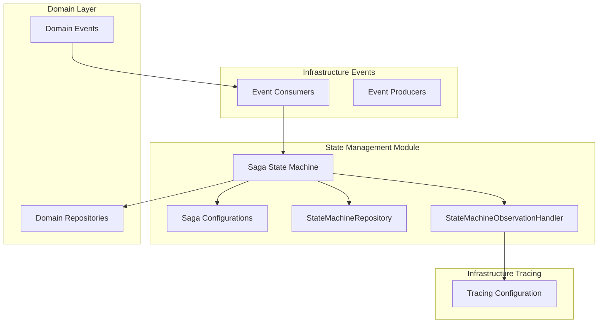
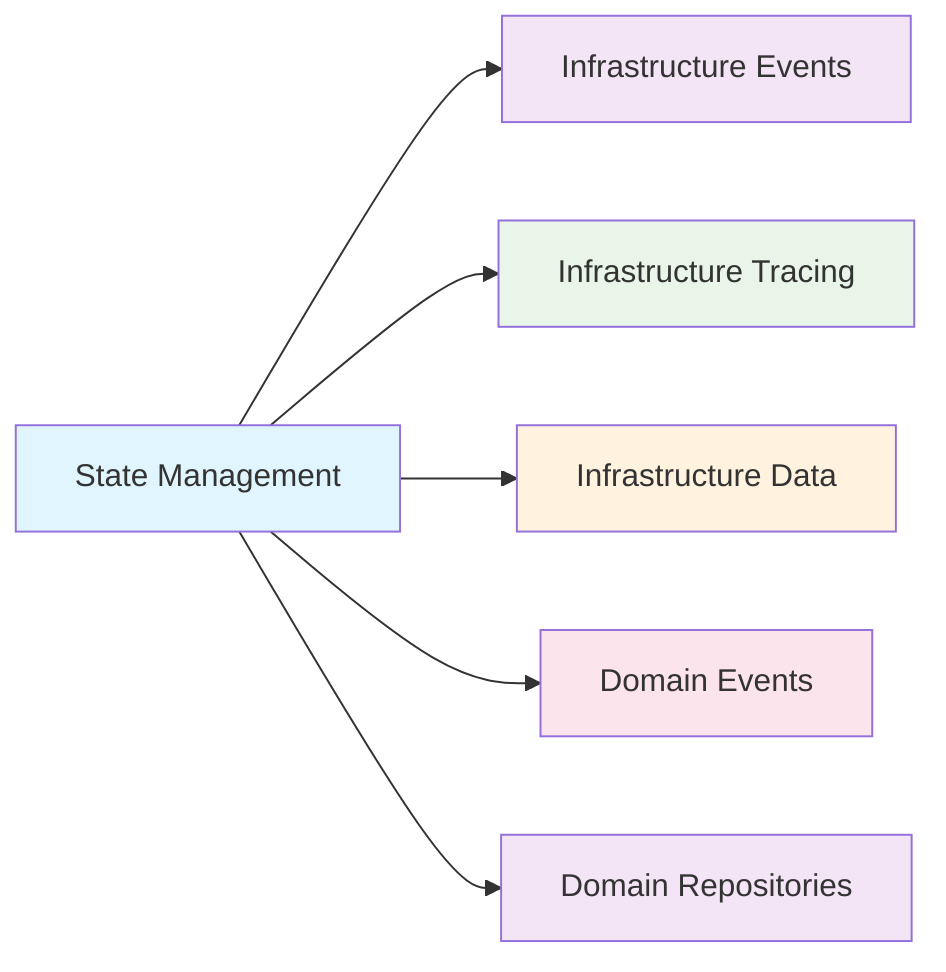
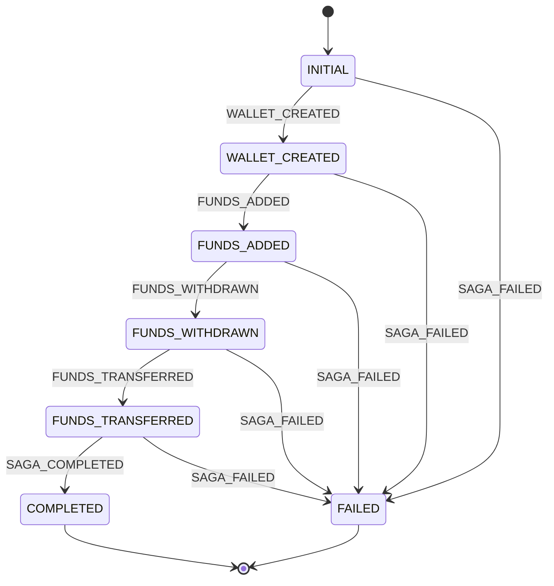
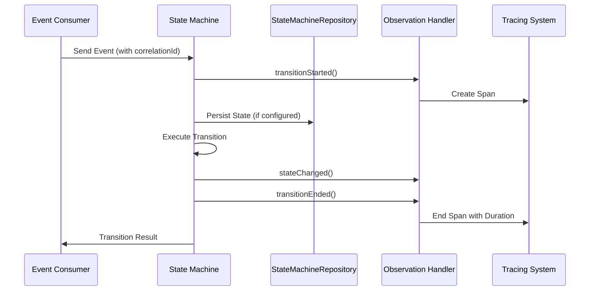

# State Management Module

## Overview

The State Management module provides a robust saga pattern implementation using Spring State Machine for managing distributed transactions in the Wallet Hub application. This module orchestrates complex multi-step workflows involving wallet creation, fund operations, and transaction processing while ensuring data consistency and fault tolerance.

## Core Purpose

The module's primary purpose is to:
1. **Coordinate Distributed Transactions**: Manage multi-step operations across different services and components
2. **Ensure Consistency**: Implement the saga pattern to maintain data consistency in distributed systems
3. **Provide Fault Tolerance**: Handle failures gracefully with compensation mechanisms
4. **Enable Observability**: Track and trace state transitions for monitoring and debugging

## Architecture

### Component Relationships



### Module Dependencies



## Core Components

### 1. Saga State Machine Configuration

#### `SagaStateMachineConfig`
**Profile**: `saga`
**Purpose**: Full-featured state machine configuration with JPA persistence

**Key Features**:
- **State Persistence**: Uses `JpaPersistingStateMachineInterceptor` for persistent state storage
- **Machine ID**: Configured as "sagaStateMachine"
- **Runtime Persistence**: Integrates with `StateMachineRepository` for state persistence

**Configuration Methods**:
- `configure(StateMachineStateConfigurer)`: Defines all saga states
- `configure(StateMachineTransitionConfigurer)`: Configures state transitions
- `configure(StateMachineConfigurationConfigurer)`: Sets up global configuration and persistence

#### `StandardSagaStateMachineConfig`
**Profile**: `!saga` (default)
**Purpose**: Lightweight configuration without persistence for simpler deployments

**Key Features**:
- **In-Memory State**: No persistence layer dependency
- **Same State/Transition Logic**: Identical state and transition definitions
- **Simplified Deployment**: No database dependencies

### 2. State and Event Definitions

#### `SagaStates` Enum
Defines all possible states in the saga lifecycle:

| State | Description | Type |
|-------|-------------|------|
| `INITIAL` | Starting state of the saga | Initial |
| `WALLET_CREATED` | Wallet successfully created | Intermediate |
| `FUNDS_ADDED` | Funds added to wallet | Intermediate |
| `FUNDS_WITHDRAWN` | Funds withdrawn from wallet | Intermediate |
| `FUNDS_TRANSFERRED` | Funds transferred between wallets | Intermediate |
| `COMPLETED` | Saga successfully completed | End |
| `FAILED` | Saga failed | End |
| `ANY` | Generic state for failure handling | Special |

#### `SagaEvents` Enum
Defines events that trigger state transitions:

| Event | Description | Triggers Transition |
|-------|-------------|-------------------|
| `WALLET_CREATED` | Wallet creation event | INITIAL → WALLET_CREATED |
| `FUNDS_ADDED` | Funds addition event | WALLET_CREATED → FUNDS_ADDED |
| `FUNDS_WITHDRAWN` | Funds withdrawal event | FUNDS_ADDED → FUNDS_WITHDRAWN |
| `FUNDS_TRANSFERRED` | Funds transfer event | FUNDS_WITHDRAWN → FUNDS_TRANSFERRED |
| `SAGA_COMPLETED` | Saga completion event | FUNDS_TRANSFERRED → COMPLETED |
| `SAGA_FAILED` | Saga failure event | Any state → FAILED |

### 3. State Machine Repository

#### `StateMachineRepository`
**Type**: Spring Data JPA Repository
**Purpose**: Provides persistence layer for state machine instances

**Key Features**:
- **Extends**: `JpaStateMachineRepository` from Spring State Machine
- **Auto-generated Implementation**: Spring Data generates repository implementation
- **Persistence Integration**: Used by `JpaPersistingStateMachineInterceptor`

### 4. State Machine Observation Handler

#### `StateMachineObservationHandler`
**Purpose**: Provides comprehensive observability for state machine operations

**Key Features**:
- **Transition Tracing**: Creates spans for each state transition
- **Performance Monitoring**: Tracks transition durations and detects slow transitions
- **Error Tracking**: Captures and reports state machine errors
- **Compensation Flow Detection**: Identifies transitions to FAILED state
- **Guard/Action Monitoring**: Tracks guard evaluations and action executions

**Configuration**:
- Enabled via `tracing.features.stateMachine=true` property
- Slow transition threshold: 5000ms (configurable)

## State Transition Flow

### Normal Saga Flow



### Data Flow Diagram



## Integration with Other Modules

### Event System Integration

The state management module integrates with the [infrastructure_events](infrastructure_events.md) module through event consumers:

| Event Consumer | Processes Event | Triggers State Transition |
|----------------|----------------|---------------------------|
| `WalletCreatedEventConsumer` | `WalletCreatedEvent` | `WALLET_CREATED` |
| `FundsAddedEventConsumer` | `FundsAddedEvent` | `FUNDS_ADDED` |
| `FundsWithdrawnEventConsumer` | `FundsWithdrawnEvent` | `FUNDS_WITHDRAWN` |
| `FundsTransferredEventConsumer` | `FundsTransferredEvent` | `FUNDS_TRANSFERRED` |

**Correlation ID Flow**:
1. Domain events include `correlationId` field
2. Event consumers extract correlation ID from events
3. State machine transitions use correlation ID for context
4. Tracing system propagates correlation ID through spans

### Tracing Integration

The module integrates with the [infrastructure_tracing](infrastructure_tracing.md) module:

1. **StateMachineObservationHandler**: Extends `StateMachineListenerAdapter`
2. **Span Creation**: Creates spans for each state transition
3. **Attribute Tracking**: Tags spans with state machine metadata
4. **Error Propagation**: Captures and reports state machine errors
5. **Performance Metrics**: Tracks transition durations

### Domain Integration

The module interacts with the [domain_models](domain_models.md) and [domain_repositories](domain_repositories.md) modules:

1. **Domain Events**: Consumes events from domain layer
2. **Repository Access**: Persists state through repositories
3. **Business Logic**: Orchestrates domain operations

## Configuration Options

### Spring Profiles

| Profile | Configuration Class | Features |
|---------|-------------------|----------|
| `saga` | `SagaStateMachineConfig` | Full persistence, JPA integration |
| `!saga` (default) | `StandardSagaStateMachineConfig` | In-memory, no persistence |

### Application Properties

```yaml
# State Machine Configuration
spring:
  statemachine:
    enabled: true
    
# Tracing Configuration
tracing:
  features:
    stateMachine: true  # Enable/disable state machine tracing
    
# Saga Configuration (optional)
saga:
  persistence:
    enabled: true  # Enable JPA persistence (requires 'saga' profile)
```

## Usage Examples

### 1. Sending Events to State Machine

```java
// From event consumer
@Bean
public Consumer<Message<WalletCreatedEvent>> walletCreatedConsumer(
        StateMachine<SagaStates, SagaEvents> stateMachine) {
    return message -> {
        var event = message.getPayload();
        var stateMachineMessage = MessageBuilder.withPayload(SagaEvents.WALLET_CREATED)
                .setHeader("correlationId", event.getCorrelationId())
                .build();
        stateMachine.sendEvent(Mono.just(stateMachineMessage)).subscribe();
    };
}
```

### 2. Monitoring State Transitions

```java
// Accessing state machine information
State<SagaStates, SagaEvents> currentState = stateMachine.getState();
Collection<State<SagaStates, SagaEvents>> states = stateMachine.getStates();
```

### 3. Handling Failure Scenarios

```java
// Triggering saga failure
stateMachine.sendEvent(Mono.just(
    MessageBuilder.withPayload(SagaEvents.SAGA_FAILED).build()
)).subscribe();
```

## Error Handling and Compensation

### Failure Scenarios

1. **Missing Correlation ID**: Events without correlation ID trigger `SAGA_FAILED`
2. **Transition Errors**: Exceptions during transitions are captured by observation handler
3. **Persistence Failures**: JPA persistence errors are handled gracefully

### Compensation Mechanisms

1. **Explicit Failure Transitions**: Every state has a direct transition to `FAILED`
2. **Error Propagation**: Errors are propagated through tracing system
3. **State Recovery**: Persistent state machines can recover from failures

## Performance Considerations

### State Persistence

- **With `saga` profile**: State persisted to database, suitable for production
- **Without `saga` profile**: In-memory state, suitable for testing/development

### Transition Performance

- **Observation Overhead**: Tracing adds minimal overhead (configurable)
- **Slow Transition Detection**: Alerts for transitions >5000ms
- **Concurrent Operations**: Thread-safe observation handler

## Testing Strategies

### Unit Testing

```java
@SpringBootTest
@ActiveProfiles("test")
class SagaStateMachineTest {
    
    @Autowired
    private StateMachine<SagaStates, SagaEvents> stateMachine;
    
    @Test
    void testWalletCreationFlow() {
        // Test state transitions
        stateMachine.sendEvent(SagaEvents.WALLET_CREATED);
        assertEquals(SagaStates.WALLET_CREATED, stateMachine.getState().getId());
    }
}
```

### Integration Testing

1. **Event Consumer Tests**: Verify event processing
2. **State Persistence Tests**: Test JPA persistence (with `saga` profile)
3. **Tracing Integration Tests**: Verify span creation and attributes

## Monitoring and Observability

### Key Metrics

1. **Transition Duration**: Time taken for state transitions
2. **Error Rate**: Percentage of failed transitions
3. **State Distribution**: Distribution of state machine instances across states
4. **Compensation Rate**: Frequency of compensation flows

### Tracing Attributes

Each state transition span includes:
- `statemachine.id`: Unique machine identifier
- `statemachine.type`: Always "saga"
- `statemachine.state.from`: Source state
- `statemachine.state.to`: Target state
- `statemachine.event`: Triggering event
- `statemachine.transition.duration_ms`: Transition duration
- `statemachine.compensation`: "true" for failure transitions

## Best Practices

### 1. Correlation ID Management
- Always include correlation ID in domain events
- Propagate correlation ID through all state transitions
- Use correlation ID for trace correlation

### 2. State Machine Design
- Keep state machines focused on single business processes
- Define clear failure transitions from every state
- Use meaningful state and event names

### 3. Observability
- Enable state machine tracing in production
- Monitor slow transition thresholds
- Track compensation flow rates

### 4. Testing
- Test both success and failure scenarios
- Verify state persistence (if enabled)
- Test with different correlation IDs

## Related Documentation

- [Infrastructure Events](infrastructure_events.md): Event producers and consumers
- [Infrastructure Tracing](infrastructure_tracing.md): Tracing and observability
- [Domain Models](domain_models.md): Domain entities and events
- [Domain Repositories](domain_repositories.md): Data access layer
- [Infrastructure Data](infrastructure_data.md): Data persistence and repositories

## Future Enhancements

### Planned Features

1. **Dynamic State Machine Configuration**: Runtime configuration updates
2. **Enhanced Compensation Logic**: Sophisticated compensation strategies
3. **State Machine Versioning**: Support for multiple state machine versions
4. **Advanced Monitoring**: Real-time state machine dashboard

### Technical Debt

1. **Legacy Event Support**: Deprecated non-CloudEvent consumers
2. **Configuration Simplification**: Reduce profile-based complexity
3. **Performance Optimization**: Optimize JPA persistence for high throughput