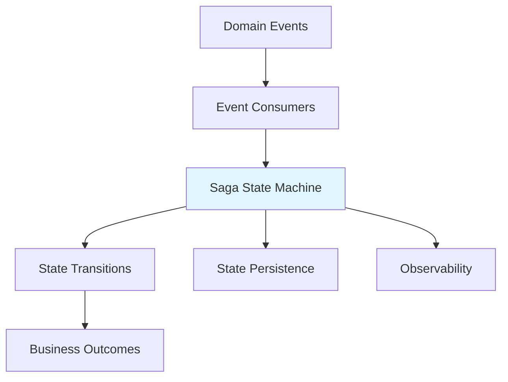

# State Management Module - Introduction

## Quick Overview

The State Management module implements the **Saga Pattern** using **Spring State Machine** to orchestrate distributed transactions in the Wallet Hub application. It provides a robust framework for managing complex multi-step workflows involving wallet operations, fund management, and transaction processing.

## Key Features

- **Saga Pattern Implementation**: Coordinates distributed transactions across services
- **Spring State Machine Integration**: Leverages Spring's state machine framework
- **Dual Configuration Profiles**: Supports both persistent (`saga` profile) and in-memory (`!saga` profile) configurations
- **Comprehensive Observability**: Integrated tracing with detailed state transition monitoring
- **Fault Tolerance**: Built-in compensation mechanisms for failure handling

## Core Components

1. **Saga State Machine Configurations**:
   - `SagaStateMachineConfig`: Full-featured with JPA persistence
   - `StandardSagaStateMachineConfig`: Lightweight in-memory configuration

2. **State/Event Definitions**:
   - `SagaStates`: Enum defining all saga states
   - `SagaEvents`: Enum defining transition-triggering events

3. **Persistence Layer**:
   - `StateMachineRepository`: JPA repository for state persistence

4. **Observability**:
   - `StateMachineObservationHandler`: Tracing and monitoring integration

## Quick Start

### Basic Configuration

```java
// Using default in-memory configuration
@SpringBootApplication
public class Application {
    public static void main(String[] args) {
        SpringApplication.run(Application.class, args);
    }
}

// Using persistent configuration
@SpringBootApplication
@Profile("saga")
public class Application {
    public static void main(String[] args) {
        SpringApplication.run(Application.class, args);
    }
}
```

### Sending Events

```java
// Trigger state transition
stateMachine.sendEvent(Mono.just(
    MessageBuilder.withPayload(SagaEvents.WALLET_CREATED)
        .setHeader("correlationId", correlationId)
        .build()
));
```

## Architecture Diagram



## When to Use

Use this module when you need to:

1. **Coordinate multi-step operations** across different services
2. **Ensure data consistency** in distributed transactions
3. **Implement compensation logic** for failure scenarios
4. **Monitor complex workflows** with detailed tracing
5. **Manage stateful processes** that require persistence

## Integration Points

- **Event System**: Consumes domain events from [infrastructure_events](infrastructure_events.md)
- **Tracing**: Integrates with [infrastructure_tracing](infrastructure_tracing.md) for observability
- **Persistence**: Uses [infrastructure_data](infrastructure_data.md) for state storage
- **Domain Layer**: Orchestrates operations defined in [domain_models](domain_models.md)

## Next Steps

For comprehensive documentation including:
- Detailed architecture diagrams
- Complete API reference
- Configuration options
- Performance considerations
- Testing strategies
- Best practices

Please refer to the [full State Management documentation](state_management.md).

## Common Use Cases

1. **Wallet Creation Flow**: Create wallet → Add funds → Complete setup
2. **Fund Transfer Process**: Validate → Withdraw → Transfer → Confirm
3. **Transaction Processing**: Initiate → Validate → Execute → Confirm
4. **Error Recovery**: Detect failure → Compensate → Notify

## Support

- **Profile-based Configuration**: Choose between persistent and in-memory modes
- **Extensive Tracing**: Monitor every state transition
- **Failure Handling**: Built-in compensation mechanisms
- **Scalable Design**: Suitable for high-throughput applications