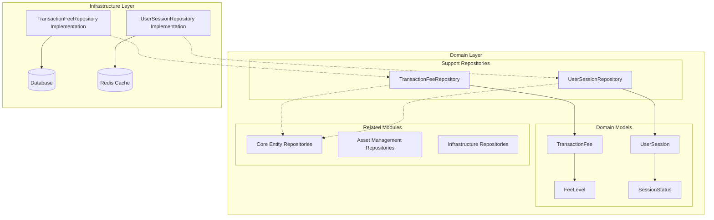
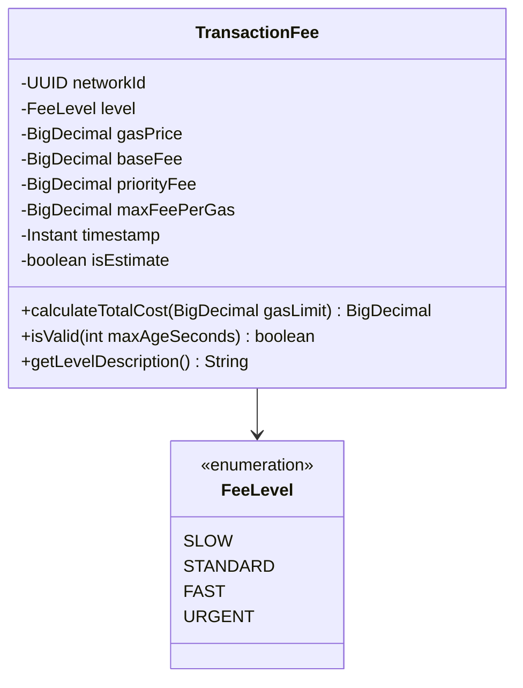
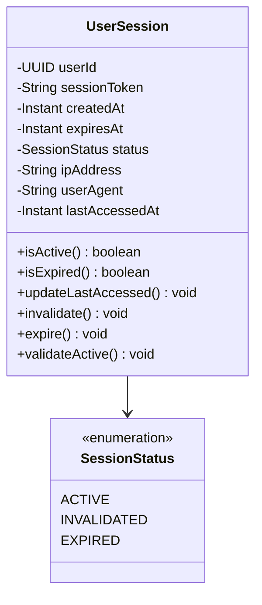
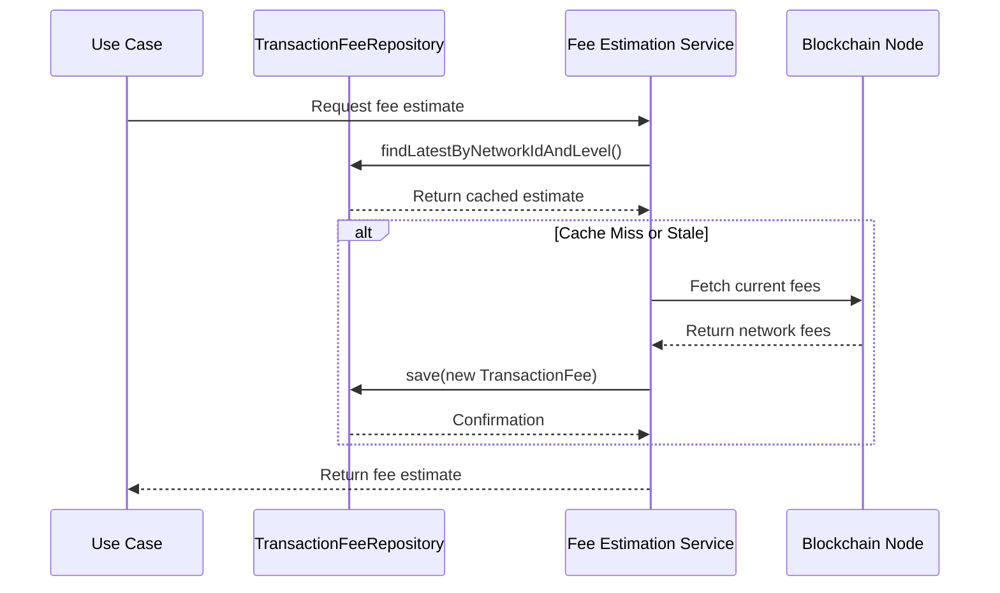
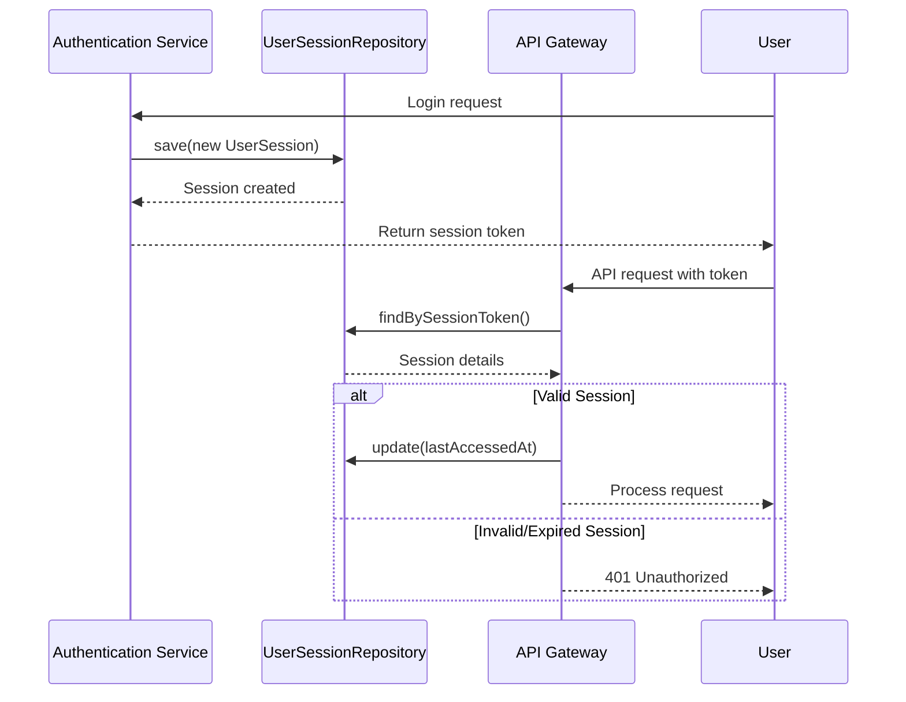
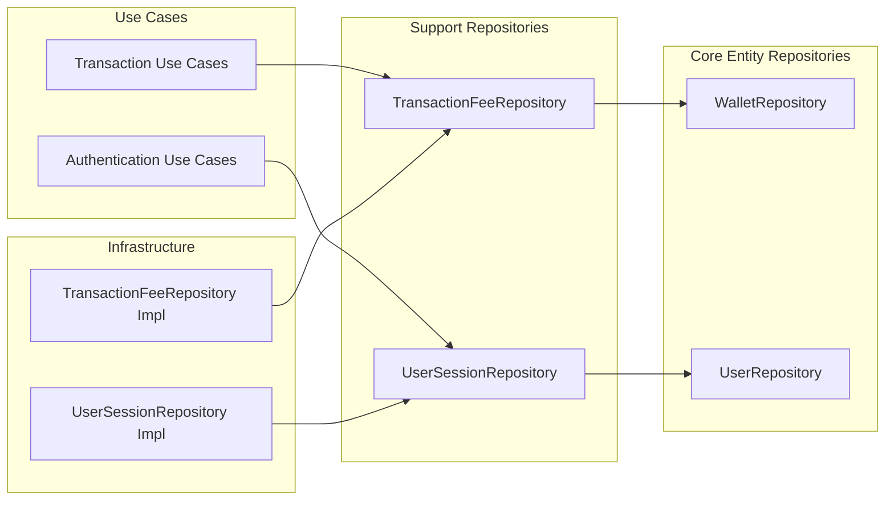

# Support Repositories Module

## Overview

The **Support Repositories** module provides specialized repository interfaces for managing auxiliary domain entities that support core business operations in the Wallet Hub system. This module focuses on two key areas:

1. **Transaction Fee Management** - Repository for storing and retrieving transaction fee estimates across different blockchain networks
2. **User Session Management** - Repository for managing user authentication sessions and session lifecycle

These repositories are part of the domain layer and follow the repository pattern, providing abstraction over data persistence while maintaining domain-driven design principles.

## Module Architecture



## Core Components

### 1. TransactionFeeRepository

The `TransactionFeeRepository` interface manages transaction fee estimates for different blockchain networks and fee levels.

#### Key Responsibilities:
- Store and retrieve transaction fee estimates
- Query fees by network and fee level
- Manage fee estimate lifecycle (cleanup of old estimates)
- Support fee calculation for transaction cost estimation

#### Interface Definition:

```java
public interface TransactionFeeRepository {
    TransactionFee save(TransactionFee transactionFee);
    
    Optional<TransactionFee> findById(UUID id);
    
    List<TransactionFee> findByNetworkId(UUID networkId);
    
    List<TransactionFee> findByNetworkIdAndLevel(UUID networkId, FeeLevel level);
    
    Optional<TransactionFee> findLatestByNetworkIdAndLevel(UUID networkId, FeeLevel level);
    
    List<TransactionFee> findAll();
    
    void delete(UUID id);
    
    void deleteOldEstimates(int maxAgeSeconds);
    
    boolean existsById(UUID id);
}
```

#### Key Methods:

| Method | Description | Use Case |
|--------|-------------|----------|
| `save()` | Persists a transaction fee estimate | When new fee estimates are fetched from blockchain nodes |
| `findByNetworkIdAndLevel()` | Retrieves fees for specific network and level | When estimating transaction costs for a specific network |
| `findLatestByNetworkIdAndLevel()` | Gets the most recent fee estimate | For real-time transaction cost calculation |
| `deleteOldEstimates()` | Cleans up stale fee estimates | Scheduled cleanup job to maintain data freshness |

#### Fee Levels:
The repository supports four fee levels defined in the `FeeLevel` enum:
- **SLOW**: Economy pricing, slower confirmation
- **STANDARD**: Normal confirmation speed (recommended for most transactions)
- **FAST**: Quick confirmation, higher cost
- **URGENT**: Fastest confirmation, highest cost

### 2. UserSessionRepository

The `UserSessionRepository` interface manages user authentication sessions, providing session persistence and lifecycle management.

#### Key Responsibilities:
- Store and retrieve user sessions
- Manage session expiration and invalidation
- Track session activity and access patterns
- Support session-based authentication

#### Interface Definition:

```java
public interface UserSessionRepository {
    UserSession save(UserSession session);
    
    Optional<UserSession> findById(UUID id);
    
    Optional<UserSession> findBySessionToken(String sessionToken);
    
    List<UserSession> findByUserId(UUID userId);
    
    List<UserSession> findActiveByUserId(UUID userId);
    
    void delete(UUID id);
    
    void deleteExpiredSessions(Instant before);
    
    void invalidateAllUserSessions(UUID userId);
    
    boolean existsActiveSessionForUser(UUID userId);
    
    void update(UserSession session);
}
```

#### Key Methods:

| Method | Description | Use Case |
|--------|-------------|----------|
| `save()` | Creates a new user session | During user login/authentication |
| `findBySessionToken()` | Retrieves session by token | Session validation in API requests |
| `findActiveByUserId()` | Gets all active sessions for a user | User session management UI |
| `invalidateAllUserSessions()` | Invalidates all sessions for a user | Security measure during password reset or suspicious activity |
| `deleteExpiredSessions()` | Cleans up expired sessions | Scheduled cleanup job |

#### Session Status:
Sessions can be in one of three states defined in `SessionStatus`:
- **ACTIVE**: Valid and usable for authentication
- **INVALIDATED**: Manually revoked (e.g., user logout, security event)
- **EXPIRED**: Automatically expired based on time-to-live

## Domain Models

### TransactionFee Entity

The `TransactionFee` entity represents a fee estimate for blockchain transactions.



**Key Features:**
- Supports both legacy gas price and EIP-1559 fee structure (base fee + priority fee)
- Automatic calculation of `maxFeePerGas` (baseFee + priorityFee)
- Built-in validation for fee estimate freshness
- Utility methods for cost calculation and UI display

### UserSession Entity

The `UserSession` entity represents a user authentication session.



**Key Features:**
- Automatic timestamp management (createdAt, lastAccessedAt)
- Session status management with validation
- Support for session metadata (IP address, user agent)
- Built-in expiration checking

## Data Flow

### Transaction Fee Management Flow



### User Session Management Flow



## Integration Points

### Dependencies



### Related Modules:
1. **[core_entity_repositories.md](core_entity_repositories.md)** - For `UserRepository` and `WalletRepository` dependencies
2. **[asset_management_repositories.md](asset_management_repositories.md)** - For related asset management operations
3. **[infrastructure_repositories.md](infrastructure_repositories.md)** - For infrastructure-related repository patterns

## Implementation Considerations

### TransactionFeeRepository Implementation

**Storage Strategy:**
- Time-series data structure for fee estimates
- Indexing on `(networkId, level, timestamp)` for efficient queries
- TTL-based cleanup for stale estimates

**Performance Considerations:**
- Cache frequently accessed fee estimates (e.g., latest STANDARD fees for popular networks)
- Batch cleanup operations for old estimates
- Consider read replicas for high query volume

### UserSessionRepository Implementation

**Storage Strategy:**
- High-performance key-value store (Redis recommended)
- Session token as primary key
- Secondary indexes on `userId` and `status`
- Automatic TTL based on `expiresAt`

**Security Considerations:**
- Secure session token generation
- Encryption of sensitive session data
- Rate limiting for session creation
- Audit logging for session invalidation events

## Usage Examples

### Transaction Fee Management

```java
// Getting fee estimate for a transaction
public BigDecimal estimateTransactionCost(UUID networkId, BigDecimal gasLimit) {
    Optional<TransactionFee> fee = transactionFeeRepository
        .findLatestByNetworkIdAndLevel(networkId, FeeLevel.STANDARD);
    
    if (fee.isPresent()) {
        return fee.get().calculateTotalCost(gasLimit);
    }
    
    // Fallback to default calculation
    return calculateDefaultFee(networkId, gasLimit);
}

// Cleaning up old fee estimates
@Scheduled(fixedRate = 3600000) // Every hour
public void cleanupOldFeeEstimates() {
    // Delete estimates older than 1 hour
    transactionFeeRepository.deleteOldEstimates(3600);
}
```

### User Session Management

```java
// Creating a new session
public UserSession createSession(UUID userId, String ipAddress, String userAgent) {
    String sessionToken = generateSecureToken();
    Instant expiresAt = Instant.now().plus(Duration.ofDays(7));
    
    UserSession session = UserSession.create(
        UUID.randomUUID(),
        userId,
        sessionToken,
        expiresAt
    );
    
    session.setIpAddress(ipAddress);
    session.setUserAgent(userAgent);
    
    return userSessionRepository.save(session);
}

// Validating session in API request
public User validateSession(String sessionToken) {
    Optional<UserSession> session = userSessionRepository
        .findBySessionToken(sessionToken);
    
    if (session.isEmpty() || !session.get().isActive()) {
        throw new UnauthorizedException("Invalid or expired session");
    }
    
    session.get().updateLastAccessed();
    userSessionRepository.update(session.get());
    
    return userRepository.findById(session.get().getUserId())
        .orElseThrow(() -> new NotFoundException("User not found"));
}
```

## Testing Strategy

### Unit Tests
- Repository interface contracts
- Domain entity behavior
- Business logic validation

### Integration Tests
- Repository implementation with actual database
- Session persistence and retrieval
- Fee estimate cleanup operations

### Performance Tests
- Session lookup performance under load
- Concurrent session management
- Fee estimation query performance

## Monitoring and Observability

### Key Metrics
- **Session creation rate** - Tracks authentication activity
- **Active sessions count** - Monitors system load
- **Session invalidation rate** - Security monitoring
- **Fee estimate accuracy** - Quality of fee predictions
- **Cache hit rate** - Performance optimization

### Health Checks
- Repository connectivity
- Session storage availability
- Fee estimation service health
- Cleanup job execution status

## Security Considerations

### Session Security
- Secure token generation using cryptographically secure random
- HTTPS-only cookie transmission
- Session fixation prevention
- Cross-site request forgery (CSRF) protection

### Data Protection
- Encryption of sensitive session metadata
- Secure storage of fee estimation data
- Access control for repository operations
- Audit logging for security events

## Future Enhancements

### Planned Features
1. **Multi-network fee aggregation** - Aggregate fees across multiple blockchain networks
2. **Predictive fee estimation** - Machine learning-based fee prediction
3. **Session analytics** - Detailed session usage analytics
4. **Distributed session management** - Support for multi-region session storage

### Scalability Improvements
- Sharded session storage for high-volume applications
- Read-optimized fee estimation cache
- Async session cleanup operations
- Geo-distributed session replication

## Conclusion

The Support Repositories module provides essential infrastructure for two critical aspects of the Wallet Hub system: transaction cost management and user session management. By abstracting these concerns into dedicated repository interfaces, the system maintains clean separation of concerns while providing robust, scalable solutions for these supporting functions.

The module follows domain-driven design principles, with clear entity definitions and repository contracts that can be implemented using various persistence technologies based on specific requirements (e.g., Redis for sessions, PostgreSQL for fee estimates).

For more information on related components, refer to:
- [core_entity_repositories.md](core_entity_repositories.md) - Core entity management
- [domain_models.md](domain_models.md) - Domain model definitions
- [infrastructure_data.md](infrastructure_data.md) - Infrastructure implementation details