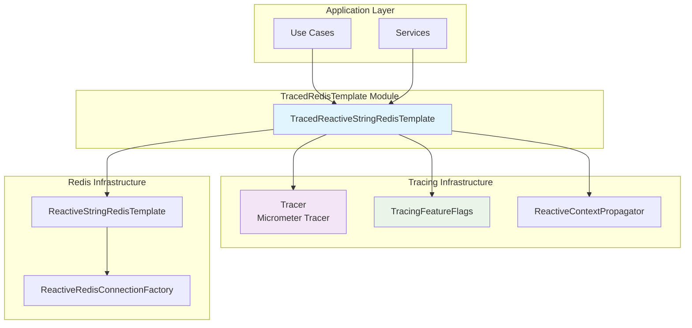
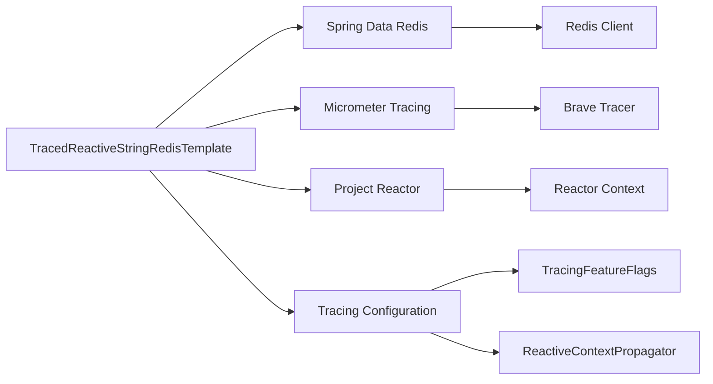
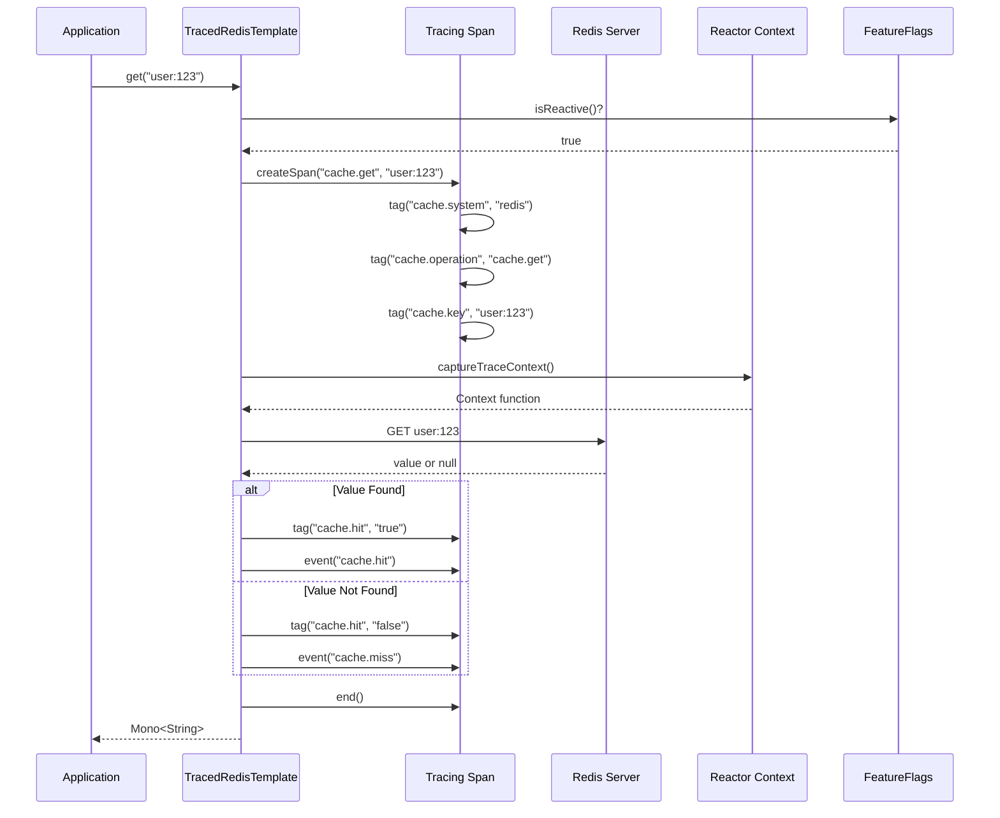
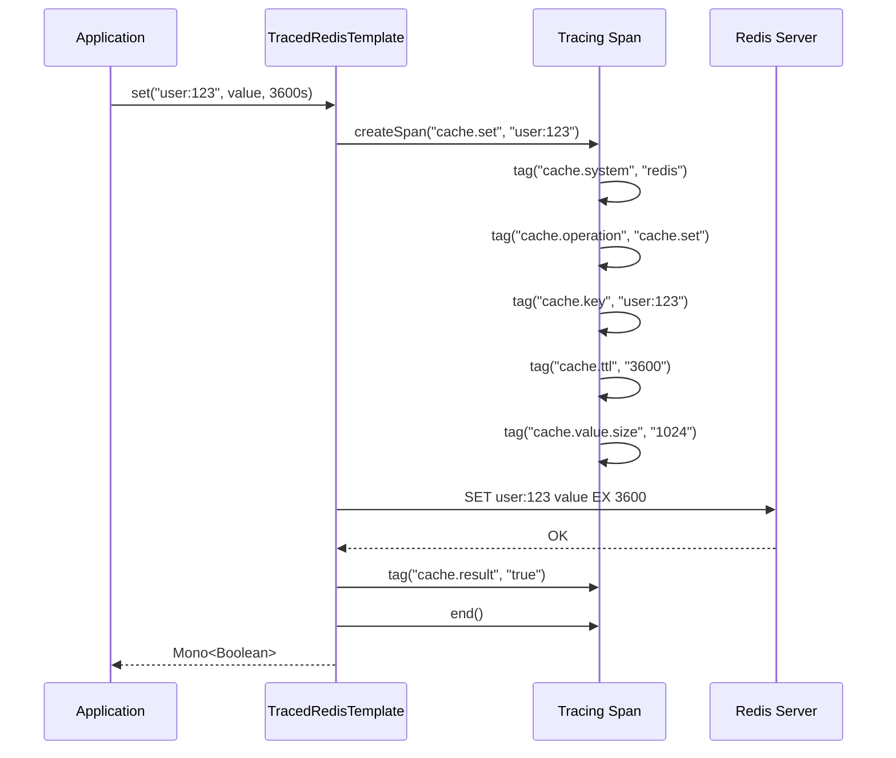

# TracedReactiveStringRedisTemplate Module

## Overview

The `TracedReactiveStringRedisTemplate` module provides a distributed tracing wrapper for Redis operations in reactive applications. It integrates with the WalletHub's observability infrastructure to add comprehensive tracing to all Redis cache operations, enabling end-to-end visibility into cache performance, hit rates, and error patterns.

### Key Features
- **Automatic span creation** for Redis operations (get, set, delete, exists, multiGet, multiSet)
- **Cache-specific span attributes** (cache.system, cache.operation, cache.key, cache.hit, cache.ttl)
- **Span events** for cache hits, misses, and errors
- **Reactive context propagation** across async boundaries
- **Performance monitoring** with operation timing and result tracking
- **Feature flag control** for enabling/disabling reactive tracing

## Architecture

### Component Relationships



### Dependencies



## Core Components

### TracedReactiveStringRedisTemplate Class

The main class that wraps `ReactiveStringRedisTemplate` with tracing capabilities.

#### Constructor
```java
public TracedReactiveStringRedisTemplate(
    ReactiveRedisConnectionFactory connectionFactory,
    Tracer tracer,
    TracingFeatureFlags featureFlags,
    ReactiveContextPropagator contextPropagator)
```

**Parameters:**
- `connectionFactory`: Redis connection factory for creating the underlying template
- `tracer`: Micrometer Tracer for creating spans
- `featureFlags`: Controls whether reactive tracing is enabled
- `contextPropagator`: Manages trace context propagation in reactive pipelines

#### Key Methods

| Method | Description | Span Attributes |
|--------|-------------|-----------------|
| `get(String key)` | Retrieves value with cache hit/miss tracking | `cache.hit`, `cache.key` |
| `set(String key, String value)` | Sets value with size tracking | `cache.value.size`, `cache.result` |
| `set(String key, String value, Duration timeout)` | Sets value with TTL | `cache.ttl`, `cache.value.size` |
| `delete(String key)` | Deletes key | `cache.result` |
| `exists(String key)` | Checks key existence | `cache.result` |
| `multiGet(Collection<String> keys)` | Batch retrieval | `cache.keys.count`, `cache.hits`, `cache.misses` |
| `multiSet(Map<String, String> map)` | Batch set | `cache.keys.count`, `cache.result` |
| `getDelegate()` | Access to underlying template | - |

## Span Attributes and Events

### Standard Span Attributes

| Attribute | Type | Description | Example |
|-----------|------|-------------|---------|
| `cache.system` | String | Cache system identifier | `"redis"` |
| `cache.operation` | String | Operation type | `"cache.get"`, `"cache.set"` |
| `cache.key` | String | Redis key (sanitized) | `"user:123"` |
| `cache.hit` | Boolean | Cache hit status | `"true"`, `"false"` |
| `cache.ttl` | Number | TTL in seconds | `"3600"` |
| `cache.value.size` | Number | Value size in bytes | `"1024"` |
| `cache.result` | Boolean | Operation result | `"true"`, `"false"` |
| `cache.keys.count` | Number | Number of keys in batch | `"5"` |
| `cache.hits` | Number | Number of hits in batch | `"3"` |
| `cache.misses` | Number | Number of misses in batch | `"2"` |
| `error.type` | String | Error class name | `"RedisConnectionException"` |
| `error.message` | String | Error message | `"Connection refused"` |

### Span Events

| Event | Trigger | Description |
|-------|---------|-------------|
| `cache.hit` | Key found in cache | Indicates successful cache retrieval |
| `cache.miss` | Key not found in cache | Indicates cache miss (value is null) |
| `cache.error` | Operation failed | Indicates Redis operation failure |

## Configuration

### Bean Configuration

```java
@Configuration
public class RedisTracingConfig {
    
    @Bean
    public TracedReactiveStringRedisTemplate tracedRedisTemplate(
        ReactiveRedisConnectionFactory factory,
        Tracer tracer,
        TracingFeatureFlags flags,
        ReactiveContextPropagator propagator) {
        return new TracedReactiveStringRedisTemplate(factory, tracer, flags, propagator);
    }
}
```

### Application Properties

```yaml
# Enable/disable reactive tracing
tracing:
  features:
    reactive: true  # Enables reactive tracing including Redis
    
# Redis configuration
spring:
  data:
    redis:
      host: localhost
      port: 6379
      timeout: 2000ms
      connect-timeout: 1000ms
```

### Feature Flags

The module respects the `tracing.features.reactive` flag from [TracingFeatureFlags](tracing_configuration.md#tracingfeatureflags). When disabled, operations bypass tracing and delegate directly to the underlying Redis template.

## Usage Examples

### Basic Cache Operations

```java
@Service
public class UserService {
    
    private final TracedReactiveStringRedisTemplate tracedRedis;
    
    public Mono<User> getUser(String userId) {
        return tracedRedis.get("user:" + userId)
            .map(value -> deserializeUser(value))
            .switchIfEmpty(fetchFromDatabase(userId));
    }
    
    public Mono<Boolean> cacheUser(User user) {
        String key = "user:" + user.getId();
        String value = serializeUser(user);
        return tracedRedis.set(key, value, Duration.ofHours(1));
    }
}
```

### Batch Operations with Tracing

```java
@Service
public class BatchCacheService {
    
    public Mono<List<String>> getMultipleUsers(List<String> userIds) {
        List<String> keys = userIds.stream()
            .map(id -> "user:" + id)
            .collect(Collectors.toList());
        
        return tracedRedis.multiGet(keys)
            .map(values -> values.stream()
                .filter(Objects::nonNull)
                .collect(Collectors.toList()));
    }
}
```

### Error Handling with Tracing

```java
public Mono<String> getWithFallback(String key) {
    return tracedRedis.get(key)
        .onErrorResume(error -> {
            // Error is already captured in span
            log.error("Cache error for key {}: {}", key, error.getMessage());
            return fetchFromFallback(key);
        });
}
```

## Data Flow

### Get Operation Flow



### Set Operation with TTL Flow



## Integration with Other Modules

### Tracing Infrastructure

The module integrates with the broader tracing infrastructure:

1. **TracingConfiguration**: Provides the overall tracing setup and span exporters
2. **TracingFeatureFlags**: Controls whether reactive tracing is enabled
3. **ReactiveContextPropagator**: Manages trace context propagation in reactive pipelines
4. **Span Exporters**: Exports spans to configured backends (Zipkin/Tempo)

### Use Case Tracing

When used within use cases instrumented by [UseCaseTracingAspect](use_case_tracing.md), Redis operations appear as child spans of the use case span, providing hierarchical visibility:

```
UseCase:GetUserDetails
├── Repository:findById
├── Cache:get(user:123) [hit]
└── ExternalAPI:fetchProfile
```

### Repository Tracing

When combined with [RepositoryTracingAspect](repository_tracing.md), provides complete visibility into data access patterns:

```
Repository:UserRepository.findByEmail
├── Cache:get(user:by-email:alice@example.com) [miss]
└── Database:SELECT * FROM users WHERE email = ?
```

## Performance Considerations

### Overhead Analysis

| Operation | Tracing Overhead | Notes |
|-----------|-----------------|-------|
| Span Creation | ~0.1-0.3ms | Creating span and setting attributes |
| Context Propagation | ~0.05-0.1ms | Capturing/restoring Reactor Context |
| Total per Operation | ~0.15-0.4ms | Acceptable for most use cases |

### Optimization Strategies

1. **Batch Operations**: Use `multiGet`/`multiSet` for multiple keys to reduce span count
2. **Feature Flags**: Disable reactive tracing (`tracing.features.reactive=false`) in high-throughput scenarios
3. **Sampling**: Configure sampling rates in [TracingConfiguration](tracing_configuration.md) to reduce volume
4. **Key Sanitization**: Sensitive keys are automatically sanitized in span attributes

### Memory Impact

- Each span consumes ~1-2KB of memory
- Spans are exported asynchronously and garbage collected
- High-volume systems (>1000 ops/sec) should monitor heap usage

## Error Handling and Resilience

### Error Tracking

The module automatically captures Redis errors in spans:

```java
span.tag("error.type", error.getClass().getSimpleName());
span.tag("error.message", error.getMessage());
span.event("cache.error");
```

### Circuit Breaker Integration

When used with [CircuitBreakerTracingDecorator](circuit_breaker_tracing.md), provides additional resilience metrics:

- Circuit breaker state transitions
- Failure rates and thresholds
- Slow operation detection

## Monitoring and Observability

### Key Metrics to Monitor

| Metric | Description | Alert Threshold |
|--------|-------------|-----------------|
| Cache Hit Rate | `cache.hits / (cache.hits + cache.misses)` | < 0.8 (80%) |
| Cache Error Rate | Failed operations / total operations | > 0.01 (1%) |
| Cache Latency P95 | 95th percentile operation duration | > 50ms |
| Batch Operation Size | Average keys per batch operation | Context-dependent |

### Dashboard Examples

**Redis Cache Performance Dashboard:**
- Cache hit/miss ratio over time
- Operation latency distribution
- Error rate and types
- Top keys by access frequency

**Business Impact Dashboard:**
- Cache savings (reduced database load)
- User experience impact (reduced latency)
- Cost savings (reduced external API calls)

## Testing

### Unit Testing

```java
@ExtendWith(MockitoExtension.class)
class TracedRedisTemplateTest {
    
    @Mock ReactiveRedisConnectionFactory connectionFactory;
    @Mock Tracer tracer;
    @Mock TracingFeatureFlags featureFlags;
    @Mock ReactiveContextPropagator contextPropagator;
    @Mock Span span;
    
    @Test
    void testGetOperationWithTracing() {
        when(featureFlags.isReactive()).thenReturn(true);
        when(tracer.nextSpan()).thenReturn(span);
        
        TracedReactiveStringRedisTemplate template = 
            new TracedReactiveStringRedisTemplate(connectionFactory, tracer, featureFlags, contextPropagator);
        
        // Test get operation
        // Verify span creation and attributes
    }
}
```

### Integration Testing

```java
@SpringBootTest
@AutoConfigureMockMvc
class RedisTracingIntegrationTest {
    
    @Autowired
    private TracedReactiveStringRedisTemplate tracedRedis;
    
    @Test
    void testEndToEndTracing() {
        tracedRedis.set("test:key", "value", Duration.ofSeconds(10)).block();
        String result = tracedRedis.get("test:key").block();
        
        assertEquals("value", result);
        // Verify spans exported to tracing backend
    }
}
```

## Troubleshooting

### Common Issues

| Issue | Symptoms | Solution |
|-------|----------|----------|
| No spans created | Operations work but no traces in backend | Check `tracing.features.reactive` flag |
| Context loss | Spans not linked to parent trace | Ensure `.contextWrite(captureTraceContext())` |
| High latency | Redis operations slower with tracing | Disable tracing or reduce sampling rate |
| Memory leak | Heap usage grows over time | Check span exporter configuration |

### Debug Logging

Enable debug logging for troubleshooting:

```yaml
logging:
  level:
    dev.bloco.wallet.hub.infra.adapter.tracing.decorator: DEBUG
    io.micrometer.tracing: DEBUG
```

### Health Checks

The module integrates with [TracingHealthIndicator](tracing_health.md) to provide health status:
- Redis connection health
- Span export health
- Tracing backend connectivity

## Best Practices

### Key Design

1. **Use descriptive keys**: `user:{id}:profile` not `u:{id}:p`
2. **Implement TTL**: Always set appropriate expiration times
3. **Batch operations**: Use `multiGet`/`multiSet` for related data
4. **Monitor hit rates**: Aim for >80% cache hit rate

### Tracing Configuration

1. **Enable in production**: Keep tracing enabled for observability
2. **Adjust sampling**: Reduce sampling rate for high-volume caches
3. **Use feature flags**: Disable selectively for performance testing
4. **Monitor overhead**: Regularly check tracing impact on latency

### Error Handling

1. **Graceful degradation**: Cache failures shouldn't break core functionality
2. **Circuit breakers**: Implement for external cache dependencies
3. **Retry logic**: Consider retries for transient cache errors
4. **Fallback strategies**: Use database or in-memory fallbacks

## Related Documentation

- [Tracing Configuration](tracing_configuration.md) - Overall tracing setup and configuration
- [ReactiveContextPropagator](reactive_context_propagator.md) - Context propagation in reactive pipelines
- [TracingFeatureFlags](tracing_feature_flags.md) - Feature flag management for tracing
- [Use Case Tracing](use_case_tracing.md) - Business operation tracing
- [Repository Tracing](repository_tracing.md) - Data access layer tracing
- [Circuit Breaker Tracing](circuit_breaker_tracing.md) - Resilience pattern tracing

## Future Enhancements

### Planned Features

1. **Advanced sampling**: Dynamic sampling based on cache patterns
2. **Cache warming**: Trace cache population operations
3. **Eviction tracking**: Monitor cache eviction patterns
4. **Cluster support**: Distributed Redis cluster tracing
5. **Redis Streams**: Tracing for Redis Stream operations

### Performance Optimizations

1. **Span pooling**: Reuse span objects for high-throughput scenarios
2. **Async span creation**: Non-blocking span creation
3. **Selective tracing**: Trace only specific cache patterns
4. **Compressed attributes**: Reduce span payload size

---

*Last Updated: [Current Date]*  
*Module Version: 1.0.0*  
*Compatibility: Spring Boot 3.x, Redis 6+, Micrometer Tracing 1.1+*