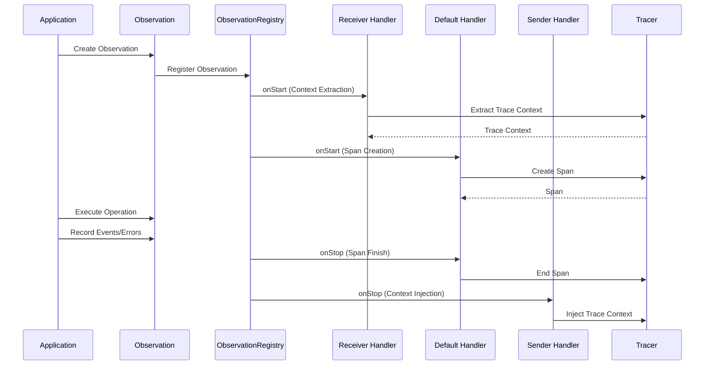
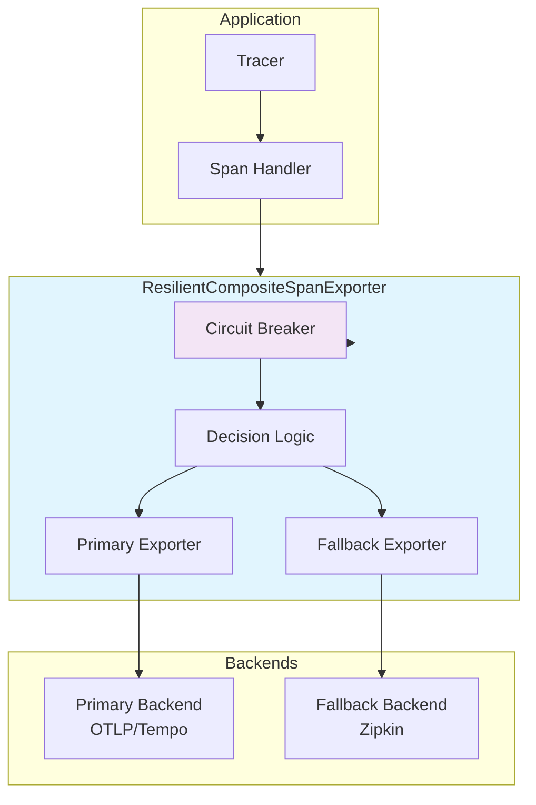

# Tracing Configuration

## Overview

The Tracing Configuration module provides the central configuration and setup for distributed tracing in the WalletHub application. It integrates with Spring Boot's observability infrastructure to provide comprehensive tracing across all application components.

## Core Components

### TracingConfiguration Class

The main configuration class that sets up the observation registry and multi-backend trace export.

#### Key Features
- **ObservationRegistry configuration**: Central registry for all instrumentation
- **Multi-backend export**: Support for primary/fallback tracing backends
- **Circuit breaker integration**: Resilience for span export
- **Feature flag initialization**: Runtime configuration management

#### Bean Definitions

| Bean | Type | Description |
|------|------|-------------|
| `observationRegistry` | `ObservationRegistry` | Central registry for all tracing observations |
| `multiBackendExportConfiguration` | `String` | Configures and validates trace export backends |
| `circuitBreakerRegistry` | `CircuitBreakerRegistry` | Registry for circuit breakers (Resilience4j) |
| `resilientCompositeSpanExporter` | `ResilientCompositeSpanExporter` | Resilient span exporter with failover |
| `tracingFeatureFlagsInitializer` | `String` | Initializes and logs feature flag configuration |

## Configuration Properties

### Application Properties

```yaml
# Enable/disable tracing
management:
  tracing:
    enabled: true
    sampling:
      probability: 0.1  # Sample 10% of traces
    
  # Zipkin backend
  zipkin:
    tracing:
      endpoint: http://localhost:9411/api/v2/spans
      connect-timeout: 5s
      read-timeout: 10s
  
  # OTLP backend (Tempo/Jaeger)
  otlp:
    tracing:
      endpoint: http://localhost:4318/v1/traces
      timeout: 10s
      compression: gzip

# Tracing configuration
tracing:
  backends:
    primary: tempo      # Primary: OTLP (Tempo)
    fallback: zipkin    # Fallback: Zipkin
  
  resilience:
    circuit-breaker:
      enabled: true
      failure-threshold: 5
      wait-duration-in-open-state: 60s
      ring-buffer-size-in-closed-state: 100
  
  features:
    database: true
    kafka: true
    stateMachine: true
    externalApi: true
    reactive: true
    useCase: true
```

### Feature Flags

The `TracingFeatureFlags` class provides runtime control over tracing components:

| Flag | Default | Description | Performance Impact |
|------|---------|-------------|-------------------|
| `database` | `true` | Database operation tracing | ~1-2ms per query |
| `kafka` | `true` | Kafka producer/consumer tracing | ~0.5-1ms per message |
| `stateMachine` | `true` | State machine transition tracing | ~0.5ms per transition |
| `externalApi` | `true` | External API call tracing | <1ms per request |
| `reactive` | `true` | Reactive pipeline tracing | <0.5ms per operator |
| `useCase` | `true` | Use case execution tracing | ~1-2ms per use case |

## Architecture

### Observation Registry Flow



### Multi-Backend Export Architecture



## Usage Examples

### Custom Observation Creation

```java
@Service
public class CustomTracingService {
    
    private final ObservationRegistry observationRegistry;
    
    public void performTracedOperation(String operationName) {
        Observation observation = Observation.createNotStarted(operationName, observationRegistry)
            .lowCardinalityKeyValue("service", "custom-service")
            .highCardinalityKeyValue("operation.id", UUID.randomUUID().toString())
            .start();
        
        try (Observation.Scope scope = observation.openScope()) {
            // Perform operation
            observation.event(Observation.Event.of("operation.started"));
            
            // Business logic
            
            observation.event(Observation.Event.of("operation.completed"));
        } catch (Exception e) {
            observation.error(e);
            throw e;
        } finally {
            observation.stop();
        }
    }
}
```

### Conditional Tracing

```java
@Component
public class ConditionalTracingService {
    
    private final TracingFeatureFlags featureFlags;
    
    public Mono<String> processWithConditionalTracing(String data) {
        if (featureFlags.isUseCase()) {
            return performTracedOperation(data);
        } else {
            return performUntracedOperation(data);
        }
    }
    
    private Mono<String> performTracedOperation(String data) {
        // Operation with tracing
        return Mono.just(data)
            .doOnNext(value -> log.debug("Processing with tracing: {}", value));
    }
}
```

## Performance Considerations

### Overhead Analysis

| Component | Overhead | Notes |
|-----------|----------|-------|
| Observation Creation | ~0.1ms | Creating observation context |
| Span Creation | ~0.2ms | Creating span and attributes |
| Context Propagation | ~0.05ms | Extracting/injecting trace context |
| Span Export | Async | Background thread, no blocking |

### Optimization Strategies

1. **Sampling**: Configure appropriate sampling rates based on traffic
2. **Feature Flags**: Disable non-critical tracing components
3. **Batch Export**: Configure batch size for span exporters
4. **Async Processing**: Ensure span export doesn't block application threads

## Monitoring and Health

### Health Indicators

The tracing system provides health indicators:
- **TracingHealthIndicator**: Overall tracing system health
- **Backend connectivity**: Primary/fallback backend status
- **Export metrics**: Success/failure rates for span export

### Metrics Collection

Key metrics to monitor:
- `tracing.spans.created`: Total spans created
- `tracing.spans.exported`: Spans successfully exported
- `tracing.spans.dropped`: Spans dropped (sampling/errors)
- `tracing.export.errors`: Export failures by backend
- `tracing.circuit.breaker.state`: Circuit breaker state transitions

## Troubleshooting

### Common Issues

| Issue | Symptoms | Solution |
|-------|----------|----------|
| No spans exported | Spans created but not in backend | Check backend endpoints and connectivity |
| High memory usage | Heap grows with tracing enabled | Adjust sampling rate, check for memory leaks |
| Context loss | Spans not linked properly | Verify handler registration order |
| Performance degradation | Application slower with tracing | Disable non-critical features, adjust sampling |

### Debug Configuration

```yaml
logging:
  level:
    dev.bloco.wallet.hub.infra.adapter.tracing.config: DEBUG
    io.micrometer.observation: DEBUG
    io.micrometer.tracing: DEBUG
    
management:
  endpoints:
    web:
      exposure:
        include: health,metrics,tracing
```

## Related Documentation

- [TracedReactiveStringRedisTemplate](traced_redis_template.md) - Redis cache tracing
- [ReactiveContextPropagator](reactive_context_propagator.md) - Reactive context propagation
- [Use Case Tracing](use_case_tracing.md) - Business operation tracing
- [Repository Tracing](repository_tracing.md) - Data access layer tracing
- [Circuit Breaker Tracing](circuit_breaker_tracing.md) - Resilience pattern tracing