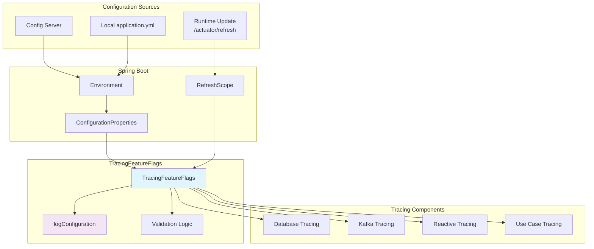
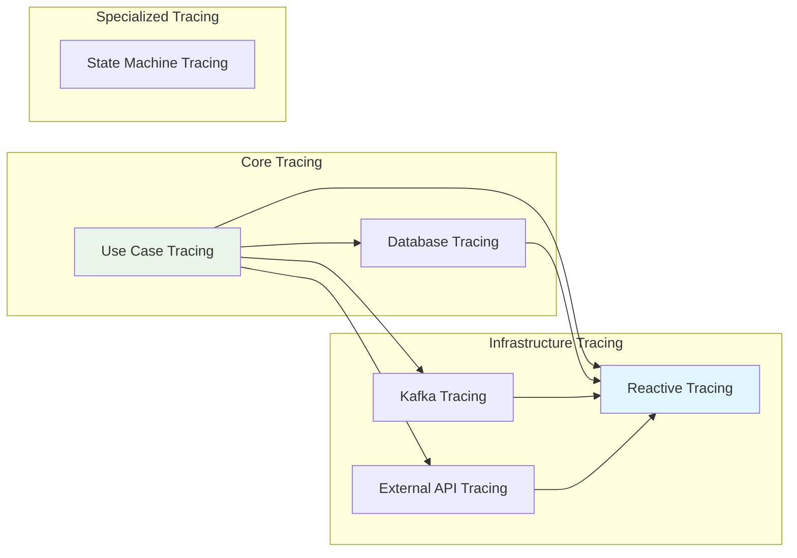

# TracingFeatureFlags

## Overview

The `TracingFeatureFlags` module provides runtime configuration control for tracing components in the WalletHub application. It enables fine-grained control over which tracing features are active, allowing performance optimization and selective observability.

### Key Features
- **Runtime configuration**: Flags can be updated via Spring Cloud Config or `/actuator/refresh`
- **Performance optimization**: Disable non-critical tracing for high-throughput scenarios
- **Component isolation**: Enable/disable specific tracing components independently
- **Configuration validation**: Logs configuration state and warnings
- **Health monitoring**: Tracks enabled/disabled components for observability

## Configuration Properties

### Application Properties

```yaml
tracing:
  features:
    database: true          # Database operation tracing
    kafka: true            # Kafka producer/consumer tracing
    stateMachine: true     # State machine transition tracing
    externalApi: true      # External API call tracing
    reactive: true         # Reactive pipeline tracing
    useCase: true          # Use case execution tracing
```

### Default Values and Impact

| Flag | Default | Performance Impact | When to Disable |
|------|---------|-------------------|-----------------|
| `database` | `true` | ~1-2ms per query | High-volume read-only queries (>1000/sec) |
| `kafka` | `true` | ~0.5-1ms per message | Event streaming systems (>10k msg/sec) |
| `stateMachine` | `true` | ~0.5ms per transition | Complex sagas with >10 transitions |
| `externalApi` | `true` | <1ms per request | External calls with strict SLAs |
| `reactive` | `true` | <0.5ms per operator | Deep reactive chains (>10 operators) |
| `useCase` | `true` | ~1-2ms per use case | **Warning**: Disabling removes core business visibility |

## Architecture

### Feature Flag Management Flow



### Component Dependency Graph



## Core Components

### TracingFeatureFlags Class

The main configuration class that manages tracing feature flags.

#### Key Methods

| Method | Description | Usage |
|--------|-------------|-------|
| `logConfiguration()` | Logs current configuration state | Called on initialization and refresh |
| `isAnyTracingEnabled()` | Checks if any tracing is enabled | Conditional bean creation |
| `isAllTracingDisabled()` | Checks if all tracing is disabled | Skip tracing infrastructure |
| `getEnabledComponents()` | Returns comma-separated enabled components | Monitoring and logging |
| `getDisabledComponents()` | Returns comma-separated disabled components | Performance optimization |

#### Configuration Logging Example

```log
TracingFeatureFlags configuration: [database=true, kafka=true, stateMachine=true, 
                                    externalApi=true, reactive=true, useCase=true]
Full observability: All tracing components enabled
```

## Usage Patterns

### Conditional Bean Creation

```java
@Configuration
public class ConditionalTracingConfig {
    
    @Bean
    @ConditionalOnProperty(value = "tracing.features.database", havingValue = "true")
    public RepositoryTracingAspect repositoryTracingAspect(
        Tracer tracer,
        TracingFeatureFlags featureFlags) {
        return new RepositoryTracingAspect(tracer, featureFlags);
    }
    
    @Bean
    @ConditionalOnProperty(value = "tracing.features.reactive", havingValue = "true")
    public ReactiveContextPropagator reactiveContextPropagator(
        Tracer tracer,
        TracingFeatureFlags featureFlags) {
        return new ReactiveContextPropagator(tracer, featureFlags);
    }
}
```

### Runtime Configuration Check

```java
@Service
public class TracedService {
    
    private final TracingFeatureFlags featureFlags;
    
    public Mono<String> processWithConditionalTracing(String input) {
        if (featureFlags.isUseCase()) {
            return performTracedOperation(input);
        } else {
            return performUntracedOperation(input);
        }
    }
    
    public Flux<String> batchProcessWithTracing(List<String> inputs) {
        if (!featureFlags.isReactive()) {
            return Flux.fromIterable(inputs)
                .map(this::processWithoutTracing);
        }
        
        return Flux.fromIterable(inputs)
            .flatMap(this::performTracedOperation)
            .contextWrite(contextPropagator.captureTraceContext());
    }
}
```

### Performance Optimization

```java
@Component
public class PerformanceOptimizedService {
    
    private final TracingFeatureFlags featureFlags;
    
    @PostConstruct
    public void optimizeForHighThroughput() {
        if (isHighThroughputScenario()) {
            // Disable non-critical tracing for performance
            log.info("High throughput detected, optimizing tracing configuration");
            
            // In a real scenario, you would update configuration
            // For demonstration, we just log the recommendation
            log.info("Consider disabling: database tracing for read-only queries");
            log.info("Consider disabling: kafka tracing for high-volume streams");
        }
    }
    
    private boolean isHighThroughputScenario() {
        // Check metrics or configuration
        return false; // Implementation specific
    }
}
```

## Configuration Management

### Dynamic Updates

Feature flags can be updated at runtime via:

1. **Spring Cloud Config Server**: Centralized configuration management
2. **/actuator/refresh endpoint**: Manual refresh of configuration
3. **Environment variables**: Override specific properties

### Refresh Example

```bash
# Update configuration
curl -X POST http://localhost:8080/actuator/refresh -H "Content-Type: application/json" -d '{
  "tracing.features.database": "false",
  "tracing.features.kafka": "false"
}'

# Check updated configuration
curl http://localhost:8080/actuator/configprops/tracing.features
```

### Configuration Validation

The `logConfiguration()` method provides validation:

```log
# Warning when critical flags are disabled
WARN: Use case tracing is DISABLED - core business operation visibility lost
WARN: Kafka tracing is DISABLED - event-driven workflow visibility lost

# Performance optimization info
INFO: Performance optimization: 2 tracing components disabled, 
      estimated overhead reduction: ~3 ms per operation
```

## Performance Considerations

### Overhead Analysis by Component

| Component | Base Overhead | High-Volume Impact | Optimization Strategy |
|-----------|--------------|-------------------|----------------------|
| Database Tracing | 1-2ms/query | 1-2 seconds per 1000 queries | Disable for read-only queries |
| Kafka Tracing | 0.5-1ms/msg | 5-10 seconds per 10k messages | Disable for high-throughput streams |
| Reactive Tracing | 0.5ms/operator | 5ms per 10-operator chain | Disable for deep reactive pipelines |
| Use Case Tracing | 1-2ms/use case | Core visibility - rarely disable | Keep enabled for business monitoring |

### Memory Impact

- Each flag check: negligible (<0.01ms)
- Configuration object: ~1KB memory
- No persistent memory overhead

### CPU Impact

- Boolean checks: minimal CPU usage
- Logging on refresh: moderate (parsing and formatting)
- Overall: <0.1% CPU usage in typical scenarios

## Monitoring and Observability

### Health Indicators

```java
@Component
public class TracingFeatureFlagsHealthIndicator implements HealthIndicator {
    
    private final TracingFeatureFlags featureFlags;
    
    @Override
    public Health health() {
        Map<String, Object> details = new HashMap<>();
        details.put("enabledComponents", featureFlags.getEnabledComponents());
        details.put("disabledComponents", featureFlags.getDisabledComponents());
        details.put("anyTracingEnabled", featureFlags.isAnyTracingEnabled());
        
        if (featureFlags.isAllTracingDisabled()) {
            return Health.down()
                .withDetails(details)
                .withDetail("warning", "All tracing disabled - observability compromised")
                .build();
        }
        
        if (!featureFlags.isUseCase()) {
            return Health.outOfService()
                .withDetails(details)
                .withDetail("warning", "Use case tracing disabled - business visibility reduced")
                .build();
        }
        
        return Health.up().withDetails(details).build();
    }
}
```

### Metrics Collection

Key metrics to monitor:
- `tracing.features.enabled.count`: Number of enabled features
- `tracing.features.disabled.count`: Number of disabled features
- `tracing.configuration.refresh.count`: Configuration refresh events
- `tracing.performance.overhead.estimated`: Estimated overhead reduction

## Best Practices

### Configuration Management

1. **Enable by default**: Start with all features enabled in development
2. **Selective disabling**: Disable features based on performance testing
3. **Monitor impact**: Track performance before/after disabling features
4. **Document changes**: Record configuration changes and their rationale

### Performance Optimization

1. **Profile first**: Always profile before disabling features
2. **Incremental changes**: Disable one feature at a time
3. **Monitor business impact**: Ensure disabled features don't affect troubleshooting
4. **Set thresholds**: Define performance thresholds for re-enabling features

### Security Considerations

1. **Secure refresh endpoint**: Protect `/actuator/refresh` endpoint
2. **Audit configuration changes**: Log all feature flag changes
3. **Validate configurations**: Prevent invalid configurations
4. **Backup configurations**: Maintain configuration backups

## Troubleshooting

### Common Issues

| Issue | Symptoms | Solution |
|-------|----------|----------|
| Flags not updating | Changes via refresh not taking effect | Check `@RefreshScope` annotation |
| Performance not improving | Disabled features but no speedup | Feature may not be bottleneck |
| Configuration conflicts | Multiple configuration sources | Check precedence: env vars > config server > local |
| Memory leaks | Configuration objects not garbage collected | Ensure proper scope management |

### Debug Configuration

```yaml
logging:
  level:
    dev.bloco.wallet.hub.infra.adapter.tracing.config: DEBUG
    org.springframework.cloud.context.refresh: DEBUG
    
management:
  endpoints:
    web:
      exposure:
        include: health,metrics,configprops
```

### Configuration Verification

```java
@SpringBootTest
class TracingFeatureFlagsTest {
    
    @Autowired
    private TracingFeatureFlags featureFlags;
    
    @Test
    void testConfigurationLoading() {
        assertTrue(featureFlags.isUseCase());
        assertTrue(featureFlags.isReactive());
        assertEquals("database, kafka, stateMachine, externalApi, reactive, useCase", 
                    featureFlags.getEnabledComponents());
    }
}
```

## Related Documentation

- [Tracing Configuration](tracing_configuration.md) - Overall tracing setup
- [ReactiveContextPropagator](reactive_context_propagator.md) - Reactive tracing (uses `reactive` flag)
- [TracedReactiveStringRedisTemplate](traced_redis_template.md) - Redis tracing (uses `reactive` flag)
- [Use Case Tracing](use_case_tracing.md) - Business operation tracing (uses `useCase` flag)
- [Repository Tracing](repository_tracing.md) - Database tracing (uses `database` flag)