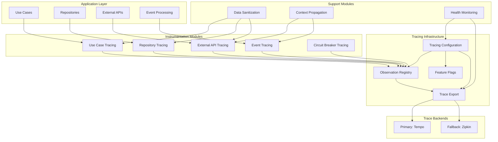
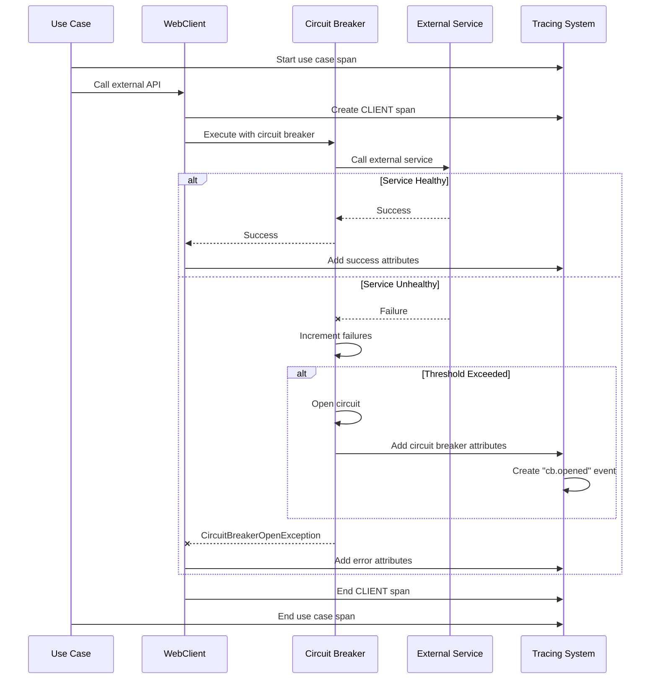

# Tracing System Overview

## Introduction

The Wallet Hub Tracing System provides comprehensive distributed tracing capabilities across the entire application. This document provides an overview of how all tracing modules work together to provide observability, performance monitoring, and debugging capabilities.

## System Architecture

### High-Level Architecture



## Module Relationships

### Core Tracing Modules

| Module | Purpose | Key Components | Dependencies |
|--------|---------|----------------|--------------|
| **[Tracing Configuration](tracing_configuration.md)** | Central configuration and setup | `TracingConfiguration`, `TracingFeatureFlags` | Spring Boot, Micrometer |
| **[Circuit Breaker Tracing](circuit_breaker_tracing.md)** | Circuit breaker observability | `CircuitBreakerTracingDecorator` | Resilience4j, External API Tracing |
| **[WebClient Tracing](webclient_tracing.md)** | External HTTP API tracing | `WebClientTracingCustomizer` | Spring WebClient, Data Sanitization |
| **[Data Sanitization](data_sanitization.md)** | PII protection in traces | `SensitiveDataSanitizer` | All tracing modules |
| **[Use Case Tracing](use_case_tracing.md)** | Business operation tracing | `UseCaseTracingAspect` | AOP, Business logic |

### Integration Patterns

#### 1. External API Call with Circuit Breaker


#### 2. Data Flow Through Tracing System


## Feature Flags System

### Configuration Management
The tracing system uses feature flags for granular control:

```yaml
tracing:
  features:
    database: true      # Database query tracing
    kafka: true        # Event tracing
    stateMachine: true # State machine tracing
    externalApi: true  # External API + circuit breaker tracing
    reactive: true     # Reactive context propagation
    useCase: true      # Business operation tracing
```

### Performance Impact by Feature

| Feature | Overhead | When to Enable | When to Disable |
|---------|----------|----------------|-----------------|
| **externalApi** | <1ms per request | Always in production | Extreme performance requirements |
| **useCase** | 1-2ms per use case | Debugging business logic | High-volume read operations |
| **database** | 1-2ms per query | Debugging SQL performance | Read-heavy workloads |
| **kafka** | 0.5-1ms per message | Event-driven workflows | High-throughput messaging |

## Trace Export Strategy

### Multi-backend Architecture
- **Primary Backend**: OTLP/Tempo (production)
- **Fallback Backend**: Zipkin (backup)
- **Circuit Breaker Protection**: Automatic failover on export failures
- **Resilient Export**: `ResilientCompositeSpanExporter` with circuit breaker

### Export Configuration
```yaml
tracing:
  backends:
    primary: tempo
    fallback: zipkin
    
  resilience:
    circuit-breaker:
      enabled: true
      failure-threshold: 5
      wait-duration-in-open-state: 60s

management:
  otlp:
    tracing:
      endpoint: http://tempo:4318/v1/traces
  zipkin:
    tracing:
      endpoint: http://zipkin:9411/api/v2/spans
```

## Security and Compliance

### Data Protection
1. **PII Masking**: Automatic detection and masking of sensitive data
2. **URL Sanitization**: Query parameter masking for credentials
3. **SQL Sanitization**: Parameter value replacement in SQL statements
4. **Header Filtering**: Only safe headers included in traces

### Compliance Features
- **GDPR Compliance**: PII protection in traces
- **PCI DSS**: Credit card number masking
- **Security Auditing**: Regular trace export reviews

## Performance Optimization

### Sampling Strategies
```yaml
management:
  tracing:
    sampling:
      probability: 0.1    # Sample 10% of traces (production)
      # probability: 1.0  # Sample 100% (development)
      # probability: 0.01 # Sample 1% (high-volume)
```

### Overhead Reduction Techniques
1. **Selective Instrumentation**: Disable non-critical tracing features
2. **Sampling**: Reduce trace volume
3. **Async Export**: Non-blocking span export
4. **Batch Processing**: Aggregate spans before export

## Monitoring and Health

### Health Indicators
- **Tracing Health**: `GET /actuator/health/tracing`
- **Circuit Breaker State**: Monitoring via metrics
- **Export Success Rate**: Percentage of successful exports
- **Backend Connectivity**: Primary/fallback backend health

### Key Metrics
- `tracing.spans.created.total`: Total spans created
- `tracing.spans.exported.total`: Total spans exported
- `tracing.circuit_breaker.state`: Circuit breaker state
- `tracing.export.duration`: Export latency
- `tracing.sampling.rate`: Sampling decision rate

## Troubleshooting Guide

### Common Issues and Solutions

#### 1. No Traces in Backend
**Check**:
- Feature flags enabled (`tracing.features.*`)
- Backend endpoints configured
- Sampling probability > 0
- Circuit breaker not open for export

#### 2. High Memory Usage
**Solutions**:
- Reduce sampling probability
- Increase export batch size
- Disable non-critical tracing features
- Monitor span buffer metrics

#### 3. Missing Circuit Breaker Events
**Verify**:
- `tracing.features.externalApi: true`
- Circuit breaker registry available
- Active spans during circuit breaker events
- Event subscription logs

#### 4. Sensitive Data in Traces
**Ensure**:
- Data sanitization is enabled
- Safe lists configured correctly
- URL sanitization working
- SQL parameter masking active

## Development Workflow

### Local Development
```yaml
# application-local.yml
tracing:
  features:
    database: true      # Debug queries
    externalApi: true   # Debug API calls
    useCase: true      # Debug business logic
    
management:
  tracing:
    sampling:
      probability: 1.0  # Sample everything
      
  zipkin:
    tracing:
      endpoint: http://localhost:9411/api/v2/spans
```

### Production Deployment
```yaml
# application-prod.yml
tracing:
  features:
    database: false     # Performance optimization
    externalApi: true   # Keep for monitoring
    useCase: true      # Business visibility
    
management:
  tracing:
    sampling:
      probability: 0.01  # Sample 1%
      
  otlp:
    tracing:
      endpoint: https://tempo.production/v1/traces
```

## Future Enhancements

### Planned Features
1. **Predictive Analytics**: ML-based anomaly detection in traces
2. **Dynamic Sampling**: Adaptive sampling based on error rates
3. **Trace Compression**: Reduce storage requirements
4. **Cross-service Correlation**: Enhanced microservice tracing

### Technical Debt
- **T021**: Complete `ResilientCompositeSpanExporter` implementation
- **Async Context**: Improve reactive context propagation
- **Pattern Updates**: Regular PII pattern updates for new data types

## Getting Started

### Quick Start
1. **Enable Tracing**: Set `management.tracing.enabled: true`
2. **Configure Backend**: Set at least one trace export endpoint
3. **Enable Features**: Configure `tracing.features` as needed
4. **Verify**: Check `/actuator/health/tracing` endpoint

### Example Configuration
```yaml
# Minimal working configuration
management:
  tracing:
    enabled: true
  zipkin:
    tracing:
      endpoint: http://localhost:9411/api/v2/spans

tracing:
  features:
    externalApi: true
    useCase: true
```

## Related Documentation

- [Circuit Breaker Tracing](circuit_breaker_tracing.md): Detailed module documentation
- [WebClient Tracing](webclient_tracing.md): External API tracing details
- [Data Sanitization](data_sanitization.md): PII protection implementation
- [Tracing Configuration](tracing_configuration.md): Core configuration setup
- [Use Case Tracing](use_case_tracing.md): Business operation tracing

## Support and Resources

### Monitoring Tools
- **Tempo**: Primary trace backend
- **Zipkin**: Fallback trace backend
- **Grafana**: Trace visualization
- **Prometheus**: Metrics collection

### Development Resources
- **Local Zipkin**: `docker run -d -p 9411:9411 openzipkin/zipkin`
- **Local Tempo**: `docker run -d -p 4318:4318 grafana/tempo`
- **Sample Traces**: Check `/actuator/trace` endpoint

---

*Last Updated: January 2024*  
*System Version: 1.0.0*  
*Compatibility: Spring Boot 3.x, Micrometer Tracing 1.x, Resilience4j 2.x*