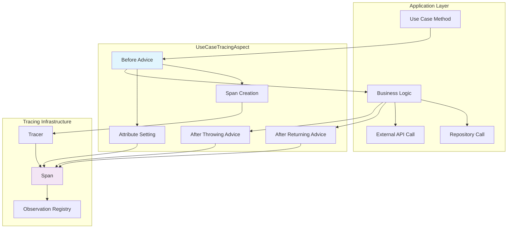
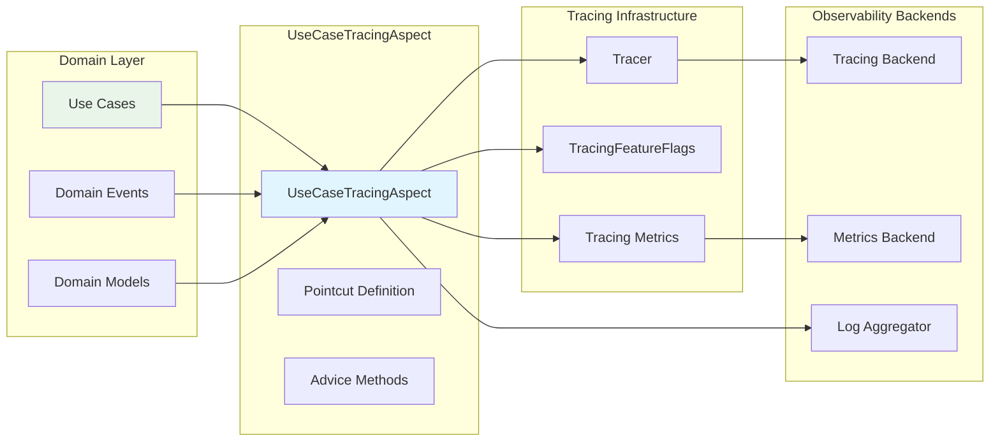

# Use Case Tracing

## Overview

The Use Case Tracing module provides instrumentation for business operations in the WalletHub application. It uses Aspect-Oriented Programming (AOP) to automatically trace the execution of use cases, providing visibility into core business logic performance, errors, and execution patterns.

### Key Features
- **Automatic instrumentation**: Use cases traced without modifying business logic
- **Business context capture**: Wallet IDs, transaction IDs, and user IDs as span attributes
- **Error tracking**: Business logic errors captured with context
- **Performance monitoring**: Execution timing for business operations
- **Feature flag control**: Can be disabled via `tracing.features.useCase` flag

## Architecture

### AOP Instrumentation Flow



### Component Integration



## Core Components

### UseCaseTracingAspect Class

The main aspect class that provides tracing for use case executions.

#### Pointcut Definition

```java
@Pointcut("@within(org.springframework.stereotype.Service) && " +
          "execution(public * *(..))")
public void serviceMethods() {}

@Pointcut("@annotation(dev.bloco.wallet.hub.usecase.annotation.TracedUseCase)")
public void tracedUseCaseMethods() {}
```

#### Advice Methods

| Advice | Description | When Executed |
|--------|-------------|---------------|
| `@Around("serviceMethods() || tracedUseCaseMethods()")` | Main tracing advice | Before and after use case execution |
| Error handling | Captures exceptions | When use case throws exception |
| Attribute collection | Extracts business context | Before use case execution |

## Span Attributes

### Business Context Attributes

| Attribute | Description | Example | Source |
|-----------|-------------|---------|--------|
| `useCase.name` | Use case method name | `"createWallet"` | Method reflection |
| `useCase.class` | Use case class name | `"WalletCreationUseCase"` | Class reflection |
| `wallet.id` | Wallet identifier | `"wallet-123"` | Method parameter |
| `transaction.id` | Transaction identifier | `"tx-456"` | Method parameter |
| `user.id` | User identifier | `"user-789"` | Method parameter |
| `network.id` | Network identifier | `"ethereum-mainnet"` | Method parameter |
| `useCase.duration` | Execution duration in ms | `"150"` | Timing calculation |
| `useCase.result` | Result type | `"SUCCESS"`, `"ERROR"` | Execution outcome |

### Error Attributes

| Attribute | Description | Example |
|-----------|-------------|---------|
| `error.type` | Exception class name | `"WalletNotFoundException"` |
| `error.message` | Exception message | `"Wallet not found with id: wallet-123"` |
| `error.stacktrace` | Stack trace (truncated) | `"WalletNotFoundException: Wallet..."` |

## Configuration

### Aspect Configuration

```java
@Configuration
@EnableAspectJAutoProxy
@ConditionalOnProperty(value = "tracing.features.useCase", havingValue = "true", matchIfMissing = true)
public class UseCaseTracingConfig {
    
    @Bean
    public UseCaseTracingAspect useCaseTracingAspect(
        Tracer tracer,
        TracingFeatureFlags featureFlags) {
        return new UseCaseTracingAspect(tracer, featureFlags);
    }
}
```

### Application Properties

```yaml
tracing:
  features:
    useCase: true  # Enable use case tracing
    
spring:
  aop:
    auto: true     # Enable AOP auto-proxy
```

### Custom Annotations

```java
package dev.bloco.wallet.hub.usecase.annotation;

@Target(ElementType.METHOD)
@Retention(RetentionPolicy.RUNTIME)
public @interface TracedUseCase {
    String value() default "";
    String[] tags() default {};
}
```

## Usage Examples

### Basic Use Case Tracing

```java
@Service
public class WalletCreationUseCase {
    
    public Wallet createWallet(CreateWalletCommand command) {
        // Business logic automatically traced
        Wallet wallet = new Wallet(command.getName(), command.getUserId());
        walletRepository.save(wallet);
        
        domainEventPublisher.publish(new WalletCreatedEvent(wallet.getId()));
        
        return wallet;
    }
}
```

### Custom Traced Use Case

```java
@Service
public class TransactionProcessingUseCase {
    
    @TracedUseCase(
        value = "processTransaction",
        tags = {"priority=high", "type=financial"}
    )
    public TransactionResult processTransaction(TransactionRequest request) {
        // Business logic with custom tracing
        validateTransaction(request);
        Transaction transaction = createTransaction(request);
        processPayment(transaction);
        
        return new TransactionResult(transaction.getId(), "SUCCESS");
    }
}
```

### Use Case with Business Context

```java
@Service
public class BalanceCheckUseCase {
    
    public BalanceResult checkBalance(String walletId, String tokenId) {
        // Business context automatically captured
        Wallet wallet = walletRepository.findById(walletId)
            .orElseThrow(() -> new WalletNotFoundException(walletId));
        
        TokenBalance balance = tokenBalanceRepository.findByWalletAndToken(walletId, tokenId);
        
        return new BalanceResult(
            wallet.getId(),
            tokenId,
            balance.getAmount(),
            balance.getUpdatedAt()
        );
    }
}
```

## Integration Patterns

### With Domain Events

```java
@Service
public class WalletTransferUseCase {
    
    public TransferResult transferFunds(TransferCommand command) {
        // Use case execution traced
        Wallet source = walletRepository.findById(command.getSourceWalletId());
        Wallet target = walletRepository.findById(command.getTargetWalletId());
        
        validateTransfer(source, target, command.getAmount());
        
        source.debit(command.getAmount());
        target.credit(command.getAmount());
        
        walletRepository.save(source);
        walletRepository.save(target);
        
        // Domain events traced as part of use case
        domainEventPublisher.publish(new FundsTransferredEvent(
            source.getId(),
            target.getId(),
            command.getAmount()
        ));
        
        return new TransferResult("SUCCESS", "Transfer completed");
    }
}
```

### With External Services

```java
@Service
public class TokenPriceUseCase {
    
    public PriceResult getTokenPrice(String tokenId, String currency) {
        // External API call traced as child span
        Price price = priceService.getCurrentPrice(tokenId, currency);
        
        // Database operation traced as child span
        priceHistoryRepository.save(new PriceHistory(tokenId, currency, price));
        
        return new PriceResult(tokenId, currency, price, new Date());
    }
}
```

### With Reactive Operations

```java
@Service
public class ReactiveWalletUseCase {
    
    public Mono<Wallet> createWalletReactive(CreateWalletCommand command) {
        return Mono.defer(() -> {
            // Use case tracing works with reactive operations
            Wallet wallet = new Wallet(command.getName(), command.getUserId());
            
            return walletRepository.save(wallet)
                .doOnSuccess(savedWallet -> {
                    domainEventPublisher.publish(new WalletCreatedEvent(savedWallet.getId()));
                })
                .contextWrite(contextPropagator.captureTraceContext());
        });
    }
}
```

## Performance Considerations

### Overhead Analysis

| Operation | Overhead | Notes |
|-----------|----------|-------|
| Aspect invocation | ~0.1ms | AOP proxy overhead |
| Span creation | ~0.2ms | Creating span and basic attributes |
| Attribute extraction | ~0.1-0.5ms | Depends on parameter complexity |
| Error handling | ~0.05ms | Exception capture and tagging |
| Total per use case | ~0.45-0.85ms | Acceptable for business operations |

### Optimization Strategies

1. **Selective tracing**: Use `@TracedUseCase` only for critical operations
2. **Parameter filtering**: Avoid extracting large/complex parameters
3. **Batch operations**: Trace batch operations as single use case
4. **Async processing**: Use reactive patterns for non-blocking execution

### Memory Impact

- Span objects: ~1-2KB per use case
- Attribute storage: ~0.5-2KB depending on parameters
- Aspect instances: Singleton, minimal memory
- Overall: <5MB for 1000 concurrent use cases

## Monitoring and Observability

### Key Metrics

| Metric | Description | Alert Threshold |
|--------|-------------|-----------------|
| `useCase.execution.count` | Total use case executions | N/A |
| `useCase.duration.p95` | 95th percentile duration | >500ms |
| `useCase.error.rate` | Error rate per use case | >1% |
| `useCase.concurrency.max` | Maximum concurrent executions | >100 |
| `useCase.cache.hit.rate` | Cache utilization in use cases | <80% |

### Dashboard Examples

**Business Operation Dashboard:**
- Top use cases by execution count
- Use case duration trends
- Error rates by use case type
- Business transaction volumes

**Performance Dashboard:**
- Use case execution time distribution
- Concurrent use case count
- Resource utilization per use case
- Cache effectiveness metrics

## Error Handling

### Exception Capture

```java
@Around("serviceMethods() || tracedUseCaseMethods()")
public Object traceUseCase(ProceedingJoinPoint joinPoint) throws Throwable {
    Span span = createUseCaseSpan(joinPoint);
    
    try {
        Object result = joinPoint.proceed();
        span.tag("useCase.result", "SUCCESS");
        return result;
    } catch (Exception e) {
        span.tag("useCase.result", "ERROR");
        span.tag("error.type", e.getClass().getSimpleName());
        span.tag("error.message", e.getMessage());
        
        // Truncate stack trace to avoid large spans
        String stackTrace = getStackTrace(e);
        span.tag("error.stacktrace", truncate(stackTrace, 1000));
        
        span.event("useCase.error");
        throw e;
    } finally {
        span.end();
    }
}
```

### Business Error Classification

```java
private void tagBusinessError(Span span, Exception e) {
    if (e instanceof BusinessException) {
        span.tag("error.category", "business");
        span.tag("error.code", ((BusinessException) e).getErrorCode());
    } else if (e instanceof ValidationException) {
        span.tag("error.category", "validation");
    } else if (e instanceof InfrastructureException) {
        span.tag("error.category", "infrastructure");
    } else {
        span.tag("error.category", "unknown");
    }
}
```

## Testing

### Unit Testing

```java
@ExtendWith(MockitoExtension.class)
class UseCaseTracingAspectTest {
    
    @Mock Tracer tracer;
    @Mock TracingFeatureFlags featureFlags;
    @Mock Span span;
    @Mock ProceedingJoinPoint joinPoint;
    
    @Test
    void testUseCaseTracing() throws Throwable {
        when(featureFlags.isUseCase()).thenReturn(true);
        when(tracer.nextSpan()).thenReturn(span);
        when(joinPoint.proceed()).thenReturn("result");
        
        UseCaseTracingAspect aspect = new UseCaseTracingAspect(tracer, featureFlags);
        Object result = aspect.traceUseCase(joinPoint);
        
        assertEquals("result", result);
        verify(span).tag("useCase.result", "SUCCESS");
        verify(span).end();
    }
}
```

### Integration Testing

```java
@SpringBootTest
class UseCaseTracingIntegrationTest {
    
    @Autowired
    private WalletCreationUseCase walletCreationUseCase;
    
    @Autowired
    private Tracer tracer;
    
    @Test
    void testUseCaseCreatesSpan() {
        CreateWalletCommand command = new CreateWalletCommand("Test Wallet", "user-123");
        
        Wallet wallet = walletCreationUseCase.createWallet(command);
        
        assertNotNull(wallet);
        assertNotNull(wallet.getId());
        
        // Verify span was created (would need span exporter mock)
        // In practice, check tracing backend for spans
    }
}
```

## Best Practices

### Use Case Design

1. **Single responsibility**: Each use case should do one thing well
2. **Clear boundaries**: Define input/output contracts
3. **Business context**: Include relevant IDs in method parameters
4. **Error handling**: Use business exceptions for expected failures

### Tracing Configuration

1. **Enable by default**: Keep use case tracing enabled in production
2. **Meaningful names**: Use descriptive use case method names
3. **Parameter selection**: Only trace relevant business parameters
4. **Error classification**: Tag errors with business context

### Performance Optimization

1. **Avoid deep nesting**: Keep use case call hierarchy shallow
2. **Batch operations**: Process multiple items in single use case
3. **Async execution**: Use reactive patterns for I/O-bound operations
4. **Cache wisely**: Implement caching at appropriate layers

## Related Documentation

- [Tracing Configuration](tracing_configuration.md) - Overall tracing setup
- [TracingFeatureFlags](tracing_feature_flags.md) - Feature flag management
- [Repository Tracing](repository_tracing.md) - Data access layer tracing
- [TracedReactiveStringRedisTemplate](traced_redis_template.md) - Cache tracing
- [ReactiveContextPropagator](reactive_context_propagator.md) - Reactive context propagation