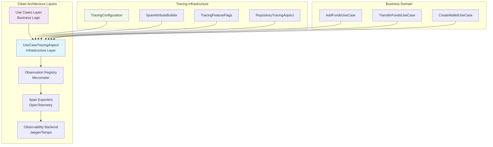
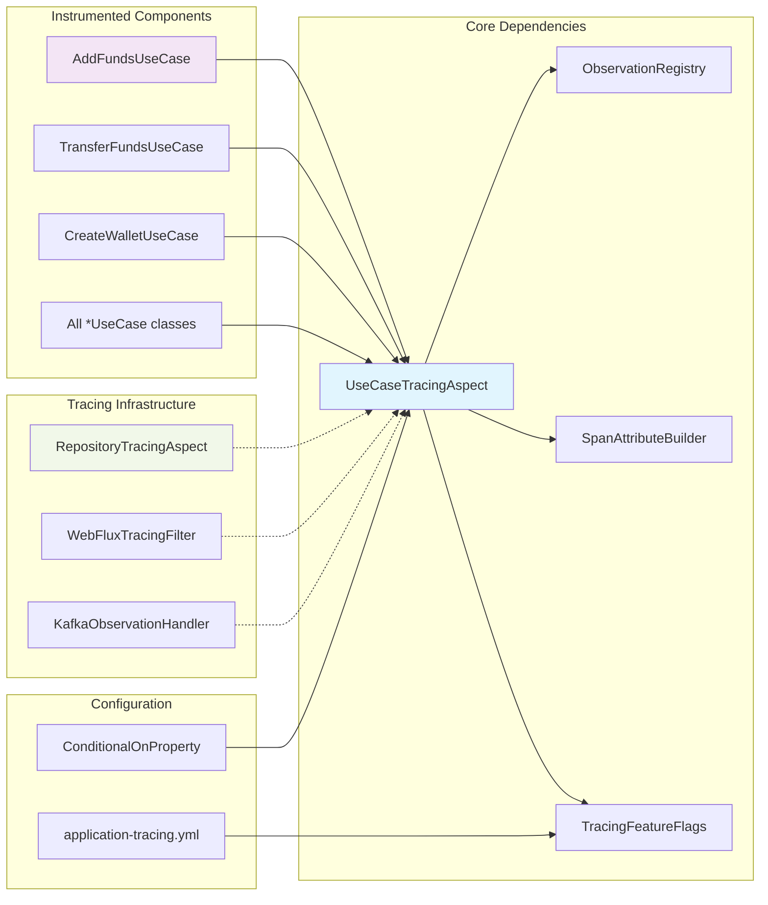
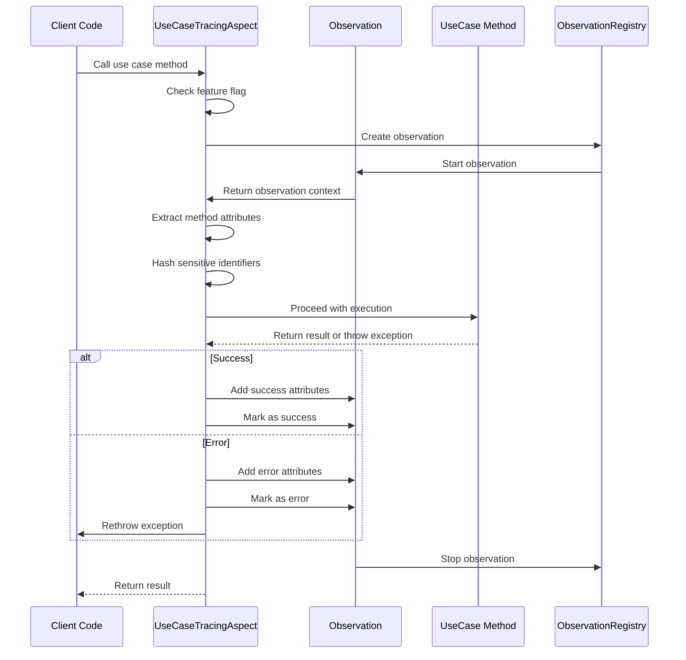
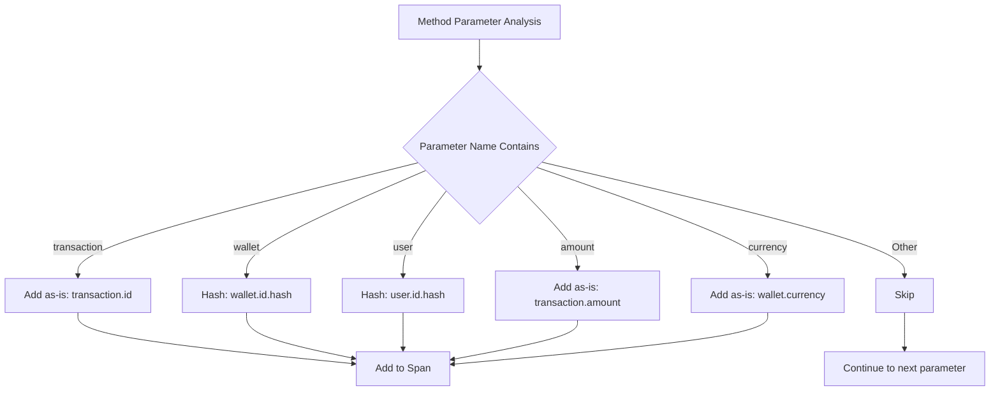

# UseCaseTracingAspect Module Documentation

## Overview

The `UseCaseTracingAspect` module is a critical component of the Wallet Hub's distributed tracing infrastructure that automatically instruments all business use case executions. It provides comprehensive observability into core business operations by creating detailed tracing spans for every use case method invocation.

## Module Purpose

The primary purpose of this module is to:
1. **Automatically trace business operations** - Capture execution details of all use cases without manual instrumentation
2. **Ensure privacy compliance** - Hash sensitive identifiers while preserving trace correlation
3. **Provide business context** - Enrich traces with domain-specific attributes (wallet operations, transaction details)
4. **Enable performance monitoring** - Track execution times and identify bottlenecks in business logic
5. **Support debugging** - Capture error details and stack traces for failed operations

## Architecture

### Module Position in System Architecture



### Component Relationships



## Core Components

### 1. UseCaseTracingAspect Class

The main aspect class that provides AOP-based instrumentation for use case executions.

**Key Responsibilities:**
- Intercepts all public methods in classes ending with "UseCase" in the `usecase` package
- Creates observation spans with standardized naming conventions
- Extracts and adds business context attributes
- Handles sensitive identifier hashing for privacy
- Captures error details and stack traces
- Integrates with Micrometer Observation API

**Configuration:**
```java
@Slf4j
@Aspect
@Component
@RequiredArgsConstructor
@ConditionalOnProperty(
    value = "tracing.features.use-case", 
    havingValue = "true", 
    matchIfMissing = true
)
public class UseCaseTracingAspect {
    // Aspect implementation
}
```

### 2. Dependencies

#### SpanAttributeBuilder
Provides standardized span attribute constants and building methods following OpenTelemetry semantic conventions. Used for consistent attribute naming across the tracing infrastructure.

**Key Attributes Used:**
- `WALLET_OPERATION`: Business operation type (e.g., "add_funds", "transfer_funds")
- `TRANSACTION_ID`: Transaction identifier (included as-is)
- `WALLET_CURRENCY`: Currency code (ISO 4217)
- `TRANSACTION_AMOUNT`: Transaction amount
- `ERROR`, `ERROR_TYPE`, `ERROR_MESSAGE`, `ERROR_STACK`: Error handling attributes

#### TracingFeatureFlags
Runtime-configurable feature flags that control tracing instrumentation per component. The `useCase` flag enables/disables use case tracing.

#### ObservationRegistry
Micrometer Observation API registry for creating and managing observation spans.

## How It Works

### 1. Aspect Pointcut Definition

The aspect intercepts all public methods in use case classes:
```java
@Around("execution(public * dev.bloco.wallet.hub.usecase.*UseCase.*(..))")
public Object traceUseCaseExecution(ProceedingJoinPoint joinPoint) throws Throwable
```

### 2. Span Creation Process



### 3. Attribute Extraction Logic

The aspect analyzes method parameters to extract business context:



### 4. Identifier Privacy Handling

Following specification clarifications (2025-12-16):

| Identifier Type | Handling | Reason |
|----------------|----------|--------|
| **Transaction ID** | Included as-is | Technical identifier, not user-identifiable |
| **Saga ID** | Included as-is | Technical identifier, not user-identifiable |
| **Event Type** | Included as-is | Business metadata, not user-identifiable |
| **Wallet ID** | SHA-256 hashed | User-related identifier, requires privacy |
| **User ID** | SHA-256 hashed | User-related identifier, requires privacy |

**Hashing Implementation:**
```java
private String hashIdentifier(String identifier) {
    MessageDigest digest = SHA256_DIGEST.get();
    digest.reset();
    byte[] hash = digest.digest(identifier.getBytes(StandardCharsets.UTF_8));
    String base64 = Base64.getUrlEncoder().withoutPadding().encodeToString(hash);
    return base64.substring(0, Math.min(16, base64.length())); // 96 bits entropy
}
```

### 5. Error Handling

When a use case throws an exception:
1. Error attributes added to span (`error.type`, `error.message`, `error.stack`)
2. Span marked as failed (`error=true`)
3. Parent trace marked as failed
4. Exception propagated to caller (not swallowed)

**Error Message Sanitization:**
- UUID patterns masked: `***-WALLET-ID-***`
- Currency amounts masked: `***`
- Truncated to 512 characters if too long

## Configuration

### 1. Feature Flags

Control via `application-tracing.yml`:
```yaml
tracing:
  features:
    use-case: true  # Enable/disable use case tracing
```

### 2. Conditional Registration

The aspect is conditionally registered based on the feature flag:
```java
@ConditionalOnProperty(value = "tracing.features.use-case", havingValue = "true", matchIfMissing = true)
```

### 3. Runtime Updates

Feature flags can be updated without restart:
```bash
# Update configuration
curl -X POST http://localhost:8080/actuator/refresh \
  -H "Content-Type: application/json"
```

## Integration with Other Modules

### 1. RepositoryTracingAspect (Sibling Module)

**Relationship:** Complementary instrumentation
- **UseCaseTracingAspect**: Business logic layer tracing
- **RepositoryTracingAspect**: Data access layer tracing
- **Together**: Provide end-to-end trace from business operation to database

**Trace Correlation:**
```
HTTP Request → UseCaseTracingAspect → RepositoryTracingAspect → Database
      │              │                      │
      └─ Trace ID ───┴──────────────────────┘
```

### 2. WebFluxTracingFilter

**Relationship:** HTTP request context propagation
- **WebFluxTracingFilter**: Creates root span for HTTP requests
- **UseCaseTracingAspect**: Creates child span for business logic
- **Trace Context**: Automatically propagated through reactive context

### 3. Kafka Observation Handlers

**Relationship:** Event-driven workflow tracing
- **KafkaProducerObservationHandler**: Traces event publishing
- **UseCaseTracingAspect**: Traces use case execution that triggers events
- **End-to-end**: Trace spans from use case → event publishing → event consumption

## Usage Examples

### 1. Basic Use Case Tracing

```java
@Component
public class AddFundsUseCase {
    public void execute(UUID walletId, BigDecimal amount, String transactionId) {
        // Automatically traced:
        // - Span name: "usecase.AddFundsUseCase.execute"
        // - Attributes: 
        //   • wallet.id.hash: [hashed walletId]
        //   • transaction.id: [transactionId as-is]
        //   • wallet.operation: "add_funds"
        //   • transaction.amount: [amount]
        // - Duration: measured automatically
    }
}
```

### 2. Error Tracing

```java
@Component  
public class TransferFundsUseCase {
    public void execute(UUID fromWalletId, UUID toWalletId, BigDecimal amount) {
        // If InsufficientFundsException is thrown:
        // - Span marked as error
        // - Attributes added:
        //   • error.type: "InsufficientFundsException"
        //   • error.message: "Balance too low" (sanitized)
        //   • error.stack: [truncated stack trace]
    }
}
```

### 3. Complex Parameter Analysis

```java
@Component
public class CreateWalletUseCase {
    public Wallet execute(UUID userId, String currency, String walletName) {
        // Parameters analyzed:
        // - userId → hashed as user.id.hash
        // - currency → added as wallet.currency
        // - walletName → not traced (no identifier pattern)
    }
}
```

## Performance Characteristics

### 1. Overhead Analysis

| Component | Overhead | Notes |
|-----------|----------|-------|
| **Aspect Interception** | ~0.5ms | AOP proxy overhead |
| **Span Creation** | ~0.5ms | Observation API overhead |
| **Attribute Extraction** | ~0.5-1ms | Parameter analysis and hashing |
| **Total Per Use Case** | **~1-2ms** | Typical overhead range |

### 2. Optimization Features

1. **Feature Flag Bypass**: When `tracing.features.use-case=false`, aspect is not registered
2. **Thread-local SHA-256**: Reuses MessageDigest instance per thread
3. **Lazy Attribute Extraction**: Only extracts attributes when tracing is enabled
4. **Sampling Integration**: Works with sampling configuration to reduce export volume

### 3. Memory Usage

- **Thread-local SHA-256**: ~1KB per thread
- **Observation Context**: ~2-5KB per concurrent use case
- **Attribute Storage**: ~0.5-2KB per span (depending on parameter count)

## Best Practices

### 1. Naming Conventions

**Use Case Classes:**
- Must end with "UseCase" suffix (e.g., `AddFundsUseCase`)
- Must be in `dev.bloco.wallet.hub.usecase` package
- Public methods will be automatically traced

**Method Parameters:**
- Use descriptive parameter names: `walletId`, `userId`, `transactionId`
- The aspect uses parameter names to identify identifier types
- Consider using `@Param` annotation if parameter names are not available at runtime

### 2. Privacy Considerations

**Always Hash:**
- User identifiers (userId, customerId)
- Wallet identifiers (walletId, accountId)
- Any personally identifiable information

**Can Include as-is:**
- Technical identifiers (transactionId, sagaId, correlationId)
- Business metadata (operation type, currency, amount)
- System identifiers (sessionId, requestId)

### 3. Error Handling

**Good Practice:**
```java
public void execute(UUID walletId, BigDecimal amount) {
    try {
        // Business logic
    } catch (BusinessException e) {
        // Exception will be captured in trace
        throw e;
    }
}
```

**Avoid:**
```java
public void execute(UUID walletId, BigDecimal amount) {
    try {
        // Business logic
    } catch (Exception e) {
        // Swallowing exceptions hides errors from traces
        log.error("Error", e);
        // No rethrow
    }
}
```

## Troubleshooting

### 1. Tracing Not Working

**Check:**
1. Feature flag: `tracing.features.use-case=true`
2. Aspect registration: Check Spring logs for aspect bean creation
3. Pointcut matching: Ensure class name ends with "UseCase"
4. Method visibility: Must be `public`

### 2. Missing Attributes

**Check:**
1. Parameter names: Must be available at runtime (compile with `-parameters`)
2. Identifier detection: Parameter names must contain keywords (wallet, user, transaction)
3. Hashing errors: Check logs for SHA-256 algorithm availability

### 3. Performance Issues

**Mitigation:**
1. Disable tracing for specific use cases via feature flag
2. Increase sampling rate to reduce export volume
3. Review attribute extraction logic for expensive operations

## Testing

### 1. Unit Testing

```java
@SpringBootTest
class UseCaseTracingAspectTest {
    
    @Autowired
    private UseCaseTracingAspect aspect;
    
    @Autowired
    private TracingFeatureFlags flags;
    
    @Test
    void shouldTraceUseCaseExecution() {
        // Test with tracing enabled
    }
    
    @Test
    @TestPropertySource(properties = "tracing.features.use-case=false")
    void shouldSkipTracingWhenDisabled() {
        // Test with tracing disabled
    }
}
```

### 2. Integration Testing

```java
@SpringBootTest
@AutoConfigureObservability
class UseCaseTracingIntegrationTest {
    
    @Autowired
    private AddFundsUseCase addFundsUseCase;
    
    @Autowired
    private ObservationRegistry observationRegistry;
    
    @Test
    void shouldCreateSpanForUseCaseExecution() {
        // Execute use case
        addFundsUseCase.execute(walletId, amount, transactionId);
        
        // Verify span was created
        // (Check via test observation registry or mock exporter)
    }
}
```

## Future Enhancements

### 1. Planned Improvements

1. **Custom Annotations**: `@Traceable` annotation for fine-grained control
2. **Attribute Customization**: Allow use cases to define custom span attributes
3. **Performance Metrics**: Integrate with Micrometer metrics for business KPIs
4. **Trace Sampling**: Business-aware sampling (e.g., trace all high-value transactions)

### 2. Integration Roadmap

1. **Business Process Tracing**: Correlate use cases into business workflows
2. **SLA Monitoring**: Track business operation SLAs via tracing
3. **Cost Attribution**: Attribute infrastructure costs to business operations
4. **Compliance Auditing**: Use traces for regulatory compliance evidence

## Related Documentation

- [RepositoryTracingAspect](repository_tracing_aspect.md): Data access layer tracing
- [TracingConfiguration](tracing_configuration.md): Overall tracing setup
- [SpanAttributeBuilder](span_attribute_builder.md): Attribute naming conventions
- [TracingFeatureFlags](tracing_feature_flags.md): Runtime control of tracing features

## Conclusion

The `UseCaseTracingAspect` module is a foundational component for business observability in the Wallet Hub system. By automatically instrumenting all use case executions, it provides:

1. **Comprehensive visibility** into business operations
2. **Privacy-compliant tracing** with identifier hashing
3. **Performance monitoring** for business logic
4. **Debugging support** with detailed error capture
5. **Integration readiness** with the broader tracing infrastructure

The module follows Clean Architecture principles by keeping tracing concerns in the infrastructure layer while providing seamless integration with the business logic layer.