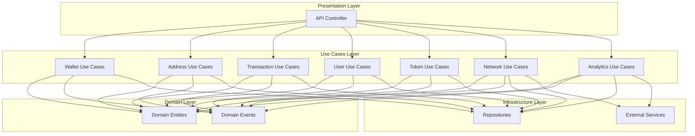
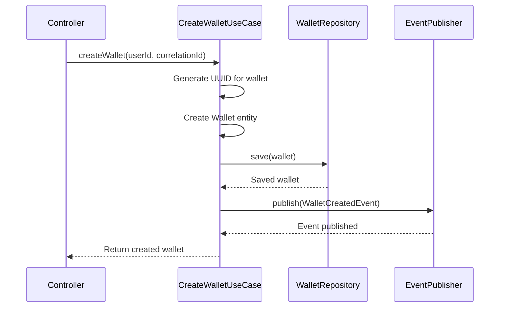

# Use Cases Module Documentation

## Overview

The Use Cases module implements the application's business logic following the Clean Architecture pattern. It contains all the business operations that can be performed within the Wallet Hub system, organized as discrete, focused use cases that encapsulate specific business workflows.

## Module Purpose

The Use Cases module serves as the **business logic layer** that orchestrates domain entities, repositories, and events to fulfill business requirements. Each use case represents a single business operation with well-defined inputs, outputs, and side effects.

## Architecture

### Clean Architecture Position
```
┌─────────────────────────────────────────────────────────────┐
│                    Presentation Layer                        │
│                    (Controllers, APIs)                       │
├─────────────────────────────────────────────────────────────┤
│                    Use Cases Layer                           │
│                    (Business Logic)                          │
├─────────────────────────────────────────────────────────────┤
│                    Domain Layer                              │
│                    (Entities, Value Objects, Events)         │
├─────────────────────────────────────────────────────────────┤
│                    Infrastructure Layer                      │
│                    (Repositories, External Services)         │
└─────────────────────────────────────────────────────────────┘
```

The Use Cases module sits between the Presentation Layer (controllers) and the Domain Layer, orchestrating business operations while maintaining separation of concerns.

### Component Relationships



## Use Case Categories

### 1. Wallet Management Use Cases
Core operations for managing cryptocurrency wallets within the system.

| Use Case | Purpose | Dependencies | Events Published |
|----------|---------|--------------|------------------|
| `CreateWalletUseCase` | Creates new wallet for user | `WalletRepository`, `DomainEventPublisher` | `WalletCreatedEvent` |
| `UpdateWalletUseCase` | Updates wallet metadata | `WalletRepository`, `DomainEventPublisher` | `WalletUpdatedEvent` |
| `ActivateWalletUseCase` | Activates a wallet | `WalletRepository`, `DomainEventPublisher` | `WalletStatusChangedEvent` |
| `DeactivateWalletUseCase` | Deactivates a wallet | `WalletRepository`, `DomainEventPublisher` | `WalletStatusChangedEvent` |
| `DeleteWalletUseCase` | Deletes a wallet | `WalletRepository`, `DomainEventPublisher` | `WalletDeletedEvent` |
| `ListWalletsUseCase` | Lists all wallets | `WalletRepository` | None |
| `GetWalletDetailsUseCase` | Gets detailed wallet info | `WalletRepository`, `AddressRepository` | None |
| `RecoverWalletUseCase` | Initiates wallet recovery | `WalletRepository`, `DomainEventPublisher` | `WalletRecoveryInitiatedEvent` |

### 2. Address Management Use Cases
Operations for managing blockchain addresses associated with wallets.

| Use Case | Purpose | Dependencies | Events Published |
|----------|---------|--------------|------------------|
| `CreateAddressUseCase` | Creates new address | `AddressRepository`, `WalletRepository`, `NetworkRepository`, `DomainEventPublisher` | `AddressCreatedEvent` |
| **`ValidateAddressUseCase`** | **Validates address format** | **`NetworkRepository`** | **None** |
| `GetAddressBalanceUseCase` | Gets address balance | `AddressRepository`, `TokenBalanceRepository` | None |
| `ListAddressesByWalletUseCase` | Lists addresses by wallet | `AddressRepository`, `WalletRepository` | None |
| `UpdateAddressStatusUseCase` | Updates address status | `AddressRepository`, `DomainEventPublisher` | `AddressStatusChangedEvent` |
| `ImportAddressUseCase` | Imports existing address | `AddressRepository`, `WalletRepository`, `NetworkRepository`, `DomainEventPublisher`, `ValidateAddressUseCase` | `AddressAddedToWalletEvent` |

### 3. Transaction Management Use Cases
Operations for handling fund transfers and transaction lifecycle.

| Use Case | Purpose | Dependencies | Events Published |
|----------|---------|--------------|------------------|
| `AddFundsUseCase` | Adds funds to wallet | `WalletRepository`, `TransactionRepository`, `DomainEventPublisher` | `FundsAddedEvent` |
| `WithdrawFundsUseCase` | Withdraws funds from wallet | `WalletRepository`, `TransactionRepository`, `DomainEventPublisher` | `FundsWithdrawnEvent` |
| `TransferFundsUseCase` | Transfers between wallets | `WalletRepository`, `TransactionRepository`, `DomainEventPublisher` | `FundsTransferredEvent` |
| `CreateTransactionUseCase` | Creates transaction record | `TransactionRepository`, `DomainEventPublisher` | `TransactionCreatedEvent` |
| `ConfirmTransactionUseCase` | Confirms transaction | `TransactionRepository`, `DomainEventPublisher` | `TransactionConfirmedEvent` |
| `FailTransactionUseCase` | Marks transaction as failed | `TransactionRepository`, `DomainEventPublisher` | `TransactionStatusChangedEvent` |

### 4. User Management Use Cases
Operations for user authentication and profile management.

| Use Case | Purpose | Dependencies | Events Published |
|----------|---------|--------------|------------------|
| `CreateUserUseCase` | Creates new user | `UserRepository`, `DomainEventPublisher` | `UserCreatedEvent` |
| `AuthenticateUserUseCase` | Authenticates user | `UserRepository`, `UserSessionRepository`, `DomainEventPublisher` | `UserAuthenticatedEvent` |
| `UpdateUserProfileUseCase` | Updates user profile | `UserRepository`, `DomainEventPublisher` | `UserProfileUpdatedEvent` |
| `ChangePasswordUseCase` | Changes user password | `UserRepository`, `UserSessionRepository`, `DomainEventPublisher` | None |
| `DeactivateUserUseCase` | Deactivates user account | `UserRepository`, `UserSessionRepository`, `DomainEventPublisher` | `UserStatusChangedEvent` |

### 5. Token Management Use Cases
Operations for managing cryptocurrency tokens.

| Use Case | Purpose | Dependencies | Events Published |
|----------|---------|--------------|------------------|
| `AddTokenToWalletUseCase` | Adds token to wallet | `WalletRepository`, `TokenRepository`, `WalletTokenRepository`, `DomainEventPublisher` | `TokenAddedToWalletEvent` |
| `RemoveTokenFromWalletUseCase` | Removes token from wallet | `WalletRepository`, `WalletTokenRepository`, `DomainEventPublisher` | `TokenRemovedFromWalletEvent` |
| `GetTokenBalanceUseCase` | Gets token balance | `WalletRepository`, `TokenRepository`, `TokenBalanceRepository` | None |
| `ListSupportedTokensUseCase` | Lists supported tokens | `TokenRepository`, `NetworkRepository` | None |

### 6. Network Management Use Cases
Operations for managing blockchain networks.

| Use Case | Purpose | Dependencies | Events Published |
|----------|---------|--------------|------------------|
| `AddNetworkUseCase` | Adds new network | `NetworkRepository`, `DomainEventPublisher` | `NetworkCreatedEvent` |
| `ListNetworksUseCase` | Lists all networks | `NetworkRepository` | None |

### 7. Analytics and Portfolio Use Cases
Operations for analytics and portfolio management.

| Use Case | Purpose | Dependencies | Events Published |
|----------|---------|--------------|------------------|
| `CheckBalanceUseCase` | Checks wallet balance | `WalletRepository` | None |
| `EstimateTransactionFeeUseCase` | Estimates transaction fees | `NetworkRepository`, `TransactionFeeRepository` | None |
| `GetPortfolioSummaryUseCase` | Gets portfolio summary | `WalletRepository`, `AddressRepository`, `TokenBalanceRepository`, `TokenRepository` | None |

## Detailed Use Case Analysis

### ValidateAddressUseCase (Featured Use Case)

The `ValidateAddressUseCase` is a critical validation component that ensures blockchain addresses are properly formatted and compatible with target networks.

#### Purpose
- Validate address format correctness
- Check network compatibility
- Support batch validation operations

#### Business Rules
1. Address format must be valid for the specific network
2. Network must exist and be accessible
3. Validation rules vary by network type
4. No domain events are published by this validation operation

#### Supported Address Formats
- **Ethereum**: `0x` followed by 40 hex characters
- **Bitcoin Legacy**: Base58 format starting with `1` or `3`
- **Bitcoin Bech32**: `bc1` prefix with specific length
- **Hexadecimal**: Generic hex format

#### Network Compatibility Rules
- Ethereum addresses compatible with Ethereum, BSC, Polygon networks
- Bitcoin addresses compatible with Bitcoin networks
- Unknown formats allowed for flexibility

#### Usage Example
```java
// Single address validation
AddressValidationResult result = validateAddressUseCase.validateAddress(
    "0x742d35Cc6634C0532925a3b844Bc9e0F0C863F94",
    networkId,
    correlationId
);

// Batch validation
AddressValidationResult[] results = validateAddressUseCase.validateAddresses(
    addresses,
    networkId,
    correlationId
);
```

#### Validation Result Structure
```java
public class AddressValidationResult {
    private final boolean valid;           // Format validity
    private final String address;          // Original address
    private final String format;          // Detected format
    private final String network;         // Network name
    private final boolean networkCompatible; // Network compatibility
    private final String error;           // Error message if invalid
}
```

### CreateWalletUseCase

#### Purpose
Creates a new wallet with default metadata and publishes creation event.

#### Business Rules
1. Generates unique wallet ID
2. Sets default wallet name
3. Publishes `WalletCreatedEvent` for downstream processing

#### Flow Diagram


### TransferFundsUseCase

#### Purpose
Transfers funds between two wallets with validation and event publishing.

#### Business Rules
1. Amount must be greater than zero
2. Both source and destination wallets must exist
3. Source wallet must have sufficient balance
4. Publishes `FundsTransferredEvent` for audit trail

#### Error Conditions
- Invalid amount (≤ 0)
- Source wallet not found
- Destination wallet not found
- Insufficient funds

## Configuration

### UseCaseConfig
All use cases are configured in `UseCaseConfig.java` with Spring Beans. Configuration is conditional on `app.usecases.enabled` property.

```java
@Configuration(proxyBeanMethods = false)
@ConditionalOnProperty(value = "app.usecases.enabled", havingValue = "true", matchIfMissing = true)
public class UseCaseConfig {
    // Bean definitions for all use cases
}
```

### Dependency Injection Pattern
Each use case follows the record pattern with constructor injection:
```java
public record ValidateAddressUseCase(NetworkRepository networkRepository) {
    // Business logic methods
}
```

## Error Handling

### Validation Errors
- Address validation errors return `AddressValidationResult` with error details
- Invalid inputs throw `IllegalArgumentException`
- Missing dependencies throw appropriate runtime exceptions

### Business Rule Violations
- Insufficient funds
- Invalid wallet states
- Network unavailability
- Authentication failures

### Correlation ID Management
All use cases support correlation IDs for distributed tracing:
- Required for operations that span multiple systems
- Validated as UUID format
- Propagated through events and repository calls

## Testing Considerations

### Unit Testing
- Test each use case in isolation with mocked dependencies
- Verify business rules are enforced
- Test error conditions and edge cases

### Integration Testing
- Test use case interactions with real repositories
- Verify event publishing
- Test correlation ID propagation

### Performance Testing
- Batch operations (e.g., batch address validation)
- Concurrent execution scenarios
- Memory usage for large datasets

## Best Practices

### 1. Single Responsibility
Each use case handles exactly one business operation.

### 2. Immutable Inputs
Use case methods accept immutable parameters and return new results.

### 3. Event-Driven Architecture
Publish domain events for significant state changes.

### 4. Correlation ID Propagation
Always propagate correlation IDs for traceability.

### 5. Validation First
Validate inputs before performing business logic.

### 6. Error Handling
Provide meaningful error messages and maintain system consistency.

## Integration Points

### With Domain Models
- Use cases operate on domain entities
- Follow domain-driven design principles
- Respect entity invariants

### With Repositories
- Abstract data access through repository interfaces
- Support correlation ID propagation
- Handle transaction boundaries appropriately

### With Events
- Publish domain events for significant changes
- Support event-driven workflows
- Maintain event consistency

### With Tracing Infrastructure
- Integrated with `UseCaseTracingAspect` for observability
- Supports distributed tracing through correlation IDs
- Monitors performance metrics

## Performance Characteristics

### Lightweight Operations
- Address validation: O(1) regex matching
- Balance checks: O(1) repository calls
- Simple CRUD operations: O(1) with proper indexing

### Batch Operations
- Batch address validation: O(n) with parallel processing support
- Portfolio calculations: O(n) aggregations

### Memory Usage
- Minimal state maintained in use cases
- Results returned as immutable objects
- Stream processing for large datasets

## Security Considerations

### Input Validation
- All inputs validated before processing
- Address format validation prevents injection attacks
- Correlation ID validation prevents log injection

### Access Control
- Use cases assume authorization has been performed
- Business rules enforce consistency
- No direct security logic in use cases

### Data Protection
- Sensitive data handled through domain entities
- No plaintext storage of private keys
- Audit trails through event publishing

## Monitoring and Observability

### Metrics
- Execution time per use case
- Success/failure rates
- Batch operation statistics

### Tracing
- Correlation ID propagation
- Distributed tracing support
- Performance bottleneck identification

### Logging
- Structured logging with correlation IDs
- Business operation auditing
- Error tracking and debugging

## Future Enhancements

### Planned Features
1. **Advanced Address Validation**
   - Smart contract address detection
   - Multi-signature address validation
   - Cross-chain address compatibility

2. **Enhanced Batch Operations**
   - Parallel processing optimization
   - Streaming support for large datasets
   - Progress tracking for long-running operations

3. **Caching Layer**
   - Address format cache
   - Network compatibility cache
   - Validation result caching

4. **Plugin Architecture**
   - Custom address format validators
   - Network-specific validation rules
   - Third-party validation service integration

## Related Documentation

- [Domain Models](domain_models.md) - Core domain entities and value objects
- [Domain Events](domain_events.md) - Event definitions and publishing
- [Domain Repositories](domain_repositories.md) - Data access interfaces
- [Infrastructure Data](infrastructure_data.md) - Repository implementations
- [Infrastructure Events](infrastructure_events.md) - Event infrastructure
- [Infrastructure Tracing](infrastructure_tracing.md) - Observability and monitoring