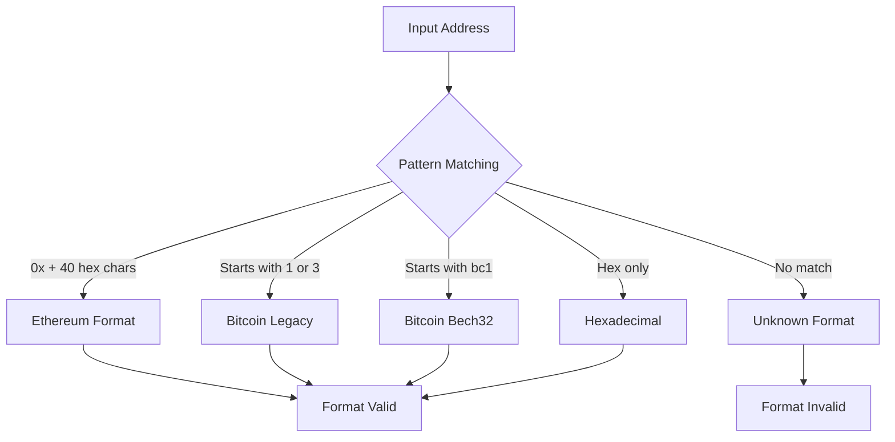
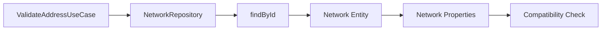

# ValidateAddressUseCase - Detailed Documentation

## Overview

The `ValidateAddressUseCase` is a specialized validation component within the Wallet Hub system that provides comprehensive blockchain address validation. It ensures addresses are properly formatted and compatible with target blockchain networks before they are used in transactions or stored in the system.

## Core Responsibilities

1. **Format Validation**: Verify address syntax matches expected patterns
2. **Network Compatibility**: Check if address format is compatible with target network
3. **Batch Processing**: Support validation of multiple addresses efficiently
4. **Error Reporting**: Provide detailed validation results with error information

## Class Structure

```java
public record ValidateAddressUseCase(NetworkRepository networkRepository) {
    
    // Core validation method
    public AddressValidationResult validateAddress(
        String addressValue, 
        UUID networkId, 
        String correlationId
    )
    
    // Batch validation method
    public AddressValidationResult[] validateAddresses(
        String[] addresses, 
        UUID networkId, 
        String correlationId
    )
    
    // Result class
    public static class AddressValidationResult {
        // Builder pattern implementation
        public static class Builder { ... }
    }
}
```

## Validation Logic

### Address Format Detection

The use case detects address formats using regex patterns:



### Network Compatibility Rules

```java
private boolean isAddressCompatibleWithNetwork(String address, Network network) {
    String format = determineAddressFormat(address);
    String networkName = network.getName().toLowerCase();
    
    return switch (format) {
        case "Ethereum" -> networkName.contains("ethereum") || 
                          networkName.contains("bsc") || 
                          networkName.contains("polygon");
        case "Bitcoin Legacy", "Bitcoin Bech32" -> networkName.contains("bitcoin");
        default -> true; // Allow unknown formats for flexibility
    };
}
```

## Usage Examples

### Single Address Validation

```java
// Initialize use case
ValidateAddressUseCase validator = new ValidateAddressUseCase(networkRepository);

// Validate Ethereum address against Ethereum network
AddressValidationResult result = validator.validateAddress(
    "0x742d35Cc6634C0532925a3b844Bc9e0F0C863F94",
    ethereumNetworkId,
    "550e8400-e29b-41d4-a716-446655440000"
);

// Check results
if (result.isValid() && result.isNetworkCompatible()) {
    // Address is valid and compatible with network
    System.out.println("Format: " + result.getFormat());
    System.out.println("Network: " + result.getNetwork());
} else {
    // Handle validation failure
    System.out.println("Error: " + result.getError());
}
```

### Batch Address Validation

```java
// Validate multiple addresses
String[] addresses = {
    "0x742d35Cc6634C0532925a3b844Bc9e0F0C863F94",
    "1A1zP1eP5QGefi2DMPTfTL5SLmv7DivfNa",
    "bc1qar0srrr7xfkvy5l643lydnw9re59gtzzwf5mdq"
};

AddressValidationResult[] results = validator.validateAddresses(
    addresses,
    bitcoinNetworkId,
    "550e8400-e29b-41d4-a716-446655440001"
);

// Process results
for (AddressValidationResult result : results) {
    System.out.println(result.getAddress() + ": " + 
                      (result.isValid() ? "Valid" : "Invalid"));
}
```

### Network-Agnostic Validation

```java
// Validate without specifying network (format-only validation)
AddressValidationResult result = validator.validateAddress(
    "0x742d35Cc6634C0532925a3b844Bc9e0F0C863F94",
    null,  // No network specified
    "550e8400-e29b-41d4-a716-446655440002"
);

// Result will have networkCompatible = true if format is valid
```

## Validation Result Structure

### AddressValidationResult Properties

| Property | Type | Description | Example |
|----------|------|-------------|---------|
| `valid` | `boolean` | Format validity | `true` |
| `address` | `String` | Original address value | `"0x742d35Cc6634C0532925a3b844Bc9e0F0C863F94"` |
| `format` | `String` | Detected address format | `"Ethereum"` |
| `network` | `String` | Network name (if provided) | `"Ethereum Mainnet"` |
| `networkCompatible` | `boolean` | Compatibility with network | `true` |
| `error` | `String` | Error message (if invalid) | `"Invalid address format"` |

### Builder Pattern Usage

```java
// Successful validation
AddressValidationResult success = AddressValidationResult.builder()
    .valid(true)
    .address("0x742d35Cc6634C0532925a3b844Bc9e0F0C863F94")
    .format("Ethereum")
    .network("Ethereum Mainnet")
    .networkCompatible(true)
    .build();

// Failed validation
AddressValidationResult failure = AddressValidationResult.builder()
    .valid(false)
    .address("invalid-address")
    .format("Invalid")
    .network("Unknown")
    .networkCompatible(false)
    .error("Address does not match any known format")
    .build();
```

## Error Conditions

### Input Validation Errors

| Error Condition | Exception | Message |
|-----------------|-----------|---------|
| Empty address | `IllegalArgumentException` | `"Address value must be provided"` |
| Missing correlation ID | `IllegalArgumentException` | `"Correlation ID must be provided"` |
| Invalid correlation ID format | `IllegalArgumentException` | `"Correlation ID must be a valid UUID"` |

### Validation Failure Scenarios

1. **Invalid Format**: Address doesn't match any known pattern
2. **Network Incompatibility**: Valid format but incompatible with target network
3. **Network Not Found**: Network ID provided but network doesn't exist
4. **Invalid AccountAddress**: Address fails `AccountAddress` constructor validation

## Integration with Other Components

### NetworkRepository Dependency



The use case depends on `NetworkRepository` to:
1. Retrieve network details by ID
2. Access network properties for compatibility checking
3. Validate network existence and status

### AccountAddress Integration

```java
// Internal usage of AccountAddress for basic validation
try {
    AccountAddress accountAddress = new AccountAddress(addressValue);
    // Address passes basic validation
} catch (IllegalArgumentException e) {
    // Address fails AccountAddress validation
    return AddressValidationResult.builder()
        .valid(false)
        .error(e.getMessage())
        .build();
}
```

## Business Rules

### Rule 1: Format Precedence
Address formats are checked in specific order:
1. Ethereum (most specific pattern)
2. Bitcoin Legacy
3. Bitcoin Bech32
4. Hexadecimal (generic fallback)

### Rule 2: Network Compatibility
- Ethereum addresses compatible with Ethereum, BSC, Polygon networks
- Bitcoin addresses compatible only with Bitcoin networks
- Unknown formats allowed for flexibility (future-proofing)

### Rule 3: Error Handling
- Format errors return `valid = false` with error message
- Network errors don't affect format validity
- Missing network results in format-only validation

### Rule 4: Correlation ID Requirements
- Required for all operations
- Must be valid UUID format
- Propagated to repository calls

## Performance Characteristics

### Time Complexity
- **Single validation**: O(1) - constant time regex matching
- **Batch validation**: O(n) - linear scaling with address count
- **Network lookup**: O(1) - repository call with UUID

### Memory Usage
- Minimal object creation per validation
- Results are lightweight POJOs
- No caching of validation results

### Optimization Opportunities
1. **Pattern Pre-compilation**: Regex patterns could be pre-compiled
2. **Network Cache**: Frequently accessed networks could be cached
3. **Parallel Processing**: Batch validation could use parallel streams

## Testing Strategy

### Unit Tests

```java
@Test
void validateAddress_validEthereumAddress_returnsValidResult() {
    // Given
    String address = "0x742d35Cc6634C0532925a3b844Bc9e0F0C863F94";
    UUID networkId = UUID.randomUUID();
    Network network = mockNetwork("Ethereum Mainnet");
    
    when(networkRepository.findById(networkId, any()))
        .thenReturn(Optional.of(network));
    
    // When
    AddressValidationResult result = useCase.validateAddress(
        address, networkId, CORRELATION_ID);
    
    // Then
    assertTrue(result.isValid());
    assertEquals("Ethereum", result.getFormat());
    assertTrue(result.isNetworkCompatible());
}

@Test
void validateAddress_invalidFormat_returnsInvalidResult() {
    // Given
    String address = "invalid-address";
    
    // When
    AddressValidationResult result = useCase.validateAddress(
        address, null, CORRELATION_ID);
    
    // Then
    assertFalse(result.isValid());
    assertEquals("Invalid", result.getFormat());
    assertNotNull(result.getError());
}
```

### Integration Tests
- Test with real NetworkRepository implementations
- Verify correlation ID propagation
- Test batch validation performance

### Edge Cases
- Empty strings and null values
- Extremely long addresses
- Mixed case hexadecimal
- Network maintenance status
- Concurrent validation requests

## Security Considerations

### Input Sanitization
- Address values are not sanitized (preserve original format)
- Correlation IDs are validated as UUIDs
- No SQL injection risk (parameters not used in queries)

### Privacy Considerations
- Addresses are public blockchain data
- No PII in address values
- Correlation IDs are for tracing only

### Rate Limiting
- Consider implementing rate limiting for batch operations
- Monitor for abuse patterns
- Log validation attempts for audit

## Monitoring and Observability

### Metrics to Track
- Validation success/failure rates
- Average validation time
- Network compatibility statistics
- Batch operation sizes

### Logging
```json
{
  "timestamp": "2024-01-15T10:30:00Z",
  "level": "INFO",
  "component": "ValidateAddressUseCase",
  "correlationId": "550e8400-e29b-41d4-a716-446655440000",
  "address": "0x742d35Cc6634C0532925a3b844Bc9e0F0C863F94",
  "networkId": "123e4567-e89b-12d3-a456-426614174000",
  "valid": true,
  "format": "Ethereum",
  "networkCompatible": true,
  "durationMs": 15
}
```

### Tracing Integration
- Integrated with `UseCaseTracingAspect`
- Supports distributed tracing
- Correlates validation with downstream operations

## Extension Points

### Custom Format Validators
```java
public interface AddressFormatValidator {
    boolean matches(String address);
    String getFormatName();
    boolean isCompatibleWith(Network network);
}

// Register custom validators
List<AddressFormatValidator> customValidators = Arrays.asList(
    new SolanaAddressValidator(),
    new CardanoAddressValidator()
);
```

### Network-Specific Rules
```java
public interface NetworkCompatibilityRule {
    boolean isCompatible(String addressFormat, Network network);
    int getPriority(); // Rule precedence
}
```

### Validation Hooks
```java
public interface ValidationHook {
    void beforeValidation(String address, UUID networkId);
    void afterValidation(AddressValidationResult result);
}
```

## Related Use Cases

### ImportAddressUseCase
Uses `ValidateAddressUseCase` to validate addresses before import:
```java
public class ImportAddressUseCase {
    private final ValidateAddressUseCase validateAddressUseCase;
    
    public Address importAddress(String addressValue, UUID walletId, 
                                UUID networkId, String correlationId) {
        // Validate address first
        AddressValidationResult validation = validateAddressUseCase.validateAddress(
            addressValue, networkId, correlationId);
        
        if (!validation.isValid() || !validation.isNetworkCompatible()) {
            throw new IllegalArgumentException("Invalid address for network");
        }
        
        // Proceed with import...
    }
}
```

### CreateAddressUseCase
Could integrate validation for address generation verification.

## Future Enhancements

### Planned Features
1. **Smart Contract Detection**
   - Detect if address is a contract vs EOA
   - Check contract bytecode and ABI compatibility

2. **Multi-Chain Support**
   - Solana, Cardano, Polkadot address formats
   - Cross-chain address mapping

3. **Advanced Validation**
   - Checksum verification (EIP-55)
   - Bech32 error correction
   - Hierarchical deterministic (HD) address validation

4. **Performance Improvements**
   - Pattern cache for frequent formats
   - Async validation for batch operations
   - Result caching with TTL

5. **External Service Integration**
   - Blockchain node validation
   - Third-party validation services
   - Real-time network status checks

## Configuration

### Spring Bean Configuration
```java
@Bean
public ValidateAddressUseCase validateAddressUseCase(
    NetworkRepository networkRepository) {
    return new ValidateAddressUseCase(networkRepository);
}
```

### Properties
```yaml
app:
  validation:
    address:
      enabled: true
      batch-size: 100
      timeout-ms: 5000
      cache-enabled: true
      cache-ttl-minutes: 30
```

## Best Practices for Consumers

### 1. Always Validate Before Use
```java
// ❌ Don't use addresses without validation
walletRepository.addAddress(unvalidatedAddress);

// ✅ Always validate first
AddressValidationResult validation = validator.validateAddress(
    address, networkId, correlationId);
if (validation.isValid() && validation.isNetworkCompatible()) {
    walletRepository.addAddress(address);
}
```

### 2. Handle Validation Errors Gracefully
```java
try {
    AddressValidationResult result = validator.validateAddress(
        address, networkId, correlationId);
    
    if (!result.isValid()) {
        return ApiResponse.error("Invalid address: " + result.getError());
    }
    
    if (!result.isNetworkCompatible()) {
        return ApiResponse.error(
            "Address format not compatible with " + result.getNetwork());
    }
    
    // Proceed with valid address
} catch (IllegalArgumentException e) {
    return ApiResponse.error("Validation error: " + e.getMessage());
}
```

### 3. Use Correlation IDs for Tracing
```java
// Generate correlation ID at request entry point
String correlationId = UUID.randomUUID().toString();

// Propagate through all operations
validator.validateAddress(address, networkId, correlationId);
networkRepository.findById(networkId, correlationId);
```

### 4. Batch Validation for Efficiency
```java
// For multiple addresses, use batch validation
AddressValidationResult[] results = validator.validateAddresses(
    addresses, networkId, correlationId);

// Process results
List<String> validAddresses = Arrays.stream(results)
    .filter(AddressValidationResult::isValid)
    .filter(AddressValidationResult::isNetworkCompatible)
    .map(AddressValidationResult::getAddress)
    .collect(Collectors.toList());
```

## Troubleshooting Guide

### Common Issues

| Issue | Symptoms | Solution |
|-------|----------|----------|
| Address always invalid | Returns "Unknown" format | Check address format matches supported patterns |
| Network compatibility false | Valid format but incompatible | Verify network name contains expected keywords |
| Correlation ID errors | IllegalArgumentException | Ensure correlation ID is valid UUID string |
| Performance issues | Slow batch validation | Reduce batch size or implement caching |

### Debugging Steps
1. Check address format with regex testers
2. Verify network exists in repository
3. Check correlation ID format
4. Review validation result details
5. Monitor logs for error messages

### Support Contact
For issues with address validation, contact:
- **Component Owner**: Wallet Infrastructure Team
- **Documentation**: [Domain Models](domain_models.md)
- **Repository**: `src/main/java/dev/bloco/wallet/hub/usecase/`