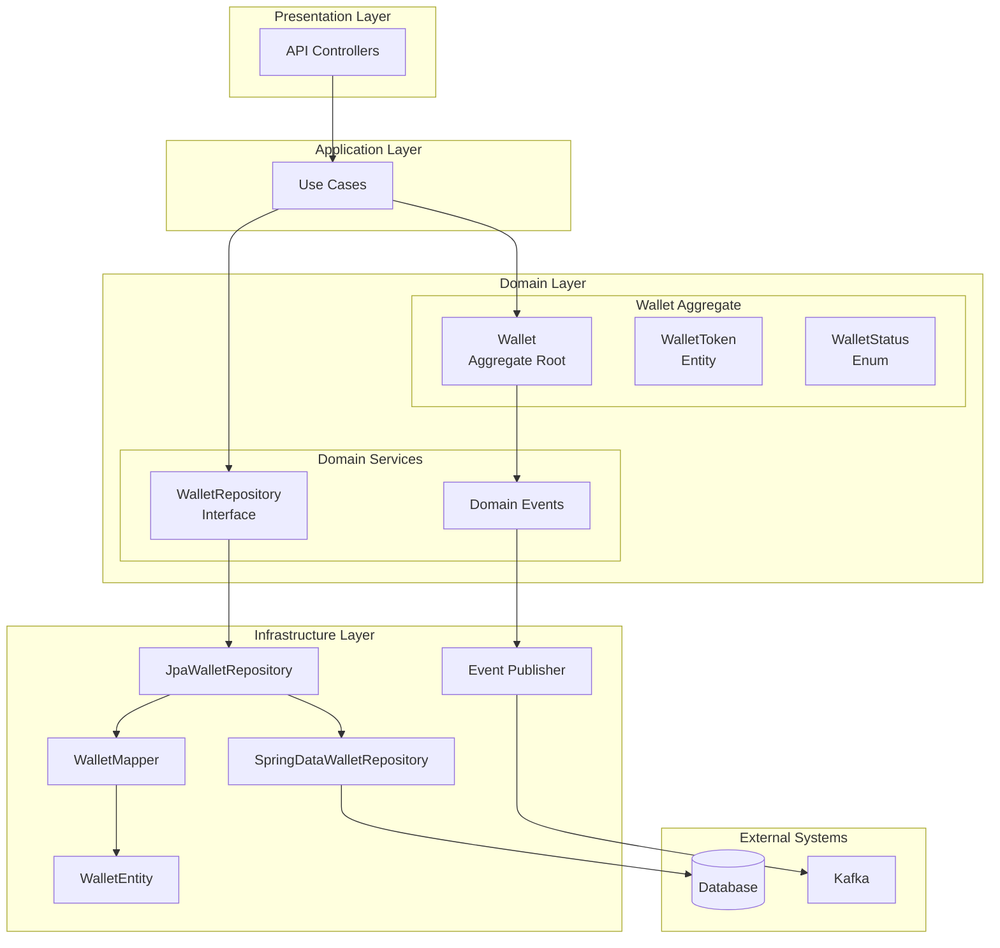
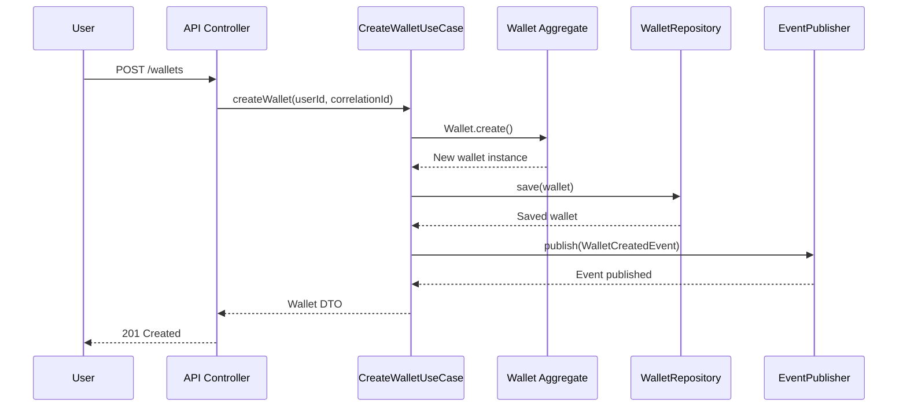
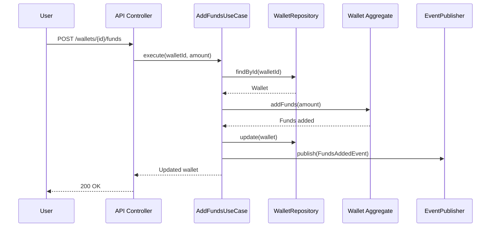

# Wallet Management Module

## Overview

The Wallet Management module is a core component of the Wallet Hub system that provides comprehensive wallet lifecycle management, including creation, updates, status management, and financial operations. This module implements Domain-Driven Design principles with a rich domain model that encapsulates wallet behavior and business rules.

## Core Purpose

The module enables users to:
- Create and manage digital wallets
- Perform financial operations (add/withdraw funds)
- Manage wallet status and lifecycle
- Associate addresses and tokens with wallets
- Track wallet balances and relationships

## Architecture

### Module Structure

```
wallet_management/
├── domain/
│   ├── model/
│   │   ├── Wallet.java              # Main aggregate root
│   │   └── wallet/
│   │       ├── WalletStatus.java    # Status enumeration
│   │       └── WalletToken.java     # Wallet-token relationship entity
│   ├── gateway/
│   │   ├── WalletRepository.java    # Repository interface
│   │   └── WalletTokenRepository.java
│   └── event/
│       └── wallet/                  # Domain events
│           ├── WalletCreatedEvent.java
│           ├── WalletUpdatedEvent.java
│           ├── WalletStatusChangedEvent.java
│           ├── WalletDeletedEvent.java
│           ├── WalletRecoveryInitiatedEvent.java
│           ├── AddressAddedToWalletEvent.java
│           ├── AddressRemovedFromWalletEvent.java
│           ├── TokenAddedToWalletEvent.java
│           ├── TokenRemovedFromWalletEvent.java
│           ├── FundsAddedEvent.java
│           ├── FundsWithdrawnEvent.java
│           └── FundsTransferredEvent.java
├── infrastructure/
│   ├── provider/
│   │   ├── data/
│   │   │   ├── entity/
│   │   │   │   └── WalletEntity.java
│   │   │   ├── repository/
│   │   │   │   ├── JpaWalletRepository.java
│   │   │   │   └── SpringDataWalletRepository.java
│   │   │   └── mapper/
│   │   │       └── WalletMapper.java
│   └── adapter/
│       └── event/
│           └── consumer/
│               └── WalletCreatedEventConsumer.java
└── usecase/
    ├── CreateWalletUseCase.java
    ├── UpdateWalletUseCase.java
    ├── DeleteWalletUseCase.java
    ├── ActivateWalletUseCase.java
    ├── DeactivateWalletUseCase.java
    ├── AddFundsUseCase.java
    ├── WithdrawFundsUseCase.java
    ├── TransferFundsUseCase.java
    ├── AddTokenToWalletUseCase.java
    ├── RemoveTokenFromWalletUseCase.java
    ├── GetWalletDetailsUseCase.java
    ├── ListWalletsUseCase.java
    └── RecoverWalletUseCase.java
```

### Architecture Diagram



## Core Components

### 1. Wallet Aggregate Root

The `Wallet` class is the central aggregate root that manages wallet state and behavior.

#### Key Attributes
- **id**: Unique identifier (UUID)
- **name**: Human-readable wallet name
- **description**: Optional description
- **balance**: Current wallet balance (BigDecimal)
- **status**: Current wallet state (WalletStatus enum)
- **userId**: Associated user identifier
- **addressIds**: Set of associated address IDs
- **createdAt/updatedAt**: Timestamps for audit

#### Core Operations

```java
// Creation
public static Wallet create(UUID id, String name, String description)

// Financial Operations
public void addFunds(BigDecimal amount)
public void withdrawFunds(BigDecimal amount)

// Status Management
public void activate()
public void deactivate()
public void delete(String reason)
public void lock(String reason)
public void initiateRecovery(String recoveryMethod)

// Address Management
public void addAddress(UUID addressId)
public void removeAddress(UUID addressId)
public boolean containsAddress(UUID addressId)

// Validation
public void validateOperationAllowed()
```

#### State Management

The wallet supports the following statuses:

| Status | Description | Operations Allowed |
|--------|-------------|-------------------|
| **ACTIVE** | Wallet is fully operational | All operations |
| **INACTIVE** | Wallet is temporarily disabled | Limited operations |
| **DELETED** | Wallet is soft-deleted | No operations (audit only) |
| **RECOVERING** | Wallet is being recovered | Limited recovery operations |
| **LOCKED** | Wallet is locked for security | No operations |

### 2. WalletToken Entity

The `WalletToken` entity manages the many-to-many relationship between wallets and tokens.

#### Key Attributes
- **walletId**: Reference to wallet
- **tokenId**: Reference to token
- **addedAt**: Timestamp when token was added
- **isEnabled**: Whether token is enabled in wallet
- **displayName**: Custom display name for token
- **isVisible**: Whether token is visible in UI

### 3. Domain Events

The module publishes various domain events to notify other system components about wallet state changes:

| Event | Trigger | Purpose |
|-------|---------|---------|
| `WalletCreatedEvent` | Wallet creation | Notify new wallet creation |
| `WalletUpdatedEvent` | Wallet info update | Track metadata changes |
| `WalletStatusChangedEvent` | Status change | Monitor state transitions |
| `WalletDeletedEvent` | Wallet deletion | Handle cleanup processes |
| `WalletRecoveryInitiatedEvent` | Recovery start | Trigger recovery workflows |
| `AddressAddedToWalletEvent` | Address association | Update address mappings |
| `TokenAddedToWalletEvent` | Token association | Update token balances |
| `FundsAddedEvent` | Funds addition | Track financial transactions |
| `FundsWithdrawnEvent` | Funds withdrawal | Monitor outflows |
| `FundsTransferredEvent` | Funds transfer | Track inter-wallet transfers |

### 4. Event Consumers

The module includes event consumers that process domain events:

1. **WalletCreatedEventConsumer**
   - Processes wallet creation events from Kafka
   - Extracts trace context for distributed tracing
   - Updates saga state machine for workflow management
   - Validates correlation IDs for event correlation

2. **FundsAddedEventConsumer**
   - Processes fund addition events
   - Updates related systems (analytics, notifications)

3. **FundsWithdrawnEventConsumer**
   - Processes withdrawal events
   - Triggers security checks and notifications

4. **FundsTransferredEventConsumer**
   - Processes transfer events
   - Updates both source and destination wallet systems

### 5. Saga State Machine Integration

The wallet module integrates with the saga state machine for managing distributed transactions:

- **State Transitions**: `WALLET_CREATED` event triggers state transitions
- **Correlation ID**: Events include correlation IDs for tracking distributed workflows
- **Error Handling**: Missing correlation IDs trigger `SAGA_FAILED` state
- **Trace Propagation**: CloudEvents with W3C Trace Context for distributed tracing

## Data Flow

### Wallet Creation Flow



### Fund Management Flow



## Dependencies

### Internal Dependencies

1. **Common Foundation Module** ([common_foundation.md](common_foundation.md))
   - `AggregateRoot` base class
   - `Entity` base class
   - Domain event infrastructure

2. **User Management Module** ([user_management.md](user_management.md))
   - User association via `userId`
   - User authentication and authorization

3. **Address Management Module** ([address_management.md](address_management.md))
   - Address entities and management
   - Address-wallet relationships

4. **Token Management Module** ([token_management.md](token_management.md))
   - Token entities
   - Token balance tracking

### External Dependencies

1. **Spring Data JPA** - Data persistence
2. **MapStruct** - Object mapping
3. **Kafka** - Event publishing
4. **PostgreSQL** - Database storage

## Repository Pattern

### WalletRepository Interface

```java
public interface WalletRepository {
    Wallet save(Wallet wallet);
    void update(Wallet wallet);
    Optional<Wallet> findById(UUID id);
    List<Wallet> findAll();
    void delete(UUID id);
    List<Wallet> findByName(String name);
    boolean existsById(UUID id);
    List<Wallet> findByUserId(UUID userId);
    List<Wallet> findByUserIdAndStatus(UUID userId, WalletStatus status);
    List<Wallet> findActiveByUserId(UUID userId);
}
```

### Implementation Details

The `JpaWalletRepository` implements the repository interface using:
- **Spring Data JPA** for CRUD operations
- **WalletMapper** for domain-entity conversion
- **WalletEntity** as JPA entity representation

## Use Cases

### Primary Use Cases

1. **Create Wallet** (`CreateWalletUseCase`)
   - Creates new wallet with default settings
   - Publishes `WalletCreatedEvent`
   - Returns created wallet

2. **Update Wallet** (`UpdateWalletUseCase`)
   - Updates wallet name and description
   - Publishes `WalletUpdatedEvent`
   - Validates operation permissions

3. **Manage Funds** (`AddFundsUseCase`, `WithdrawFundsUseCase`, `TransferFundsUseCase`)
   - Handles financial transactions
   - Validates balance constraints
   - Publishes financial events

4. **Status Management** (`ActivateWalletUseCase`, `DeactivateWalletUseCase`, `DeleteWalletUseCase`)
   - Controls wallet lifecycle
   - Enforces business rules
   - Publishes status change events

5. **Token Management** (`AddTokenToWalletUseCase`, `RemoveTokenFromWalletUseCase`)
   - Manages wallet-token relationships
   - Updates token visibility and settings

### Business Rules

1. **Balance Validation**
   - Withdrawals require sufficient balance
   - Amounts must be positive
   - Balance cannot be negative

2. **Status Constraints**
   - Only ACTIVE wallets can perform operations
   - DELETED wallets cannot be modified
   - LOCKED wallets require administrative action

3. **Address Management**
   - Addresses must be unique per wallet
   - Address operations require wallet to be ACTIVE

## Error Handling

### Common Exceptions

| Exception | Cause | Resolution |
|-----------|-------|------------|
| `IllegalArgumentException` | Invalid amount (≤ 0) | Provide positive amount |
| `IllegalStateException` | Wallet not ACTIVE | Activate wallet first |
| `IllegalArgumentException` | Insufficient balance | Add funds before withdrawal |
| `EntityNotFoundException` | Wallet not found | Check wallet ID |

### Validation Rules

1. **Amount Validation**: All financial amounts must be > 0
2. **Status Validation**: Operations require ACTIVE status
3. **Balance Validation**: Withdrawals require sufficient balance
4. **Address Validation**: Addresses must exist before association

## Testing Strategy

### Unit Tests
- Wallet aggregate behavior
- Business rule validation
- State transition correctness

### Integration Tests
- Repository operations
- Use case execution
- Event publishing

### End-to-End Tests
- API endpoints
- Complete workflows
- Error scenarios

## Performance Considerations

### Caching Strategy
- Frequently accessed wallets
- User wallet lists
- Balance information

### Database Optimization
- Indexes on `userId`, `status`
- Partitioning by user or date
- Query optimization for common operations

### Event Processing
- Async event publishing
- Batch processing for high-volume operations
- Dead letter queues for failed events

## Security Considerations

### Access Control
- User-specific wallet access
- Role-based permissions
- Operation-level authorization

### Data Protection
- Sensitive data encryption
- Audit logging
- Tamper detection

### Recovery Mechanisms
- Wallet backup procedures
- Recovery key management
- Disaster recovery plans

## Monitoring and Observability

### Key Metrics
- Wallet creation rate
- Transaction volume
- Average wallet balance
- Status distribution

### Health Checks
- Repository connectivity
- Event publishing status
- Database performance

### Alerting
- Unusual activity detection
- System error thresholds
- Performance degradation

## Future Enhancements

### Planned Features
1. **Multi-currency Support**
   - Multiple currency balances
   - Exchange rate integration
   - Cross-currency transfers

2. **Advanced Security**
   - Multi-signature wallets
   - Hardware wallet integration
   - Biometric authentication

3. **Analytics Integration**
   - Spending patterns
   - Portfolio analysis
   - Tax reporting

4. **API Extensions**
   - WebSocket notifications
   - Batch operations
   - Advanced filtering

## Related Documentation

- [User Management Module](user_management.md) - User authentication and profiles
- [Address Management Module](address_management.md) - Address creation and validation
- [Token Management Module](token_management.md) - Token definitions and balances
- [Transaction Management Module](transaction_management.md) - Transaction processing
- [Common Foundation Module](common_foundation.md) - Base classes and patterns