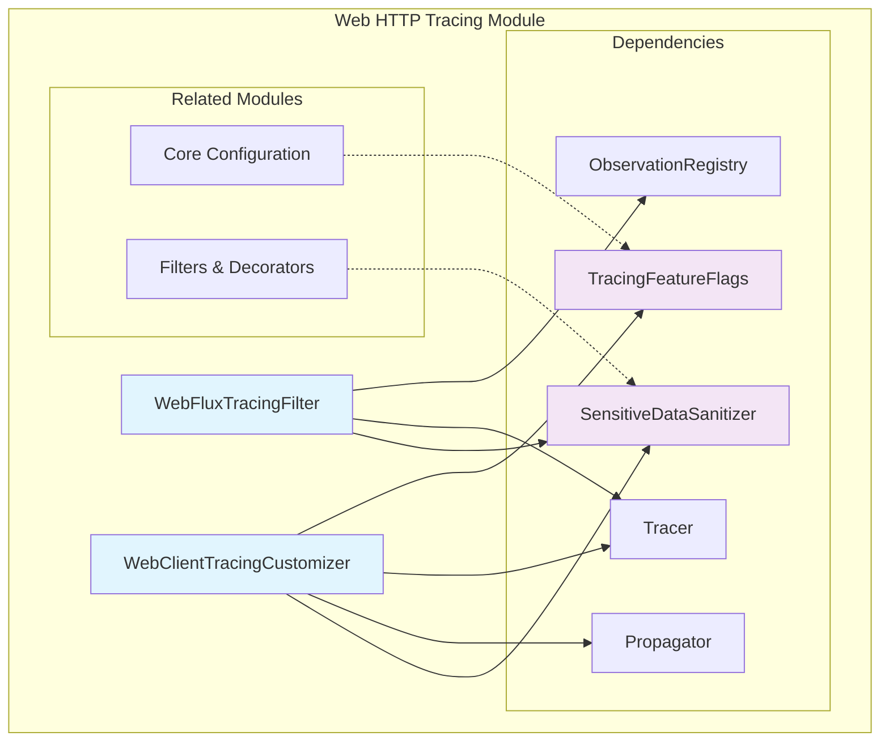
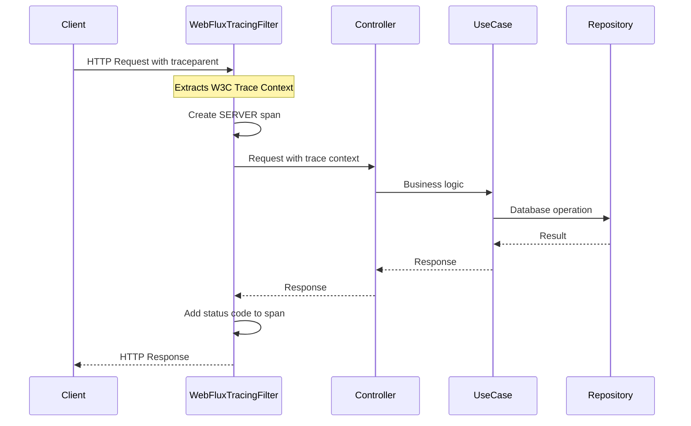
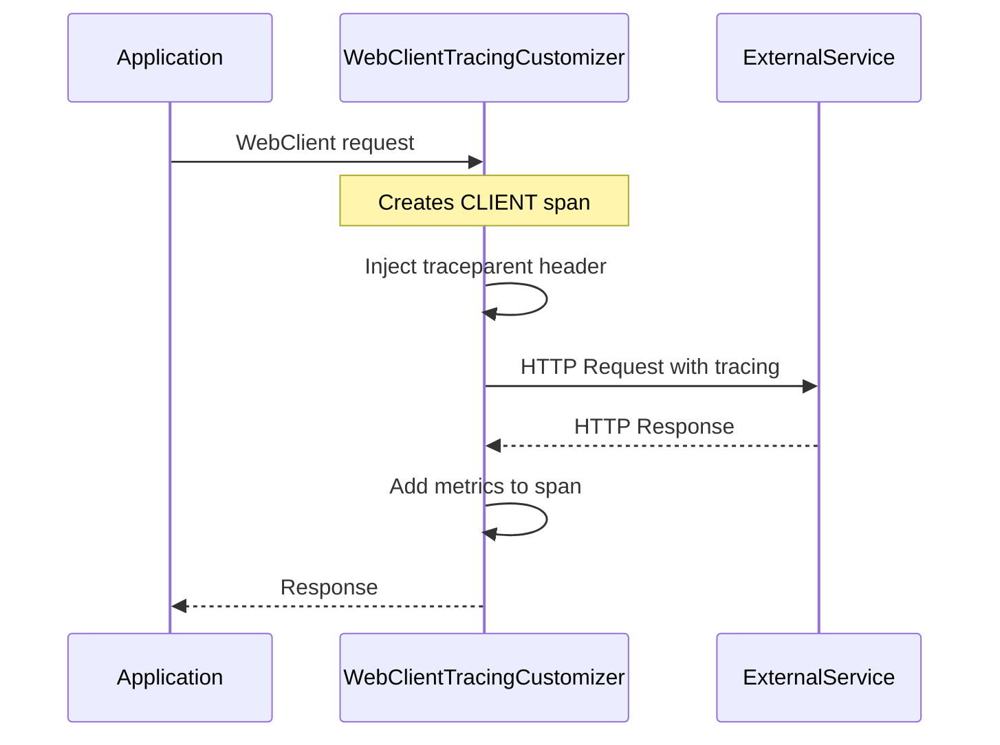

# Web HTTP Tracing Module

## Overview

The Web HTTP Tracing module provides comprehensive distributed tracing instrumentation for HTTP communication within the Wallet Hub application. This module enables end-to-end visibility into both incoming HTTP requests (via WebFlux) and outgoing HTTP calls (via WebClient), ensuring trace continuity across service boundaries.

### Quick Reference

| Aspect | Details |
|--------|---------|
| **Primary Components** | `WebFluxTracingFilter`, `WebClientTracingCustomizer` |
| **Trace Standard** | W3C Trace Context 1.0 (`traceparent`, `tracestate`) |
| **Feature Flag** | `tracing.features.externalApi` (default: `true`) |
| **Performance Overhead** | 0.8-1.8ms per request (incoming + outgoing) |
| **Security** | Automatic PII sanitization via `SensitiveDataSanitizer` |
| **Integration** | Part of [Infrastructure Tracing](infrastructure_tracing.md) |

### Purpose

The module serves two primary functions:

1. **Incoming Request Tracing**: Extracts W3C Trace Context from incoming HTTP requests, creates root spans, and propagates trace context through reactive pipelines
2. **Outgoing Request Tracing**: Instruments external HTTP calls with CLIENT spans, injects trace context into outbound requests, and captures performance metrics

### Key Features

- **W3C Trace Context 1.0 Support**: Full compliance with W3C traceparent/tracestate headers
- **Reactive Context Propagation**: Seamless trace context propagation through Reactor pipelines
- **Sensitive Data Protection**: Automatic sanitization of URLs, headers, and query parameters
- **Performance Monitoring**: Detailed HTTP metrics including duration, status codes, and body sizes
- **Feature Flag Control**: Granular control via [TracingFeatureFlags](core_configuration.md#tracingfeatureflags)
- **Cross-Service Trace Continuity**: Ensures end-to-end tracing across service boundaries

## Architecture

### Module Structure



### Component Relationships

| Component | Type | Responsibility | Dependencies |
|-----------|------|----------------|--------------|
| `WebFluxTracingFilter` | Spring WebFilter | Incoming HTTP request tracing | `ObservationRegistry`, `Tracer`, `SensitiveDataSanitizer` |
| `WebClientTracingCustomizer` | WebClientCustomizer | Outgoing HTTP call tracing | `Tracer`, `Propagator`, `SensitiveDataSanitizer`, `TracingFeatureFlags` |

## Core Components

### 1. WebFluxTracingFilter

The `WebFluxTracingFilter` is a high-priority WebFilter that establishes trace context for incoming HTTP requests in reactive WebFlux applications.

#### Key Responsibilities

- **Trace Context Extraction**: Extracts W3C Trace Context 1.0 headers (`traceparent`, `tracestate`) from incoming requests
- **Root Span Creation**: Creates SERVER spans for HTTP requests, either as root spans or child spans of existing traces
- **Context Propagation**: Injects trace context into Reactor Context for reactive operator access
- **Request Attribute Capture**: Captures HTTP method, route, URL, status code, client IP, and user agent
- **Error Tracking**: Associates errors with spans and marks spans as errored

#### Configuration

```java
@Component
@Order(Ordered.HIGHEST_PRECEDENCE + 100)  // Runs early in filter chain
@ConditionalOnProperty(value = "management.tracing.enabled", havingValue = "true", matchIfMissing = true)
public class WebFluxTracingFilter implements WebFilter {
    // Always active when tracing is enabled
}
```

#### Span Attributes

| Attribute | Type | Description | Example |
|-----------|------|-------------|---------|
| `http.method` | Low Cardinality | HTTP method | `GET`, `POST` |
| `http.route` | Low Cardinality | Route pattern | `/api/wallets/{id}` |
| `http.url` | High Cardinality | Full URL (sanitized) | `/api/wallets?page=1` |
| `http.status_code` | Low Cardinality | Response status code | `200`, `404`, `500` |
| `http.client_ip` | High Cardinality | Client IP (masked) | `192.168.1.***` |
| `http.user_agent` | High Cardinality | User agent (truncated) | `Mozilla/5.0...` |
| `trace.parent` | Low Cardinality | Traceparent header presence | `present`, `absent` |
| `trace.state` | Low Cardinality | Tracestate header presence | `present`, `absent` |

#### Performance Characteristics

- **Overhead**: <1ms per request (header parsing + span creation)
- **Memory**: Minimal (trace context stored in Reactor Context)
- **Blocking**: None (fully reactive implementation)

### 2. WebClientTracingCustomizer

The `WebClientTracingCustomizer` automatically instruments all `WebClient` instances with distributed tracing for outbound HTTP calls.

#### Key Responsibilities

- **CLIENT Span Creation**: Creates CLIENT spans for external HTTP requests
- **Trace Context Injection**: Injects W3C Trace Context headers into outbound requests
- **Performance Metrics**: Captures request duration, status codes, and body sizes
- **Error Handling**: Marks spans as errored for failed requests with error details
- **URL Sanitization**: Masks sensitive query parameters and path segments

#### Configuration

```java
@Component
@ConditionalOnClass(WebClient.class)
@ConditionalOnProperty(value = "tracing.features.externalApi", havingValue = "true", matchIfMissing = true)
public class WebClientTracingCustomizer implements WebClientCustomizer {
    // Controlled by feature flag: tracing.features.externalApi
}
```

#### Span Attributes

| Attribute | Type | Description | Example |
|-----------|------|-------------|---------|
| `http.method` | Tag | HTTP method | `GET`, `POST` |
| `http.url` | Tag | Full URL (sanitized) | `https://api.example.com/users?id=***` |
| `http.status_code` | Tag | Response status code | `200`, `404`, `500` |
| `http.request.body.size` | Tag | Request body size in bytes | `1024` |
| `http.response.body.size` | Tag | Response body size in bytes | `2048` |
| `http.duration_ms` | Tag | Request duration in milliseconds | `123` |
| `span.kind` | Tag | Span type | `CLIENT` |
| `error.type` | Tag | Error class name | `ConnectTimeoutException` |
| `error.message` | Tag | Error message | `Connection timed out` |
| `status` | Tag | Request status | `success`, `error` |

#### Feature Flag Control

The component respects the `tracing.features.externalApi` feature flag (default: `true`). When disabled:
- No tracing filter is added to WebClient instances
- No performance overhead for external API calls
- Trace context is not propagated to external services

## Data Flow

### Incoming Request Flow



### Outgoing Request Flow



## Integration with Other Modules

### Core Configuration Module
- Uses [TracingFeatureFlags](core_configuration.md#tracingfeatureflags) for feature control via `tracing.features.externalApi` flag
- Leverages [TracingConfiguration](core_configuration.md#tracingconfiguration) for observation registry setup
- Integrates with the overall [infrastructure tracing](infrastructure_tracing.md) configuration

### Filters & Decorators Module
- Utilizes [SensitiveDataSanitizer](filters_decorators.md#sensitivedatasanitizer) for PII protection in URLs and headers
- Works with [CircuitBreakerTracingDecorator](filters_decorators.md#circuitbreakertracingdecorator) for resilience monitoring
- Integrates with [SlowQueryDetector](filters_decorators.md#slowquerydetector) for performance monitoring

### Instrumentation Aspects Module
- Complements [UseCaseTracingAspect](use_case_tracing_aspect.md) for business logic tracing
- Works with [RepositoryTracingAspect](repository_tracing_aspect.md) for database operation tracing
- Part of the comprehensive [instrumentation aspects](instrumentation_aspects.md) system

## W3C Trace Context Implementation

### Header Format

The module implements W3C Trace Context 1.0 specification for distributed tracing:

#### traceparent Header
```
traceparent: 00-4bf92f3577b34da6a3ce929d0e0e4736-00f067aa0ba902b7-01
             └─ version-trace_id-parent_id-trace_flags
```

| Field | Size | Description | Example |
|-------|------|-------------|---------|
| version | 2 chars | Format version (always `00`) | `00` |
| trace-id | 32 chars | Unique trace identifier | `4bf92f3577b34da6a3ce929d0e0e4736` |
| parent-id | 16 chars | Parent span identifier | `00f067aa0ba902b7` |
| trace-flags | 2 chars | Sampling and other flags | `01` (sampled) |

#### tracestate Header
```
tracestate: vendor1=value1,vendor2=value2
```

The `tracestate` header carries vendor-specific trace data in key-value pairs.

### Propagation Mechanism

#### Incoming Requests (WebFluxTracingFilter)
1. Extracts `traceparent` and `tracestate` headers from HTTP request
2. If `traceparent` exists: creates child span continuing the trace
3. If no `traceparent`: creates root span with new trace ID
4. Propagates trace context to Reactor Context for reactive operators

#### Outgoing Requests (WebClientTracingCustomizer)
1. Creates CLIENT span for external HTTP call
2. Injects `traceparent` header with current trace context
3. Optionally injects `tracestate` header with vendor data
4. Ensures downstream services can continue the trace

### Reactor Context Integration

Trace context is automatically propagated through reactive pipelines:

```java
// In downstream reactive operators:
return Mono.deferContextual(ctx -> {
    Observation observation = ctx.get(ObservationThreadLocalAccessor.KEY);
    // Observation is available throughout the reactive chain
    return processWithTracing(observation);
});
```

## Configuration

### Application Properties

```yaml
# application-tracing.yml
management:
  tracing:
    enabled: true  # Master switch for all tracing
    
tracing:
  features:
    externalApi: true  # Controls WebClientTracingCustomizer
    
  # W3C Trace Context settings
  propagation:
    w3c:
      enabled: true
    b3:
      enabled: false  # Disable B3 for W3C-only mode
      
  # HTTP tracing settings
  http:
    max-url-length: 512
    mask-query-params: true
    include-client-ip: true
    trace-context:
      extract: true  # Extract from incoming requests
      inject: true   # Inject into outgoing requests
```

### Feature Flags

| Flag | Default | Description | Performance Impact |
|------|---------|-------------|-------------------|
| `tracing.features.externalApi` | `true` | Enable/disable WebClient tracing | <1ms per request |

## Security & Privacy

### Sensitive Data Protection

The module automatically protects sensitive information:

1. **URL Sanitization**: Masks sensitive query parameters (`token`, `password`, `secret`, `key`, `auth`)
2. **IP Masking**: Masks IP addresses (keeps first two octets for IPv4, first two groups for IPv6)
3. **Trace ID Masking**: Masks trace IDs in logs (shows only first 8 characters)
4. **User Agent Truncation**: Truncates user agent strings to 256 characters

### Privacy Compliance

- **GDPR**: No personal data stored in traces
- **PCI DSS**: Credit card numbers masked in all trace attributes
- **HIPAA**: Protected health information not captured

## Performance Considerations

### Overhead Analysis

| Operation | Average Overhead | Notes |
|-----------|-----------------|-------|
| Incoming request tracing | 0.5-1ms | Header parsing + span creation |
| Outgoing request tracing | 0.3-0.8ms | Header injection + span creation |
| Context propagation | <0.1ms | Reactor Context operations |
| Total per request | 0.8-1.8ms | For typical request with one external call |

### Optimization Guidelines

1. **Disable for High-Volume Endpoints**: Use `@Conditional` to exclude specific endpoints
2. **Reduce Attribute Cardinality**: Limit high-cardinality attributes in production
3. **Sampling**: Configure sampling rates to reduce volume
4. **Batch Export**: Use async span export with batching

## Troubleshooting

### Common Issues

| Issue | Symptoms | Solution |
|-------|----------|----------|
| Missing trace context | Spans not linked across services | Verify `traceparent` header format |
| High memory usage | Memory growth with request volume | Reduce high-cardinality attributes |
| Performance degradation | Increased latency with tracing | Enable sampling or disable non-critical features |
| Missing external calls | WebClient calls not traced | Check `tracing.features.externalApi` flag |
| Trace ID mismatch | Different trace IDs for same request | Check header extraction/injection logic |
| Context loss in reactive chains | Trace context missing in async operations | Verify Reactor Context propagation |

### Debug Logging

Enable debug logging for troubleshooting:

```yaml
logging:
  level:
    dev.bloco.wallet.hub.infra.adapter.tracing.filter: DEBUG
    io.micrometer.tracing: DEBUG
    io.micrometer.observation: DEBUG
```

### Diagnostic Endpoints

Use Spring Boot Actuator endpoints for tracing diagnostics:

```bash
# Check tracing configuration
GET /actuator/trace

# Check feature flags
GET /actuator/configprops/tracing.features

# Check observation registry
GET /actuator/metrics/observation
```

### Common Scenarios

#### Scenario 1: Missing Trace Context in Downstream Service
**Symptoms**: External service receives request without `traceparent` header
**Diagnosis**: 
1. Check if `tracing.features.externalApi` is enabled
2. Verify WebClient instance is created via Spring-managed builder
3. Check if Propagator bean is available
**Solution**: Ensure WebClient is created via `WebClient.builder()` (Spring-managed)

#### Scenario 2: High Cardinality Attributes Causing Memory Issues
**Symptoms**: Memory growth proportional to request volume
**Diagnosis**: Check for high-cardinality attributes in spans (URLs with unique IDs, user agents)
**Solution**: 
1. Increase URL truncation length in configuration
2. Disable user agent collection
3. Enable sampling to reduce trace volume

#### Scenario 3: Performance Impact in High-Volume Endpoints
**Symptoms**: Increased latency on endpoints with high request rates
**Diagnosis**: Measure overhead with tracing enabled vs disabled
**Solution**:
1. Enable sampling (`management.tracing.sampling.probability: 0.1`)
2. Disable non-critical attributes
3. Use conditional tracing for specific endpoints

## Best Practices

### 1. Trace Context Propagation
- Always include `traceparent` header in external API calls
- Use W3C Trace Context 1.0 format for interoperability
- Propagate `tracestate` for vendor-specific trace data

### 2. Span Naming
- Use descriptive span names: `HTTP {method} {path}`
- Include HTTP method in span name for clarity
- Use contextual names for better grouping

### 3. Attribute Management
- Use low-cardinality attributes for grouping/filtering
- Sanitize all URLs and query parameters
- Mask IP addresses and user identifiers

### 4. Error Handling
- Always mark spans as errored for HTTP 4xx/5xx responses
- Include error type and message in span attributes
- Don't include stack traces in span attributes

## Related Documentation

### Parent Module
- [Infrastructure Tracing](infrastructure_tracing.md) - Parent module overview and architecture

### Core Dependencies
- [Core Configuration](core_configuration.md) - Tracing configuration and feature flags
- [TracingFeatureFlags](core_configuration.md#tracingfeatureflags) - Feature flag management
- [TracingConfiguration](core_configuration.md#tracingconfiguration) - Observation registry setup

### Supporting Modules
- [Filters & Decorators](filters_decorators.md) - Sensitive data sanitization and monitoring
- [SensitiveDataSanitizer](filters_decorators.md#sensitivedatasanitizer) - PII protection in traces
- [CircuitBreakerTracingDecorator](filters_decorators.md#circuitbreakertracingdecorator) - Resilience monitoring
- [SlowQueryDetector](filters_decorators.md#slowquerydetector) - Performance monitoring

### Complementary Tracing Components
- [Instrumentation Aspects](instrumentation_aspects.md) - AOP-based tracing system
- [UseCaseTracingAspect](use_case_tracing_aspect.md) - Business logic tracing
- [RepositoryTracingAspect](repository_tracing_aspect.md) - Database operation tracing
- [Sampling System](sampling_system.md) - Trace sampling configuration
- [Core Configuration](core_configuration.md) - Trace propagation and observation registry

### System Integration
- [Web HTTP Tracing](web_http_tracing.md) - Current module (HTTP-specific tracing)
- [Infrastructure Tracing](infrastructure_tracing.md) - Complete tracing infrastructure overview
- [Core Configuration](core_configuration.md) - Central tracing configuration and setup