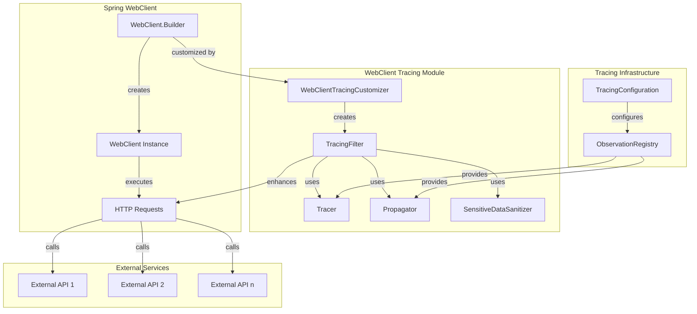
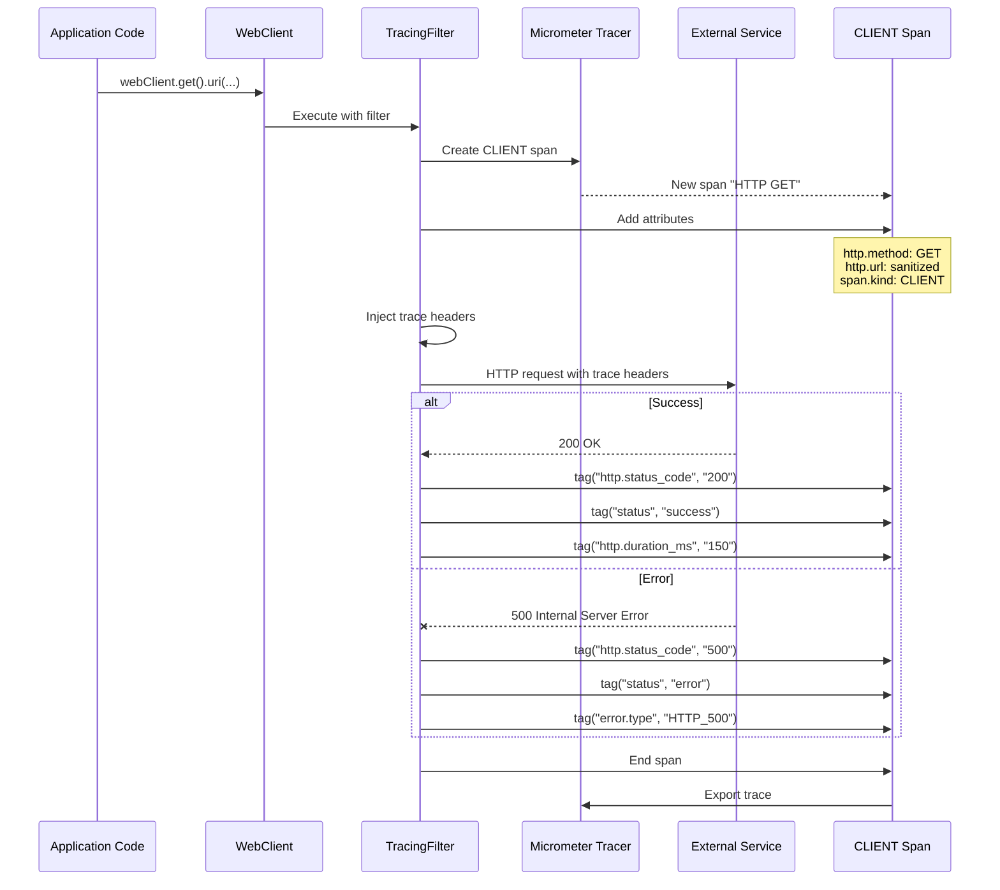

# WebClient Tracing Module

## Overview

The WebClient Tracing module provides distributed tracing for external HTTP API calls made using Spring WebClient. It automatically creates CLIENT spans for outbound HTTP requests, injects trace context headers, and captures response metadata for observability.

## Purpose and Core Functionality

### Primary Objectives
1. **External API Observability**: Trace all outbound HTTP requests to external services
2. **Context Propagation**: Inject W3C trace context headers for distributed tracing
3. **Performance Monitoring**: Capture request/response timing and sizes
4. **Error Tracking**: Correlate HTTP errors with circuit breaker states and business operations

### Key Features
- **Automatic Span Creation**: Creates CLIENT spans for all WebClient HTTP requests
- **W3C Trace Context**: Injects `traceparent` and `tracestate` headers
- **URL Sanitization**: Masks sensitive query parameters and PII in URLs
- **Response Tracking**: Captures HTTP status codes, response sizes, and durations
- **Error Handling**: Tags spans with error details for failed requests
- **Feature Flag Control**: Controlled by `tracing.features.externalApi` configuration

## Architecture

### Component Integration



### Span Creation Flow



## Core Components

### WebClientTracingCustomizer

The main component that customizes WebClient.Builder to add tracing capabilities.

#### Key Responsibilities
1. **Filter Registration**: Adds tracing ExchangeFilterFunction to WebClient
2. **Feature Flag Check**: Validates `tracing.features.externalApi` is enabled
3. **Dependency Injection**: Injects Tracer, Propagator, and Sanitizer

#### Configuration
```java
@ConditionalOnClass(WebClient.class)              // WebClient available
@ConditionalOnProperty(
    value = "tracing.features.externalApi",       // Feature flag enabled
    havingValue = "true", 
    matchIfMissing = true
)
```

### Tracing ExchangeFilterFunction

The core filter function that wraps HTTP requests in CLIENT spans.

#### Span Attributes Added
| Attribute | Description | Example |
|-----------|-------------|---------|
| `http.method` | HTTP method | `GET`, `POST`, `PUT`, `DELETE` |
| `http.url` | Sanitized request URL | `https://api.example.com/data?param=***` |
| `span.kind` | Span kind | `CLIENT` |
| `http.request.body.size` | Request body size in bytes | `1024` |
| `http.status_code` | HTTP response status | `200`, `404`, `500` |
| `http.response.body.size` | Response body size in bytes | `2048` |
| `http.duration_ms` | Request duration in milliseconds | `150` |
| `status` | Overall request status | `success`, `error` |
| `error.type` | Error type if request failed | `HTTP_500`, `ConnectTimeoutException` |

#### Trace Context Injection
Injects W3C trace context headers:
- `traceparent`: `00-0af7651916cd43dd8448eb211c80319c-b7ad6b7169203331-01`
- `tracestate`: Vendor-specific tracing system state

## Integration with Circuit Breaker Tracing

### Combined Observability
When used with [CircuitBreakerTracingDecorator](circuit_breaker_tracing.md), provides complete external API observability:

1. **WebClientTracingCustomizer** creates the CLIENT span
2. **CircuitBreakerTracingDecorator** adds circuit breaker attributes
3. **SensitiveDataSanitizer** protects sensitive data

### Example Combined Trace
```json
{
  "traceId": "abc123def456",
  "spans": [
    {
      "name": "HTTP GET",
      "kind": "CLIENT",
      "attributes": {
        "http.method": "GET",
        "http.url": "https://api.chainlist.org/chains?api_key=***",
        "http.status_code": "200",
        "http.duration_ms": "125",
        "cb.name": "external-api-chainlist",
        "cb.state": "CLOSED",
        "cb.failure_rate": "5.2",
        "status": "success"
      },
      "events": [
        {
          "name": "cb.success",
          "timestamp": "2024-01-15T10:30:00Z"
        }
      ]
    }
  ]
}
```

## Data Sanitization

### URL Sanitization
The module uses [SensitiveDataSanitizer](data_sanitization.md) to protect sensitive information:

```java
// Original URL
https://api.wallet.com/transfer?token=abc123&amount=100&user=john@example.com

// Sanitized in span
https://api.wallet.com/transfer?token=***&amount=100&user=***@***.***
```

### Protected Parameters
- Authentication tokens: `token`, `access_token`, `api_key`
- Credentials: `password`, `secret`, `auth`
- Personal data: Email addresses, phone numbers
- Financial data: Credit card numbers

## Configuration

### Application Properties
```yaml
# application-tracing.yml
tracing:
  features:
    externalApi: true  # Enable/disable WebClient tracing
    
management:
  tracing:
    enabled: true
    sampling:
      probability: 0.1  # Sample 10% of requests
```

### WebClient Configuration
```java
@Configuration
public class WebClientConfig {
    
    @Bean
    public WebClient webClient(WebClient.Builder builder) {
        // WebClientTracingCustomizer automatically adds tracing
        return builder
            .baseUrl("https://api.example.com")
            .defaultHeader(HttpHeaders.CONTENT_TYPE, MediaType.APPLICATION_JSON_VALUE)
            .build();
    }
}
```

## Performance Characteristics

### Overhead Analysis
| Operation | Typical Overhead | Notes |
|-----------|-----------------|-------|
| Span Creation | < 0.5ms | Creating span and adding attributes |
| Header Injection | < 0.1ms | Injecting W3C trace context |
| URL Sanitization | < 0.05ms | Pattern matching and replacement |
| Response Handling | < 0.1ms | Adding response attributes |
| Total per request | < 1ms | Negligible compared to network I/O |

### Memory Footprint
- **Span Objects**: ~500 bytes per HTTP request
- **Attribute Storage**: ~200 bytes per attribute
- **Filter Chain**: Minimal (shared across all requests)

## Use Cases and Examples

### 1. External API Monitoring
**Scenario**: Monitor response times and error rates for third-party APIs.

**Implementation**:
```java
@RestController
public class WalletController {
    
    private final WebClient chainlistClient;
    
    public List<Chain> getChains() {
        return chainlistClient.get()
            .uri("/chains")
            .retrieve()
            .bodyToMono(new ParameterizedTypeReference<List<Chain>>() {})
            .block();
    }
}
```

**Trace Output**: CLIENT span with `http.url`, `http.duration_ms`, `http.status_code`

### 2. Circuit Breaker Integration
**Scenario**: External API failures trigger circuit breaker opening.

**Trace Analysis**:
- CLIENT span shows HTTP error (500, timeout)
- Circuit breaker attributes show state transition to OPEN
- Correlation between HTTP errors and circuit breaker metrics

### 3. Distributed Transaction Tracing
**Scenario**: Cross-service calls in a distributed transaction.

**Trace Context Propagation**:
- Parent span created by initial request
- WebClient injects trace context into outbound request
- Downstream service continues the same trace
- End-to-end visibility across service boundaries

## Best Practices

### 1. WebClient Configuration
```java
// Recommended: Use WebClient.Builder bean
@Bean
public WebClient webClient(WebClient.Builder builder) {
    return builder
        .filter(ExchangeFilterFunction.ofRequestProcessor(
            clientRequest -> {
                // Add custom headers if needed
                return Mono.just(ClientRequest.from(clientRequest)
                    .header("X-Custom-Header", "value")
                    .build());
            }
        ))
        .build();
}
```

### 2. Error Handling
```java
webClient.get()
    .uri("/api/data")
    .retrieve()
    .onStatus(HttpStatusCode::isError, response -> {
        // Custom error handling
        return response.bodyToMono(String.class)
            .flatMap(errorBody -> Mono.error(
                new ExternalApiException("API error: " + errorBody)
            ));
    })
    .bodyToMono(Data.class);
```

### 3. Timeout Configuration
```java
@Bean
public WebClient webClient(WebClient.Builder builder) {
    HttpClient httpClient = HttpClient.create()
        .responseTimeout(Duration.ofSeconds(30))
        .option(ChannelOption.CONNECT_TIMEOUT_MILLIS, 5000);
    
    return builder
        .clientConnector(new ReactorClientHttpConnector(httpClient))
        .build();
}
```

## Troubleshooting

### Common Issues

#### 1. Tracing Not Working
**Symptoms**: No CLIENT spans for WebClient requests.

**Diagnosis**:
```bash
# Check feature flag
curl http://localhost:8080/actuator/configprops/tracing.features.externalApi

# Check WebClient configuration
grep "WebClient tracing filter registered" application.log
```

**Solutions**:
- Ensure `tracing.features.externalApi: true`
- Verify WebClient bean is created via WebClient.Builder
- Check Spring Boot auto-configuration logs

#### 2. Missing Trace Headers
**Symptoms**: Downstream services don't receive trace context.

**Diagnosis**: Check HTTP headers in outbound requests.

**Solutions**:
- Verify Propagator bean is available
- Check WebClient filter chain order
- Test with simple HTTP client to see headers

#### 3. Performance Issues
**Symptoms**: Increased latency in HTTP requests.

**Diagnosis**: Profile tracing filter execution time.

**Solutions**:
- Disable via `tracing.features.externalApi: false`
- Use sampling to reduce volume
- Monitor with application performance monitoring

## Related Modules

- [Circuit Breaker Tracing](circuit_breaker_tracing.md): Circuit breaker state tracking
- [Data Sanitization](data_sanitization.md): PII protection in traces
- [Tracing Configuration](tracing_configuration.md): Core tracing setup
- [Use Case Tracing](use_case_tracing.md): Business operation tracing

## References

- [Spring WebClient Documentation](https://docs.spring.io/spring-framework/docs/current/reference/html/web-reactive.html#webflux-client)
- [W3C Trace Context Specification](https://www.w3.org/TR/trace-context/)
- [Micrometer Tracing](https://micrometer.io/docs/tracing)
- [OpenTelemetry HTTP Semantic Conventions](https://opentelemetry.io/docs/specs/semconv/http/http-spans/)

---

*Last Updated: January 2024*  
*Module Version: 1.0.0*  
*Compatibility: Spring Boot 3.x, WebFlux, Micrometer Tracing 1.x*